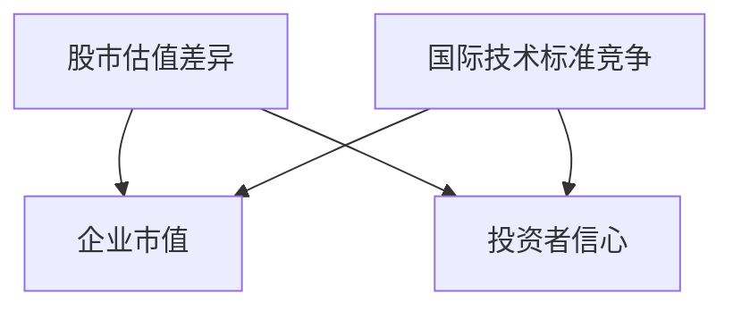
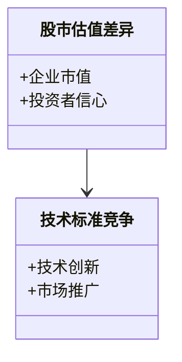

                 

# 股市估值差异对国际技术标准竞争的影响

> 关键词：股市估值、国际技术标准、竞争机制、博弈论模型、系统架构

> 摘要：本文探讨了股市估值差异如何影响国际技术标准的竞争格局，通过分析股市估值差异的形成机制、国际技术标准竞争的核心问题，以及两者之间的关联关系，结合博弈论模型和系统架构设计，深入剖析了股市估值差异对国际技术标准竞争的多维度影响。文章最后通过实际案例分析，提出了最佳实践建议。

---

# 第一部分: 背景介绍

## 第1章: 股市估值差异与国际技术标准竞争的背景

### 1.1 问题背景

#### 1.1.1 股市估值差异的定义与影响
股市估值差异是指同一企业在不同市场或不同时期的股票估值存在差异。这种差异可能由市场环境、投资者预期、政策法规等多种因素引起，直接影响企业的市值和投资者信心。

#### 1.1.2 国际技术标准竞争的定义与特点
国际技术标准竞争是指不同国家或企业之间在技术标准的制定和推广上展开的竞争。技术标准的制定权往往关系到产业话语权和市场准入，具有高度的战略意义。

#### 1.1.3 问题背景的现实意义
随着全球化进程的加速，技术标准的竞争日益激烈。股市估值差异作为企业市值和投资者信心的重要指标，对技术标准的竞争结果具有重要影响。研究这一问题有助于理解国际技术标准竞争的深层机制。

### 1.2 问题描述

#### 1.2.1 股市估值差异的形成机制
股市估值差异的形成机制涉及多种因素，包括市场流动性、投资者情绪、企业基本面等。例如，技术创新能力强的企业通常能获得更高的估值溢价。

#### 1.2.2 国际技术标准竞争的核心问题
国际技术标准竞争的核心问题是技术标准的制定权和市场主导权。企业或国家需要通过技术创新、市场推广和政策支持等手段来争取技术标准的竞争优势。

#### 1.2.3 问题的复杂性与挑战
股市估值差异和技术标准竞争的交织使得问题更加复杂。一方面，股市估值差异可能影响企业的研发投入和市场推广能力；另一方面，技术标准的竞争又可能反过来影响股市估值。

### 1.3 问题解决

#### 1.3.1 股市估值差异的分析方法
股市估值差异的分析方法包括基本面分析、技术分析和情绪分析。通过这些方法可以识别影响估值差异的关键因素。

#### 1.3.2 国际技术标准竞争的解决路径
解决国际技术标准竞争问题需要从技术创新、市场推广和政策支持等多个方面入手，构建综合竞争优势。

#### 1.3.3 问题解决的可行性分析
通过建立多维度竞争优势，企业或国家可以在技术标准竞争中占据更有利的位置，从而间接影响股市估值。

### 1.4 边界与外延

#### 1.4.1 股市估值差异的边界条件
股市估值差异的边界条件包括市场环境、企业基本面和投资者预期等。这些因素的变化会影响估值差异的范围和程度。

#### 1.4.2 国际技术标准竞争的范围界定
国际技术标准竞争的范围包括技术标准的制定、推广和应用等多个方面。不同领域和行业的技术标准竞争具有不同的特点。

#### 1.4.3 相关概念的外延与内涵
股市估值差异和技术标准竞争的相关概念需要明确其外延和内涵，避免概念混淆和误解。

### 1.5 概念结构与核心要素组成

#### 1.5.1 股市估值差异的核心要素
股市估值差异的核心要素包括市场环境、企业基本面和投资者预期。这些要素共同作用，影响企业的市值和投资者信心。

#### 1.5.2 国际技术标准竞争的核心要素
国际技术标准竞争的核心要素包括技术创新能力、市场推广能力、政策支持和国际影响力。这些要素决定了企业在技术标准竞争中的地位和影响力。

#### 1.5.3 两者之间的关联关系
股市估值差异和技术标准竞争之间存在密切的关联关系。一方面，股市估值差异影响企业的研发投入和市场推广能力；另一方面，技术标准竞争的结果又会影响企业的股市估值。

---

## 第2章: 国际技术标准竞争的机制

### 2.1 核心概念原理

#### 2.1.1 技术标准竞争的基本原理
技术标准竞争的基本原理包括技术创新、市场推广和政策支持。企业需要通过这些手段来争取技术标准的制定权和市场主导权。

#### 2.1.2 股市估值差异对技术标准竞争的影响机制
股市估值差异通过影响企业的研发投入和市场推广能力，进而影响技术标准竞争的结果。例如，高估值的企业有更多的资金用于技术创新，从而在技术标准竞争中占据优势。

### 2.2 概念属性特征对比表格

| 概念           | 属性特征                   |
|----------------|---------------------------|
| 股市估值差异   | 影响企业市值、投资者信心   |
| 技术标准竞争   | 影响市场准入、技术发展     |

### 2.3 ER实体关系图架构

---

## 第3章: 算法原理讲解

### 3.1 博弈论模型

#### 3.1.1 博弈论模型的数学表达
在博弈论模型中，可以将股市估值差异和技术标准竞争视为一个动态博弈过程。例如，假设两家企业A和B在技术标准的竞争中博弈，其收益可以表示为：

$$
R_A = v_A \cdot p_A - c_A \\
R_B = v_B \cdot p_B - c_B
$$

其中，\(v_A\)和\(v_B\)分别为A和B的股市估值，\(p_A\)和\(p_B\)分别为A和B的技术标准市场份额，\(c_A\)和\(c_B\)分别为A和B的技术研发投入。

#### 3.1.2 博弈论模型的详细分析
通过建立博弈论模型，可以分析股市估值差异对技术标准竞争的动态影响。例如，高估值的企业可能在技术研发上投入更多，从而在技术标准竞争中占据优势。

### 3.2 系统架构设计

#### 3.2.1 领域模型设计

#### 3.2.2 系统架构设计

---

## 第4章: 系统分析与架构设计方案

### 4.1 问题场景介绍

#### 4.1.1 问题场景描述
在国际技术标准竞争中，企业需要通过技术创新和市场推广来争取技术标准的制定权。同时，股市估值差异可能影响企业的研发投入和市场推广能力。

#### 4.1.2 项目介绍
本项目旨在通过分析股市估值差异和技术标准竞争的关联关系，构建一个综合竞争优势模型，帮助企业在国际技术标准竞争中占据优势。

### 4.2 系统功能设计

#### 4.2.1 领域模型设计
通过建立领域模型，可以明确企业市值、投资者信心、技术创新和市场推广等关键因素之间的关系。

#### 4.2.2 系统架构设计
系统架构设计包括数据采集、数据分析、模型构建和结果输出四个模块。

#### 4.2.3 系统接口设计
系统接口设计需要考虑数据输入、模型训练和结果输出的接口设计。

#### 4.2.4 系统交互设计
系统交互设计包括用户与系统的交互流程，例如数据输入、模型训练和结果输出。

---

## 第5章: 项目实战

### 5.1 环境安装

#### 5.1.1 开发环境搭建
需要安装Python、TensorFlow、Mermaid等工具。

### 5.2 核心实现

#### 5.2.1 数据处理
数据处理包括企业市值、投资者信心和技术标准竞争数据的采集和清洗。

#### 5.2.2 模型训练
模型训练包括建立博弈论模型，分析股市估值差异和技术标准竞争的动态关系。

#### 5.2.3 代码实现
代码实现包括数据处理、模型训练和结果输出。

### 5.3 案例分析

#### 5.3.1 案例分析
以某项国际技术标准竞争为例，分析股市估值差异如何影响技术标准竞争的结果。

#### 5.3.2 结果解读
通过案例分析，可以验证模型的有效性和准确性。

### 5.4 项目小结

#### 5.4.1 项目总结
总结项目的实现过程和主要成果，提出改进建议。

---

## 第6章: 最佳实践

### 6.1 小结

#### 6.1.1 内容总结
总结本文的主要内容和技术方法，强调股市估值差异和技术标准竞争的关联关系。

### 6.2 注意事项

#### 6.2.1 实践中的注意事项
在实际应用中，需要注意数据的准确性和模型的可解释性，避免误用模型。

### 6.3 拓展阅读

#### 6.3.1 相关领域的拓展
建议读者进一步阅读相关领域的文献，深入了解股市估值差异和技术标准竞争的复杂性。

---

## 第7章: 结语

### 7.1 未来展望

#### 7.1.1 未来研究方向
未来的研究可以进一步探讨股市估值差异和技术标准竞争的动态关系，提出更完善的模型和解决方案。

#### 7.1.2 技术发展趋势
随着技术的发展，股市估值差异和技术标准竞争的关系将更加复杂，需要更多的研究和实践。

---

通过以上结构，我们可以系统地分析股市估值差异对国际技术标准竞争的影响，结合理论分析和实际案例，提出有效的解决方案和实践建议。

