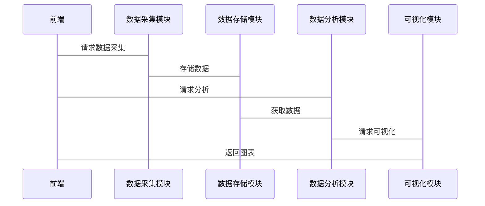

                 


# 《股市估值差异对国际技术转让的影响》目录大纲

## 第一部分：背景介绍

### 第1章：股市估值与国际技术转让概述

#### 1.1 核心概念
- 1.1.1 股市估值的基本概念
  - 介绍股市估值的主要指标，如市盈率、市净率等。
- 1.1.2 国际技术转让的基本概念
  - 解释技术转让的定义，包括专利转让、技术授权等。

#### 1.2 问题背景
- 1.2.1 股市估值差异的现状
  - 分析不同市场中估值差异的原因，如市场效率、信息不对称等。
- 1.2.2 技术转让的驱动因素
  - 探讨技术成熟度、市场需求对技术转让的影响。

#### 1.3 问题描述
- 1.3.1 股市估值差异如何影响技术转让的决策
  - 详细描述估值差异如何影响技术转让的定价和决策过程。

#### 1.4 问题解决
- 1.4.1 提出研究问题：股市估值差异是否显著影响国际技术转让
  - 设计研究假设，如“股市估值差异越大，技术转让的可能性越低”。

#### 1.5 边界与外延
- 1.5.1 研究范围的界定
  - 明确研究仅限于跨国公司，不包括国内技术转让。
- 1.5.2 相关概念的外延
  - 区分技术转让与技术合作的不同。

#### 1.6 概念结构与核心要素
- 1.6.1 概念图：展示股市估值、技术转让及其影响因素的关系。

---

## 第二部分：核心概念与联系

### 第2章：核心概念原理

#### 2.1 股市估值的核心原理
- 2.1.1 估值方法：市盈率、市净率、EV/EBITDA等。
- 2.1.2 影响因素：盈利能力、成长性、行业地位等。

#### 2.2 国际技术转让的核心原理
- 2.2.1 转让模式：直接转让、授权使用等。
- 2.2.2 影响因素：技术价值、市场潜力、法律环境等。

#### 2.3 股市估值与技术转让的关系
- 2.3.1 估值差异如何影响技术转让的定价。
- 2.3.2 技术转让如何反作用于股市估值。

### 第3章：核心概念对比与ER图

#### 3.1 对比分析
- 使用表格对比股市估值和国际技术转让的核心属性，如定义、影响因素、评估方法等。

#### 3.2 ER图架构
```mermaid
erDiagram
    企业 ---|{拥有}| 技术
    企业 ---|{受制于}| 市场环境
    市场环境 --> 技术
    技术 --> 估值差异
    估值差异 --> 技术转让
```

---

## 第三部分：算法原理

### 第4章：算法原理与实现

#### 4.1 算法选择
- 使用多元回归模型分析股市估值差异对技术转让的影响。

#### 4.2 算法流程
- 数据收集：收集跨国公司的股市估值数据和相关技术转让数据。
- 数据预处理：清洗数据，处理缺失值和异常值。
- 模型构建：建立多元回归模型，将估值差异作为自变量，技术转让作为因变量。
- 模型验证：通过R²值、F检验等方法验证模型的有效性。

#### 4.3 数学模型
- 多元回归公式：
  $$ Y = \beta_0 + \beta_1X_1 + \beta_2X_2 + \epsilon $$
  其中，Y为技术转让数量，X1为市盈率差，X2为市净率差。

#### 4.4 代码实现
```python
import pandas as pd
import numpy as np
from sklearn.linear_model import LinearRegression
from sklearn.metrics import r2_score

# 数据加载与预处理
data = pd.read_csv('tech_trans.csv')
data = data.dropna()
X = data[['市盈率差', '市净率差']]
y = data['技术转让数量']

# 建立回归模型
model = LinearRegression()
model.fit(X, y)
y_pred = model.predict(X)

# 模型评估
r2 = r2_score(y, y_pred)
print(f"R² = {r2}")
print(f"回归系数：{model.coef_}")
print(f"截距：{model.intercept_}")
```

---

## 第四部分：系统分析与架构设计

### 第5章：系统分析与架构设计

#### 5.1 问题场景
- 分析跨国公司技术转让受股市估值影响的具体场景，如跨国并购中的技术评估。

#### 5.2 系统功能设计
- 数据采集模块：收集相关股市数据和技术转让数据。
- 分析模块：应用回归模型分析估值差异对技术转让的影响。
- 可视化模块：生成图表展示分析结果。

#### 5.3 系统架构设计


#### 5.4 系统接口设计
- 数据接口：定义数据格式和接口调用方式。
- 分析接口：定义模型调用和结果返回格式。

#### 5.5 系统交互设计


---

## 第五部分：项目实战

### 第6章：项目实战与案例分析

#### 6.1 项目环境安装
- 安装Python、Pandas、Scikit-learn等工具。

#### 6.2 核心代码实现
- 数据清洗、建模和可视化代码，如：
  ```python
  import matplotlib.pyplot as plt
  plt.scatter(X['市盈率差'], y)
  plt.title('市盈率差与技术转让数量关系')
  plt.xlabel('市盈率差')
  plt.ylabel('技术转让数量')
  plt.show()
  ```

#### 6.3 案例分析
- 分析某跨国公司的技术转让案例，展示如何应用模型进行分析。

#### 6.4 项目小结
- 总结项目实施过程中的关键点和经验教训。

---

## 第六部分：总结与展望

### 第7章：总结与展望

#### 7.1 研究总结
- 回顾全书内容，总结研究发现和主要结论。

#### 7.2 研究局限性
- 指出研究中的不足，如数据范围的限制。

#### 7.3 未来展望
- 提出未来的研究方向，如引入更多变量或扩展到其他行业。

---

## 参考文献
- 列举相关书籍、论文和技术文档，作为研究的参考依据。

---

## 附录
- 包括完整的代码、数据表格和附加图表，供读者参考。

---

通过以上目录结构，本书将系统地探讨股市估值差异对国际技术转让的影响，从理论到实践，为读者提供全面而深入的分析和指导。

