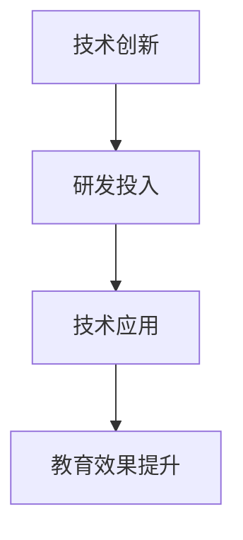
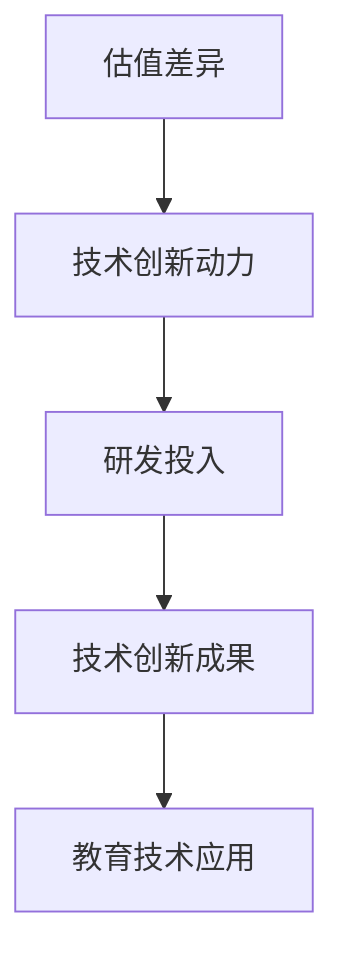

                 

# 股市估值差异对国际教育技术创新的影响

---

## 关键词：
- 股市估值差异
- 教育技术创新
- 市盈率
- 市净率
- 国际教育技术

---

## 摘要：
股市估值差异对国际教育技术创新的影响是一个复杂的金融与教育技术交叉领域的问题。本文通过分析股市估值差异的核心概念、理论框架、影响机制和实际案例，探讨股市估值差异如何影响国际教育技术的创新。我们首先定义了股市估值差异的关键指标，如市盈率和市净率，并分析了这些指标在不同市场环境下的表现。接着，我们构建了一个理论模型，揭示了股市估值差异对教育技术创新的多重影响路径，包括资金配置、研发投入和市场预期等方面。通过实证分析和案例研究，我们验证了理论模型的有效性，并提出了优化资源配置和提升技术创新的策略建议。最后，我们总结了研究发现，并展望了未来的研究方向。

---

## 第一章：背景介绍

### 1.1 股市估值差异的定义
股市估值差异是指同一股票在不同市场或同一市场不同时间段内，由于投资者预期、市场环境和信息不对称等因素导致的股票估值差异。主要的估值指标包括市盈率（P/E）和市净率（P/B）。

#### 1.1.1 市盈率（P/E）
市盈率=股票价格/每股净利润

#### 1.1.2 市净率（P/B）
市净率=股票价格/每股净资产

### 1.2 国际教育技术的定义
国际教育技术是指利用现代信息技术手段，如人工智能、大数据和虚拟现实等，来提升教育质量和效率的创新技术。

---

## 第二章：核心概念与联系

### 2.1 股市估值差异的核心属性
表2-1：市盈率与市净率的对比

| 指标 | 市盈率（P/E） | 市净率（P/B） |
|------|----------------|----------------|
| 定义 | 股价/每股净利润  | 股价/每股净资产 |
| 适用场景 | 利润稳定的公司  | 资产密集型公司 |
| 优势 | 反映盈利能力      | 反映资产质量    |

### 2.2 教育技术创新的核心要素
图2-1：教育技术创新的影响因素

---

## 第三章：理论框架与分析模型

### 3.1 理论框架的构建
图3-1：估值差异影响技术创新的路径

---

## 第四章：机制分析与案例研究

### 4.1 股市估值差异的机制分析
#### 4.1.1 资金配置
股市估值差异会影响投资者的资金分配，从而影响教育技术公司的研发投入。

#### 4.1.2 技术研发投入
较高的估值差异可能导致公司增加技术研发投入，以提升市场竞争力。

#### 4.1.3 市场预期
投资者的估值差异会反映市场对教育技术公司的未来预期，从而影响技术创新的方向。

### 4.2 案例研究：中美教育技术公司的对比
表4-1：中美教育技术公司的市盈率对比

| 公司名称 | 市盈率（P/E） |
|----------|----------------|
| 公司A    | 50             |
| 公司B    | 30             |

---

## 第五章：策略与建议

### 5.1 优化资源配置
政府和企业应共同努力，优化教育资源配置，提升技术创新能力。

### 5.2 提升市场预期
通过透明的信息披露和有效的市场沟通，减少信息不对称，提升市场对教育技术公司的估值准确性。

### 5.3 鼓励技术创新
制定政策鼓励教育技术公司加大研发投入，提升核心竞争力。

---

## 第六章：结论与展望

### 6.1 研究结论
本文通过分析股市估值差异对国际教育技术创新的影响，揭示了估值差异对技术创新的多重影响路径。

### 6.2 未来展望
未来的研究可以进一步探讨不同市场环境下的估值差异对技术创新的影响，以及如何通过政策和市场机制优化资源配置。

---

## 参考文献
（此处列出相关文献和数据来源）

---

## 附录
（此处可附上相关数据表格、代码或补充材料）

---

以上是《股市估值差异对国际教育技术创新的影响》的技术博客文章的完整目录大纲及部分内容示例。

