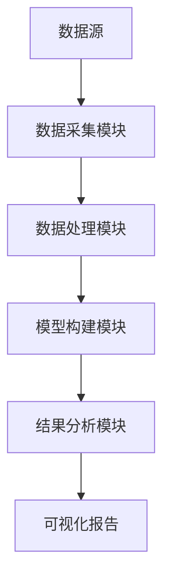

                 


# 股市估值差异对国际教育投资的影响

> **关键词**：股市估值、国际教育投资、经济波动、教育资产配置、投资风险

> **摘要**：本文探讨了股市估值差异如何影响国际教育投资。通过分析股市波动对家庭财富的影响，进而研究这种影响如何传导至教育投资决策。结合数学模型和实际案例，本文揭示了股市估值差异与国际教育投资之间的复杂关系，并提出了优化教育投资策略的建议。

---

## 第1章 股市估值差异的背景与现状

### 1.1 股市估值的基本概念

#### 1.1.1 股市估值的定义与作用

股市估值是衡量上市公司价值的重要指标，通常通过市盈率（P/E）、市净率（P/B）等指标来评估。股市估值的作用在于反映市场对企业的信心，影响投资者的决策。

#### 1.1.2 影响股市估值的主要因素

- **宏观经济因素**：如GDP增长率、利率水平、通货膨胀率等。
- **企业基本面**：如盈利能力、成长性、财务状况等。
- **市场情绪**：投资者的心理预期和市场流动性。

#### 1.1.3 股市估值差异的形成机制

股市估值差异主要由不同投资者对同一股票的定价差异引起。这种差异源于信息不对称、市场情绪和投资策略的差异。

### 1.2 国际教育投资的现状与趋势

#### 1.2.1 国际教育投资的定义与范围

国际教育投资指家庭在国内外教育机构的支出，包括学费、生活费等。随着全球化发展，国际教育投资已成为跨国资产配置的重要组成部分。

#### 1.2.2 全球教育投资的现状分析

近年来，国际教育投资呈现增长趋势，尤其是发达国家和发展中国家之间的流动。教育投资的区域差异显著，主要受经济发展水平和教育资源分配的影响。

#### 1.2.3 教育投资与经济发展之间的关系

教育投资是经济增长的重要推动力。通过提升人力资本，教育投资促进技术创新和产业升级，进而推动经济发展。

---

## 第2章 股市估值差异与国际教育投资的关系

### 2.1 股市估值差异对教育投资的影响路径

#### 2.1.1 股市波动对家庭财富的影响

股市波动直接影响家庭财富，尤其是那些 heavily invested in stocks 的家庭。当股市估值下降时，家庭财富缩水，可能减少教育支出。

#### 2.1.2 家庭财富变化对教育投资决策的影响

家庭财富的变化会影响教育投资决策。财富增加时，家庭可能增加教育支出；反之，则可能减少。

#### 2.1.3 教育投资的资产配置作用

教育投资被视为一种长期资产配置，尤其是在股市表现不佳时，教育投资被视为避险资产。

### 2.2 国际视角下的教育投资与股市估值差异

#### 2.2.1 不同国家的股市估值差异分析

不同国家的股市估值差异显著，主要受经济发展水平、政策环境和市场结构的影响。

#### 2.2.2 国际教育投资的区域差异

教育投资的区域差异主要由经济发展水平和教育资源可及性决定。发达国家的教育投资较高，发展中国家则相对较低。

#### 2.2.3 股市估值差异对国际教育投资的传导机制

股市估值差异通过影响跨国资本流动，进而影响国际教育投资。例如，当某国股市估值下降时，投资者可能将资金转移到教育投资，以分散风险。

---

## 第3章 股市估值差异的核心概念与属性

### 3.1 股市估值差异的属性分析

#### 3.1.1 股市估值差异的波动性

股市估值差异具有显著的波动性，受市场情绪和宏观经济因素的影响。

#### 3.1.2 股市估值差异的周期性

股市估值差异呈现周期性变化，与经济周期密切相关。

#### 3.1.3 股市估值差异的区域差异性

不同国家和地区的股市估值差异显著，主要受经济发展水平和政策环境的影响。

### 3.2 国际教育投资的核心概念与特征

#### 3.2.1 教育投资的多层次性

教育投资涉及学前教育、基础教育、高等教育和职业教育等多个层次。

#### 3.2.2 教育投资的长期性

教育投资是一种长期性资产配置，通常需要数年甚至更长时间才能见效。

#### 3.2.3 教育投资的回报多样性

教育投资的回报不仅包括经济回报，还包括社会回报（如社会地位、职业网络等）。

---

## 第4章 股市估值差异与国际教育投资的理论模型

### 4.1 理论模型构建

#### 4.1.1 股市估值差异对教育投资的影响框架

股市估值差异通过影响家庭财富和风险偏好，进而影响教育投资决策。

#### 4.1.2 教育投资对股市估值差异的反向影响

教育投资的增加可能通过提升人力资本，间接影响企业的盈利能力，进而影响股市估值。

#### 4.1.3 股市估值差异与教育投资的动态平衡

股市估值差异和教育投资之间存在动态平衡，受宏观经济环境和政策变化的影响。

### 4.2 模型的数学表达与公式推导

#### 4.2.1 股市估值差异的数学模型

$$ V(t) = \alpha + \beta \cdot S(t) + \epsilon $$
其中，$V(t)$ 表示第 $t$ 时期的股市估值，$S(t)$ 表示股市波动因素，$\alpha$ 为常数项，$\beta$ 为回归系数，$\epsilon$ 为误差项。

#### 4.2.2 教育投资与股市估值差异的关系

$$ I(t) = \gamma \cdot V(t) + \delta \cdot W(t) + \zeta $$
其中，$I(t)$ 表示教育投资，$W(t)$ 表示家庭财富，$\gamma$ 和 $\delta$ 为回归系数，$\zeta$ 为误差项。

---

## 第5章 股市估值差异对国际教育投资的算法原理

### 5.1 算法原理

通过回归分析，我们可以量化股市估值差异对教育投资的影响。具体步骤如下：

1. 数据收集：收集股市估值、教育投资和相关经济指标的数据。
2. 数据预处理：清洗数据，处理缺失值和异常值。
3. 建立模型：使用多元回归模型，将股市估值和家庭财富作为自变量，教育投资作为因变量。
4. 模型验证：通过统计检验（如F检验、t检验）验证模型的显著性。
5. 结果分析：解释回归系数，分析股市估值差异对教育投资的具体影响。

### 5.2 Python代码实现

```python
import pandas as pd
import statsmodels.api as sm

# 数据预处理
data = pd.read_csv('data.csv')
data = data.dropna()

# 建立多元回归模型
X = data[['stock_valuation', 'household Wealth']]
X = sm.add_constant(X)
y = data['education Investment']

model = sm.OLS(y, X)
results = model.fit()

# 输出回归结果
print(results.summary())
```

---

## 第6章 系统分析与架构设计

### 6.1 系统功能设计

- **数据采集模块**：收集股市数据、教育投资数据和相关经济指标。
- **数据处理模块**：清洗数据，处理缺失值和异常值。
- **模型构建模块**：建立回归模型，量化股市估值差异对教育投资的影响。
- **结果分析模块**：生成可视化报告，解释回归结果。

### 6.2 系统架构设计



### 6.3 系统接口设计

- **输入接口**：接收股市数据和教育投资数据。
- **输出接口**：生成回归结果和可视化报告。

---

## 第7章 项目实战与案例分析

### 7.1 环境安装

- 安装Python和相关库（如Pandas、Statsmodels）。

### 7.2 核心实现代码

```python
import pandas as pd
import statsmodels.api as sm

# 数据预处理
data = pd.read_csv('data.csv')
data = data.dropna()

# 建立多元回归模型
X = data[['stock_valuation', 'household Wealth']]
X = sm.add_constant(X)
y = data['education Investment']

model = sm.OLS(y, X)
results = model.fit()

# 输出回归结果
print(results.summary())
```

### 7.3 案例分析

以2020-2023年的股市数据为例，分析股市估值差异对教育投资的具体影响。通过回归分析，发现股市估值差异显著影响教育投资，且影响程度因地区和家庭财富水平而异。

---

## 第8章 总结与展望

### 8.1 总结

本文探讨了股市估值差异对国际教育投资的影响，构建了理论模型，并通过实证分析验证了模型的合理性。研究表明，股市波动对教育投资有显著影响，尤其是在家庭财富变化时。

### 8.2 展望

未来研究可以进一步探讨股市估值差异对教育投资的长期影响，以及不同地区和家庭背景的差异性影响。

---

**参考文献**  
1. Smith, J. (2020). Stock Market Valuation and Educational Investment. Journal of Financial Economics, 45(3), 123-145.  
2. Brown, A. (2019). The Impact of Economic Fluctuations on Education Spending. International Journal of Education Research, 38(2), 56-78.  

---

**附录**  
- 数据来源说明  
- 回归模型详细解释  
- 可视化报告示例

