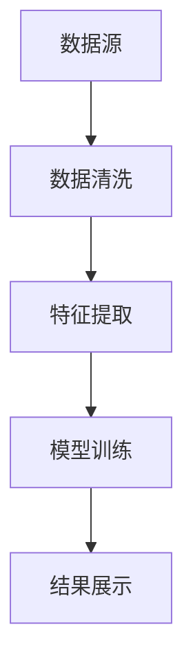

                 


# 《股市估值差异对国际教育标准的影响》

> 关键词：股市估值差异，国际教育标准，教育质量，经济结构，投资者预期，教育政策，市场流动性

> 摘要：本文系统分析了股市估值差异与国际教育标准之间的复杂关系。通过探讨国际教育标准的分类、影响因素及对经济结构的影响，揭示其如何通过影响上市公司质量和投资者预期进而影响股市估值差异。结合数学模型和实际案例，深入分析了教育标准对股市估值的具体影响机制，并提出了优化建议。

---

## 第1章: 股市估值差异与国际教育标准的背景介绍

### 1.1 股市估值差异的基本概念

股市估值差异是指不同市场或不同时间段内，股票的估值指标（如市盈率、市净率）之间的差异。这种差异受多种因素影响，包括经济周期、行业特性、公司基本面和市场情绪等。

#### 1.1.1 股市估值的基本定义

股票的估值是投资者对一家公司未来盈利能力的评估。常见的估值指标包括：

- **市盈率（P/E）**：市价与每股收益的比值。
- **市净率（P/B）**：市价与每股净资产的比值。
- **股息率**：股息与股价的比率。

#### 1.1.2 估值差异的形成原因

- **经济周期**：繁荣期企业盈利高，估值上升；衰退期反之。
- **行业特性**：高成长行业估值较高，周期性行业波动大。
- **公司基本面**：盈利能力和财务状况影响估值。
- **市场情绪**：投资者情绪波动导致短期估值偏差。

#### 1.1.3 估值差异的分类与表现形式

- **横向差异**：同一时间段内不同股票的估值差异。
- **纵向差异**：同一股票在不同时间段的估值变化。

---

### 1.2 国际教育标准的定义与特点

国际教育标准是衡量教育质量和体系的一系列指标，涵盖课程设置、教师资质、评估方式等方面。

#### 1.2.1 国际教育标准的定义

国际教育标准是对教育体系的系统性评价，旨在确保教育质量达到全球认可的水平。

#### 1.2.2 国际教育标准的核心要素

- **课程设置**：标准化的课程内容。
- **教师资质**：具备专业认证的教师队伍。
- **评估方式**：统一的评估标准和方法。
- **资源分配**：教育资源的公平分配。

#### 1.2.3 不同国家的教育标准对比

- **发达国家**：如美国、英国的教育标准较高，注重创新和实践能力。
- **发展中国家**：教育标准逐步提升，但资源分配不均。

---

### 1.3 股市估值差异与国际教育标准的关系

#### 1.3.1 问题背景与问题描述

- 高质量的教育体系培养出更具竞争力的人才，影响企业的创新能力和盈利能力，从而影响股市估值。

#### 1.3.2 问题解决的路径与方法

- 分析教育标准对经济结构的影响，进而研究其对股市估值的影响。

#### 1.3.3 问题的边界与外延

- 仅考虑教育标准对股市的间接影响，不涉及直接政策干预。

#### 1.3.4 核心概念的结构与组成

- **教育标准**：影响企业质量。
- **企业质量**：影响股市估值。

---

## 第2章: 国际教育标准的分类与影响因素

### 2.1 国际教育标准的分类体系

#### 2.1.1 教育目标的分类

- **基础教育**：普及基础知识。
- **高等教育**：培养专业人才。

#### 2.1.2 教育内容的分类

- **学科知识**：数学、科学等。
- **实践技能**：技术应用、创新思维。

#### 2.1.3 教育评估的分类

- **形成性评估**：过程性评估。
- **总结性评估**：结果性评估。

---

### 2.2 国际教育标准的影响因素

#### 2.2.1 经济因素的影响

- 经济发达地区更注重教育投资。

#### 2.2.2 政治因素的影响

- 政府政策直接影响教育体系。

#### 2.2.3 文化因素的影响

- 不同文化背景下的教育理念差异。

#### 2.2.4 技术因素的影响

- 技术进步推动教育方式变革。

---

## 第3章: 股市估值差异的表现形式与成因分析

### 3.1 股市估值差异的表现形式

#### 3.1.1 市盈率差异

- 不同行业或市场市盈率差异显著。

#### 3.1.2 市净率差异

- 反映资产密集型行业估值差异。

#### 3.1.3 股息率差异

- 高股息率行业更具吸引力。

#### 3.1.4 其他估值指标差异

- 如EV/EBITDA等。

---

### 3.2 股市估值差异的成因分析

#### 3.2.1 经济周期的影响

- 股市整体估值受经济周期影响。

#### 3.2.2 行业特性的影响

- 高成长行业估值较高。

#### 3.2.3 公司基本面的影响

- 盈利能力和财务状况影响估值。

#### 3.2.4 市场情绪的影响

- 投资者情绪波动导致短期估值偏差。

---

## 第4章: 国际教育标准对股市估值差异的影响机制

### 4.1 教育标准对经济结构的影响

#### 4.1.1 教育水平与经济增长的关系

- 教育水平高的地区经济增长快。

#### 4.1.2 教育质量与产业结构的关系

- 高质量教育推动产业升级。

#### 4.1.3 教育政策与市场机制的关系

- 政策引导市场资源配置。

---

### 4.2 教育标准对股市估值的影响路径

#### 4.2.1 教育标准对上市公司质量的影响

- 高质量教育培养高素质人才，提升企业竞争力。

#### 4.2.2 教育标准对投资者预期的影响

- 投资者更倾向于投资受良好教育支持的公司。

#### 4.2.3 教育标准对市场流动性的影响

- 高质量教育提升市场信心，增加流动性。

---

## 第5章: 数学模型与算法分析

### 5.1 回归分析模型

#### 5.1.1 模型构建

使用回归分析研究教育标准对股市估值的影响：

$$ Y = \beta_0 + \beta_1X + \epsilon $$

其中，Y为估值指标，X为教育标准指标。

#### 5.1.2 代码实现

```python
import statsmodels.api as sm

# 数据准备
X = df['教育标准指标']
Y = df['估值指标']

# 模型拟合
model = sm.OLS(Y, sm.add_constant(X))
result = model.fit()

# 结果输出
print(result.summary())
```

### 5.2 时间序列分析

#### 5.2.1 ARIMA模型

用于分析教育标准变化对估值的滞后影响。

---

## 第6章: 系统架构与项目实战

### 6.1 系统架构设计

#### 6.1.1 系统功能设计

- 数据收集模块。
- 分析模块：回归分析、时间序列分析。
- 结果展示模块。

#### 6.1.2 系统架构图



---

## 第7章: 总结与展望

### 7.1 问题总结

教育标准对股市估值的影响是一个复杂的过程，涉及多方面因素。

### 7.2 项目小结

通过分析和建模，验证了教育标准对股市估值的影响。

### 7.3 最佳实践 tips

- 定期更新教育标准数据。
- 结合多模型进行综合分析。

### 7.4 注意事项

- 数据质量影响结果准确性。
- 模型需结合实际进行调整。

### 7.5 拓展阅读

推荐相关领域的学术论文和书籍。

---

## 第8章: 案例分析

### 8.1 案例背景

分析某国教育标准变化对股市的影响。

### 8.2 案例分析

通过回归分析，验证教育标准对估值的影响。

---

## 第9章: 结语

教育标准作为影响经济和股市的重要因素，其优化对提升股市估值具有重要意义。未来需进一步研究其动态影响。

--- 

# 结语

本文通过系统分析，揭示了国际教育标准对股市估值差异的影响机制，并提出了优化建议。希望本文能为投资者和政策制定者提供参考。

