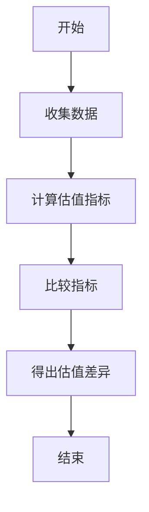
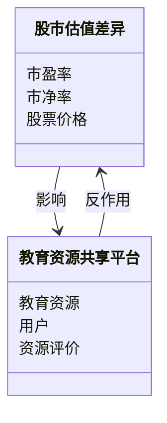
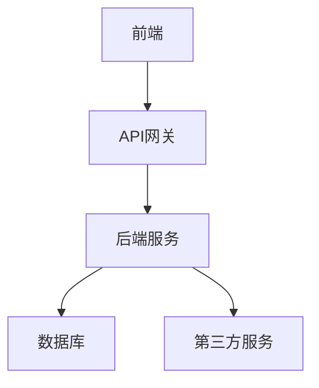
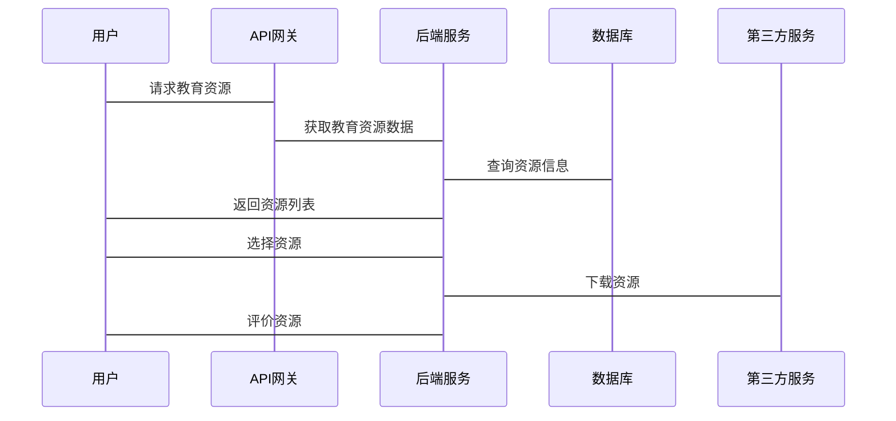

                 


# 股市估值差异对国际教育资源共享平台的影响

> 关键词：股市估值、教育资源共享、国际教育、技术分析、教育平台

> 摘要：本文探讨了股市估值差异对国际教育资源共享平台的影响。通过分析股市估值差异的核心概念与教育资源共享平台的国际化挑战，本文揭示了两者之间的内在联系，并提出了应对策略。结合实际案例和系统设计，本文为教育资源共享平台的优化和未来发展提供了有价值的参考。

---

## 第1章: 背景与核心概念

### 1.1 股市估值的基本概念

#### 1.1.1 什么是股市估值
股市估值是指通过对公司财务数据、市场环境和行业趋势的分析，确定公司股票的合理市场价格。常见的估值方法包括市盈率（P/E）、市净率（P/B）和现金流折现法（DCF）等。

#### 1.1.2 股市估值的主要指标
- 市盈率（P/E）：股票价格与每股收益的比率。
- 市净率（P/B）：股票价格与每股净资产的比率。
- 市销率（P/S）：股票价格与每股收入的比率。

#### 1.1.3 影响股市估值的因素
- 公司基本面：收入、利润、负债等。
- 市场环境：经济周期、通货膨胀、货币政策等。
- 行业特性：行业竞争格局、增长潜力等。
- 投资者情绪：市场情绪波动对股价的影响。

### 1.2 国际教育资源共享平台的定义与特点

#### 1.2.1 教育资源共享平台的概念
教育资源共享平台是指通过互联网技术，将优质教育资源（如课程、教材、师资等）进行整合、共享和分配的平台。其目标是打破地域限制，实现教育资源的均衡分配。

#### 1.2.2 国际化教育资源共享的特点
- 跨界性：跨越国界，连接全球教育资源。
- 多元性：支持多语言、多文化背景的教育资源共享。
- 技术驱动：依赖云计算、大数据和人工智能等技术实现高效资源共享。

#### 1.2.3 平台的核心功能与目标
- 提供高质量教育资源：包括课程内容、教学工具等。
- 促进跨文化交流：支持多语言学习和国际课程合作。
- 优化资源分配：通过技术手段实现教育资源的精准匹配。

### 1.3 股市估值差异对教育资源共享的影响

#### 1.3.1 股市估值差异的形成机制
股市估值差异通常由地区经济发展水平、市场流动性、政策环境等因素造成。例如，发达国家股市的估值通常较高，而发展中国家股市估值相对较低。

#### 1.3.2 教育资源共享平台的国际化挑战
- 文化差异：不同国家的教育体系和文化背景可能影响教育资源的接受和使用。
- 经济差异：经济发达地区对教育资源的需求和支付能力与欠发达地区存在差异。
- 技术差异：不同国家的互联网基础设施和技术水平不一，影响教育资源共享的效率。

#### 1.3.3 股市估值差异对教育资源共享的潜在影响
- 优质教育资源的流动性：股市估值高的地区可能吸引更多的优质教育资源，导致教育资源分配的不均衡。
- 教育平台的可持续性：股市估值差异可能影响教育平台的融资能力，进而影响其持续运营和扩张。

---

## 第2章: 核心概念与联系

### 2.1 股市估值差异的核心概念

#### 2.1.1 股市估值差异的定义
股市估值差异是指不同地区或行业之间，由于市场环境、经济基础等因素的差异，导致股票估值出现差异的现象。

#### 2.1.2 股市估值差异的度量方法
- 相对估值法：通过比较不同地区的市盈率、市净率等指标，计算估值差异。
- 绝对估值法：通过现金流折现法等方法，计算不同地区的股票估值差异。

#### 2.1.3 股市估值差异的分类
- 区域性差异：不同国家或地区的股市估值差异。
- 行业性差异：同一地区内不同行业的股市估值差异。

### 2.2 教育资源共享平台的核心概念

#### 2.2.1 教育资源共享平台的定义
教育资源共享平台是一个基于互联网的平台，通过整合、共享和分配教育资源，实现教育资源的优化配置和高效利用。

#### 2.2.2 教育资源共享平台的功能模块
- 资源发布：教师或机构上传教育资源。
- 资源搜索：用户根据需求搜索教育资源。
- 资源共享：用户下载或使用教育资源。
- 资源评价：用户对教育资源进行评分和反馈。

#### 2.2.3 教育资源共享平台的目标
- 实现教育资源的全球化共享。
- 提高教育资源的使用效率。
- 促进教育公平。

### 2.3 股市估值差异与教育资源共享的关系

#### 2.3.1 股市估值差异如何影响教育资源共享
- 经济发达地区的教育资源可能更受市场欢迎，导致教育资源分配不均。
- 股市估值高的地区可能吸引更多的教育资源投入，进一步拉大地区差距。

#### 2.3.2 教育资源共享平台如何反作用于股市估值
- 教育资源共享平台的运营可能影响相关公司的股票估值。
- 平台的国际化拓展可能提升相关公司的市场影响力，进而影响股市估值。

#### 2.3.3 两者之间的动态平衡关系
股市估值差异与教育资源共享平台之间存在动态平衡关系。一方面，股市估值差异影响教育资源共享的效率和公平性；另一方面，教育资源共享平台的发展可能缓解股市估值差异带来的负面影响。

---

## 第3章: 算法原理讲解

### 3.1 股市估值差异的量化算法

#### 3.1.1 算法原理
通过分析不同地区和行业的市盈率、市净率等指标，计算股市估值差异。具体步骤如下：
1. 收集不同地区或行业的股市估值数据。
2. 计算各地区的估值指标（如P/E、P/B）。
3. 比较不同地区或行业的估值指标，得出估值差异。

#### 3.1.2 算法流程图


#### 3.1.3 数学模型与公式
市盈率（P/E）计算公式：
$$ P/E = \frac{\text{股票价格}}{\text{每股收益}} $$

市净率（P/B）计算公式：
$$ P/B = \frac{\text{股票价格}}{\text{每股净资产}} $$

#### 3.1.4 实际案例
以A国和B国为例，假设A国的市盈率为15，B国的市盈率为20，则B国股市估值相对较高。

---

## 第4章: 系统分析与架构设计方案

### 4.1 系统功能设计

#### 4.1.1 领域模型类图


#### 4.1.2 系统架构设计


#### 4.1.3 系统交互设计


---

## 第5章: 项目实战

### 5.1 环境安装

#### 5.1.1 技术选型
- 前端：React
- 后端：Node.js
- 数据库：MongoDB
- 工具：Git、Docker

#### 5.1.2 环境搭建
1. 安装Node.js和npm。
2. 安装MongoDB。
3. 安装React和相关插件。

### 5.2 核心代码实现

#### 5.2.1 后端代码
```javascript
// 后端服务
const express = require('express');
const app = express();
const port = 3001;

app.get('/api/resources', (req, res) => {
    // 获取教育资源数据
    const resources = [
        { id: 1, name: '数学课程', type: 'video' },
        { id: 2, name: '英语课程', type: 'audio' }
    ];
    res.json(resources);
});

app.listen(port, () => {
    console.log(`后端服务运行在 ${port}`);
});
```

#### 5.2.2 前端代码
```javascript
// 前端组件
import React from 'react';

function ResourceList({ resources }) {
    return (
        <div>
            {resources.map(resource => (
                <div key={resource.id}>
                    <h3>{resource.name}</h3>
                    <p>{resource.type}</p>
                </div>
            ))}
        </div>
    );
}

export default ResourceList;
```

### 5.3 案例分析

#### 5.3.1 案例背景
假设我们开发了一个国际教育资源共享平台，用户来自不同国家，需求和支付能力差异较大。

#### 5.3.2 案例实现
通过后端API获取教育资源数据，前端展示资源列表，用户可以根据需求选择资源。

#### 5.3.3 案例总结
通过平台实现教育资源的全球化共享，缓解教育资源分配不均的问题。

---

## 第6章: 最佳实践与总结

### 6.1 最佳实践

#### 6.1.1 技术实现
- 使用分布式架构提高平台的扩展性。
- 引入人工智能技术优化教育资源推荐算法。

#### 6.1.2 运营策略
- 针对不同地区的用户制定差异化的运营策略。
- 提供多种支付方式，降低用户使用门槛。

### 6.2 小结

通过本文的分析，我们得出以下结论：
- 股市估值差异对国际教育资源共享平台的影响是多方面的。
- 教育资源共享平台需要结合技术手段和运营策略，应对股市估值差异带来的挑战。
- 通过技术创新和国际化合作，可以有效缓解股市估值差异对教育资源共享的负面影响。

### 6.3 注意事项

- 数据安全：确保用户数据的安全性和隐私性。
- 技术风险：关注技术更新和市场变化，及时调整平台功能。
- 用户体验：优化平台的使用体验，提高用户满意度。

### 6.4 拓展阅读

- 《股票估值方法与应用》
- 《国际教育资源共享平台的构建与优化》
- 《技术驱动下的教育公平化研究》

---

# 结语

股市估值差异对国际教育资源共享平台的影响是一个复杂而重要的课题。通过本文的深入分析，我们不仅揭示了两者之间的内在联系，还提出了应对策略和优化建议。未来，随着技术的进步和全球化的深入，教育资源共享平台将在促进教育公平和经济发展中发挥更加重要的作用。

