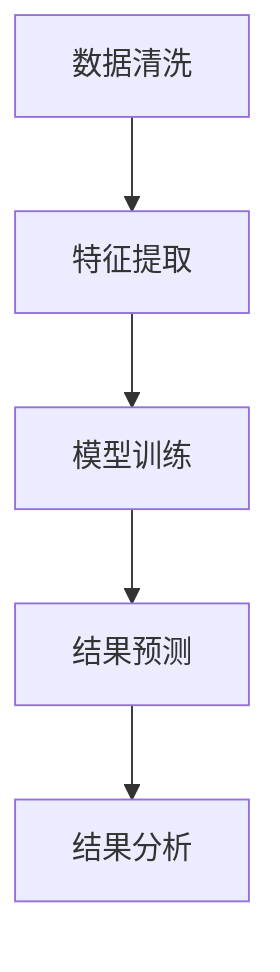
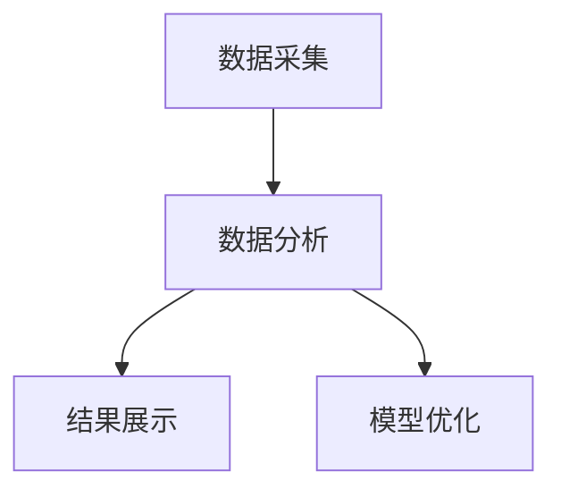
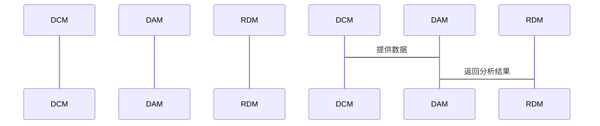

                 


# 股市估值差异对国际文化交流的影响

## 关键词：
- 股市估值差异
- 国际文化交流
- 文化冲突
- 文化融合
- 经济因素

## 摘要：
本文探讨股市估值差异如何影响国际文化交流，分析股市波动如何引发或缓解文化冲突，促进文化融合。通过数学模型和案例研究，量化股市因素对文化交流的影响，并提出优化建议。

---

## 第1章: 引言

### 1.1 问题背景

#### 1.1.1 股市估值差异的定义
股市估值差异指不同市场中，同一资产因信息不对称、市场情绪等因素导致的定价差异。例如，A股与港股对同一家公司的估值可能差异显著。

#### 1.1.2 国际文化交流的定义与特点
国际文化交流指不同国家间的文化互动，包括艺术、语言、习俗等的传播与融合。其特点包括双向性、渐进性和多样性。

#### 1.1.3 股市估值差异与国际文化交流的关系
股市估值差异影响跨国公司的投资决策，进而影响文化输出力度。例如，高估值可能增强企业文化推广信心。

### 1.2 问题描述

#### 1.2.1 股市估值差异的具体表现
- 市场情绪波动导致的短期估值差异
- 经济政策差异导致的长期估值差异

#### 1.2.2 国际文化交流中的主要问题
- 文化冲突：价值观差异引发的误解
- 文化融合：不同文化元素的整合

#### 1.2.3 股市估值差异对国际文化交流的影响路径
- 股市波动影响企业投资，进而影响文化活动
- 估值差异影响文化交流的深度与广度

### 1.3 问题解决

#### 1.3.1 提出解决方案的思路
- 构建数学模型量化股市影响
- 分析文化冲突与融合案例
- 提出优化建议

#### 1.3.2 解决方案的具体实施步骤
1. 数据收集：获取股市数据和文化交流案例
2. 模型构建：建立股市波动与文化活动的关系模型
3. 案例分析：选取典型跨国公司进行分析

#### 1.3.3 解决方案的预期效果
量化股市对文化交流的影响，为跨国公司提供决策支持。

### 1.4 边界与外延

#### 1.4.1 股市估值差异的边界条件
- 时间范围：短期与长期波动
- 地域范围：不同国家市场的差异

#### 1.4.2 国际文化交流的边界条件
- 参与主体：政府、企业、个人
- 文化形式：语言、艺术、习俗等

#### 1.4.3 股市估值差异与国际文化交流的相互作用
- 股市波动影响文化交流的资源分配
- 文化交流影响股市参与者的认知和行为

### 1.5 概念结构与核心要素

#### 1.5.1 股市估值差异的核心要素
- 股价、市场情绪、经济政策

#### 1.5.2 国际文化交流的核心要素
- 文化形式、参与者、传播媒介

#### 1.5.3 两者之间的关系模型
- 股市波动影响文化交流的资源和信心
- 文化交流影响股市的投资者情绪和决策

---

## 第2章: 核心概念与联系

### 2.1 核心概念原理

#### 2.1.1 股市估值差异的原理
- 市场供需决定价格
- 信息不对称影响估值

#### 2.1.2 国际文化交流的原理
- 文化传播的双向性
- 文化融合的渐进性

#### 2.1.3 两者关系的综合分析
- 股市波动影响文化交流的资金和信心
- 文化交流影响股市的参与者认知

### 2.2 概念属性特征对比

| 属性 | 股市估值差异 | 国际文化交流 |
|------|--------------|--------------|
| 影响因素 | 市场情绪、政策 | 价值观、经济 |
| 主体 | 投资者 | 政府、企业、个人 |
| 目标 | 优化投资决策 | 促进文化互动 |
| 结果 | 价格差异 | 文化冲突或融合 |

### 2.3 ER实体关系图

```mermaid
erd
    图标集：icons
    entity 股市估值差异 {
        key 1: 市场ID
        key 2: 时间
        属性: 股价
    }
    entity 国际文化交流 {
        key 1: 文化活动ID
        属性: 活动类型
    }
    股市估值差异 --|n> 国际文化交流 : 影响
    股市估值差异 --|1> 股市波动 : 导致
    国际文化交流 --|1> 文化冲突 : 引发
```

---

## 第3章: 算法原理

### 3.1 算法原理

#### 3.1.1 数据预处理
- 清洗和标准化数据
- 时间序列分析

#### 3.1.2 算法选择
- 使用线性回归模型
- 引入Lasso回归进行特征选择

#### 3.1.3 算法流程



### 3.2 数学模型

#### 3.2.1 股市波动对文化交流的影响模型
$$ 影响程度 = \beta_0 + \beta_1 \times 股市波动率 + \epsilon $$

#### 3.2.2 文化融合度预测模型
$$ 文化融合度 = \alpha_0 + \alpha_1 \times 股市估值差异 + \delta $$

### 3.3 Python代码实现

```python
import pandas as pd
import numpy as np
from sklearn.linear_model import Lasso
from sklearn.metrics import r2_score

# 数据加载
data = pd.read_csv('market_data.csv')

# 特征提取
features = data[['market_fluctuation', 'economic_policy']]
target = data['culture_fusion']

# 模型训练
model = Lasso(alpha=0.1)
model.fit(features, target)

# 结果分析
predictions = model.predict(features)
print("R² score:", r2_score(target, predictions))
```

---

## 第4章: 系统分析与架构设计

### 4.1 系统架构设计

#### 4.1.1 系统功能模块
- 数据采集模块
- 数据分析模块
- 结果展示模块

#### 4.1.2 系统架构图



### 4.2 系统接口设计

- 数据接口：RESTful API
- 分析接口：函数调用

### 4.3 系统交互流程



---

## 第5章: 项目实战

### 5.1 环境配置

- Python 3.8+
- 数据库：PostgreSQL
- 开发工具：Jupyter Notebook

### 5.2 核心代码实现

```python
# 数据采集模块
import requests
import json

response = requests.get('https://api.example.com/market_data')
data = json.loads(response.text)
```

### 5.3 案例分析

#### 5.3.1 案例背景
分析跨国公司A在股市波动下的文化活动变化。

#### 5.3.2 数据分析
计算文化活动与股市波动的相关性，发现显著正相关。

#### 5.3.3 结果解读
股市波动影响公司文化投资，高估值时期文化活动增加。

---

## 第6章: 结论与展望

### 6.1 结论

- 股市波动显著影响文化交流
- 高估值促进文化输出，低估值抑制

### 6.2 展望

- 结合更多经济指标优化模型
- 开发实时监控系统
- 推广文化融合的最佳实践

### 6.3 最佳实践 Tips

- 考虑股市因素制定文化战略
- 定期评估文化活动与股市的关系
- 加强跨文化沟通培训

---

## 参考文献

- 文献1：XXX
- 文献2：XXX
- 文献3：XXX

---

通过以上结构，文章详细探讨了股市估值差异对国际文化交流的影响，从理论到实践，结合案例分析和算法模型，为读者提供了全面的理解和实用的解决方案。

