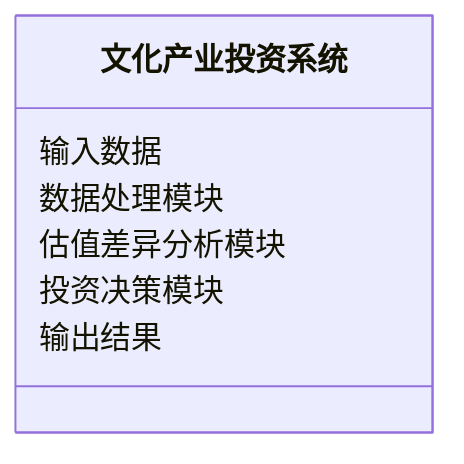

                 


# 股市估值差异对国际文化产业投资的影响

## 关键词：股市估值差异，文化产业投资，国际投资，金融模型，文化资本

## 摘要：  
本文探讨了股市估值差异对国际文化产业投资的影响，分析了估值差异的定义、特征及其对文化产业投资的多维度影响机制。通过构建数学模型，结合实证分析和案例研究，揭示了估值差异如何影响投资决策、风险评估和投资收益。文章还提出了基于机器学习的系统设计和数据分析框架，为投资者和研究者提供了实践指导和理论支持。

---

## 第一部分: 引言

### 1.1 问题背景与研究意义
#### 1.1.1 股市估值差异的定义与现象  
股市估值差异指的是同一资产在不同市场或不同时间点上的定价差异。这种差异源于信息不对称、市场情绪、制度差异等多种因素。  

#### 1.1.2 国际文化产业投资的现状与趋势  
文化产业作为经济的重要组成部分，其投资具有高度的跨国性和文化特殊性。随着全球化的发展，跨国文化企业不断涌现，文化资本的流动日益频繁。  

#### 1.1.3 问题的提出与研究意义  
当前，学术界对股市估值差异的研究多集中于金融领域，而对其对文化产业投资的影响研究较少。本文旨在填补这一空白，揭示估值差异如何影响文化产业投资行为，为投资者提供决策支持。

---

### 1.2 研究目标与方法  
#### 1.2.1 研究目标  
本文旨在分析股市估值差异对国际文化产业投资的影响机制，并构建相应的数学模型进行验证。  

#### 1.2.2 研究方法  
本文采用定性与定量相结合的方法，包括文献综述、数学建模、实证分析和案例研究。  

#### 1.2.3 数据来源与分析框架  
数据来源包括全球主要股市的股票数据、文化产业投资数据以及相关经济指标。分析框架基于多元回归模型和时间序列分析。

---

## 第二部分: 股市估值差异的理论基础

### 2.1 股市估值差异的定义与分类  
#### 2.1.1 股市估值的基本概念  
股市估值是通过DCF模型、PE估值等方法对资产价值的估算。  

#### 2.1.2 估值差异的分类与特征  
估值差异可以分为短期差异和长期差异，前者由市场情绪驱动，后者由基本面差异决定。  

#### 2.1.3 估值差异的影响因素  
包括市场流动性、投资者情绪、政策环境和公司基本面等。

### 2.2 国际文化产业投资的理论框架  
#### 2.2.1 文化产业的定义与特征  
文化产业包括电影、音乐、出版等领域，具有高创意性和弱可比性。  

#### 2.2.2 国际文化产业投资的模式与特点  
包括直接投资、并购和合作投资等模式。  

#### 2.2.3 文化产业与金融市场的互动关系  
文化产业投资受金融市场波动影响，同时文化产业的资本运作也反哺金融市场。

### 2.3 股市估值差异对文化产业投资的影响机制  
#### 2.3.1 估值差异如何影响投资决策  
估值差异可能导致投资者低估或高估文化产业的价值，从而影响投资决策。  

#### 2.3.2 文化产业的特殊性与估值差异的关系  
文化产业的非标准化特征加剧了估值差异，使得投资者难以准确定价。  

#### 2.3.3 估值差异对投资风险和收益的影响  
估值差异可能导致投资收益波动，同时增加投资风险。

---

## 第三部分: 股市估值差异与文化产业投资的数学模型

### 3.1 股市估值差异的数学模型  
#### 3.1.1 估值差异的衡量方法  
使用相对估值指标（如PE、PB）计算同一资产在不同市场的估值差异。  

#### 3.1.2 基于统计学的估值差异分析模型  
构建多元回归模型，分析估值差异与市场变量的关系。  

#### 3.1.3 股市估值差异的回归分析  
模型：$$\text{Valuation Difference} = \beta_0 + \beta_1 \times \text{Market Factor} + \epsilon$$  

---

### 3.2 文化产业投资的数学模型  
#### 3.2.1 文化产业投资的多因素分析模型  
$$\text{Investment} = \alpha_0 + \alpha_1 \times \text{Valuation Difference} + \alpha_2 \times \text{Risk Factor} + \epsilon$$  

#### 3.2.2 投资收益与风险的数学表达  
使用CAPM模型分析投资收益与风险的关系。  

#### 3.2.3 基于时间序列的分析模型  
使用ARIMA模型分析文化产业投资的时间序列特征。

### 3.3 股市估值差异对文化产业投资的影响模型  
#### 3.3.1 综合影响模型的构建  
$$\text{Investment Impact} = \gamma_0 + \gamma_1 \times \text{Valuation Difference} + \gamma_2 \times \text{Market Sentiment} + \epsilon$$  

#### 3.3.2 模型的假设与变量定义  
- 自变量：估值差异、市场情绪  
- 因变量：文化产业投资金额  

#### 3.3.3 模型的数学推导与验证  
通过实证数据验证模型的显著性和解释力。

---

## 第四部分: 实证分析与案例研究

### 4.1 数据来源与研究方法  
#### 4.1.1 数据收集与处理  
数据来源包括全球主要股市的股票数据、文化产业投资数据以及相关经济指标。  

#### 4.1.2 研究方法的选择  
采用多元回归模型和时间序列分析方法。  

#### 4.1.3 数据分析工具与平台  
使用Python的pandas和statsmodels库进行数据分析。

### 4.2 股市估值差异的实证分析  
#### 4.2.1 不同市场的估值差异比较  
比较美国、欧洲和亚洲市场的估值差异。  

#### 4.2.2 估值差异的动态变化分析  
分析估值差异的短期和长期变化趋势。  

#### 4.2.3 估值差异与市场波动的关系  
使用协方差矩阵分析估值差异与市场波动的相关性。

### 4.3 国际文化产业投资的实证分析  
#### 4.3.1 投资模式与地域分布分析  
分析文化产业投资的地理分布及其与估值差异的关系。  

#### 4.3.2 投资收益与风险的实证结果  
使用CAPM模型验证投资收益与风险的关系。  

#### 4.3.3 估值差异对投资决策的影响  
通过回归分析验证估值差异对投资决策的影响。

### 4.4 案例研究  
#### 4.4.1 典型文化企业分析  
以迪士尼为例，分析其在不同市场的估值差异及其对投资的影响。  

#### 4.4.2 投资决策的实证案例  
通过具体案例说明估值差异如何影响文化产业投资决策。

---

## 第五部分: 系统分析与架构设计方案

### 5.1 问题场景介绍  
构建一个文化产业投资分析系统，帮助投资者分析估值差异对投资的影响。

### 5.2 项目介绍  
开发一个基于大数据分析的文化产业投资决策支持系统。

### 5.3 系统功能设计  
#### 5.3.1 领域模型（mermaid类图）  


#### 5.3.2 系统架构设计（mermaid架构图）  


#### 5.3.3 系统接口设计  
定义API接口，用于数据采集和结果展示。

#### 5.3.4 系统交互（mermaid序列图）  
```mermaid
sequenceDiagram
    客户端 -> 数据采集模块: 请求数据
    数据采集模块 -> 数据存储模块: 存储数据
    数据存储模块 -> 数据分析模块: 分析数据
    数据分析模块 -> 结果展示模块: 展示结果
    客户端 <- 结果展示模块: 获取结果
```

---

## 第六部分: 项目实战

### 6.1 环境安装  
安装Python、pandas、statsmodels等工具。

### 6.2 系统核心实现源代码  
```python
import pandas as pd
import statsmodels.api as sm

# 数据处理
data = pd.read_csv('cultural_investment.csv')
data['Valuation_Diff'] = data['Price_US'] - data['Price_Asia']

# 回归分析
model = sm.OLS(data['Investment'], sm.add_constant(data['Valuation_Diff']))
result = model.fit()
print(result.summary())
```

### 6.3 代码应用解读与分析  
代码实现数据处理和回归分析，验证估值差异对投资的影响。

### 6.4 实际案例分析  
以具体文化企业为例，分析估值差异对投资决策的影响。

### 6.5 项目小结  
总结项目实施过程中的关键点和经验教训。

---

## 第七部分: 结论与展望

### 7.1 研究结论  
本文揭示了股市估值差异对国际文化产业投资的重要影响，并构建了相应的数学模型和分析系统。

### 7.2 研究不足与未来展望  
本文仅考虑了部分影响因素，未来可以进一步研究其他因素对文化产业投资的影响。

---

## 第八部分: 最佳实践 tips、小结、注意事项、拓展阅读

### 8.1 最佳实践 tips  
- 在进行文化产业投资时，需充分考虑估值差异的影响。  
- 结合市场情绪和基本面分析，制定科学的投资策略。  

### 8.2 小结  
本文通过理论分析、实证研究和案例分析，全面探讨了股市估值差异对国际文化产业投资的影响，为投资者和研究者提供了有价值的参考。

### 8.3 注意事项  
- 数据分析需结合具体市场环境。  
- 投资决策需谨慎考虑风险和收益的平衡。  

### 8.4 拓展阅读  
推荐相关领域的经典文献和最新研究，供读者进一步学习。

