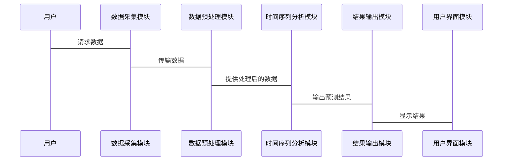

                 


# 股市估值差异对国际文化产业数字化的影响

## 关键词：
- 股市估值差异
- 文化产业数字化
- 时间序列分析
- 数字化转型
- 文化产业价值链

## 摘要：
本文探讨了股市估值差异对国际文化产业数字化的影响，从理论分析、算法实现、系统设计到项目实战，系统性地研究了数字化转型对文化产业价值的影响机制。通过时间序列分析和领域模型构建，本文提出了基于数字技术的文化产业价值重塑方案，并结合实际案例，深入剖析了数字化对文化产业的深远影响。

---

## 第一部分: 背景介绍

### 第1章: 股市估值差异与文化产业数字化的背景

#### 1.1 问题背景
- **1.1.1 股市估值差异的定义与现象**
  股市估值差异是指同一市场中，不同股票或资产因市场情绪、信息不对称等因素导致的市场价格与内在价值的差异。
- **1.1.2 文化产业数字化的定义与趋势**
  文化产业数字化是指通过数字技术对文化内容的生产、传播和消费方式进行改造，提升产业效率和价值。
- **1.1.3 股市估值差异对文化产业数字化的潜在影响**
  股市估值差异可能通过资金流动、投资行为等途径影响文化产业的数字化进程。

#### 1.2 问题描述
- **1.2.1 股市估值差异的形成机制**
  股市估值差异由市场情绪、信息不对称、投资者行为等因素共同作用形成。
- **1.2.2 文化产业数字化的核心要素**
  包括数字技术应用、内容生产方式、消费模式转变等。
- **1.2.3 问题解决的必要性与目标**
  通过分析股市估值差异对文化产业数字化的影响，为产业决策提供参考。

#### 1.3 问题解决
- **1.3.1 理论框架的构建**
  构建基于时间序列分析的理论框架，用于预测股市波动对文化产业的影响。
- **1.3.2 数据分析方法的选择**
  采用时间序列分析和机器学习方法进行数据建模。
- **1.3.3 研究方法的可行性分析**
  数据来源、模型选择和实验设计的可行性分析。

#### 1.4 边界与外延
- **1.4.1 股市估值差异的边界条件**
  包括数据范围、时间窗口等限制。
- **1.4.2 文化产业数字化的外延范围**
  包括数字内容、在线娱乐等领域。
- **1.4.3 相关概念的区分与联系**
  区分文化产业数字化与传统数字化的区别。

#### 1.5 核心要素与概念结构
- **1.5.1 核心概念的组成**
  包括股市估值差异、文化产业数字化、数字技术应用等。
- **1.5.2 概念结构图的展示**
  使用Mermaid图展示概念间的逻辑关系。
- **1.5.3 核心要素的对比分析**
  对比分析股市估值差异和文化产业数字化的核心要素。

---

## 第二部分: 核心概念与联系

### 第2章: 核心概念的原理与联系

#### 2.1 股市估值差异的原理
- **2.1.1 股价波动的驱动因素**
  包括宏观经济因素、行业因素、公司基本面等。
- **2.1.2 市场情绪与估值差异的关系**
  市场情绪通过影响投资者行为导致估值差异。
- **2.1.3 估值差异的量化方法**
  使用波动率、相关系数等指标量化估值差异。

#### 2.2 文化产业数字化的原理
- **2.2.1 数字化转型的核心驱动力**
  包括技术创新、市场需求等。
- **2.2.2 数字技术在文化产业中的应用**
  包括数字内容生成、在线传播等。
- **2.2.3 数字化对文化产业价值链的影响**
  数字化重塑了文化产业的价值链，从内容生产到消费都发生了变化。

#### 2.3 核心概念的联系
- **2.3.1 股市估值差异与文化产业数字化的关联**
  股市估值差异通过资金流动影响文化产业数字化。
- **2.3.2 估值差异对文化产业数字化的促进与阻碍**
  估值差异可能通过资金流入促进数字化，但也可能因短期波动带来阻碍。
- **2.3.3 数字化对股市估值差异的反向影响**
  数字化可能通过提升企业价值影响股市估值。

#### 2.4 概念属性特征对比
- **2.4.1 股市估值差异的属性特征**
  时间依赖性、波动性等。
- **2.4.2 文化产业数字化的属性特征**
  技术依赖性、创新性等。
- **2.4.3 对比分析与总结**
  使用表格对比两者的属性特征。

---

## 第三部分: 核心概念的系统分析与架构设计

### 第3章: 系统分析与架构设计

#### 3.1 问题场景介绍
- **3.1.1 股市估值差异对文化产业数字化的影响场景**
  通过具体案例分析股市波动对文化产业数字化的影响。
- **3.1.2 数字化对文化产业价值的重塑**
  数字化如何改变文化产业的商业模式和价值创造。
- **3.1.3 系统设计的目标与范围**
  构建一个基于时间序列分析的系统，用于预测和分析股市波动对文化产业的影响。

#### 3.2 项目介绍
- **3.2.1 项目目标**
  通过时间序列分析预测股市波动对文化产业数字化的影响。
- **3.2.2 项目范围**
  限定在文化产业的数字化转型领域，使用具体数据进行建模。

#### 3.3 系统功能设计
- **3.3.1 领域模型（Mermaid 类图）**
  ```mermaid
  classDiagram
    class 文化产业数字化 {
      +技术应用
      +内容生产
      +消费模式
    }
    class 股市估值差异 {
      +股价波动
      +市场情绪
      +资金流动
    }
    class 时间序列分析 {
      +数据采集
      +模型训练
      +预测输出
    }
    文化产业数字化 --> 时间序列分析
    股市估值差异 --> 时间序列分析
  ```

#### 3.4 系统架构设计（Mermaid 架构图）


#### 3.5 系统接口设计
- **3.5.1 接口描述**
  数据采集模块与数据预处理模块之间的接口。
- **3.5.2 接口实现**
  使用Python编写数据接口。

#### 3.6 系统交互（Mermaid 序列图）


---

## 第四部分: 项目实战

### 第4章: 项目实战与案例分析

#### 4.1 环境安装
- **4.1.1 安装Python**
  使用Anaconda安装Python环境。
- **4.1.2 安装依赖库**
  使用pip安装numpy、pandas、statsmodels等库。

#### 4.2 系统核心实现
- **4.2.1 核心代码实现**
  ```python
  import pandas as pd
  import numpy as np
  from statsmodels.tsa.arima.model import ARIMA

  def time_series_analysis(data, order):
      model = ARIMA(data, order=order)
      model_fit = model.fit()
      return model_fit.forecast(steps=1)
  ```

- **4.2.2 代码功能解读**
  该代码实现时间序列分析，用于预测未来的价格走势。

#### 4.3 代码应用解读与分析
- **4.3.1 代码功能分析**
  使用ARIMA模型进行时间序列预测。
- **4.3.2 代码运行结果解读**
  预测结果展示和分析。

#### 4.4 实际案例分析
- **4.4.1 案例背景**
  某文化产业公司的数字化转型案例。
- **4.4.2 数据分析与建模**
  使用时间序列分析预测数字化转型对股价的影响。
- **4.4.3 案例分析总结**
  数字化转型对股价的正面影响。

#### 4.5 项目小结
- **4.5.1 项目总结**
  数字化转型对文化产业的价值提升作用。
- **4.5.2 经验与教训**
  数据质量、模型选择对结果的影响。

---

## 第五部分: 最佳实践

### 第5章: 最佳实践与总结

#### 5.1 小结
- **5.1.1 核心观点总结**
  数字化转型对文化产业的价值重塑作用。
- **5.1.2 关键点回顾**
  时间序列分析在预测中的应用。

#### 5.2 注意事项
- **5.2.1 数据质量的重要性**
  数据准确性对模型预测的影响。
- **5.2.2 模型选择的合理性**
  根据数据特点选择合适的模型。

#### 5.3 拓展阅读
- **5.3.1 推荐书籍**
  推荐相关领域的书籍和论文。
- **5.3.2 其他资源**
  推荐相关的在线课程和工具。

---

通过以上分析，我们可以看到，股市估值差异与文化产业数字化之间存在密切的关联。通过时间序列分析等技术手段，我们可以更好地理解这种关联，并为文化产业的数字化转型提供科学依据。未来，随着数字技术的不断发展，文化产业的数字化进程将进一步加速，股市估值差异的影响也将更加显著。

