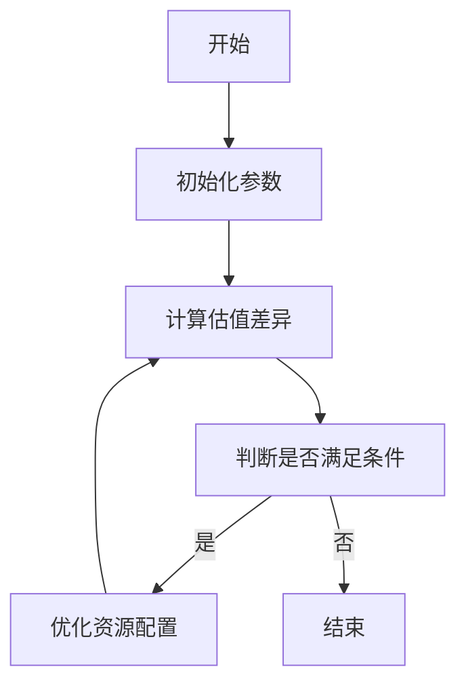
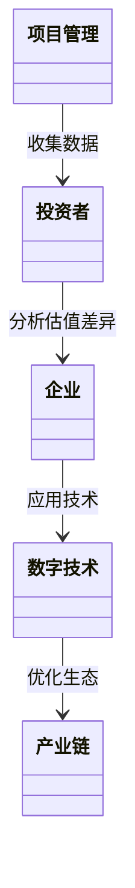
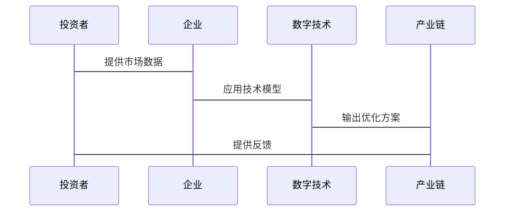

                 


# 股市估值差异对国际文化产业数字化转型的影响

> 关键词：股市估值差异，数字化转型，文化产业，国际文化，数字技术

> 摘要：本文探讨了股市估值差异对国际文化产业数字化转型的影响。首先，定义了股市估值差异和数字化转型的基本概念，分析了国际文化产业的现状与发展趋势。接着，详细阐述了股市估值差异对文化产业投资、创新和国际竞争力的影响，以及数字化转型对文化产业效率、模式和生态的影响。通过构建数学模型和算法，本文进一步分析了两者之间的协同效应，并结合实际案例进行了深入剖析。最后，提出了最佳实践建议，为国际文化产业的数字化转型提供了理论依据和实践指导。

---

## 第一部分: 背景介绍

### 第1章: 核心概念与问题背景

#### 1.1 股市估值差异的定义与特征
股市估值差异是指同一资产在不同市场、不同投资者或不同时间点上，由于信息不对称、市场情绪、政策差异等因素导致的股票估值差异。其主要特征包括：
- **信息不对称性**：市场参与者掌握的信息不一致，导致估值差异。
- **市场情绪影响**：投资者情绪波动会影响股票的估值。
- **政策与制度差异**：不同市场的监管政策和制度差异也会导致估值差异。

#### 1.2 数字化转型的定义与内涵
数字化转型是指企业利用数字技术（如大数据、人工智能、云计算等）改变其业务模式、流程、文化、组织结构等方面的过程。其核心在于通过技术创新提升效率、创造新价值，并实现业务的可持续发展。

#### 1.3 国际文化产业的定义与现状
国际文化产业是指跨越国界的文化产品和服务的生产和流通活动，包括电影、音乐、游戏、出版、艺术等多个领域。随着全球化和数字技术的普及，国际文化产业呈现出数字化、网络化和跨国化的趋势。

---

### 第2章: 问题描述与研究目标

#### 2.1 股市估值差异对文化产业的影响
- **投资影响**：股市估值差异会影响投资者对文化产业的投资决策。
- **创新影响**：估值差异可能影响文化产业的创新能力和技术升级。
- **国际竞争力影响**：估值差异会影响文化产业在国际市场的竞争力。

#### 2.2 数字化转型对文化产业的影响
- **效率提升**：数字化转型可以提高文化产业的生产效率。
- **模式创新**：数字化转型催生了新的商业模式，如数字内容订阅、虚拟现实体验等。
- **生态构建**：数字化转型促进了文化产业生态的构建，推动了产业链的整合。

#### 2.3 研究目标与研究意义
- **研究目标**：探索股市估值差异对国际文化产业数字化转型的影响机制，提出相应的对策建议。
- **研究意义**：有助于优化文化产业的投融资环境，推动文化产业的可持续发展。

---

## 第二部分: 核心概念与联系

### 第3章: 核心概念原理与联系

#### 3.1 股市估值差异的核心原理
- **经济学解释**：信息不对称和市场情绪是导致估值差异的主要原因。
- **金融学模型**：利用CAPM（资本资产定价模型）和APT（套利定价理论）分析估值差异的形成机制。
- **市场机制**：市场机制的不完善性和参与者行为的多样性加剧了估值差异。

#### 3.2 数字化转型的核心原理
- **技术驱动**：数字技术（如AI、大数据）是数字化转型的核心驱动力。
- **组织变革**：数字化转型要求企业进行组织结构和管理模式的创新。
- **生态协同**：数字化转型需要产业链上下游的协同合作。

#### 3.3 股市估值差异与数字化转型的联系
- **促进作用**：股市估值差异可以通过优化资源配置促进文化产业的数字化转型。
- **反馈作用**：数字化转型可以通过提升企业价值减少股市估值差异。
- **协同效应**：两者协同可以实现文化产业的高质量发展。

---

### 第4章: 核心概念属性对比与ER实体关系图

#### 4.1 核心概念属性对比表
| **属性**       | **股市估值差异**             | **数字化转型**             |
|----------------|------------------------------|-----------------------------|
| 核心因素       | 信息不对称、市场情绪         | 数字技术、组织变革         |
| 影响对象       | 投资者、企业                 | 企业、产业链               |
| 目标           | 减少估值差异                 | 提升效率、创新模式         |
| 方法           | 金融模型、市场机制优化       | 技术应用、组织重构         |

#### 4.2 ER实体关系图
```mermaid
er
    项目
    投资者
    企业
    数字技术
    产业链
    
    项目 (1..n) -- 投资者: 投资关系
    项目 (1..n) -- 企业: 项目实施
    企业 (1..n) -- 数字技术: 技术应用
    企业 (1..n) -- 产业链: 产业协同
```

---

## 第三部分: 算法原理讲解

### 第5章: 算法原理与实现

#### 5.1 算法原理
- **博弈论模型**：分析投资者和企业在估值差异下的博弈行为。
- **系统动力学模型**：模拟文化产业数字化转型的过程和结果。

#### 5.2 算法实现


#### 5.3 Python代码实现
```python
import numpy as np

def calculate_valuation_difference(prices, expected_prices):
    difference = np.mean(prices - expected_prices)
    return difference

# 示例数据
prices = np.array([100, 110, 90, 120, 105])
expected_prices = np.array([105, 115, 95, 125, 110])

# 计算估值差异
difference = calculate_valuation_difference(prices, expected_prices)
print("估值差异:", difference)
```

#### 5.4 数学模型与公式
- **文化产业价值评估模型**：
  $$ V = \alpha \times P + \beta \times Q $$
  其中，$P$ 表示文化产业的市场潜力，$Q$ 表示文化产业的技术创新水平，$\alpha$ 和 $\beta$ 是模型参数。
  
- **股市估值差异模型**：
  $$ D = \sum_{i=1}^{n} |P_i - Q_i| $$
  其中，$P_i$ 和 $Q_i$ 分别表示第 $i$ 个市场的估值和实际值。

---

## 第四部分: 数学模型与公式

### 第6章: 数学模型与公式推导

#### 6.1 文化产业价值评估模型
- **模型推导**：
  $$ V = \alpha P + \beta Q $$
  其中，$\alpha$ 和 $\beta$ 可以通过回归分析确定。
  
- **应用案例**：
  假设 $\alpha = 0.6$，$\beta = 0.4$，$P = 80$，$Q = 60$，则：
  $$ V = 0.6 \times 80 + 0.4 \times 60 = 72 $$

#### 6.2 股市估值差异模型
- **模型推导**：
  $$ D = \sum_{i=1}^{n} |P_i - Q_i| $$
  该模型用于衡量不同市场间估值差异的总和。
  
- **应用案例**：
  假设 $P = [100, 110, 90]$，$Q = [105, 115, 95]$，则：
  $$ D = |100-105| + |110-115| + |90-95| = 5 + 5 + 5 = 15 $$

---

## 第五部分: 系统分析与架构设计

### 第7章: 系统分析与架构设计

#### 7.1 系统功能设计


#### 7.2 系统架构设计


#### 7.3 接口设计
- **输入接口**：接收市场数据和企业信息。
- **输出接口**：输出估值差异报告和数字化转型方案。

#### 7.4 交互设计


---

## 第六部分: 项目实战

### 第8章: 项目实战与案例分析

#### 8.1 环境安装
- **工具安装**：安装Python、NumPy、Mermaid等工具。
- **数据获取**：收集相关市场数据和企业信息。

#### 8.2 核心代码实现
```python
import numpy as np

def calculate_valuation_difference(prices, expected_prices):
    difference = np.mean(prices - expected_prices)
    return difference

# 示例数据
prices = np.array([100, 110, 90, 120, 105])
expected_prices = np.array([105, 115, 95, 125, 110])

# 计算估值差异
difference = calculate_valuation_difference(prices, expected_prices)
print("估值差异:", difference)
```

#### 8.3 案例分析
- **案例背景**：某国文化产业数字化转型的现状与挑战。
- **分析过程**：利用上述模型分析估值差异，制定转型方案。
- **结果展示**：通过图表展示分析结果。

#### 8.4 项目总结
- **总结成果**：详细说明项目完成情况和取得的成果。
- **经验教训**：总结项目实施过程中的经验和教训。

---

## 第七部分: 最佳实践

### 第9章: 最佳实践与小结

#### 9.1 关键点总结
- **估值差异的优化**：通过信息共享和政策引导减少估值差异。
- **数字化转型的推进**：加强技术应用和组织协同。

#### 9.2 注意事项
- **数据质量**：确保数据的准确性和完整性。
- **模型适用性**：根据实际情况调整模型参数。

#### 9.3 拓展阅读
- 推荐相关书籍和论文，供读者深入学习。

---

## 结语

本文系统地探讨了股市估值差异对国际文化产业数字化转型的影响，通过理论分析、模型构建和案例研究，提出了优化文化产业发展的建议。希望本文能够为相关领域的研究和实践提供有价值的参考。

