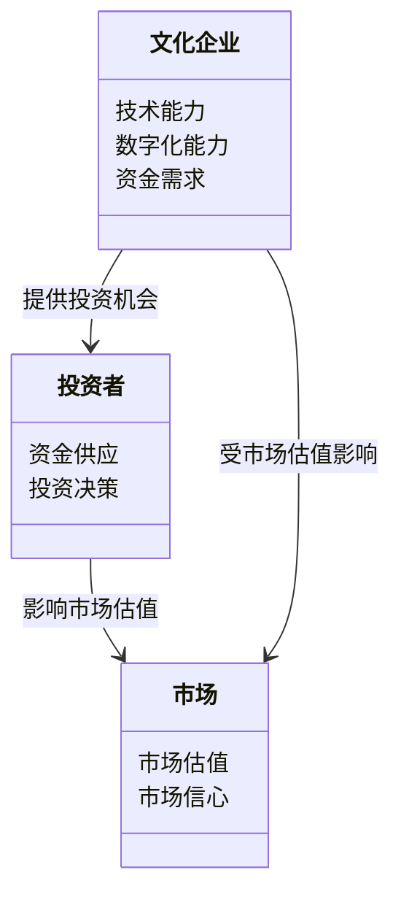
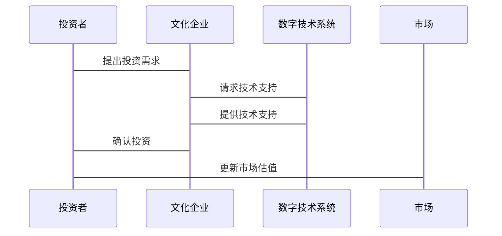

                 


# 股市估值差异对国际文化产业数字化转型的影响

## 关键词
股市估值差异、文化产业、数字化转型、文化企业、数字技术

## 摘要
本文探讨了股市估值差异对国际文化产业数字化转型的影响，分析了估值差异的成因及其对文化产业投资和转型的具体影响。文章从背景、核心概念、理论分析、系统设计、案例研究和解决方案等多方面展开，结合实际案例和数学模型，深入剖析了估值差异如何通过影响投资行为和企业决策，进而推动或阻碍文化产业的数字化进程。最后，文章提出了应对估值差异的策略和优化路径，为相关领域的研究和实践提供了参考。

---

## 第1章：背景介绍

### 1.1 股市估值差异的定义与影响
股市估值差异是指同一市场中，不同企业或行业之间的股票估值存在显著差异的现象。这种差异通常由市场情绪、信息不对称、行业特性等因素引起。股市估值差异对经济活动的影响体现在以下几个方面：

1. **资源配置效率**：估值差异可能导致资本分配不均，高估值企业获得更多资金支持，而低估值企业可能被忽视。
2. **市场风险**：估值差异放大了市场波动，特别是在市场下跌时，低估值企业可能面临更大的抛售压力。
3. **企业行为**：估值差异会影响企业的融资成本和投资决策，进而影响其业务拓展和创新能力。

### 1.2 文化产业数字化转型的背景
文化产业数字化转型是指通过数字技术（如人工智能、大数据、区块链等）对文化内容的生产、传播和消费方式进行革新。这一转型不仅改变了文化产业的商业模式，还推动了文化价值的重新定义。

1. **驱动因素**：
   - 技术进步：数字技术的普及降低了内容创作和传播的成本。
   - 市场需求：消费者对个性化和互动化体验的需求增加。
   - 政策支持：政府通过政策引导推动文化产业的数字化发展。

2. **影响**：
   - 提高文化产品的生产效率。
   - 扩大文化消费的市场规模。
   - 促进文化内容的创新和多样性。

### 1.3 股市估值差异与文化产业数字化转型的关联
文化产业的数字化转型与股市估值差异密切相关。一方面，数字化转型需要大量资金投入，而股市估值差异可能影响企业的融资能力；另一方面，数字化转型可能改变企业的盈利能力，从而影响其估值水平。

1. **问题背景**：
   - 文化企业数字化转型面临资金短缺问题。
   - 股市对数字化转型的长期价值认可不足。

2. **问题解决的必要性**：
   - 提高市场对文化产业数字化转型的认知。
   - 优化股市估值机制，为文化企业提供更多的融资支持。

---

## 第2章：核心概念与联系

### 2.1 核心概念的定义与属性

#### 2.1.1 股市估值差异
| 属性 | 描述 |
|------|------|
| 形成原因 | 市场情绪、信息不对称、行业特性 |
| 表现形式 | P/E比率、P/B比率、EV/EBITDA比率 |
| 影响 | 资源配置效率、市场风险、企业行为 |

#### 2.1.2 文化产业数字化转型
| 属性 | 描述 |
|------|------|
| 驱动因素 | 技术进步、市场需求、政策支持 |
| 核心特征 | 数字化内容生产、智能化传播、个性化消费 |
| 影响 | 提高效率、扩大市场、促进创新 |

### 2.2 核心概念的联系与对比

#### 2.2.1 概念属性对比表格
| 比较维度 | 股市估值差异 | 文化产业数字化转型 |
|----------|--------------|----------------------|
| 定义     | 估值水平的差异 | 数字技术驱动的转型 |
| 影响因素 | 市场情绪、信息不对称 | 技术、需求、政策 |
| 影响结果 | 资源分配、市场波动 | 效率提升、市场扩大 |

#### 2.2.2 ER实体关系图
```mermaid
er
  entity 股市估值差异 {
    <<股票>> 股票代码
    <<投资者>> 投资者ID
    <<市场>> 市场ID
  }
  entity 文化产业数字化转型 {
    <<文化企业>> 企业ID
    <<数字技术>> 技术ID
    <<消费者>> 消费者ID
  }
  股市估值差异 -[拥有]-> 文化产业数字化转型
```

---

## 第3章：股市估值差异对文化产业数字化转型的影响机制

### 3.1 理论基础

#### 3.1.1 股市估值差异的理论模型
股市估值差异可以用资本资产定价模型（CAPM）进行分析：
$$ E(r_i) = r_f + \beta_i (E(r_m) - r_f) $$
其中，$E(r_i)$ 是股票i的预期回报率，$r_f$ 是无风险利率，$\beta_i$ 是股票i的贝塔系数，$E(r_m)$ 是市场预期回报率。

#### 3.1.2 文化产业数字化转型的理论框架
文化产业数字化转型可以视为一种创新过程，可以用创新扩散理论进行分析：
$$ I_t = I_{t-1} \cdot e^{g} $$
其中，$I_t$ 是t时刻的创新扩散程度，$g$ 是增长率。

### 3.2 影响机制分析

#### 3.2.1 估值差异如何影响文化产业投资
$$ \text{投资决策} = f(\text{估值差异}, \text{风险偏好}, \text{市场信心}) $$
- 低估值可能导致投资者对文化产业数字化转型项目的兴趣降低。
- 高估值可能导致过度投资，引发市场泡沫。

#### 3.2.2 数字化转型如何缓解估值差异
$$ \text{估值调整} = f(\text{数字化能力}, \text{盈利能力}, \text{市场预期}) $$
- 数字化转型提高了文化企业的盈利能力，从而提高其估值。
- 数字化转型增强了市场对文化产业的长期价值认知，从而缩小估值差异。

---

## 第4章：系统分析与架构设计

### 4.1 问题场景介绍

#### 4.1.1 股市估值差异的具体表现
- 某些文化企业因技术落后而被市场低估。
- 高科技文化企业因高增长潜力而被市场高估。

#### 4.1.2 文化产业数字化转型的现实挑战
- 资金短缺限制了数字化转型的进度。
- 技术壁垒和人才短缺影响了转型效果。

### 4.2 系统功能设计

#### 4.2.1 领域模型Mermaid类图


### 4.3 系统架构设计

#### 4.3.1 Mermaid架构图


#### 4.3.2 系统接口设计
- 投资者与文化企业之间的资金流动接口。
- 文化企业与数字技术支持系统之间的数据交互接口。

#### 4.3.3 系统交互序列图


---

## 第5章：案例分析

### 5.1 典型国家的案例分析

#### 5.1.1 美国文化产业的数字化转型
- 美国好莱坞通过数字技术实现了内容制作和分发的创新。
- 投资者对数字化转型的高估值推动了文化产业的快速发展。

#### 5.1.2 日本动漫产业的数字化转型
- 日本动漫产业通过线上平台扩展了全球市场。
- 数字化转型提高了动漫产业的估值，吸引了更多投资。

### 5.2 案例对比与启示
- 不同国家的数字化转型路径和效果差异显著。
- 政策支持和技术创新是影响估值差异的重要因素。

---

## 第6章：解决方案与最佳实践

### 6.1 应对估值差异的策略

#### 6.1.1 优化估值机制
- 提高市场信息透明度。
- 优化投资者教育，减少信息不对称。

#### 6.1.2 提升文化产业数字化能力
- 加大对数字技术的投入。
- 培养数字化人才。

#### 6.1.3 加强政策支持与国际合作
- 政府提供税收优惠和补贴。
- 国际合作推动文化数字化的跨国流动。

### 6.2 数字化转型的实施路径
1. **技术引入**：采用人工智能、大数据等技术提升文化内容的生产效率。
2. **市场拓展**：通过线上平台扩大文化产品的消费群体。
3. **模式创新**：探索新的商业模式，如订阅制、会员制等。

---

## 结论

本文系统分析了股市估值差异对国际文化产业数字化转型的影响，结合实际案例和数学模型，提出了优化估值机制和提升数字化能力的解决方案。未来的研究可以进一步探讨估值差异的动态变化及其对文化产业长期发展的深远影响。

---

## 注意事项
- 文化产业数字化转型需要长期投入，企业需做好充足的资金准备。
- 投资者应关注企业的实际盈利能力和长期价值，避免盲目跟风。
- 政府和市场应共同努力，为文化产业的数字化转型创造良好的环境。

## 拓展阅读
- 推荐阅读《数字化转型：企业重构与商业生态》。
- 关注相关学术期刊，了解最新的研究成果。

