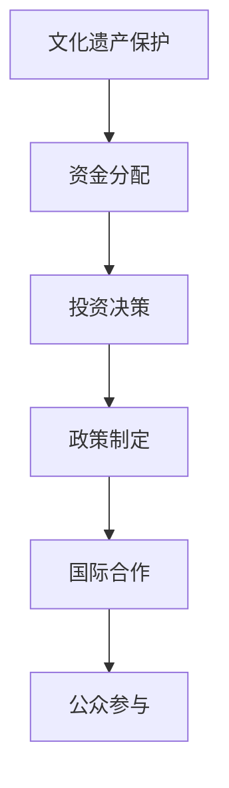

                 

# 股市估值差异对国际文化遗产保护的影响

## 关键词：
- 股市估值差异
- 文化遗产保护
- 经济影响
- 全球化
- 可持续发展

## 摘要：
本文探讨股市估值差异对国际文化遗产保护的影响。通过分析股市波动如何影响文化遗产保护的资金、投资和政策决策，揭示其对文化遗产保护的多维度影响。结合数学模型和实际案例，提出应对策略，为文化遗产保护提供新的视角。

---

# 第1章 股市估值差异的基本概念

## 1.1 股市估值差异的定义

股市估值差异是指同一股票在不同时间、市场或投资者眼中的价值差异。这种差异源于信息不对称、市场情绪、宏观经济因素等。

## 1.2 股市估值差异的影响因素

### 1.2.1 市场供需关系
供需失衡导致估值差异，买方和卖方预期不一致引发价格波动。

### 1.2.2 经济周期与宏观环境
经济波动影响投资者对股票的估值，通货膨胀和利率变化加剧估值差异。

### 1.2.3 公司基本面与市场情绪
公司业绩和市场情绪共同作用，导致同一股票估值差异。

## 1.3 股市估值差异与文化遗产保护的关系

### 1.3.1 文化遗产保护的基本概念
文化遗产是人类历史的物质和非物质见证，保护包括修复、保存和传承。

### 1.3.2 估值差异对文化遗产保护的影响路径
- 估值差异影响文化遗产保护资金的稳定性。
- 投资者行为变化影响文化遗产保护的经济支持。
- 经济波动影响文化遗产保护政策的制定和实施。

### 1.3.3 全球化背景下的文化遗产保护挑战
全球化加剧了文化多样性和经济差异，增加了文化遗产保护的复杂性。

---

# 第2章 国际文化遗产保护的现状

## 2.1 文化遗产保护的定义与分类

### 2.1.1 文化遗产的定义
文化遗产包括物质遗产（如建筑、遗址）和非物质遗产（如传统艺术、习俗）。

### 2.1.2 文化遗产的分类
- 物质文化遗产：如古迹、遗址。
- 非物质文化遗产：如传统音乐、舞蹈。

## 2.2 国际文化遗产保护的法律与政策

### 2.2.1 世界文化遗产公约
联合国教科文组织《世界遗产公约》是国际文化遗产保护的核心法律框架。

### 2.2.2 各国文化遗产保护政策
各国根据自身情况制定文化遗产保护政策，如美国的《国家历史保护法》。

## 2.3 文化遗产保护的经济与社会价值

### 2.3.1 文化遗产的经济价值
文化遗产吸引旅游，促进当地经济发展。

### 2.3.2 文化遗产的社会价值
文化遗产维护文化多样性，增强社区凝聚力。

### 2.3.3 文化遗产保护的可持续发展
文化遗产保护需在经济发展与文化传承之间找到平衡。

---

# 第3章 股市波动对文化遗产保护的影响

## 3.1 股市波动对文化遗产保护的直接影响

### 3.1.1 股市波动对文化遗产资金的影响
股市波动影响政府和企业的财政状况，进而影响文化遗产保护的资金投入。

### 3.1.2 股市波动对文化遗产投资的影响
投资者在经济不稳定的时期可能减少对文化遗产项目的投资。

### 3.1.3 股市波动对文化遗产保护组织的影响
股市波动可能导致文化遗产保护组织的资助减少，影响其运营能力。

## 3.2 股市波动对文化遗产保护的间接影响

### 3.2.1 经济不稳定性对文化遗产保护的影响
经济不稳定可能导致文化遗产保护项目被推迟或取消。

### 3.2.2 投资者行为变化对文化遗产保护的影响
投资者在经济不确定性增加时可能更倾向于短期投资，减少对文化遗产保护的长期支持。

### 3.2.3 社会舆论对文化遗产保护的影响
股市波动可能影响公众对文化遗产保护的关注度和参与度。

---

# 第4章 文化遗产保护中的估值差异问题

## 4.1 文化遗产保护中的估值差异现象

### 4.1.1 不同国家间文化遗产保护的估值差异
发达国家与发展中国家在文化遗产保护的资金投入和重视程度上存在显著差异。

### 4.1.2 不同文化背景下文化遗产保护的估值差异
不同文化背景下，人们对文化遗产的重视程度和保护方式不同。

### 4.1.3 不同利益相关者间文化遗产保护的估值差异
政府、企业和非营利组织在文化遗产保护的估值和优先级上可能存在分歧。

## 4.2 估值差异对文化遗产保护决策的影响

### 4.2.1 估值差异对文化遗产保护优先级的影响
估值差异可能导致某些文化遗产项目被忽视，而其他项目获得过多关注。

### 4.2.2 估值差异对文化遗产保护资金分配的影响
资金分配往往倾向于那些被认为具有更高经济价值的文化遗产项目。

### 4.2.3 估值差异对文化遗产保护政策制定的影响
估值差异可能导致政策制定者在文化遗产保护方面的决策偏向于某些特定利益相关者。

---

# 第5章 应对股市估值差异的策略与案例

## 5.1 应对股市估值差异的策略

### 5.1.1 加强文化遗产保护的经济基础
通过多元化融资方式，减少对股市波动的依赖。

### 5.1.2 提高文化遗产保护的公众意识
通过教育和宣传，增强公众对文化遗产保护的认识和支持。

### 5.1.3 建立文化遗产保护的国际合作机制
通过国际合作，共同应对股市波动对文化遗产保护的影响。

## 5.2 案例分析

### 5.2.1 案例1：股市波动对某遗址保护的影响
分析某遗址在股市波动期间保护资金的变化及其影响。

### 5.2.2 案例2：国际合作在文化遗产保护中的作用
介绍国际合作在应对股市波动对文化遗产保护影响中的成功案例。

---

# 第6章 数学模型与系统架构

## 6.1 数学模型

### 6.1.1 股市波动对文化遗产保护的影响模型
构建一个简单的数学模型，量化股市波动对文化遗产保护的影响。

$$
I = f(V, S)
$$

其中，I为文化遗产保护的影响，V为股市估值差异，S为其他影响因素。

## 6.2 系统架构

### 6.2.1 文化遗产保护系统架构图
使用Mermaid绘制文化遗产保护系统的架构图，展示各模块之间的关系。

---

# 第7章 结论与展望

## 7.1 结论

股市估值差异对国际文化遗产保护的影响是多方面的，需要从经济、政策和国际合作等多角度应对。

## 7.2 展望

未来研究可进一步探讨数字技术在文化遗产保护中的应用，以及如何利用大数据和人工智能优化文化遗产保护策略。

---

# 参考文献

（此处列出相关文献和参考资料）

---

通过以上结构，文章详细分析了股市估值差异对国际文化遗产保护的影响，结合实际案例和数学模型，提出了应对策略，为文化遗产保护提供了新的视角和方法。

