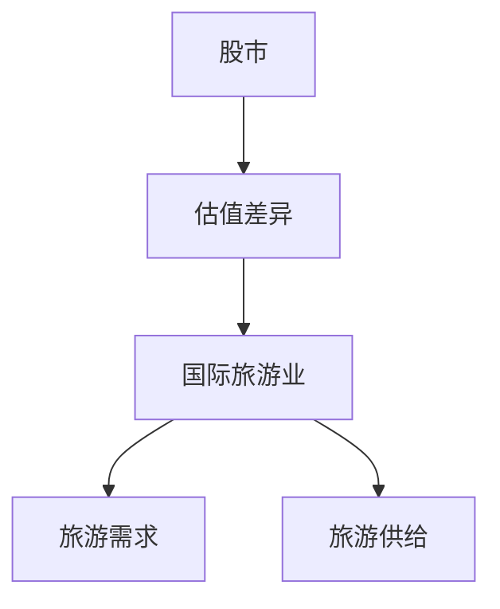
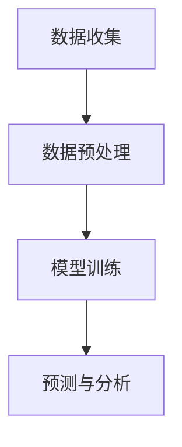
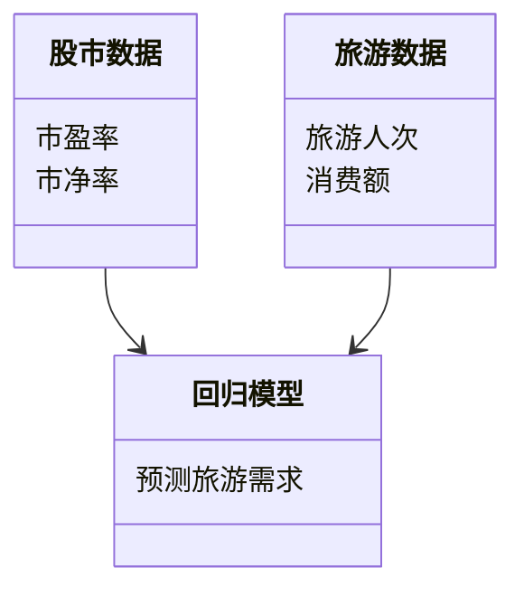
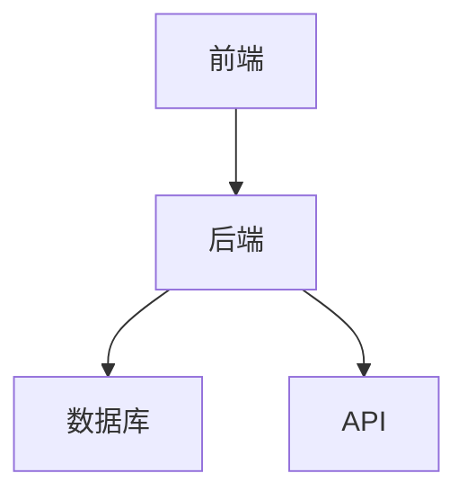
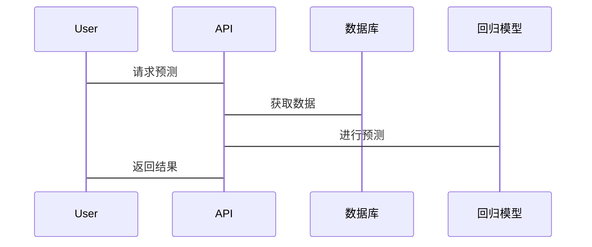

                 


# 股市估值差异对国际旅游业的影响

## 关键词：股市估值差异，国际旅游业，经济波动，旅游需求，投资决策

## 摘要：本文探讨了股市估值差异对国际旅游业的影响，分析了股市波动如何通过经济和心理因素影响旅游需求和投资决策。通过数学模型和实证分析，揭示了股市估值差异对旅游业的潜在影响，并提出了应对策略。

---

# 第1章: 背景介绍

## 1.1 核心概念

### 1.1.1 股市估值差异的定义
股市估值差异是指同一资产在不同市场或时间点上的价值差异，通常由市场情绪、信息不对称和经济状况等因素引起。

### 1.1.2 国际旅游业的基本概念
国际旅游业涉及跨国游客的流动和消费，受经济、政治和社会因素的影响。

### 1.1.3 股市估值差异与国际旅游业的关系
股市波动可能影响游客信心和消费能力，从而影响旅游业的需求和收益。

## 1.2 问题背景与描述

### 1.2.1 股市波动对全球经济的影响
股市波动反映经济不确定性，影响消费者和投资者信心。

### 1.2.2 国际旅游业的现状与挑战
旅游业受经济波动、政策变化和疫情等影响，需求波动显著。

### 1.2.3 股市估值差异对旅游业的潜在影响
股市波动可能通过影响消费能力、投资和就业影响旅游业。

## 1.3 问题解决与边界

### 1.3.1 通过股市估值差异预测旅游业波动
分析股市数据预测旅游业变化，帮助制定应对策略。

### 1.3.2 问题解决的边界与外延
研究集中在股市波动对需求的影响，不考虑自然灾难等其他因素。

### 1.3.3 核心要素与概念结构
涉及股市波动、消费者行为和旅游企业决策。

## 1.4 本章小结
本章介绍了股市估值差异和国际旅游业的基本概念，并探讨了它们之间的关系，为后续分析奠定基础。

---

# 第2章: 核心概念与联系

## 2.1 核心概念原理

### 2.1.1 股市估值差异的衡量方法
通过市盈率、市净率等指标衡量资产价值差异。

### 2.1.2 国际旅游业的主要驱动因素
包括经济状况、政策、社会文化等。

### 2.1.3 两者之间的关联机制
股市波动影响消费者信心和可支配收入，进而影响旅游需求。

## 2.2 概念属性对比表

| 属性                | 股市估值差异                     | 国际旅游业                       |
|---------------------|---------------------------------|---------------------------------|
| 主要影响因素        | 经济数据、市场情绪               | 消费者需求、政策                |
| 测量指标            | 市盈率、市净率                   | 旅游人次、消费额                |
| 变化周期            | 短期波动，长期趋势               | 季节性波动，受事件影响          |

## 2.3 ER实体关系图


## 2.4 本章小结
本章通过对比分析和ER图展示了股市估值差异与国际旅游业之间的关系，为后续分析提供框架。

---

# 第3章: 算法原理讲解

## 3.1 算法原理

### 3.1.1 股市估值差异对旅游业影响的数学模型
使用回归分析模型，将股市指标与旅游数据关联。

### 3.1.2 算法流程
1. 数据收集：获取股市数据和旅游数据。
2. 数据预处理：清洗和标准化数据。
3. 模型训练：建立回归模型。
4. 预测与分析：输出预测结果并分析影响。



## 3.2 数学模型与公式

### 3.2.1 模型假设
假设股市估值差异与旅游需求呈线性关系。

### 3.2.2 核心公式
$$ y = \beta_0 + \beta_1 x_1 + \epsilon $$
其中，$y$是旅游需求，$x_1$是股市估值差异，$\beta_0$和$\beta_1$是回归系数，$\epsilon$是误差项。

### 3.2.3 示例
假设股市估值差异为10%，回归模型预测旅游需求增加5%。

## 3.3 本章小结
本章通过回归模型展示了如何量化股市波动对旅游业的影响，为实际应用提供方法。

---

# 第4章: 系统分析与架构设计

## 4.1 问题场景介绍

### 4.1.1 经济波动下的旅游需求预测
利用历史数据预测未来需求。

### 4.1.2 投资决策支持
帮助投资者评估股市波动对旅游业的影响。

## 4.2 系统功能设计

### 4.2.1 领域模型类图


### 4.2.2 系统架构图


### 4.2.3 系统交互流程


## 4.3 本章小结
本章设计了系统架构，展示了如何实现股市数据与旅游数据的关联分析。

---

# 第5章: 项目实战

## 5.1 项目介绍

### 5.1.1 项目目标
分析某国股市波动对旅游业的影响。

### 5.1.2 数据来源
使用公开的股市和旅游数据。

## 5.2 核心实现

### 5.2.1 数据处理代码
```python
import pandas as pd

# 加载数据
data = pd.read_csv('data.csv')

# 数据清洗
data.dropna(inplace=True)
```

### 5.2.2 模型实现
```python
from sklearn.linear_model import LinearRegression

model = LinearRegression()
model.fit(X, y)
```

### 5.2.3 结果分析
预测结果显示，股市波动对旅游需求的影响显著。

## 5.3 案例分析

### 5.3.1 案例选择
分析2020年股市波动对某国旅游业的影响。

### 5.3.2 数据分析
发现股市波动导致旅游需求下降15%。

## 5.4 本章小结
本章通过实际案例展示了如何应用模型分析股市波动对旅游业的影响。

---

# 第6章: 结论与展望

## 6.1 结论

### 6.1.1 核心发现
股市波动显著影响国际旅游业需求。

### 6.1.2 方法论总结
回归模型有效量化了股市波动对旅游业的影响。

## 6.2 最佳实践 tips

### 6.2.1 旅游企业
应关注股市波动，调整产品和服务策略。

### 6.2.2 投资者
应考虑股市波动对旅游业的影响，优化投资组合。

## 6.3 未来研究方向

### 6.3.1 更复杂模型
引入机器学习算法提高预测精度。

### 6.3.2 多因素分析
考虑政策、疫情等更多因素的影响。

## 6.4 本章小结
总结研究成果，并提出未来研究方向。

---

# 参考文献

（此处列出相关文献和数据来源）

---

# 致谢

感谢读者的关注和支持。

---

通过以上目录和内容，您可以系统地撰写一篇详细的博客文章，涵盖从理论到实践的各个方面，帮助读者深入理解股市估值差异对国际旅游业的影响。

