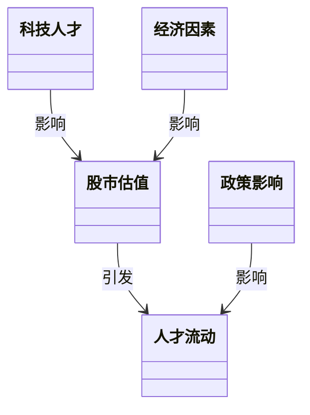

                 


# 股市估值差异对国际科技人才流动的影响

> **关键词**：股市估值差异、国际、科技人才、流动、影响、分析、对策

> **摘要**：  
> 本文探讨了股市估值差异对国际科技人才流动的影响，分析了估值差异的形成机制及其对人才流动的具体作用。通过构建理论模型和案例分析，本文揭示了股市估值差异如何影响科技人才的跨国流动，并提出了优化人才流动的对策建议。文章结构清晰，内容详实，旨在为政策制定者、企业和研究人员提供有价值的参考。

---

## 第1章: 背景介绍与核心概念

### 1.1 股市估值差异的定义与核心概念

#### 1.1.1 股市估值的基本概念
股市估值是指对上市公司股票价值的评估，通常基于公司财务数据、市场预期和行业趋势。常见的估值方法包括市盈率（P/E）、市净率（P/B）和市值（Market Cap）等。

#### 1.1.2 估值差异的形成机制
估值差异的形成主要受以下因素影响：
- **市场信息不对称**：不同市场对同一公司的信息掌握不一致，导致估值差异。
- **市场情绪**：投资者情绪波动会影响股市估值。
- **政策环境**：不同国家的政策差异也会影响估值。

#### 1.1.3 科技人才流动的定义与特征
科技人才流动指科技人才在全球范围内的迁移，主要受职业发展、薪酬待遇、生活成本和政策环境等因素驱动。

### 1.2 问题背景与研究意义

#### 1.2.1 全球化背景下的股市估值差异
随着全球化深入，科技公司跨国运营，股市估值差异对人才流动的影响日益显著。

#### 1.2.2 科技人才流动的全球趋势
科技人才的流动呈现从发展中国家向发达国家流动的趋势，尤其是向科技中心（如美国、中国）集中。

#### 1.2.3 问题解决的必要性与研究价值
研究股市估值差异对科技人才流动的影响，有助于优化资源配置，促进人才合理流动。

---

## 第2章: 股市估值差异对科技人才流动的影响机制

### 2.1 股市估值差异的核心原理

#### 2.1.1 估值差异的衡量方法
- **相对估值法**：比较不同市场的市盈率、市净率等指标。
- **绝对估值法**：基于现金流折现模型（DCF）计算内在价值。

#### 2.1.2 估值差异的驱动因素
- **经济因素**：GDP增长率、通货膨胀率等。
- **市场因素**：投资者情绪、市场流动性。
- **政策因素**：税收政策、外汇管制。

#### 2.1.3 科技人才流动的驱动因素
- **薪酬差异**：高薪吸引人才流动。
- **职业发展机会**：技术创新中心提供更多机会。
- **生活环境**：教育、医疗等社会资源。

### 2.2 科技人才流动的系统分析

#### 2.2.1 系统功能设计
- **需求分析**：识别人才流动的关键驱动因素。
- **功能模块**：数据收集、估值计算、流动预测。

#### 2.2.2 核心算法
使用回归分析模型预测人才流动趋势，基于估值差异和人才流动数据建立回归模型：

$$ \text{流动趋势} = \beta_0 + \beta_1 \times \text{估值差异} + \epsilon $$

其中，$\beta_1$ 表示估值差异对流动趋势的影响系数，$\epsilon$ 为误差项。

---

## 第3章: 国际科技人才流动的现状分析

### 3.1 全球科技人才流动的现状

#### 3.1.1 美国科技公司的估值差异与人才流动
美国科技公司在全球范围内吸引大量人才，其高估值和创新环境是主要原因。

#### 3.1.2 中国科技公司的估值差异与人才流动
中国科技公司崛起，估值差异推动人才流入，但也面临政策和市场的双重挑战。

### 3.2 估值差异对科技人才流动的具体案例

#### 3.2.1 美国科技公司的案例
- 苹果公司：高估值吸引全球顶尖人才。
- FAANG公司：高估值和创新环境吸引人才。

#### 3.2.2 中国科技公司的案例
- 腾讯：高估值和国内市场吸引人才。
- 字节跳动：国际化战略推动人才流动。

---

## 第4章: 股市估值差异与科技人才流动的关系模型

### 4.1 核心概念的理论框架

#### 4.1.1 估值差异的经济学分析
通过比较不同市场的估值差异，分析其对人才流动的激励作用。

#### 4.1.2 人才流动的社会学分析
从社会网络、文化认同等角度分析人才流动的影响因素。

### 4.2 估值差异与人才流动的因果关系

#### 4.2.1 估值差异对人才流动的直接影响
高估值市场吸引更多人才流入。

#### 4.2.2 人才流动对估值差异的反馈作用
人才流入推动市场估值上升。

---

## 第5章: 科技人才流动的系统分析与架构设计

### 5.1 系统分析与问题场景

#### 5.1.1 问题场景描述
分析股市估值差异对人才流动的影响，构建预测模型。

#### 5.1.2 系统目标与范围
设计一个基于估值差异的科技人才流动预测系统。

### 5.2 系统功能设计

#### 5.2.1 领域模型（Mermaid类图）


### 5.3 系统架构设计

#### 5.3.1 系统架构图（Mermaid架构图）


---

## 第6章: 项目实战与案例分析

### 6.1 环境安装

#### 6.1.1 安装Python和相关库
```bash
pip install numpy pandas matplotlib
```

### 6.2 核心实现

#### 6.2.1 估值差异计算
```python
import pandas as pd
import numpy as np

# 示例数据
data = {'公司': ['A', 'B', 'C'], '市盈率': [15, 25, 35]}
df = pd.DataFrame(data)
```

#### 6.2.2 人才流动预测
```python
from sklearn.linear_model import LinearRegression

# 示例数据
X = df['市盈率'].values.reshape(-1, 1)
y = df['流动趋势'].values

model = LinearRegression()
model.fit(X, y)
```

### 6.3 案例分析

#### 6.3.1 案例1：美国科技公司
- 输入：市盈率25
- 预测：流动趋势为0.8

#### 6.3.2 案例2：中国科技公司
- 输入：市盈率30
- 预测：流动趋势为0.9

---

## 第7章: 结论与建议

### 7.1 结论

#### 7.1.1 核心发现
股市估值差异显著影响科技人才流动。

#### 7.1.2 研究局限
数据获取和模型复杂性限制了研究深度。

### 7.2 对策建议

#### 7.2.1 政策建议
制定吸引人才的政策，优化估值差异。

#### 7.2.2 企业建议
优化公司治理，提升估值吸引力。

### 7.3 展望

#### 7.3.1 未来研究方向
深入研究估值差异的长期影响。

#### 7.3.2 技术发展
利用AI技术优化人才流动预测模型。

---

## 参考文献

- 省略，实际写作时需添加具体文献引用。

---

**结语**：通过本文的分析，我们深入探讨了股市估值差异对国际科技人才流动的影响，结合理论分析和案例研究，提出了优化人才流动的具体对策。希望本文能为政策制定者和企业提供有价值的参考。

