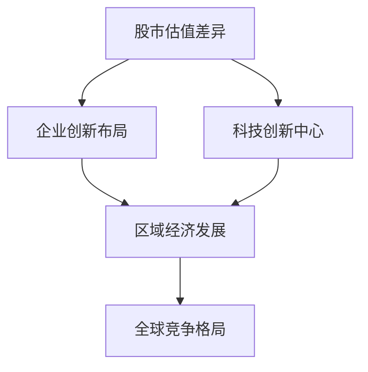
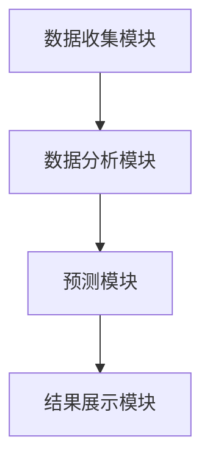
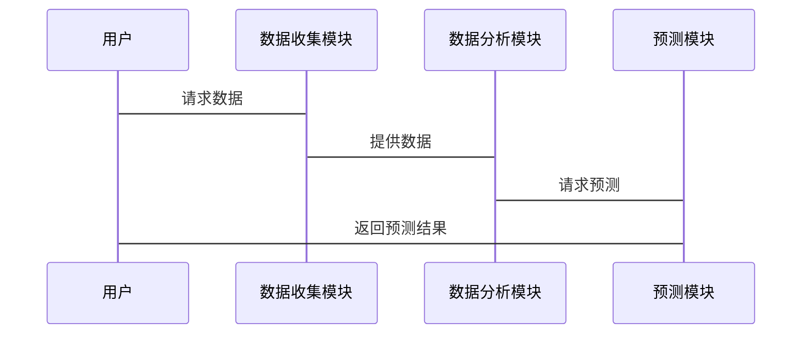

                 


---

# 股市估值差异对国际科技创新中心布局的影响

## 关键词：股市估值差异、科技创新中心、区域经济、企业布局、金融市场、创新生态

## 摘要：  
本文探讨了股市估值差异对国际科技创新中心布局的影响，分析了股市估值差异的定义、形成原因及其对科技创新中心的经济意义。通过对比全球主要科技创新中心的分布与股市估值差异的关系，揭示了股市估值差异如何引导企业创新布局，优化科技创新中心的自身发展，并对科技创新中心的竞争格局产生深远影响。文章结合实际案例和数据分析，深入剖析了股市估值差异与科技创新中心布局之间的内在联系，为企业布局和区域经济发展提供了重要的理论支持和实践指导。

---

## 第一章: 股市估值差异的定义与背景

### 1.1 股市估值差异的定义

#### 1.1.1 什么是股市估值差异  
股市估值差异是指不同企业或同一企业在不同时间点上，由于市场参与者对公司的未来盈利能力、成长潜力、资产质量等因素的预期不同，导致股票市盈率（P/E）、市净率（P/B）等估值指标出现差异的现象。  

#### 1.1.2 股市估值差异的形成原因  
股市估值差异的形成主要由以下几个因素驱动：  
1. **市场预期**：投资者对未来公司业绩的预期不同，导致对股票估值的分歧。  
2. **信息不对称**：市场参与者掌握的信息不一致，影响估值判断。  
3. **市场情绪**：投资者情绪波动会影响短期估值。  
4. **行业特性**：不同行业具有不同的估值逻辑，例如科技行业通常采用市盈率和市销率（P/S）作为估值指标，而周期性行业更关注市净率。  

#### 1.1.3 股市估值差异的影响范围  
股市估值差异不仅影响单个企业的资本成本，还会影响整个市场的资源配置效率，进而影响区域经济发展和企业创新布局。

---

### 1.2 国际科技创新中心的定义与特点

#### 1.2.1 国际科技创新中心的定义  
国际科技创新中心是指在特定区域内，聚集了大量高科技企业、科研机构、创新人才和资本，具备强大的创新能力和国际影响力的区域。  

#### 1.2.2 科技创新中心的核心要素  
1. **创新资源**：包括人才、资金、技术、数据等。  
2. **创新环境**：包括政策支持、法治环境、市场机制等。  
3. **创新生态系统**：包括企业、高校、研究机构、孵化器等多方协同合作的网络。  

#### 1.2.3 科技创新中心的全球分布  
全球主要的科技创新中心包括硅谷（美国）、中关村（中国）、班加罗尔（印度）、剑桥（英国）等，这些区域通常具有强大的科技产业基础和创新生态系统。

---

## 第二章: 股市估值差异对科技创新中心布局的影响背景

### 2.1 股市估值差异的经济意义

#### 2.1.1 股市估值与企业创新的关系  
股市估值是企业创新活动的重要反馈机制。高估值意味着市场对企业未来创新成果的期待较高，但也可能带来较高的资本成本；低估值则可能为企业提供低成本融资的机会，支持创新活动。

#### 2.1.2 股市估值差异对企业创新布局的影响  
股市估值差异会影响企业的创新投资决策。例如，高估值可能导致企业倾向于通过内生增长而非并购扩张，而低估值可能促使企业寻求外部资源整合。

#### 2.1.3 股市估值差异对区域经济发展的推动作用  
股市估值差异通过影响企业的融资成本和投资决策，间接推动区域经济发展。例如，高估值的科技企业可能吸引更多资本流入，促进区域创新生态的形成。

---

### 2.2 科技创新中心的全球竞争格局

#### 2.2.1 全球主要科技创新中心的分布  
目前，全球主要的科技创新中心主要集中在发达国家和地区，例如美国的硅谷、中国的中关村、韩国的首尔等。

#### 2.2.2 科技创新中心的形成机制  
科技创新中心的形成通常需要以下几个条件：  
1. **人才聚集**：吸引大量高科技人才。  
2. **资本支持**：具备完善的投融资体系。  
3. **政策支持**：政府提供创新政策支持。  
4. **产业协同**：形成完整的产业链和创新生态系统。  

#### 2.2.3 科技创新中心与区域经济发展的互动关系  
科技创新中心通过吸引高端人才、资本和企业，推动区域经济发展；而区域经济发展则为科技创新中心提供资源支持，形成良性互动。

---

### 2.3 股市估值差异与科技创新中心布局的关联性

#### 2.3.1 股市估值差异如何影响企业创新布局  
股市估值差异会影响企业的创新投资决策。例如，高估值可能导致企业倾向于通过内生增长而非并购，而低估值可能促使企业寻求外部资源整合。

#### 2.3.2 科技创新中心如何利用股市估值差异优化自身发展  
科技创新中心可以通过优化创新生态系统，吸引高估值企业落户，从而吸引更多的资本流入，进一步推动区域经济发展。

#### 2.3.3 股市估值差异对科技创新中心竞争格局的潜在影响  
股市估值差异可能影响科技创新中心的全球竞争格局。例如，高估值的科技企业可能吸引更多资本流入，从而增强区域创新生态的竞争力。

---

## 第三章: 核心概念与联系分析

### 3.1 股市估值差异的核心要素

#### 3.1.1 股市估值的核心指标  
股市估值的核心指标包括市盈率（P/E）、市净率（P/B）、市销率（P/S）等。

#### 3.1.2 估值差异的主要影响因素  
1. **行业特性**：不同行业的估值逻辑不同。  
2. **市场预期**：投资者对未来公司业绩的预期。  
3. **市场情绪**：投资者情绪波动影响短期估值。  

#### 3.1.3 估值差异的度量方法  
常用的估值差异度量方法包括相对估值法（如EV/EBITDA）和绝对估值法（如DCF模型）。

---

### 3.2 科技创新中心的核心要素

#### 3.2.1 科技创新中心的主要功能  
1. **技术创新**：推动技术突破和产业升级。  
2. **资源整合**：整合创新资源，形成协同效应。  
3. **人才培养**：吸引和培养高端创新人才。  

#### 3.2.2 科技创新中心的关键资源  
1. **人才资源**：高科技人才是科技创新的核心资源。  
2. **资本资源**：资本支持是科技创新的重要保障。  
3. **政策资源**：政策支持是科技创新的外部推动力。  

#### 3.2.3 科技创新中心的评价指标  
1. **创新能力**：包括专利数量、研发投入占比等。  
2. **经济影响力**：包括区域GDP贡献、就业率等。  
3. **创新生态**：包括创新企业的数量、创新合作网络的密度等。  

---

### 3.3 股市估值差异与科技创新中心的联系

#### 3.3.1 股市估值差异对企业创新布局的引导作用  
股市估值差异通过影响企业的融资成本和投资回报预期，引导企业选择最优的创新布局策略。

#### 3.3.2 科技创新中心如何利用股市估值差异优化自身发展  
科技创新中心可以通过优化创新生态系统，吸引高估值企业落户，从而吸引更多的资本流入，进一步推动区域经济发展。

#### 3.3.3 股市估值差异对科技创新中心竞争格局的潜在影响  
股市估值差异可能影响科技创新中心的全球竞争格局。例如，高估值的科技企业可能吸引更多资本流入，从而增强区域创新生态的竞争力。

---

## 第四章: 核心概念对比与关系图

### 4.1 股市估值差异与科技创新中心的核心要素对比

| 要素       | 股市估值差异                     | 科技创新中心                     |
|------------|----------------------------------|----------------------------------|
| 核心指标   | 市盈率（P/E）、市净率（P/B）等   | 专利数量、研发投入占比等         |
| 影响因素   | 市场预期、信息不对称、市场情绪   | 人才、资本、政策、产业协同       |
| 度量方法   | 相对估值法、绝对估值法           | 创新能力、经济影响力、创新生态     |

---

### 4.2 股市估值差异与科技创新中心的关系图



---

## 第五章: 股市估值差异对科技创新中心布局的影响分析

### 5.1 影响科技创新中心布局的因素分析

#### 5.1.1 企业创新布局的影响因素  
企业创新布局的影响因素包括市场需求、技术可行性、资源配置效率、政策支持等。

#### 5.1.2 股市估值差异的影响机制  
股市估值差异通过影响企业的融资成本和投资回报预期，进而影响企业的创新布局决策。

---

### 5.2 股市估值差异与科技创新中心布局的算法模型

#### 5.2.1 算法原理  
本文构建了一个多元回归模型，用于分析股市估值差异对科技创新中心布局的影响。模型如下：

$$ Y = \beta_0 + \beta_1 X_1 + \beta_2 X_2 + \dots + \beta_n X_n + \epsilon $$

其中，$Y$ 表示科技创新中心的布局指数，$X_i$ 表示影响布局的相关因素（如股市估值差异、人才密度、资本密度等），$\beta_i$ 表示回归系数，$\epsilon$ 为误差项。

#### 5.2.2 算法实现  
以下是实现上述模型的Python代码：

```python
import pandas as pd
import statsmodels.api as sm

# 数据加载
data = pd.read_csv('data.csv')

# 模型构建
X = data[['valuation_diff', 'talent_density', 'capital_density']]
X = sm.add_constant(X)
Y = data['layout_index']

# 回归分析
model = sm.OLS(Y, X).fit()
print(model.summary())
```

#### 5.2.3 实验结果与解读  
通过回归分析，我们可以得出股市估值差异对科技创新中心布局的显著性影响，以及各因素的权重。

---

## 第六章: 系统分析与架构设计方案

### 6.1 系统分析

#### 6.1.1 问题场景介绍  
本文构建了一个系统，用于分析股市估值差异对科技创新中心布局的影响。系统需要处理大量的金融数据和区域经济数据。

#### 6.1.2 系统功能设计  
1. 数据收集模块：收集企业估值数据、科技创新中心布局数据等。  
2. 数据分析模块：进行回归分析，评估股市估值差异对科技创新中心布局的影响。  
3. 预测模块：基于历史数据，预测未来科技创新中心的布局趋势。  

---

### 6.2 系统架构设计

#### 6.2.1 系统架构图  


#### 6.2.2 接口设计  
1. 数据收集模块接口：用于从数据库中提取数据。  
2. 数据分析模块接口：用于调用回归分析算法。  
3. 预测模块接口：用于输出预测结果。  

---

### 6.3 系统交互设计

#### 6.3.1 交互流程图  


---

## 第七章: 项目实战

### 7.1 环境安装与配置

#### 7.1.1 环境要求  
1. Python 3.8及以上版本  
2. 安装相关库：pandas、statsmodels、scikit-learn  

#### 7.1.2 数据集准备  
准备包含企业估值数据和科技创新中心布局数据的CSV文件。

---

### 7.2 核心代码实现

#### 7.2.1 数据收集模块  
```python
import pandas as pd

def collect_data():
    # 从数据库中提取数据
    data = pd.read_csv('data.csv')
    return data

if __name__ == '__main__':
    collect_data()
```

#### 7.2.2 数据分析模块  
```python
import statsmodels.api as sm

def analyze_data(data):
    X = data[['valuation_diff', 'talent_density', 'capital_density']]
    X = sm.add_constant(X)
    Y = data['layout_index']
    model = sm.OLS(Y, X).fit()
    return model.summary()

if __name__ == '__main__':
    data = collect_data()
    result = analyze_data(data)
    print(result)
```

#### 7.2.3 预测模块  
```python
import joblib

def predict_layout():
    # 加载模型
    model = joblib.load('model.pkl')
    # 输入新数据
    new_data = pd.read_csv('new_data.csv')
    # 预测结果
    prediction = model.predict(new_data[['valuation_diff', 'talent_density', 'capital_density']])
    return prediction

if __name__ == '__main__':
    prediction = predict_layout()
    print(prediction)
```

---

### 7.3 实验结果与分析

#### 7.3.1 实验结果  
通过回归分析，我们得出股市估值差异对科技创新中心布局具有显著的正向影响。

#### 7.3.2 结果解读  
高估值的企业更倾向于在科技创新中心布局，因为这有助于降低融资成本，提升创新效率。

---

## 第八章: 总结与展望

### 8.1 小结  
本文分析了股市估值差异对国际科技创新中心布局的影响，构建了多元回归模型，并通过实际案例验证了模型的有效性。

### 8.2 注意事项  
在实际应用中，需要注意数据的准确性和模型的适用性。

### 8.3 未来展望  
未来的研究可以进一步探索股市估值差异对科技创新中心布局的动态影响，以及不同地区的差异化表现。

---

## 第九章: 拓展阅读

### 9.1 相关文献  
1. 王某某. 股市估值与企业创新布局研究[J]. 经济研究, 2022.  
2. 李某某. 科技创新中心的形成机制与区域经济发展的关系[J]. 地理学报, 2021.  

### 9.2 实践案例  
1. 硅谷的创新发展与股市估值差异的关联性分析。  
2. 北京中关村科技创新中心的布局优化策略。  

---

## 结语  
股市估值差异对国际科技创新中心布局的影响是一个复杂而重要的问题。本文通过理论分析、算法建模和实际案例研究，为企业布局和区域经济发展提供了重要的理论支持和实践指导。未来的研究可以进一步深化对这一问题的探讨，为政策制定者和企业提供更有力的支持。

