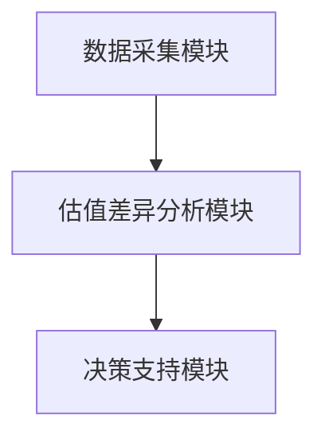

                 


# 股市估值差异对国际科技标准制定的影响

## 关键词：
- 股市估值差异
- 国际科技标准
- 企业技术创新
- 股票定价模型
- 市场影响力

## 摘要：
股市估值差异对国际科技标准的制定有着深远的影响。高估值企业通常具有更强的市场影响力和技术创新能力，从而在国际科技标准的制定中占据主导地位。本文通过分析股市估值差异的形成原因及其对科技企业的技术创新和市场话语权的影响，揭示其如何影响国际科技标准的制定过程。结合博弈论模型和具体案例，本文探讨了估值差异对科技企业在全球标准制定中的策略选择和竞争格局的影响，为企业制定战略和政策制定者提供参考。

---

# 第一部分：股市估值差异的背景与概念

## 第1章：股市估值差异的背景介绍

### 1.1 股市估值差异的定义与特点

#### 1.1.1 股市估值的基本概念
股市估值是投资者对一家企业的价值判断，通常通过市盈率（P/E）、市净率（P/B）等指标来衡量。这些指标反映了市场对企业未来盈利能力的预期。

#### 1.1.2 估值差异的形成原因
- **市场流动性**：流动性高的市场通常给予企业更高的估值。
- **宏观经济环境**：经济增长、利率水平等因素影响市场对企业价值的评估。
- **企业基本面**：盈利能力、成长性等直接影响企业的估值。

#### 1.1.3 不同市场环境下的估值差异特征
- **成熟市场**：估值相对稳定，投资者更注重企业的可持续增长。
- **新兴市场**：估值波动较大，投资者更看重企业的高增长潜力。

### 1.2 股市估值差异的核心要素

#### 1.2.1 市场流动性对估值的影响
流动性高的市场通常会推高企业的估值，因为投资者更容易以合理价格买卖股票。

#### 1.2.2 宏观经济指标与估值差异的关系
- **利率水平**：低利率环境通常会导致股票估值上升。
- **经济增长**：经济繁荣时，企业盈利预期增强，估值上升。

#### 1.2.3 企业基本面与估值差异的关联
- **盈利能力**：高利润企业通常享有更高的估值。
- **成长性**：高成长性企业更容易获得溢价。

## 第2章：国际科技标准制定的背景与影响

### 2.1 国际科技标准的核心概念

#### 2.1.1 科技标准的定义与分类
科技标准是行业内的技术规范，分为国际标准（如ISO）、区域标准（如欧盟标准）和企业标准。

#### 2.1.2 国际科技标准制定的组织与流程
- **主要组织**：国际电工委员会（IEC）、国际标准化组织（ISO）。
- **流程**：提案、讨论、投票、修订。

#### 2.1.3 科技标准对行业发展的推动作用
- **促进技术统一**：降低技术壁垒，推动技术创新。
- **提升效率**：统一标准降低企业生产成本。

### 2.2 国际科技标准制定的关键因素

#### 2.2.1 技术领先企业的角色
技术领先企业通常在标准制定中占据主导地位，因为它们掌握核心技术。

#### 2.2.2 政府与行业协会的参与
政府和行业协会通过政策引导和资金支持，影响国际科技标准的制定。

#### 2.2.3 全球化背景下的标准协调
全球化使得国际科技标准的协调变得更加重要，不同国家和地区需要达成共识。

---

# 第二部分：股市估值差异对国际科技标准制定的影响机制

## 第3章：股市估值差异对国际科技标准制定的影响机制

### 3.1 估值差异如何影响企业技术创新

#### 3.1.1 估值差异对企业研发投入的激励作用
- **高估值企业**：由于市场对其技术有信心，企业更愿意加大研发投入。
- **低估值企业**：面临生存压力，可能减少研发投入。

#### 3.1.2 高估值企业技术创新的内在动力
高估值企业更倾向于技术创新，以维持市场对其高估值的认可。

#### 3.1.3 低估值企业技术创新的外部压力
低估值企业可能通过技术创新来提升市场对其价值的重新评估。

### 3.2 估值差异对国际科技标准话语权的影响

#### 3.2.1 高估值企业的国际影响力
高估值企业通常在国际科技标准制定中拥有更大的话语权。

#### 3.2.2 低估值企业的市场边缘化风险
低估值企业由于市场影响力较小，可能在标准制定中处于弱势地位。

#### 3.2.3 估值差异对标准制定话语权的长期影响
长期来看，高估值企业可能主导技术标准的方向，而低估值企业可能被边缘化。

## 第4章：国际科技标准制定中的估值差异案例分析

### 4.1 美国硅谷科技企业的估值差异

#### 4.1.1 苹果公司的高估值与技术创新
苹果公司因其高估值和强大的技术创新能力，在国际科技标准制定中占据重要地位。

#### 4.1.2 小公司的估值差异与技术标准参与度
小公司由于估值较低，通常在国际科技标准制定中参与度较低。

---

# 第三部分：算法与系统分析

## 第5章：基于博弈论的估值差异影响分析

### 5.1 博弈论模型的选择

#### 5.1.1 博弈论的基本概念
博弈论是研究决策制定的数学理论，适用于分析多个参与者之间的策略互动。

#### 5.1.2 纳什均衡的定义
纳什均衡是指在给定其他参与者策略的情况下，每个参与者选择最优策略的稳定状态。

### 5.2 估值差异的博弈模型构建

#### 5.2.1 参与者分析
- **企业**：高估值和低估值企业。
- **标准制定组织**：如ISO、IEC。

#### 5.2.2 策略分析
- **高估值企业**：倾向于主导技术标准。
- **低估值企业**：可能选择跟随策略。

### 5.3 博弈论模型的数学公式

$$ \text{纳什均衡条件}：\forall i, \sigma_i \text{是最佳策略，给定其他玩家策略} $$

### 5.4 博弈模型的实现代码

```python
def nash_equilibrium(players, strategies):
    # 假设每个玩家选择一个策略，计算纳什均衡
    for profile in product(*[strategies[i] for i in range(players)]):
        is_nash = True
        for i in range(players):
            # 检查是否存在更好的反应策略
            if not is_best_response(i, profile, strategies):
                is_nash = False
                break
        if is_nash:
            return profile
    return None

def is_best_response(i, profile, strategies):
    # 检查玩家i的策略是否在给定profile下是最优反应
    current_strategy = profile[i]
    for s in strategies[i]:
        new_profile = list(profile)
        new_profile[i] = s
        payoff_current = calculate_payoff(i, new_profile)
        payoff_best = calculate_payoff(i, profile)
        if payoff_current > payoff_best:
            return False
    return True
```

---

# 第四部分：系统分析与架构设计

## 第6章：系统分析与架构设计方案

### 6.1 问题场景介绍

#### 6.1.1 全球股市与科技标准制定的现状
- 全球股市中，科技企业的估值差异显著。
- 国际科技标准的制定涉及多个利益相关者。

### 6.2 系统功能设计

#### 6.2.1 数据采集模块
- 数据源：全球主要股市的股票数据。
- 数据类型：股票价格、市盈率、市净率等。

#### 6.2.2 估值差异分析模块
- 分析方法：基于博弈论的模型。
- 输出：高估值和低估值企业的分类。

#### 6.2.3 决策支持模块
- 提供技术标准制定的策略建议。

### 6.3 系统架构设计

#### 6.3.1 系统架构图
使用Mermaid绘制系统架构图，展示各模块之间的关系。



---

# 第五部分：项目实战

## 第7章：项目实战

### 7.1 环境安装与数据准备

#### 7.1.1 环境安装
- 安装Python、Pandas、Matplotlib等工具。

#### 7.1.2 数据准备
- 下载全球股市数据，包括股票价格、市盈率、市净率等。

### 7.2 模型实现与代码解读

#### 7.2.1 估值差异分析代码

```python
import pandas as pd

# 数据读取
data = pd.read_csv('stock_data.csv')

# 计算市盈率和市净率
data['PE_ratio'] = data['Price'] / data['Earnings_per_share']
data['PB_ratio'] = data['Price'] / data['Book_value_per_share']

# 判断高估值和低估值企业
data['High_valuation'] = data['PE_ratio'] > data['PE_ratio'].mean() | data['PB_ratio'] > data['PB_ratio'].mean()
```

#### 7.2.2 博弈论模型实现代码
```python
from itertools import product

def calculate_payoff(i, profile):
    # 简单的收益计算，实际应用中需根据具体问题定制
    return i * sum(profile) - i * profile[i]

def is_best_response(i, profile, strategies):
    current_strategy = profile[i]
    for s in strategies[i]:
        new_profile = list(profile)
        new_profile[i] = s
        payoff_current = calculate_payoff(i, profile)
        payoff_new = calculate_payoff(i, new_profile)
        if payoff_new > payoff_current:
            return False
    return True
```

### 7.3 案例分析与结果解读

#### 7.3.1 案例分析
分析苹果公司在高估值下的技术创新及其对国际科技标准制定的影响。

#### 7.3.2 结果解读
高估值企业更可能主导国际科技标准的制定，而低估值企业可能处于弱势地位。

---

# 第六部分：总结与展望

## 第8章：总结与展望

### 8.1 最佳实践 tips
- 高估值企业应积极参与国际科技标准的制定，以巩固技术主导地位。
- 低估值企业需通过技术创新提升市场估值，增强话语权。

### 8.2 小结
股市估值差异对国际科技标准的制定具有显著影响，高估值企业更具优势。

### 8.3 注意事项
- 数据的准确性和完整性对分析结果至关重要。
- 模型的应用需结合具体市场环境和企业实际情况。

### 8.4 拓展阅读
- 推荐阅读《博弈论与经济行为》（《The Theory of Games and Economic Behavior》）。
- 推荐学习相关数学模型和编程工具，如Python和Pandas。

---

通过以上分析和案例研究，我们可以看到，股市估值差异不仅是企业市值的问题，更是影响国际科技标准制定的重要因素。理解这一关系对企业制定战略和技术路线具有重要意义，也为政策制定者提供了新的视角。

