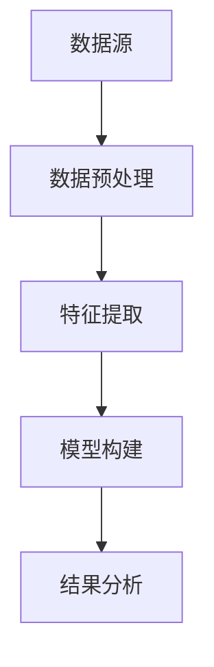
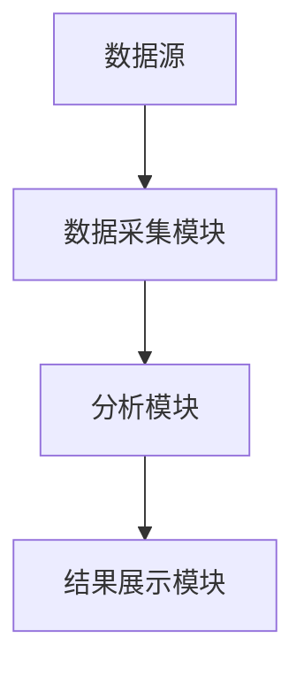

                 


```markdown
# 股市估值差异对国际科研合作的影响

> 关键词：股市估值差异、国际科研合作、经济影响、金融分析、跨国合作

> 摘要：本文探讨了股市估值差异对国际科研合作的影响，分析了股市波动如何通过资金流动和投资决策影响跨国科研项目。文章结合经济理论和系统分析方法，提出了量化评估模型，并通过实际案例展示了如何优化科研合作中的资金管理。

---

## 第一部分：背景介绍

### 第1章：股市估值差异的定义与成因分析

#### 1.1 股市估值差异的定义
- 股市估值差异是指同一股票在不同市场上的定价差异，通常由市场效率、信息不对称和投资者情绪等因素引起。

#### 1.2 国际科研合作的定义与现状
- 国际科研合作是指跨国团队共同开展科学研究，涉及资金流动、技术共享和知识转移。其模式包括政府资助项目、企业合作研发等。

### 第2章：股市估值差异对国际科研合作的影响机制

#### 2.1 股市估值差异的经济效应
- 股市波动影响资源配置和投资决策，进而影响跨国企业的科研投入。

#### 2.2 国际科研合作中的资金流动问题
- 科研合作依赖资金支持，股市估值差异可能导致资金分配不均，影响科研效率。

### 第3章：股市波动对科研合作的影响

#### 3.1 股市波动对科研项目资金的影响
- 股市波动可能导致科研资金减少，影响项目进度。

#### 3.2 股市波动对科研团队稳定性的影响
- 股市波动可能导致团队人员变动，影响合作效率。

## 第二部分：核心概念与联系

### 第4章：核心概念的定义

#### 4.1 股市估值与国际科研合作的属性对比
| 属性        | 股市估值差异 | 国际科研合作 |
|-------------|--------------|--------------|
| 定义        | 价格差异     | 跨国合作     |
| 影响因素    | 市场效率     | 资金、技术   |
| 相关性      | 高           | 高           |

#### 4.2 实体关系图（ER图）
```mermaid
erd
  图表标题：核心概念关系图

  图表内容：
    股市估值差异 <--(属于)--> 经济现象
    国际科研合作 <--(属于)--> 科研活动
    股市波动 --> 影响 --> 科研资金
    科研合作 --> 影响 --> 股市预期
```

## 第三部分：算法原理讲解

### 第5章：算法原理

#### 5.1 数据流式分析


#### 5.2 Python代码实现
```python
import pandas as pd
import numpy as np

# 数据预处理
data = pd.read_csv('market_data.csv')
data_clean = data.dropna()

# 特征提取
features = ['market_value', 'research_investment']
target = 'collaboration_efficiency'

# 模型构建
from sklearn.linear_model import LinearRegression
model = LinearRegression()
model.fit(data_clean[features], data_clean[target])

# 结果分析
importances = model.coef_
print(f'特征重要性：{importances}')
```

#### 5.3 数学模型与公式
- 线性回归模型：$y = \beta_0 + \beta_1x + \epsilon$
- 协方差矩阵：$C = E[(X - \mu)(X - \mu)^T]$

## 第四部分：系统分析与架构设计

### 第6章：系统分析

#### 6.1 系统功能设计
- 数据采集模块：收集股市数据和科研合作数据。
- 分析模块：评估股市波动对科研合作的影响。
- 结果展示模块：可视化分析结果。

#### 6.2 系统架构图


## 第五部分：项目实战

### 第7章：项目实战

#### 7.1 案例分析
- 分析某跨国公司科研项目在股市波动下的资金变化。

#### 7.2 代码实现
```python
import matplotlib.pyplot as plt

# 数据可视化
plt.plot(data['time'], data['research_investment'], label='研发投入')
plt.plot(data['time'], data['market_value'], label='股价')
plt.xlabel('时间')
plt.ylabel('数值')
plt.legend()
plt.show()
```

## 第六部分：最佳实践

### 第8章：总结与展望

#### 8.1 总结
- 股市波动对国际科研合作有显著影响，需通过模型优化和资金管理应对。

#### 8.2 注意事项
- 定期评估股市波动风险，调整科研合作策略。

#### 8.3 未来展望
- 结合人工智能技术，提升模型预测精度，优化科研合作中的资金管理。

---

# 结语

通过本文的系统分析和实际案例，我们深入探讨了股市估值差异对国际科研合作的影响。未来，随着技术进步，我们能够更好地应对这些挑战，促进跨国科研合作的健康发展。
```

