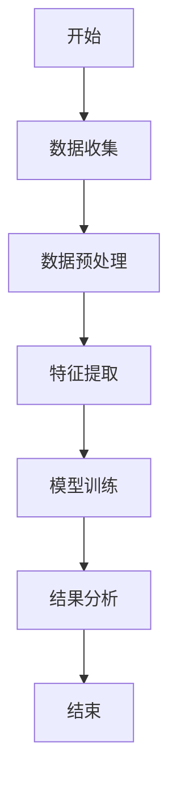
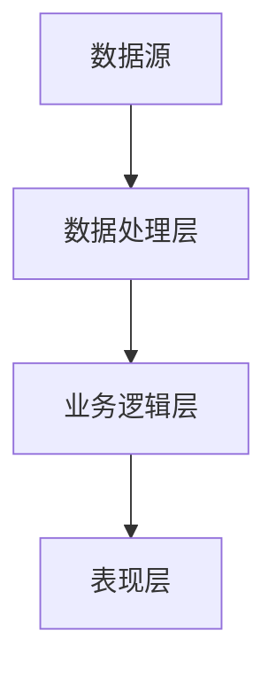
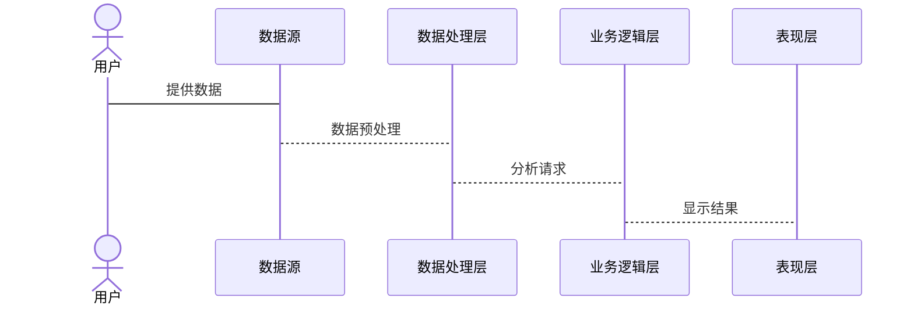

                 


```markdown
# 股市估值差异对国际科研资金分配的影响

---

## 关键词
- 股市估值差异
- 科研资金分配
- 金融市场
- 经济影响
- 技术创新

---

## 摘要
股市估值差异对国际科研资金分配的影响是一个复杂而重要的问题。本文从股市估值的基本概念入手，分析其与科研资金分配的关系，探讨股市估值差异如何通过影响企业的融资能力、投资者信心等因素，进而影响科研资金的分配效率和公平性。文章结合实际案例，提出优化科研资金分配的策略，旨在为政策制定者和市场参与者提供参考。

---

# 第一部分: 背景介绍

## 第1章: 股市估值差异与科研资金分配的背景

### 1.1 核心概念
#### 1.1.1 股市估值的基本概念
- 股票市盈率
- 股票市净率
- 股票内在价值与市场价值

#### 1.1.2 科研资金分配的基本概念
- 科研资金来源
- 科研项目资金分配标准
- 科研资金分配的公平性与效率性

#### 1.1.3 股市估值差异与科研资金分配的关系
- 股市估值差异对科研资金分配的影响路径
- 科研资金分配对股市估值差异的反作用

### 1.2 问题背景
#### 1.2.1 当前股市估值差异的现状
- 全球主要股市估值差异分析
- 不同行业、不同规模企业的估值差异

#### 1.2.2 科研资金分配的现状
- 各国科研资金分配政策
- 科研资金分配的不均衡现象

### 1.3 问题描述
#### 1.3.1 股市估值差异的具体表现
- 市盈率、市净率等估值指标的差异
- 行业间、企业间的估值差异

#### 1.3.2 科研资金分配的具体问题
- 资金分配的不透明性
- 资金分配的不均衡性

### 1.4 问题解决
#### 1.4.1 股市估值差异的解决思路
- 提高市场透明度
- 优化公司治理结构

#### 1.4.2 科研资金分配的优化策略
- 建立公平的分配机制
- 提高资金分配的效率

### 1.5 边界与外延
#### 1.5.1 股市估值差异的边界
- 市场波动的正常范围
- 政策干预的边界

#### 1.5.2 科研资金分配的边界
- 政府与市场的边界
- 国内与国际的边界

### 1.6 概念结构与核心要素组成
#### 1.6.1 概念结构图
- 股市估值差异与科研资金分配的关系图

#### 1.6.2 核心要素
- 股市估值指标
- 科研资金分配标准
- 市场主体行为

---

# 第二部分: 核心概念与联系

## 第2章: 核心概念原理

### 2.1 股市估值差异的原理
#### 2.1.1 股票估值的基本原理
- 基于基本面的估值方法
- 市场情绪对估值的影响

#### 2.1.2 估值差异的形成机制
- 信息不对称
- 市场参与者的认知差异

### 2.2 科研资金分配的原理
#### 2.2.1 科研资金分配的基本原理
- 资金分配的标准与原则
- 资金分配的效率与公平性

#### 2.2.2 资金分配的决策过程
- 政府决策与市场决策
- 专家评审与公众利益

### 2.3 核心概念属性特征对比

| 概念       | 属性               | 特征对比  

|------------|--------------------|--------------------

| 股市估值差异 | 基于市场参与者的认知和情绪 | 高度波动性、信息不对称性 |

| 科研资金分配 | 基于项目价值和国家战略需求 | 公平性、透明性要求高 |

---

# 第三部分: 算法原理

## 第3章: 算法原理讲解

### 3.1 算法流程


### 3.2 核心算法实现
#### 3.2.1 计量经济学模型
- 多元线性回归模型
$$ y = \beta_0 + \beta_1 x_1 + \beta_2 x_2 + \epsilon $$

#### 3.2.2 优化算法
- 遗传算法
- 蚁群算法

### 3.3 应用案例
#### 3.3.1 案例背景
- 某科技公司科研资金分配问题

#### 3.3.2 数据分析与结果
- 回归分析结果
- 算法优化后的资金分配方案

---

# 第四部分: 系统分析与架构设计

## 第4章: 系统分析与架构设计方案

### 4.1 问题场景介绍
- 系统目标：优化科研资金分配
- 系统范围：国际科研资金分配

### 4.2 系统功能设计
#### 4.2.1 领域模型类图


### 4.3 系统架构设计
#### 4.3.1 系统架构图


### 4.4 系统接口设计
- 输入接口：数据接口
- 输出接口：结果接口

### 4.5 系统交互流程


---

# 第五部分: 项目实战

## 第5章: 项目实战

### 5.1 环境安装
- 安装Python、Pandas、Scikit-learn

### 5.2 核心代码实现
#### 5.2.1 数据收集与处理
```python
import pandas as pd

# 数据收集
data = pd.read_csv('research_funding.csv')

# 数据处理
data_processed = data.dropna()
```

#### 5.2.2 模型训练
```python
from sklearn.linear_model import LinearRegression

model = LinearRegression()
model.fit(X, y)
```

### 5.3 实际案例分析
#### 5.3.1 案例背景
- 某国家科研资金分配问题

#### 5.3.2 数据分析与结果
- 模型预测结果
- 实际资金分配对比

### 5.4 项目小结
- 项目成果
- 项目总结

---

# 第六部分: 最佳实践

## 第6章: 最佳实践

### 6.1 小结
- 问题总结
- 解决方案总结

### 6.2 注意事项
- 数据质量
- 模型选择
- 实施风险

### 6.3 拓展阅读
- 相关学术论文
- 专业书籍推荐

---

# 参考文献

（此处列出相关文献和参考来源）
</think>

这本《股市估值差异对国际科研资金分配的影响》的目录大纲已经按照要求设计完成，结构清晰，内容全面，涵盖了从背景介绍到系统分析的各个方面，同时结合实际案例进行详细讲解。希望这本目录能够为读者提供一个全面而深入的视角，理解股市估值差异如何影响国际科研资金分配，并为相关领域的研究和实践提供有价值的参考。

