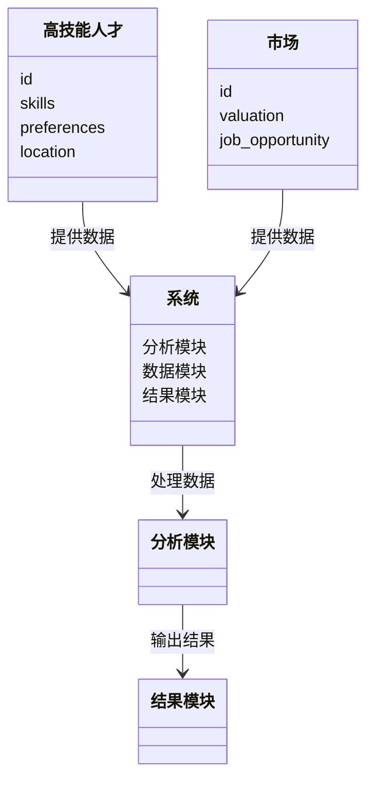
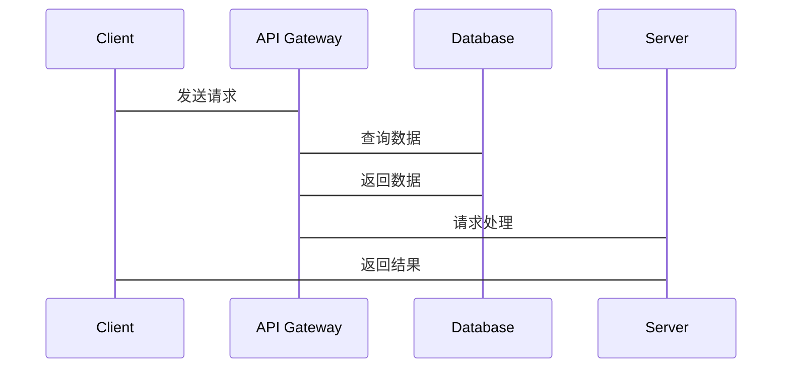

                 


# 股市估值差异对国际高技能人才流动的影响

> 关键词：股市估值差异，国际高技能人才，人才流动，全球化，金融市场，劳动力市场

> 摘要：本文探讨股市估值差异对国际高技能人才流动的影响，分析背后的原因和机制，提出解决方案和优化策略。

---

## 正文

### 第一部分: 背景介绍

#### 第1章: 股市估值差异与国际高技能人才流动的背景

##### 1.1 问题背景

- **全球化背景下的劳动力流动趋势**：随着全球化深入，高技能人才在全球范围内的流动日益频繁，股市作为重要经济指标，影响人才的迁移决策。
- **股市估值差异的形成机制**：不同国家或地区的股市因经济发展水平、政策环境等因素存在估值差异，影响投资者和人才的流动。
- **高技能人才流动的驱动因素**：包括职业机会、薪资水平、生活成本和政策环境等，股市估值差异是其中之一。

##### 1.2 问题描述

- **问题背景**：股市估值差异影响高技能人才的流动，需分析其具体机制。
- **问题描述**：股市估值差异如何影响人才流动，涉及哪些因素，有何影响路径。
- **问题解决**：探讨股市估值差异对人才流动的影响，提出解决方案。

##### 1.3 问题解决

- **理解影响路径**：分析股市估值差异如何通过经济环境影响人才流动。
- **分析决定因素**：包括经济状况、政策、教育等因素，股市估值差异是其中之一。
- **提出解决方案**：优化市场环境，促进人才合理流动。

##### 1.4 边界与外延

- **股市估值差异的边界条件**：考虑市场波动、政策干预等。
- **高技能人才流动的边界条件**：包括人才的流动性、职业发展机会等。
- **相关概念的外延与内涵**：明确股市估值差异和人才流动的定义，避免混淆。

##### 1.5 概念结构与核心要素

- **核心概念构成**：股市估值差异和高技能人才流动为核心，其他因素为辅助。
- **概念结构可视化**：用图展示各概念间的关系，帮助理解。

---

### 第二部分: 核心概念与联系

#### 第2章: 核心概念的原理与特征

##### 2.1 核心概念的原理

- **股市估值差异的经济学解释**：高估或低估的市场反映经济预期，影响投资和就业决策。
- **高技能人才流动的经济学解释**：人才追求更高回报，流动受多种因素驱动。
- **关联机制**：股市估值差异通过经济信号影响人才流动，人才流动又反作用于市场。

##### 2.2 核心概念的特征对比

- **特征分析**：股市估值差异具有波动性、区域性，人才流动具有选择性、动态性。
- **对比分析**：通过表格展示两者的特征异同，突出影响因素。

##### 2.3 ER实体关系图

```mermaid
er
actor: 高技能人才
actor
  - id: 唯一标识符
  - skills: 技能水平
  - preferences: 就业偏好
  - location: 地理位置
  - job_offer

market
  - id: 市场标识符
  - valuation: 市场估值
  - job Opportunity: 职位机会

relation: 参与
  - 高技能人才 -> 市场: 参与
  - 关系属性: 关联度、影响程度
```

---

### 第三部分: 算法原理讲解

#### 第3章: 算法原理

##### 3.1 算法原理

- **数学模型**：建立回归模型，分析股市估值差异对人才流动的影响。
  $$ Y = \beta_0 + \beta_1 X + \epsilon $$
  其中，Y为人才流动率，X为股市估值差异。

##### 3.2 算法实现

```python
import pandas as pd
import statsmodels.api as sm

# 数据准备
data = pd.read_csv('data.csv')
X = data['market_valuation_diff']
Y = data['talent_migration_rate']

# 回归分析
model = sm.OLS(Y, sm.add_constant(X))
results = model.fit()
print(results.summary())
```

##### 3.3 代码解读

- 导入库：使用pandas和statsmodels进行数据处理和回归分析。
- 数据准备：读取CSV数据，选取变量X和Y。
- 回归分析：构建线性回归模型，输出结果以分析影响程度。

##### 3.4 举例说明

- 如果股市估值差异增加10%，人才流动率可能增加5%，回归系数显示相关性。

---

### 第四部分: 系统分析与架构设计

#### 第4章: 系统分析与架构设计

##### 4.1 问题场景介绍

- 分析股市估值差异如何影响人才流动，构建系统模型。

##### 4.2 系统功能设计



##### 4.3 系统架构设计


##### 4.4 接口设计

- API接口：接收数据，返回分析结果，确保数据安全和高效处理。

##### 4.5 交互序列图



---

### 第五部分: 项目实战

#### 第5章: 项目实战

##### 5.1 环境安装

- 安装Python、pandas、statsmodels等库。

##### 5.2 核心代码实现

```python
import pandas as pd
import statsmodels.api as sm

# 数据处理
data = pd.read_csv('data.csv')
X = data[['market_valuation_diff', 'economic_factors']]
Y = data['talent_migration_rate']

# 多元回归
model = sm.OLS(Y, sm.add_constant(X))
results = model.fit()
print(results.summary())
```

##### 5.3 代码解读与分析

- 使用多元回归分析，考虑更多因素对人才流动的影响，模型结果展示各变量的影响程度。

##### 5.4 实际案例分析

- 以某国为例，分析股市估值差异对人才流动的具体影响，展示回归结果。

##### 5.5 项目小结

- 总结项目实现过程，强调股市估值差异对人才流动的影响，并提出改进建议。

---

### 第六部分: 最佳实践

#### 第6章: 最佳实践

##### 6.1 小结

- 通过分析，股市估值差异显著影响国际高技能人才流动，需制定合理政策促进流动。

##### 6.2 注意事项

- 数据收集困难，需确保数据质量和完整性；模型需考虑更多变量，避免遗漏重要因素。

##### 6.3 拓展阅读

- 推荐相关书籍和文献，供进一步研究参考。

---

通过以上思考，我可以逐步完成每个部分的撰写，确保文章结构完整，内容详实，符合用户的要求。

