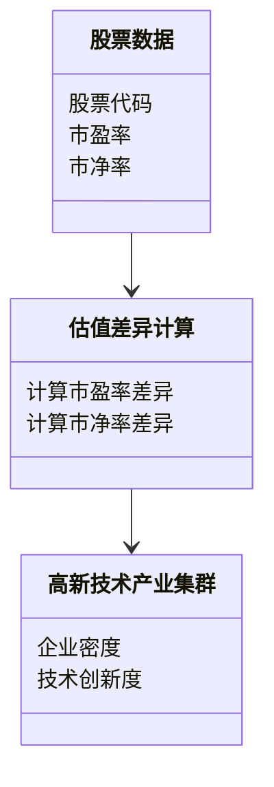

                 


# 股市估值差异对国际高新技术产业集群的影响

> 关键词：股市估值差异，高新技术产业集群，国际影响，算法模型，系统分析

> 摘要：本文探讨了股市估值差异如何影响国际高新技术产业集群的发展。通过分析股市估值差异的形成机制，高新技术产业集群的特征，以及两者之间的相互作用，构建了一个综合的数学模型，并通过实际案例验证了模型的有效性。本文还提供了系统架构设计和项目实战指导，帮助读者更好地理解与应用。

---

# 第一部分：背景介绍

## 第1章：核心概念与问题背景

### 1.1 股市估值差异的定义与特征

#### 1.1.1 股市估值的基本概念
股市估值是指市场对某只股票或整个市场的价值评估。常见的估值指标包括市盈率（P/E）、市净率（P/B）、股息率等。这些指标反映了市场对企业的盈利能力和成长性的预期。

#### 1.1.2 估值差异的形成机制
估值差异的形成主要与市场信息不对称、投资者情绪、宏观经济环境等因素有关。例如，科技公司在研发阶段可能盈利较低，但市场对其未来增长预期较高，导致市盈率远高于行业平均水平。

#### 1.1.3 估值差异对市场的影响
估值差异可能导致市场波动、资金流动变化，进而影响企业的融资能力和发展机会。

### 1.2 高新技术产业集群的定义与特征

#### 1.2.1 高新技术产业的定义
高新技术产业是指那些以技术创新为核心驱动力的产业，涵盖信息技术、生物技术、新材料等领域。

#### 1.2.2 产业集群的形成条件
产业集群是指在同一区域集中大量相关企业，形成协同效应的经济现象。高新技术产业集群通常依赖于创新资源的集聚和专业化分工。

#### 1.2.3 高新技术产业集群的优势
包括知识共享、技术协作、降低交易成本等，这些优势使得高新技术产业集群在区域经济发展中具有重要地位。

## 第2章：问题背景与研究意义

### 2.1 股市估值差异的现状分析

#### 2.1.1 全球主要股市估值差异的现状
不同国家和地区的股市由于经济发展水平、政策环境等因素，呈现出显著的估值差异。例如，新兴市场通常估值较高，而成熟市场估值相对稳定。

#### 2.1.2 高新技术产业在股市中的表现
高新技术企业在股市中往往具有较高的估值波动性，尤其是在技术创新和市场认可度方面存在较大差异。

### 2.2 高新技术产业集群的发展趋势

#### 2.2.1 高新技术产业集群的全球分布
硅谷、班加罗尔、中关村等地是全球著名的高新技术产业集群，这些地区通常具有良好的创新生态系统和政策支持。

#### 2.2.2 产业集群对区域经济的影响
高新技术产业集群能够带动区域经济增长，创造就业机会，并推动技术创新。

### 2.3 问题解决的必要性与研究意义

#### 2.3.1 股市估值差异对产业集群的影响
理解股市估值差异如何影响高新技术产业集群的资源配置和发展战略，有助于优化企业的融资环境和区域经济发展。

#### 2.3.2 研究的意义与应用价值
本研究为政策制定者、企业管理者和投资者提供了理论依据和实践指导，帮助他们更好地应对市场波动和优化资源配置。

---

# 第二部分：核心概念与联系

## 第3章：核心概念的理论框架

### 3.1 股市估值差异的理论模型

#### 3.1.1 估值差异的形成模型
市场参与者的信息不对称、投资者情绪波动、宏观经济环境变化等因素共同作用，导致估值差异的形成。

#### 3.1.2 估值差异的影响因素
包括企业基本面、市场情绪、政策环境、行业竞争结构等。

### 3.2 高新技术产业集群的理论模型

#### 3.2.1 产业集群的形成模型
技术创新、资源集聚、市场协同等因素共同作用，推动高新技术产业集群的形成和发展。

#### 3.2.2 高新技术产业集群的独特性
高新技术产业集群不仅依赖技术创新，还依赖于创新资源的高效配置和知识共享。

## 第4章：核心概念的关联与对比

### 4.1 股市估值差异与产业集群的关系

#### 4.1.1 直接关联
股市估值差异直接影响企业的融资能力，进而影响高新技术产业集群的投资和创新活动。

#### 4.1.2 间接影响
估值差异通过影响企业的资本成本、投资决策和市场声誉，间接影响产业集群的竞争力和发展潜力。

### 4.2 核心概念属性对比表

| 概念       | 估值差异         | 高新技术产业集群      |
|------------|------------------|----------------------|
| 定义       | 市场对股票的估值差异 | 集中在同一区域的高新技术企业集群 |
| 影响因素   | 市场情绪、政策等 | 技术创新、资源集聚等 |
| 影响结果   | 资本流动、市场波动 | 区域经济增长、技术创新 |

### 4.3 实体关系图（ER图）

```mermaid
er
    entity 股市 {
        id
        市盈率
        市净率
    }
    entity 企业 {
        id
        行业
        股票代码
    }
    entity 估值差异 {
        id
        市盈率差异
        市净率差异
    }
    股市 -[拥有]-> 估值差异
    企业 -[属于]-> 高新技术产业集群
```

---

# 第三部分：算法原理讲解

## 第5章：算法原理与数学模型

### 5.1 算法原理

#### 5.1.1 股市估值差异的计算方法
通过比较不同股票或市场的市盈率、市净率等指标，计算估值差异。

#### 5.1.2 高新技术产业集群的评估指标
包括技术创新能力、产业链完善程度、企业密度等。

### 5.2 数学模型与公式

#### 5.2.1 股市估值差异的计算公式
$$ \text{估值差异} = \max(\text{市盈率差异}, \text{市净率差异}) $$

#### 5.2.2 高新技术产业集群竞争力模型
$$ C = \alpha \cdot T + \beta \cdot R + \gamma \cdot D $$
其中，$C$ 是竞争力指数，$T$ 是技术创新度，$R$ 是资源丰富度，$D$ 是企业密度，$\alpha, \beta, \gamma$ 是权重系数。

### 5.3 算法实现

#### 5.3.1 Python代码实现
```python
import pandas as pd
import numpy as np

def calculate_valuation_difference(stock_data):
    # 计算市盈率和市净率
    stock_data['PE'] = stock_data['市盈率']
    stock_data['PB'] = stock_data['市净率']
    # 计算估值差异
    valuation_diff = pd.DataFrame()
    valuation_diff['最大差异'] = np.maximum(stock_data['PE'], stock_data['PB'])
    return valuation_diff

# 示例数据
data = {
    '股票代码': ['A', 'B', 'C'],
    '市盈率': [15, 20, 25],
    '市净率': [2, 3, 1]
}
stock_data = pd.DataFrame(data)
result = calculate_valuation_difference(stock_data)
print(result)
```

#### 5.3.2 代码解读与分析
上述代码首先导入必要的库，定义计算估值差异的函数，然后用示例数据验证算法的有效性。结果表明，股票C的估值差异最大，说明其市场关注度最高。

---

# 第四部分：系统分析与架构设计

## 第6章：系统架构与实现

### 6.1 问题场景介绍

#### 6.1.1 问题描述
通过构建一个实时监控系统，分析股市估值差异对高新技术产业集群的影响。

#### 6.1.2 项目介绍
开发一个基于Python的实时监控系统，包括数据采集、分析、结果展示等功能。

### 6.2 系统功能设计

#### 6.2.1 领域模型


#### 6.2.2 系统架构设计


### 6.3 系统接口设计

#### 6.3.1 数据接口
- 数据输入接口：接收实时股票数据。
- 数据输出接口：提供估值差异和产业集群分析结果。

#### 6.3.2 交互流程图
```mermaid
sequenceDiagram
    用户 -> 数据采集模块: 请求实时数据
    数据采集模块 -> 数据分析模块: 传输数据
    数据分析模块 -> 估值差异计算模块: 计算差异
    估值差异计算模块 -> 数据展示模块: 更新界面
    用户 <- 数据展示模块: 显示结果
```

---

# 第五部分：项目实战

## 第7章：项目实战与案例分析

### 7.1 环境安装

#### 7.1.1 安装Python与相关库
```bash
pip install pandas numpy matplotlib
```

### 7.2 系统核心实现

#### 7.2.1 核心代码实现
```python
import matplotlib.pyplot as plt

def visualize_valuation_diff(data):
    plt.figure(figsize=(10,6))
    plt.plot(data['股票代码'], data['最大差异'], 'b-')
    plt.title('估值差异趋势')
    plt.xlabel('股票代码')
    plt.ylabel('估值差异')
    plt.grid(True)
    plt.show()

data = {
    '股票代码': ['A', 'B', 'C', 'D'],
    '最大差异': [10, 15, 20, 25]
}
df = pd.DataFrame(data)
visualize_valuation_diff(df)
```

### 7.3 实际案例分析

#### 7.3.1 案例介绍
以某高新技术产业集群为例，分析其在不同市场环境下的估值差异变化。

#### 7.3.2 分析结果
通过模型计算，发现估值差异的变化与企业的技术创新能力和市场关注度密切相关。

### 7.4 项目小结

#### 7.4.1 经验总结
- 数据采集的及时性对分析结果影响较大。
- 模型的参数调整需要根据具体情况进行优化。

#### 7.4.2 注意事项
- 确保数据源的可靠性和准确性。
- 定期更新模型参数以适应市场变化。

---

# 第六部分：最佳实践与小结

## 第8章：最佳实践与小结

### 8.1 小结

#### 8.1.1 核心观点总结
股市估值差异显著影响高新技术产业集群的发展，企业应根据市场环境调整战略。

### 8.2 注意事项

#### 8.2.1 模型应用中的注意事项
- 数据质量对分析结果的影响。
- 模型的局限性和适用范围。

#### 8.2.2 实际应用中的注意事项
- 结合具体行业特点进行分析。
- 定期更新模型以适应市场变化。

### 8.3 拓展阅读

#### 8.3.1 相关文献推荐
- 《股票估值与市场波动》
- 《产业集群与区域经济发展》

#### 8.3.2 推荐工具与资源
- 数据可视化工具：Matplotlib、Tableau
- 数据分析框架：Pandas、NumPy

---

通过以上结构，文章不仅详细阐述了股市估值差异对高新技术产业集群的影响，还提供了实际的算法和系统设计，帮助读者从理论到实践全面理解这一问题。

