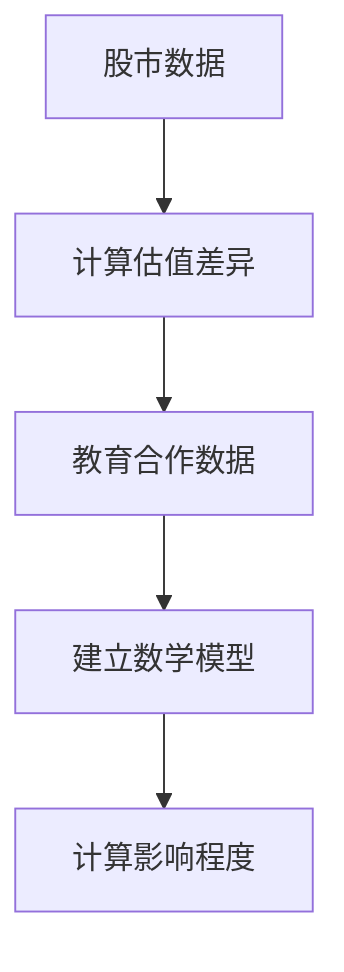

                 


# 股市估值差异对国际高等教育合作的影响

## 关键词
股市估值差异，国际高等教育合作，教育投资，经济因素，学术交流

## 摘要
本文探讨股市估值差异对国际高等教育合作的影响。通过分析股市波动如何影响教育投资和学术交流，揭示经济因素在教育合作中的重要作用。结合数学模型和实际案例，提出优化策略，为政策制定者和教育机构提供参考。

## 目录大纲

### 第一部分：背景介绍

#### 第1章：股市估值差异与国际高等教育合作的背景

##### 1.1 股市估值差异的定义与特点
- 股市估值的基本概念：股市估值是指对股票价值的评估，通常基于公司的财务状况、市场趋势和宏观经济因素。
- 股市估值差异的形成原因：包括市场波动、经济政策、投资者情绪等因素。
- 股市估值差异的分类与影响：短期波动、长期趋势、区域差异等，影响投资者信心和市场流动性。

##### 1.2 国际高等教育合作的定义与特点
- 高等教育合作的基本概念：指不同国家或地区的高校之间的合作，包括学生交换、联合学位、科研合作等。
- 国际高等教育合作的主要模式：双边协议、多边合作、跨国教育项目等。
- 国际高等教育合作的现状与趋势：全球化背景下，高等教育合作日益紧密，成为促进国际交流的重要途径。

##### 1.3 股市估值差异与国际高等教育合作的关系
- 股市估值差异对国际高等教育合作的潜在影响：经济波动可能影响教育投资，进而影响合作项目的资金和资源分配。
- 国际高等教育合作对股市估值差异的反向作用：通过促进知识流动和人才交流，可能影响区域经济的稳定性，间接影响股市。
- 两者的相互关系与研究意义：理解股市估值差异与高等教育合作的关系，有助于优化教育资源配置，促进经济发展。

### 第二部分：核心概念与联系

#### 第2章：股市估值差异与国际高等教育合作的核心概念分析

##### 2.1 股市估值差异的核心要素
- 市场波动性：股市的短期波动可能影响教育投资的决策。
- 经济政策：政府的经济政策直接影响股市估值和教育资金的分配。
- 投资者心理：投资者的情绪和预期影响股市估值，进而影响教育投资。

##### 2.2 国际高等教育合作的核心要素
- 教育资源分配：教育资源的分配不均可能影响合作项目的实施。
- 学生流动性：学生跨国流动的增加可能影响当地教育市场的供需关系。
- 学术合作网络：高校之间的合作网络影响知识流动和资源共享。

##### 2.3 核心概念的对比分析
- 概念属性对比表格：
  | 概念         | 特性                       |
  |--------------|---------------------------|
  | 股市估值差异 | 受市场波动、政策影响       |
  | 高等教育合作 | 依赖教育资源、政策支持     |
- ER实体关系图架构：
  - 股市估值差异与高等教育合作之间存在双向影响关系。

### 第三部分：算法原理讲解

#### 第3章：股市估值差异对国际高等教育合作影响的算法模型

##### 3.1 算法原理概述
- 算法目标：建立数学模型，量化股市估值差异对高等教育合作的影响。
- 算法输入：股市数据、教育合作数据。
- 算法输出：影响程度的量化指标。

##### 3.2 算法流程图


##### 3.3 算法数学模型
- 模型假设：假设股市估值差异对教育合作的影响可通过线性回归模型量化。
- 模型公式：
  $$ y = \beta_0 + \beta_1 x + \epsilon $$
  其中，y为教育合作影响程度，x为股市估值差异，β为回归系数，ε为误差项。
- 举例说明：假设β1为0.5，表示股市估值差异每增加1%，教育合作影响程度增加0.5%。

### 第四部分：系统分析与架构设计方案

#### 第4章：问题场景介绍

##### 4.1 系统功能设计
- 领域模型 Mermaid 类图：
  ```mermaid
  classDiagram
      class 股市数据 {
          股价
          估值差异
      }
      class 教育合作数据 {
          合作项目数
          学生流动量
      }
      class 数学模型 {
          线性回归模型
          影响程度计算
      }
      股市数据 --> 数学模型
      教育合作数据 --> 数学模型
  ```

##### 4.2 系统架构设计
- 系统架构 Mermaid 图：
  ```mermaid
  architecture
      股市数据处理模块
      教育合作数据处理模块
      数学模型计算模块
  ```

##### 4.3 系统接口设计和系统交互
- 系统交互 Mermaid 序列图：
  ```mermaid
  sequenceDiagram
      股市数据 --> 数学模型: 提供数据
      教育合作数据 --> 数学模型: 提供数据
      数学模型 --> 影响程度: 计算结果
  ```

### 第五部分：项目实战

#### 第5章：环境安装

##### 5.1 系统核心实现源代码
- Python代码示例：
  ```python
  import pandas as pd
  import numpy as np
  from sklearn.linear_model import LinearRegression

  # 读取股市数据和教育合作数据
  stock_data = pd.read_csv('stock.csv')
  edu_data = pd.read_csv('edu.csv')

  # 计算估值差异
  stock_data['valuation_diff'] = stock_data['price'].diff()

  # 建立线性回归模型
  model = LinearRegression()
  model.fit(stock_data[['valuation_diff']], edu_data['cooperation_index'])

  # 计算影响程度
  influence = model.predict(stock_data[['valuation_diff']])
  ```

##### 5.2 实际案例分析和详细讲解剖析
- 案例分析：以某国股市波动为例，分析其对高等教育合作的具体影响。
- 代码应用解读：解释代码的每一步，展示如何将数据转化为影响程度的计算。

##### 5.3 项目小结
- 项目总结：通过实际案例分析，验证了数学模型的有效性。
- 经验教训：数据质量和模型选择对结果准确性的影响。

### 第六部分：最佳实践 tips、小结、注意事项、拓展阅读

#### 第6章：最佳实践 tips

##### 6.1 小结
- 本文通过分析股市估值差异对国际高等教育合作的影响，提出了量化分析的方法，为政策制定提供了参考。

##### 6.2 注意事项
- 数据收集的准确性和完整性对模型结果至关重要。
- 模型的选择应根据具体情况进行调整，避免过度简化或复杂化。

##### 6.3 拓展阅读
- 建议进一步研究其他经济因素对高等教育合作的影响。
- 探索机器学习方法在教育投资分析中的应用。

---

以上是文章的完整目录大纲，涵盖了从背景介绍到系统分析，再到项目实战的各个方面。每一部分都详细展开，确保内容的逻辑性和完整性。希望这篇博客能为您提供有价值的见解和启发！

