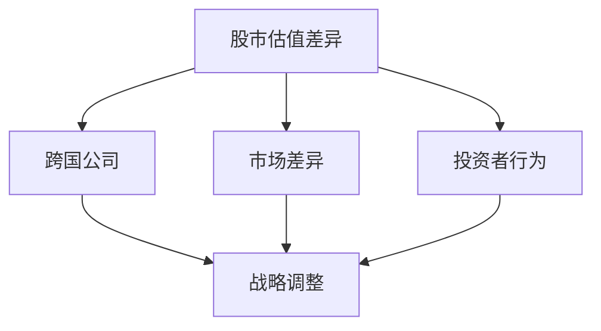

                 

# 股市估值差异对跨国公司战略的影响

> 关键词：股市估值差异，跨国公司，战略调整，市场差异，投资者行为，风险管理

> 摘要：本文探讨股市估值差异对跨国公司战略的影响，分析市场差异、公司特征、投资者行为和监管环境等因素如何导致估值差异，并提出应对策略。通过案例分析，总结经验，为跨国公司制定有效战略提供参考。

---

## # 第一部分：引言

## # 第1章：股市估值差异对跨国公司战略的影响概述

### 1.1 背景介绍

#### 1.1.1 问题背景：股市估值差异的定义与现象
股市估值差异是指同一公司股票在不同市场上的估值存在差异。例如，苹果公司在纳斯达克的市盈率可能高于它在伦敦证交所的市盈率。

#### 1.1.2 问题描述：跨国公司面临的估值差异挑战
跨国公司在全球多个市场上市，可能面临因市场差异导致的估值不一致问题，影响投资决策和公司战略。

#### 1.1.3 问题解决：如何应对估值差异对战略的影响
通过分析市场差异、投资者行为和公司特征，制定灵活的市场策略和资本结构优化方案。

#### 1.1.4 边界与外延：估值差异的范围与限制
估值差异主要由市场环境、投资者预期和公司基本面差异引起，需结合具体市场和公司情况分析。

#### 1.1.5 核心概念结构与组成：估值差异、跨国公司、战略调整
- 估值差异是核心问题。
- 跨国公司是研究对象。
- 战略调整是应对措施。

### 1.2 核心概念与联系

#### 1.2.1 核心概念原理：股市估值差异的成因与影响
股市估值差异由市场环境、投资者预期和公司基本面差异引起，影响跨国公司的战略决策。

#### 1.2.2 概念属性特征对比表格

| 概念       | 特征                 |
|------------|----------------------|
| 估值差异   | 市场差异、投资者行为   |
| 跨国公司    | 全球化、多元化         |
| 战略调整    | 市场策略、资本结构优化 |

#### 1.2.3 ER实体关系图（Mermaid流程图）

### 1.3 本章小结

---

## # 第二部分：股市估值差异的理论基础

## # 第2章：股市估值的基本原理

### 2.1 股市估值的核心方法

#### 2.1.1 市盈率（P/E）模型
$$ \text{市盈率} = \frac{\text{股价}}{\text{每股收益}} $$

#### 2.1.2 市净率（P/B）模型
$$ \text{市净率} = \frac{\text{股价}}{\text{每股净资产}} $$

#### 2.1.3 现金流折现法（DCF）
$$ \text{企业价值} = \sum_{t=1}^{n} \frac{\text{自由现金流}}{(1 + r)^t} $$

### 2.2 股市估值的影响因素

#### 2.2.1 宏观经济因素
$$ \text{宏观经济因素} = \text{GDP增长} + \text{利率水平} + \text{通货膨胀} $$

#### 2.2.2 行业因素
$$ \text{行业因素} = \text{行业生命周期} + \text{竞争格局} $$

#### 2.2.3 公司基本面
$$ \text{公司基本面} = \text{盈利能力} + \text{成长能力} + \text{财务状况} $$

### 2.3 跨国公司的定义与特点

#### 2.3.1 跨国公司的定义
跨国公司是指在多个国家设立分支机构或控股子公司的企业。

#### 2.3.2 跨国公司的全球化特征
跨国公司通常具有全球化业务、多元化市场和统一的品牌形象。

#### 2.3.3 跨国公司的战略复杂性
跨国公司需要考虑不同市场的法律法规、文化差异和经济环境。

---

## # 第三部分：股市估值差异的成因分析

## # 第3章：市场差异对估值的影响

### 3.1 不同市场间的估值差异

#### 3.1.1 发达市场与新兴市场的差异
$$ \text{发达市场估值差异} = \text{高市盈率} + \text{低波动性} $$
$$ \text{新兴市场估值差异} = \text{低市盈率} + \text{高波动性} $$

#### 3.1.2 文化差异对投资者行为的影响
$$ \text{文化差异} \Rightarrow \text{投资者风险偏好差异} $$

#### 3.1.3 市场流动性与估值差异的关系
$$ \text{市场流动性} \Rightarrow \text{市场深度} \Rightarrow \text{估值差异} $$

### 3.2 公司差异对估值的影响

#### 3.2.1 公司规模与估值差异
$$ \text{公司规模} \Rightarrow \text{市场影响力} \Rightarrow \text{估值差异} $$

#### 3.2.2 公司治理与估值差异
$$ \text{公司治理} \Rightarrow \text{投资者信任} \Rightarrow \text{估值差异} $$

#### 3.2.3 行业地位与估值差异
$$ \text{行业地位} \Rightarrow \text{竞争优势} \Rightarrow \text{估值差异} $$

### 3.3 投资者行为差异对估值的影响

#### 3.3.1 投资者情绪与估值差异
$$ \text{投资者情绪} \Rightarrow \text{市场波动} \Rightarrow \text{估值差异} $$

#### 3.3.2 投资者结构与估值差异
$$ \text{投资者结构} \Rightarrow \text{市场需求} \Rightarrow \text{估值差异} $$

### 3.4 监管差异对估值的影响

#### 3.4.1 不同市场的监管环境差异
$$ \text{监管环境} \Rightarrow \text{市场透明度} \Rightarrow \text{估值差异} $$

#### 3.4.2 监管政策对投资者行为的影响
$$ \text{监管政策} \Rightarrow \text{投资者行为} \Rightarrow \text{估值差异} $$

---

## # 第四部分：应对股市估值差异的策略

## # 第4章：跨国公司应对估值差异的策略

### 4.1 估值差异下的市场战略调整

#### 4.1.1 市场定位与产品策略
$$ \text{市场定位} \Rightarrow \text{产品差异化} \Rightarrow \text{市场适应性} $$

#### 4.1.2 定价策略
$$ \text{定价策略} \Rightarrow \text{市场接受度} \Rightarrow \text{市场份额} $$

#### 4.1.3 营销策略
$$ \text{营销策略} \Rightarrow \text{品牌影响力} \Rightarrow \text{市场需求} $$

### 4.2 资本结构优化

#### 4.2.1 债务与股权比例优化
$$ \text{资本结构} \Rightarrow \text{资本成本} \Rightarrow \text{企业价值} $$

#### 4.2.2 股权激励机制
$$ \text{股权激励} \Rightarrow \text{员工积极性} \Rightarrow \text{公司绩效} $$

### 4.3 投资者沟通与关系管理

#### 4.3.1 投资者关系管理
$$ \text{投资者沟通} \Rightarrow \text{市场信任} \Rightarrow \text{估值稳定性} $$

#### 4.3.2 股东价值最大化
$$ \text{股东价值} \Rightarrow \text{市场估值} \Rightarrow \text{公司战略调整} $$

### 4.4 全球化视角下的风险管理

#### 4.4.1 全球化风险管理框架
$$ \text{全球化视角} \Rightarrow \text{风险管理策略} \Rightarrow \text{风险控制} $$

#### 4.4.2 不同市场风险的应对策略
$$ \text{市场风险} \Rightarrow \text{风险对冲} \Rightarrow \text{风险降低} $$

---

## # 第五部分：案例分析与总结

## # 第5章：案例分析

### 5.1 案例一：苹果公司

#### 5.1.1 案例背景与估值差异分析
苹果公司在不同市场的估值差异显著，主要由于市场环境和投资者预期差异。

#### 5.1.2 战略调整与应对措施
苹果通过产品差异化和市场定位调整，有效应对估值差异。

### 5.2 案例二：可口可乐公司

#### 5.2.1 案例背景与估值差异分析
可口可乐在新兴市场的估值较低，主要由于市场流动性不足和投资者预期较低。

#### 5.2.2 战略调整与应对措施
可口可乐通过优化资本结构和加强投资者沟通，提升市场估值。

### 5.3 案例三：谷歌公司

#### 5.3.1 案例背景与估值差异分析
谷歌在欧洲市场的估值较低，主要由于监管压力和市场竞争加剧。

#### 5.3.2 战略调整与应对措施
谷歌通过调整市场定位和加强风险管理，有效应对估值差异。

### 5.4 案例总结与经验教训

---

## # 第六部分：总结与展望

## # 第6章：总结与展望

### 6.1 本章总结
股市估值差异对跨国公司战略的影响是一个复杂的问题，涉及市场环境、公司特征和投资者行为等多个因素。

### 6.2 未来研究方向
未来研究可以进一步探讨数字化转型和技术创新对估值差异的影响，以及人工智能技术在估值分析中的应用。

### 6.3 对读者的建议
建议读者结合具体市场和公司情况，灵活调整战略，有效应对估值差异。

### 6.4 致谢
感谢读者的关注与支持，感谢在写作过程中提供帮助的同事和朋友。

---

**本文通过系统分析股市估值差异的成因和影响，提出了跨国公司应对估值差异的具体策略，并通过实际案例分析验证了理论的可行性。希望本文能为跨国公司制定有效战略提供参考。**

