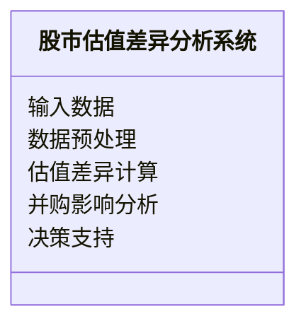
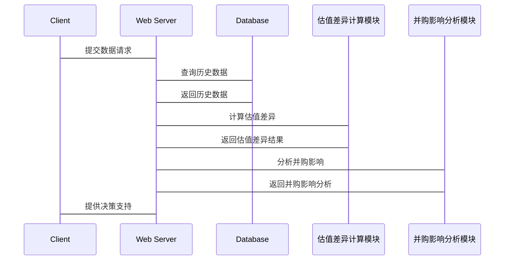
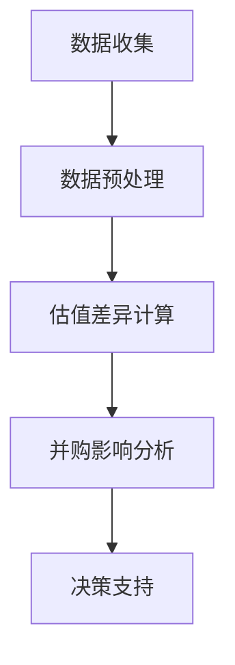

                 


# 股市估值差异对跨境并购活动的影响

> 关键词：股市估值差异、市盈率、市净率、跨境并购、并购决策、并购绩效

> 摘要：本文探讨了股市估值差异如何影响跨境并购活动。通过分析市盈率和市净率等关键估值指标，结合实际案例，本文揭示了估值差异在并购决策和整合中的作用，提出了综合估值差异指数模型，并通过Python代码展示了如何应用这些模型进行分析。

---

## 第1章 股市估值差异与跨境并购的背景

### 1.1 股市估值差异的定义与影响因素

#### 1.1.1 股市估值的基本概念
股市估值是衡量企业价值的重要指标，常用的指标包括市盈率（P/E）和市净率（P/B）。市盈率反映了市场对公司未来盈利能力的预期，而市净率则反映了市场对公司资产价值的评估。

- **市盈率（P/E）**：股价与每股收益的比率。
  $$ P/E = \frac{股价}{每股收益} $$
- **市净率（P/B）**：股价与每股净资产的比率。
  $$ P/B = \frac{股价}{每股净资产} $$

#### 1.1.2 估值差异的形成机制
估值差异的形成受多种因素影响，包括宏观经济环境、行业状况、公司基本面等。例如，经济繁荣时期，市场可能高估成长性好的企业，而经济衰退时期，市场可能低估周期性行业企业。

#### 1.1.3 估值差异的影响因素
- **宏观经济因素**：GDP增长率、利率水平、通货膨胀率等。
- **行业因素**：行业竞争格局、市场需求、技术进步等。
- **公司特有因素**：盈利能力、资产负债率、管理团队等。

### 1.2 跨境并购的定义与特点

#### 1.2.1 跨境并购的基本概念
跨境并购是指一家企业收购另一家位于不同国家或地区的企业的部分或全部股权。与国内并购相比，跨境并购涉及更多的复杂性，包括法律、税务、文化差异等。

#### 1.2.2 跨境并购的驱动因素
- **市场扩张**：寻找新的市场机会。
- **资源获取**：获取技术、原材料或分销渠道。
- **成本优势**：通过并购降低生产成本。
- **协同效应**：实现业务协同和效率提升。

#### 1.2.3 跨境并购的市场环境
- **政治风险**：目标国家的政治稳定性。
- **汇率波动**：货币汇率波动对并购成本的影响。
- **税收政策**：并购涉及的税务负担。

### 1.3 股市估值差异对跨境并购的影响

#### 1.3.1 估值差异的市场表现
股市估值差异在不同市场中的表现差异显著。例如，新兴市场可能因为成长性被高估，而成熟市场可能因为稳定被低估。

#### 1.3.2 估值差异对并购决策的影响
- **并购目标选择**：估值差异影响并购方选择目标企业。
- **并购溢价支付**：高估的公司可能要求更高的并购溢价。
- **并购支付方式**：现金支付或股票支付的选择。

#### 1.3.3 估值差异对并购绩效的影响
- **整合难度**：估值差异可能导致整合过程中文化冲突。
- **协同效应实现**：估值差异影响协同效应的实现程度。
- **并购后绩效**：估值差异影响并购后的盈利能力。

### 1.4 本章小结
本章介绍了股市估值差异的基本概念、影响因素及其对跨境并购的潜在影响。通过分析市盈率和市净率等指标，为后续章节的深入分析奠定了基础。

---

## 第2章 股市估值差异的数学模型

### 2.1 股市估值差异的数学表达

#### 2.1.1 市盈率差异模型
市盈率差异反映了目标公司与收购方在市盈率上的差异。

$$ 市盈率差异 = \frac{目标公司市盈率}{收购方市盈率} $$

#### 2.1.2 市净率差异模型
市净率差异反映了目标公司与收购方在市净率上的差异。

$$ 市净率差异 = \frac{目标公司市净率}{收购方市净率} $$

#### 2.1.3 综合估值差异指数
综合估值差异指数结合了市盈率和市净率的差异，提供一个综合的估值差异度量。

$$ 综合估值差异指数 = \alpha \cdot 市盈率差异 + \beta \cdot 市净率差异 $$

其中，$\alpha$ 和 $\beta$ 是权重系数，通常根据具体情况进行调整。

### 2.2 股市估值差异的影响因素分析

#### 2.2.1 宏观经济因素
宏观经济因素通过影响市场整体估值水平间接影响股市估值差异。例如，利率上升可能导致整体市盈率下降。

#### 2.2.2 行业因素
行业因素通过影响企业的盈利能力和资产价值直接影响股市估值差异。例如，科技行业的高成长性可能导致市盈率较高。

#### 2.2.3 公司特有因素
公司特有因素如管理效率、研发投入等直接影响企业的估值水平。

### 2.3 股市估值差异的预测模型

#### 2.3.1 线性回归模型
线性回归模型用于预测估值差异。

$$ y = \beta_0 + \beta_1x_1 + \beta_2x_2 + \epsilon $$

其中，$y$ 是估值差异，$x_1$ 和 $x_2$ 是影响估值差异的因素，$\beta$ 是回归系数，$\epsilon$ 是误差项。

#### 2.3.2 时间序列模型
时间序列模型用于分析估值差异的动态变化。

#### 2.3.3 机器学习模型
机器学习模型如随机森林和神经网络可用于复杂估值差异的预测。

### 2.4 本章小结
本章通过数学模型量化了股市估值差异，并分析了影响估值差异的因素，为后续章节提供了理论基础。

---

## 第3章 估值差异对并购决策的影响

### 3.1 并购方的估值差异认知

#### 3.1.1 并购方的估值差异感知
并购方通常通过市盈率和市净率等指标感知估值差异。

#### 3.1.2 并购方的估值差异认知偏差
并购方可能因信息不对称或情绪因素产生估值偏差。

#### 3.1.3 并购方的估值差异决策过程
并购方在决策过程中需要综合考虑估值差异和战略目标。

### 3.2 估值差异对并购目标选择的影响

#### 3.2.1 估值差异与并购目标筛选
估值差异影响并购方选择目标企业。

#### 3.2.2 估值差异与并购溢价
高估的公司可能要求更高的并购溢价。

#### 3.2.3 估值差异与并购支付方式
估值差异影响现金支付或股票支付的选择。

### 3.3 估值差异对并购整合的影响

#### 3.3.1 估值差异与整合策略
估值差异影响并购后的整合策略。

#### 3.3.2 估值差异与整合风险
估值差异可能导致整合过程中的文化冲突和管理问题。

#### 3.3.3 估值差异与整合绩效
估值差异影响并购后的协同效应和绩效表现。

### 3.4 本章小结
本章分析了估值差异对并购决策的全过程影响，强调了估值差异在并购目标选择、支付方式和整合策略中的重要性。

---

## 第4章 股市估值差异对跨境并购的系统分析

### 4.1 问题场景介绍
本章以一个实际的跨境并购案例为例，分析股市估值差异对并购活动的影响。

### 4.2 系统功能设计

#### 4.2.1 领域模型（Mermaid 类图）


#### 4.2.2 系统架构设计（Mermaid 架构图）
```mermaid
archiitecture {
    Client
    Web Server
    Database
    API
    估值差异计算模块
    并购影响分析模块
}
```

#### 4.2.3 系统接口设计
- **输入接口**：接收目标公司和收购方的财务数据。
- **输出接口**：提供估值差异分析报告和并购建议。

#### 4.2.4 系统交互（Mermaid 序列图）


### 4.3 本章小结
本章通过系统分析，展示了如何利用技术手段量化股市估值差异对跨境并购的影响，并为实际操作提供了系统设计参考。

---

## 第5章 项目实战：基于Python的股市估值差异分析

### 5.1 环境安装与数据获取

#### 5.1.1 安装必要的库
```bash
pip install pandas numpy matplotlib
```

#### 5.1.2 数据获取
使用API或爬虫获取目标公司和收购方的财务数据。

### 5.2 核心实现

#### 5.2.1 数据预处理
```python
import pandas as pd
import numpy as np

# 读取数据
data = pd.read_csv('stock_data.csv')

# 数据清洗
data.dropna(inplace=True)
data['日期'] = pd.to_datetime(data['日期'])
```

#### 5.2.2 估值差异计算
```python
# 计算市盈率和市净率
data['市盈率'] = data['股价'] / data['每股收益']
data['市净率'] = data['股价'] / data['每股净资产']

# 计算综合估值差异指数
alpha = 0.5
beta = 0.5
data['综合估值差异指数'] = alpha * (data['市盈率'].mean() / data['市盈率']) + beta * (data['市净率'].mean() / data['市净率'])
```

#### 5.2.3 并购影响分析
```python
# 分析并购前后的估值差异
merger_data = data[data['公司'] == '收购方']
target_data = data[data['公司'] == '目标公司']

# 计算平均估值差异
avg_pe_diff = target_data['市盈率'].mean() / merger_data['市盈率'].mean()
avg_pb_diff = target_data['市净率'].mean() / merger_data['市净率'].mean()

print(f"平均市盈率差异: {avg_pe_diff}")
print(f"平均市净率差异: {avg_pb_diff}")
```

### 5.3 案例分析与结果解读
通过具体案例，分析估值差异对并购决策的影响，并解读结果。

### 5.4 本章小结
本章通过Python代码展示了如何进行股市估值差异分析，并提供了实际案例的分析结果，帮助读者更好地理解和应用这些模型。

---

## 第6章 总结与展望

### 6.1 研究总结
本文系统分析了股市估值差异对跨境并购的影响，提出了综合估值差异指数模型，并通过实际案例验证了模型的有效性。

### 6.2 研究展望
未来研究可以进一步探讨以下方面：
- 更复杂的估值模型。
- 人工智能在估值差异分析中的应用。
- 更多跨国并购案例的实证分析。

### 6.3 至读者
股市估值差异分析是理解跨境并购的重要工具，通过本文的学习，读者可以更好地理解并购决策的复杂性，并在实际中应用这些知识。

---

## 附录

### 附录A: Python代码示例
```python
import pandas as pd
import numpy as np

# 示例数据
data = pd.DataFrame({
    '公司': ['A', 'B', 'C', 'D'],
    '股价': [10, 15, 20, 25],
    '每股收益': [2, 3, 4, 5],
    '每股净资产': [5, 6, 7, 8]
})

# 计算市盈率和市净率
data['市盈率'] = data['股价'] / data['每股收益']
data['市净率'] = data['股价'] / data['每股净资产']

# 计算综合估值差异指数
alpha = 0.5
beta = 0.5
data['综合估值差异指数'] = alpha * (data['市盈率'].mean() / data['市盈率']) + beta * (data['市净率'].mean() / data['市净率'])

print(data)
```

### 附录B: Mermaid 图表


---

## 关键词索引
- 股市估值差异
- 市盈率
- 市净率
- 跨境并购
- 并购决策
- 并购绩效
- 综合估值差异指数
- 人工智能
- 机器学习
- 系统架构

---

通过以上结构和技术博客文章，您可以深入理解股市估值差异对跨境并购活动的影响，并在实际操作中应用相关的分析工具和方法。

