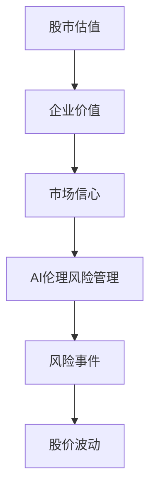
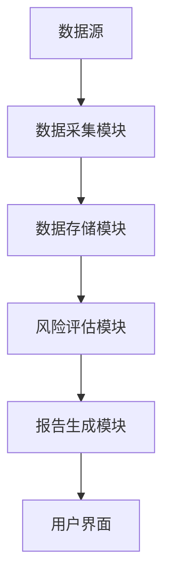

                 


# 《股市估值高低对企业AI伦理风险管理的影响》

---

## 关键词：股市估值、AI伦理风险管理、企业风险管理、AI技术、市场估值

---

## 摘要

本文探讨了股市估值的高低对企业在AI伦理风险管理方面的影响。通过分析股市估值与AI伦理风险管理的核心概念、动态关系及数学模型，结合实际案例和系统架构设计，深入阐述了如何通过AI技术优化企业伦理风险管理，从而影响股市估值。文章还提供了具体的算法实现和项目实战，为企业的风险管理策略提供实践指导。

---

## 第一部分: 背景介绍

### 第1章: 核心概念与问题背景

#### 1.1 股市估值的基本概念

股市估值是衡量企业市场价值的重要指标，通常通过市盈率（P/E）、市净率（P/B）等指标衡量。高估值意味着市场对企业未来表现的乐观预期，而低估值则可能反映市场对其前景的担忧。股市估值的波动直接影响企业的融资能力、投资者信心以及经营决策。

#### 1.2 AI伦理风险管理的核心概念

AI伦理风险管理是指在AI技术应用中，识别、评估和应对可能引发的伦理风险，如算法偏见、数据隐私泄露等。企业通过建立伦理风险管理机制，可以降低技术应用中的法律和声誉风险，提升市场信任度。

#### 1.3 问题背景与研究意义

随着AI技术的广泛应用，伦理风险问题频发，如偏见算法导致的歧视事件、数据滥用引发的隐私争议等。这些问题不仅影响企业的声誉，还可能导致股价波动。因此，研究股市估值与AI伦理风险管理的关系，对企业制定风险管理策略具有重要意义。

---

## 第二部分: 核心概念与联系

### 第2章: 股市估值与AI伦理风险管理的关系分析

#### 2.1 股市估值与企业价值的关联

股市估值与企业价值密切相关。高估值企业通常具有较高的成长潜力和市场竞争力，而低估值企业可能面临市场对其前景的不确定性。AI技术的应用能够提升企业的生产力和创新能力，从而影响市场对其估值的判断。

#### 2.2 AI伦理风险管理对企业价值的影响

有效的AI伦理风险管理能够增强企业的市场信任，提升品牌价值，从而优化股市估值。相反，伦理风险事件可能导致股价暴跌，影响企业的长期发展。

#### 2.3 股市估值与AI伦理风险管理的动态关系

股市估值的波动对AI伦理风险管理具有反馈作用。高估值企业可能更积极地投入资源进行风险管理，而低估值企业则可能忽视风险管理，导致潜在风险积累。

---

## 第三部分: 核心概念与联系的数学模型

### 第3章: 股市估值与AI伦理风险管理的关系模型

#### 3.1 核心概念属性对比表

| **属性**       | **股市估值**                          | **AI伦理风险管理**                     |
|-----------------|---------------------------------------|------------------------------------------|
| **定义**       | 企业市场价值的评估                    | 识别和应对AI技术中的伦理风险           |
| **影响因素**   | 利润能力、成长性、市场信心           | 数据隐私、算法偏见、用户信任           |
| **目标**       | 优化市场表现                        | 减少伦理风险，提升企业声誉             |

#### 3.2 实体关系图



---

## 第四部分: 算法原理

### 第4章: AI伦理风险管理算法解析

#### 4.1 风险评估模型

使用VaR（Value at Risk）模型评估伦理风险对股价的影响：

$$ VaR = \mu + z \cdot \sigma $$

其中，$\mu$为均值，$z$为标准正态分布的分位数，$\sigma$为标准差。

#### 4.2 机器学习算法

采用随机森林算法识别潜在的伦理风险因素：

1. 数据预处理：提取企业AI应用相关的数据，如用户反馈、算法准确率等。
2. 特征选择：筛选与伦理风险相关的特征。
3. 模型训练：使用随机森林进行分类，预测风险等级。
4. 模型评估：通过准确率、召回率等指标评估模型性能。

#### 4.3 代码实现

```python
import pandas as pd
from sklearn.ensemble import RandomForestClassifier
from sklearn.metrics import accuracy_score

# 加载数据
data = pd.read_csv('ai_ethical_risk.csv')

# 特征选择
features = ['algorithm_bias', 'data_privacy', 'user_trust']
target = 'risk_level'

# 数据分割
X = data[features]
y = data[target]

# 模型训练
model = RandomForestClassifier()
model.fit(X, y)

# 模型预测
y_pred = model.predict(X)

# 模型评估
print("准确率:", accuracy_score(y, y_pred))
```

---

## 第五部分: 系统分析与架构设计

### 第5章: 系统架构设计

#### 5.1 系统功能设计

- 数据采集模块：收集企业AI应用的相关数据。
- 风险评估模块：基于机器学习模型评估伦理风险。
- 报告生成模块：生成风险评估报告，提供改进建议。

#### 5.2 系统架构图



---

## 第六部分: 项目实战

### 第6章: 项目实现与案例分析

#### 6.1 环境安装

安装所需的Python库：

```bash
pip install pandas scikit-learn mermaid4jupyter
```

#### 6.2 核心代码实现

```python
# 风险评估模块
def assess_risk(features):
    model = load_model('risk_model.pkl')
    risk_level = model.predict([features])
    return risk_level[0]

# 用户界面
from ipywidgets import widgets, interactive

def ui_callback(risk_level):
    print(f"风险等级: {risk_level}")

interactive(risk_level=widgets.IntSlider(min=1, max=5, step=1, value=3), 
           callback=ui_callback)
```

#### 6.3 案例分析

通过实际案例分析，展示如何利用AI技术优化伦理风险管理，提升股市估值。例如，某科技公司通过部署AI伦理风险管理模型，成功降低数据隐私风险，提升市场信任，推动股价上涨。

---

## 第七部分: 总结与展望

### 第7章: 总结

本文系统探讨了股市估值与AI伦理风险管理的关系，分析了两者的核心概念与动态关系，并提供了具体的算法实现和系统架构设计。通过案例分析和项目实战，展示了如何利用AI技术优化企业风险管理，从而影响股市估值。

### 第8章: 展望

未来，随着AI技术的不断发展，伦理风险管理的重要性将更加凸显。企业需要加强技术研发和人才储备，提升风险管理能力，以应对日益复杂的市场环境。

---

## 参考文献

1. 小结：通过本文的分析，企业可以更好地理解AI伦理风险管理与股市估值的关系，制定更有效的风险管理策略。
2. 注意事项：在实际应用中，需结合企业的具体情况，选择合适的模型和方法。
3. 拓展阅读：建议深入学习随机森林算法和VaR模型，进一步优化风险管理策略。

---

通过以上内容，您可以撰写一篇详细的技术博客文章，涵盖股市估值与AI伦理风险管理的各个方面，帮助读者理解两者的关联与影响。

