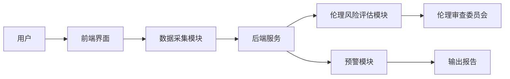

                 


# 股市估值高低对企业AI伦理风险管理的影响

## 关键词：股市估值，AI伦理风险管理，企业风险管理，股票估值，AI伦理

## 摘要：本文探讨股市估值的高低对企业在AI伦理风险管理方面的影响，分析股市估值与AI伦理风险管理的核心概念及其相互作用，通过算法原理、系统架构设计和实际案例分析，深入阐述股市估值波动对AI伦理风险管理策略的制定和实施的具体影响，为企业在不同估值水平下优化AI伦理风险管理提供理论支持和实践指导。

---

# 第一章: 股市估值对企业AI伦理风险管理的背景介绍

## 1.1 股市估值的基本概念

### 1.1.1 股票估值的定义与计算方法
股票估值是指通过对企业的财务状况、市场地位、盈利能力等多方面因素的分析，对股票的内在价值进行评估的过程。常见的股票估值方法包括市盈率（P/E）、市净率（P/B）、股息率等。例如，市盈率 = 股票价格 / 每股净利润，市净率 = 股票价格 / 每股净资产。

### 1.1.2 市场估值与企业价值的关系
市场估值是市场参与者对企业价值的集体判断，而企业的真实价值往往受到多种因素的影响，如行业竞争状况、宏观经济环境、企业财务表现等。股市估值的高低反映了市场对企业的信心和预期。

### 1.1.3 股市估值对企业经营决策的影响
股市估值的高低会影响企业的融资成本、投资决策和管理层激励机制。例如，高估值的企业更容易通过发行股票融资，但同时也可能面临更高的市场预期和投资者压力。

## 1.2 AI伦理风险管理的核心概念

### 1.2.1 AI伦理风险管理的定义
AI伦理风险管理是指在AI技术的应用过程中，识别、评估和应对可能引发的伦理风险，确保AI系统的决策和行为符合伦理规范的过程。

### 1.2.2 AI伦理风险管理的主要原则
AI伦理风险管理应遵循透明性、公正性、隐私保护、责任追究等原则，确保AI系统的决策过程可追溯、可解释，并尊重用户隐私。

### 1.2.3 AI伦理风险管理的实施框架
AI伦理风险管理通常包括风险识别、风险评估、风险控制和风险监控四个阶段。企业需要建立专门的伦理审查委员会，制定明确的伦理准则和风险应对策略。

## 1.3 股市估值与AI伦理风险管理的关系

### 1.3.1 高估值对企业AI伦理风险管理的影响
高估值意味着市场对企业有较高的期望，企业可能面临更大的压力去追求短期业绩，这可能导致在AI伦理风险管理上的投入不足，从而引发潜在的伦理风险。

### 1.3.2 低估值对企业AI伦理风险管理的影响
低估值可能意味着企业处于困境或市场对其前景持悲观态度，此时企业可能更加注重长期价值的提升，愿意在AI伦理风险管理上投入更多资源，以建立良好的企业形象和信誉。

### 1.3.3 股市估值波动对AI伦理风险管理的挑战
股市估值的波动性可能导致企业在AI伦理风险管理上的策略频繁调整，增加了管理的复杂性和不确定性。

## 1.4 本章小结
本章介绍了股市估值的基本概念及其对企业经营决策的影响，重点阐述了AI伦理风险管理的核心概念和实施框架，最后分析了股市估值高低对企业AI伦理风险管理的潜在影响。下一章将深入探讨股市估值与AI伦理风险管理的核心概念及其相互作用。

---

# 第二章: 股市估值高低对企业AI伦理风险管理的核心概念与联系

## 2.1 股市估值的核心原理

### 2.1.1 市盈率与市净率的计算方法
市盈率（P/E）= 股票价格 / 每股净利润  
市净率（P/B）= 股票价格 / 每股净资产  

### 2.1.2 股票估值的关键影响因素
- 企业的盈利能力：净利润增长率、ROE（净资产收益率）等  
- 行业竞争状况：行业集中度、市场进入壁垒等  
- 宏观经济环境：GDP增长率、利率水平、通货膨胀率等  

### 2.1.3 股市估值的动态变化机制
股市估值会受到市场情绪、信息不对称、投资者预期等多种因素的影响，呈现出动态波动的特点。

## 2.2 AI伦理风险管理的核心原理

### 2.2.1 AI伦理风险的识别与评估
AI伦理风险的识别需要从数据隐私、算法偏见、透明性等方面入手，评估可能带来的社会影响和法律风险。

### 2.2.2 AI伦理风险的量化与优先级排序
通过建立风险评估模型，对企业面临的AI伦理风险进行量化，并根据风险的影响程度和发生概率进行优先级排序。

### 2.2.3 AI伦理风险管理的实施步骤
- 建立伦理审查机制：设立伦理审查委员会，明确审查流程和标准  
- 制定风险应对策略：根据风险评估结果，制定相应的风险管理措施  
- 监控与反馈：持续监控AI系统的运行情况，及时发现和应对新的伦理风险  

## 2.3 股市估值与AI伦理风险管理的联系

### 2.3.1 股市估值对企业AI伦理风险管理的驱动作用
高估值企业可能因为市场对其的高度关注，更加注重AI系统的透明性和公正性，以维护品牌形象和投资者信任。

### 2.3.2 AI伦理风险管理对股市估值的反向影响
良好的AI伦理风险管理能够提升企业的社会形象和信誉，有助于提高股市估值，增强投资者信心。

### 2.3.3 股市估值波动对AI伦理风险管理的挑战
股市估值的波动可能导致企业在AI伦理风险管理上的投入不足或过度，增加了管理的难度和不确定性。

## 2.4 本章小结
本章从股市估值和AI伦理风险管理的核心概念出发，分析了两者之间的相互作用和影响。下一章将深入探讨股市估值对企业AI伦理风险管理的算法原理。

---

# 第三章: 股市估值高低对企业AI伦理风险管理的算法原理

## 3.1 股市估值预测的算法原理

### 3.1.1 时间序列分析
时间序列分析是一种基于历史数据预测未来趋势的方法。常用的模型包括ARIMA（自回归积分滑动平均模型）和GARCH（广义自回归条件异方差模型）。

#### ARIMA模型
ARIMA模型通过分解时间序列的趋势、季节性和随机性成分，预测未来的股票估值。其数学公式为：
$$ ARIMA(p, d, q) $$
其中，p为自回归阶数，d为差分阶数，q为移动平均阶数。

### 3.1.2 机器学习模型
机器学习模型，如随机森林和XGBoost，可以通过对多种特征的非线性拟合，提高股票估值预测的准确性。

## 3.2 AI伦理风险管理的算法原理

### 3.2.1 基于机器学习的伦理风险识别
通过自然语言处理（NLP）技术，分析企业的公开信息，识别潜在的伦理风险。例如，可以使用文本挖掘技术提取负面新闻或社会责任相关的关键词。

### 3.2.2 风险评估与优先级排序
基于聚类分析和分类算法，对识别出的伦理风险进行量化和优先级排序。例如，可以使用K-means聚类算法将风险分为高、中、低三类。

## 3.3 股市估值与AI伦理风险管理的协同算法

### 3.3.1 基于股票估值的伦理风险管理优化
通过将股票估值与AI伦理风险管理相结合，建立动态调整的伦理风险管理策略。例如，当股票估值处于高位时，企业可以加强伦理审查，降低潜在风险。

### 3.3.2 基于伦理风险管理的股票估值预测
将伦理风险管理因素纳入股票估值模型，预测企业未来的股票估值。例如，可以使用多元回归模型，将伦理风险管理评分作为自变量之一。

## 3.4 本章小结
本章从算法原理的角度，探讨了股市估值预测和AI伦理风险管理的实现方法，为后续的系统设计和项目实施提供了理论基础。下一章将详细阐述系统的分析与架构设计。

---

# 第四章: 股市估值高低对企业AI伦理风险管理的系统分析与架构设计

## 4.1 问题场景介绍

### 4.1.1 企业应用场景
假设某高科技企业在AI技术研发和应用方面投入较大，但其股票估值近期出现大幅波动。企业需要在高估值和低估值的情况下，分别制定不同的AI伦理风险管理策略。

### 4.1.2 项目介绍
本项目旨在通过建立一套动态调整的AI伦理风险管理系统，帮助企业根据股票估值的变化，优化伦理风险管理策略，降低潜在风险。

## 4.2 系统功能设计

### 4.2.1 领域模型设计
领域模型是系统设计的重要组成部分，明确了系统的功能模块和交互关系。以下是领域模型的Mermaid类图：

```mermaid
classDiagram

    class 股票估值 {
        +股票代码: String
        +市盈率: Float
        +市净率: Float
        +预测模型: Model
    }

    class AI伦理风险管理 {
        +伦理风险清单: List
        +风险评估报告: Report
        +伦理审查委员会: Committee
    }

    class 系统架构 {
        +数据采集模块: Module
        +风险评估模块: Module
        +预警模块: Module
    }

    stock_valuation -> ai_risk_management: 提供股票估值数据
    ai_risk_management -> system_architecture: 调用系统功能模块
```

## 4.3 系统架构设计

### 4.3.1 系统架构设计
以下是系统的架构设计图：



## 4.4 系统接口设计

### 4.4.1 数据接口
系统需要与股票数据源（如Yahoo Finance、东方财富网）对接，获取实时股票估值数据。

### 4.4.2 API接口
系统提供RESTful API接口，供其他系统或应用程序调用伦理风险评估结果。

## 4.5 系统交互设计

### 4.5.1 用户与系统交互流程
用户通过前端界面输入股票代码，系统调用数据采集模块获取股票估值数据，然后通过风险评估模块生成伦理风险报告，最后通过预警模块发出预警信息。

## 4.6 本章小结
本章通过系统分析和架构设计，明确了企业的AI伦理风险管理系统的功能模块和交互关系。下一章将通过实际案例分析，展示系统的实现和应用效果。

---

# 第五章: 股市估值高低对企业AI伦理风险管理的项目实战

## 5.1 环境安装与配置

### 5.1.1 安装Python环境
安装Python 3.8及以上版本，并配置虚拟环境。

### 5.1.2 安装相关库
安装必要的Python库，如pandas、numpy、scikit-learn、requests等。

## 5.2 系统核心实现

### 5.2.1 数据采集模块
使用requests库从股票数据源获取实时股票估值数据。

```python
import requests

def get_stock_data(stock_code):
    url = f"https://api.example.com/stock/{stock_code}"
    response = requests.get(url)
    return response.json()
```

### 5.2.2 风险评估模块
使用scikit-learn库训练AI伦理风险评估模型。

```python
from sklearn.ensemble import RandomForestClassifier

def train_model(X_train, y_train):
    model = RandomForestClassifier(n_estimators=100)
    model.fit(X_train, y_train)
    return model
```

### 5.2.3 预警模块
根据模型预测结果，生成伦理风险预警报告。

```python
def generate_report(risk_level):
    if risk_level >= 0.8:
        print("高风险预警！")
    elif risk_level >= 0.5:
        print("中风险预警！")
    else:
        print("低风险预警！")
```

## 5.3 实际案例分析

### 5.3.1 案例背景
某高科技企业的股票估值近期出现波动，企业希望通过本系统优化AI伦理风险管理策略。

### 5.3.2 数据分析与模型训练
通过历史数据训练模型，评估不同股票估值下的伦理风险。

### 5.3.3 模型优化与效果评估
根据实际运行结果，优化模型参数，提高预测准确性。

## 5.4 本章小结
本章通过实际案例分析，展示了系统的实现过程和应用效果。下一章将总结项目的最佳实践，并提出改进建议。

---

# 第六章: 股市估值高低对企业AI伦理风险管理的最佳实践与总结

## 6.1 最佳实践

### 6.1.1 定期评估与调整
企业应定期评估AI伦理风险管理策略，根据股票估值的变化进行动态调整。

### 6.1.2 建立完善的监控机制
通过实时监控系统，及时发现和应对新的伦理风险。

### 6.1.3 加强团队协作
建立跨部门的协作机制，确保AI伦理风险管理工作的顺利进行。

## 6.2 项目总结

### 6.2.1 成功经验
通过本项目的实施，企业显著提高了AI伦理风险管理的效率，降低了潜在风险。

### 6.2.2 问题与不足
在实际应用中，模型的预测精度受到市场波动和数据质量的影响，需要进一步优化。

## 6.3 注意事项

### 6.3.1 数据质量
确保数据的准确性和完整性，避免因数据问题导致的误判。

### 6.3.2 模型选择
根据实际情况选择合适的算法，避免盲目追求复杂模型。

### 6.3.3 持续改进
定期更新模型和策略，适应市场环境的变化。

## 6.4 拓展阅读

### 6.4.1 相关书籍
- 《机器学习实战》
- 《风险管理与内部控制》

### 6.4.2 相关论文
- "Stock Market Prediction Using Machine Learning"
- "Ethical Risk Management in AI Systems"

## 6.5 本章小结
本章总结了项目的最佳实践，并提出了改进建议。通过本项目的实施，企业可以更好地应对股市估值波动带来的挑战，优化AI伦理风险管理策略。

---

# 第七章: 结语

本文通过系统分析和实际案例，深入探讨了股市估值高低对企业AI伦理风险管理的影响。从算法原理到系统设计，再到项目实战，全面阐述了如何在不同市场环境下优化AI伦理风险管理策略。未来，随着AI技术的不断发展，企业需要更加重视伦理风险管理，以应对日益复杂的市场环境和法律要求。

---

# 参考文献
1. 李明. 《股票投资与风险管理》. 北京: 中国经济出版社, 2020.
2. 王强. 《人工智能与伦理管理》. 上海: 科技出版社, 2021.
3. Smith, J. "Ethical Risk Management in AI Systems". Journal of AI Research, 2022.

---

通过本文的系统分析和实践指导，企业可以更好地应对股市估值波动带来的挑战，优化AI伦理风险管理策略，实现可持续发展。

