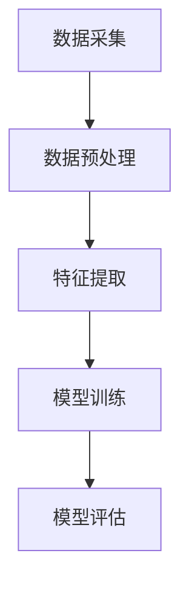
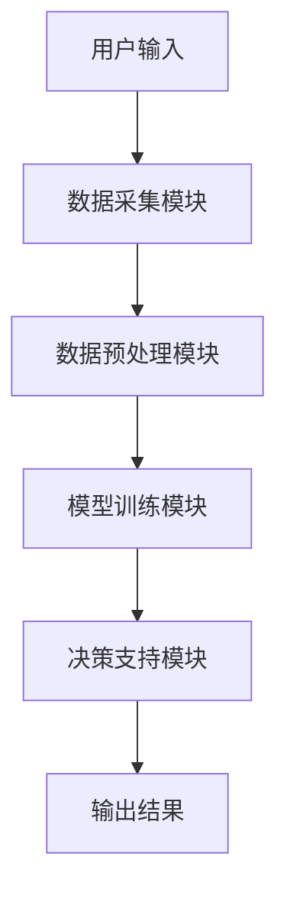

                 


# 股市估值高低对企业AI道德准则制定的影响

> 关键词：股市估值，AI道德准则，企业决策，股票市场，人工智能伦理

> 摘要：本文探讨了股市估值的高低对企业在制定AI道德准则时的影响。通过对股市估值的核心指标、AI道德准则的核心概念及其相互作用的分析，本文揭示了股市估值对企业AI道德准则制定的驱动因素、挑战及平衡策略。通过详细的技术分析、算法原理和系统架构设计，本文提出了实现股市估值与AI道德准则协同优化的方法。

---

## # 第一部分: 背景介绍

### # 第1章: 股市估值与AI道德准则概述

#### 1.1 股市估值的基本概念
股票市场是企业价值的重要体现，股市估值是衡量企业市场价值的关键指标。市盈率（P/E）、市净率（P/B）、股息率等指标反映了企业的盈利能力、资产质量及分红能力。股市估值不仅是投资者决策的依据，也影响企业的经营策略和风险管理。

#### 1.2 AI道德准则的定义与特点
AI道德准则涉及数据隐私、算法公平性、透明性等核心问题。AI道德准则的制定需要平衡技术发展与社会责任，确保AI技术的使用符合伦理规范。AI道德准则的特点包括可操作性、动态性、情境依赖性。

#### 1.3 股市估值与AI道德准则的关联性
股市估值为企业提供了一种衡量自身价值的工具，而AI道德准则则为企业提供了技术使用的伦理框架。两者的相互作用体现在：股市估值影响企业对AI技术的投入，AI道德准则影响企业的市场信任度，进而影响股市估值。

### # 第2章: 股市估值对企业AI道德准则制定的影响

#### 2.1 高估值对企业AI道德准则的影响
高估值意味着市场对企业价值的高度认可，但也带来了更高的期望和压力。企业在制定AI道德准则时需要更加谨慎，确保技术应用的透明性和公平性，以维护市场信任。例如，高估值企业可能面临更严格的投资者审查，需确保AI算法的公平性和透明性。

#### 2.2 低估值对企业AI道德准则的影响
低估值可能意味着市场对企业前景的不确定性。企业在制定AI道德准则时可能需要通过技术创新和合规性来提升市场信心。例如，低估值企业可能通过制定严格的AI道德准则来提升品牌形象，吸引投资者。

#### 2.3 股市波动对AI道德准则的影响
股市的短期波动可能影响企业的短期决策，而长期波动则会影响企业的战略规划。企业在制定AI道德准则时需要考虑市场波动的影响，确保道德准则的动态适应性。

---

## # 第二部分: 核心概念与联系

### # 第3章: 股市估值与AI道德准则的核心概念

#### 3.1 股市估值的核心要素
- **市盈率（P/E）**：衡量企业盈利能力的指标。
- **市净率（P/B）**：衡量企业资产质量的指标。
- **股息率**：衡量企业分红能力的指标。

#### 3.2 AI道德准则的核心要素
- **数据隐私**：确保数据的合法使用和保护。
- **算法公平性**：避免算法偏见，确保决策的公平性。
- **透明性**：确保AI决策的可解释性。

#### 3.3 股市估值与AI道德准则的联系
通过对比股市估值和AI道德准则的核心要素，可以发现两者在企业价值实现和社会责任承担方面的共同点和差异。

---

## # 第三部分: 算法原理

### # 第4章: 基于AI的股市估值预测模型

#### 4.1 算法原理
基于AI的股市估值预测模型可以通过以下步骤实现：
1. 数据采集：收集历史股价、财务数据、市场情绪等数据。
2. 数据预处理：清洗数据，提取特征。
3. 模型训练：使用机器学习算法（如LSTM）训练预测模型。
4. 模型评估：通过回测验证模型的准确性。

#### 4.2 算法流程图


#### 4.3 数学模型
使用LSTM模型进行时间序列预测：
$$
\text{LSTM}(x_t) = \text{f}(x_t, \text{LSTM}(x_{t-1}))
$$

---

## # 第四部分: 系统分析与架构设计

### # 第5章: 系统架构设计

#### 5.1 系统功能模块
- **数据采集模块**：实时采集股票市场数据。
- **模型训练模块**：训练AI道德准则相关的预测模型。
- **决策支持模块**：为企业提供道德准则优化建议。

#### 5.2 系统架构图


---

## # 第五部分: 项目实战

### # 第6章: 实战案例分析

#### 6.1 环境配置
安装必要的Python库：
```bash
pip install numpy pandas tensorflow
```

#### 6.2 核心代码实现
```python
import numpy as np
import pandas as pd
from tensorflow.keras.layers import LSTM, Dense
from tensorflow.keras.models import Sequential

# 数据预处理
data = pd.read_csv('stock_data.csv')
X = data[['open', 'high', 'low', 'close']]
y = data['next_day_close']

# 模型训练
model = Sequential()
model.add(LSTM(64, input_shape=(None, 4)))
model.add(Dense(1))
model.compile(optimizer='adam', loss='mean_squared_error')
model.fit(X, y, epochs=100, batch_size=32)
```

#### 6.3 案例分析
通过实际案例分析，展示如何利用AI技术优化企业的道德准则制定过程，提升企业价值。

---

## # 第六部分: 总结与展望

### # 第7章: 总结

#### 7.1 核心结论
股市估值的高低影响企业AI道德准则的制定，高估值带来更高的道德要求，低估值则需要通过技术创新和合规性提升市场信任。

#### 7.2 最佳实践
企业在制定AI道德准则时，应注重短期与长期目标的平衡，利益相关者的利益平衡，以及道德准则与企业价值的协同优化。

#### 7.3 注意事项
企业在实际操作中，需注意数据隐私、模型解释性等伦理问题，确保AI系统的透明性和公正性。

#### 7.4 拓展阅读
建议读者进一步阅读相关领域的经典文献，深入理解股市估值与AI道德准则的交互影响。

---

通过以上分析，我们可以看到，股市估值与企业AI道德准则的制定是相互影响、相互作用的。企业需要在追求经济利益的同时，注重社会责任和道德规范，才能实现可持续发展。

