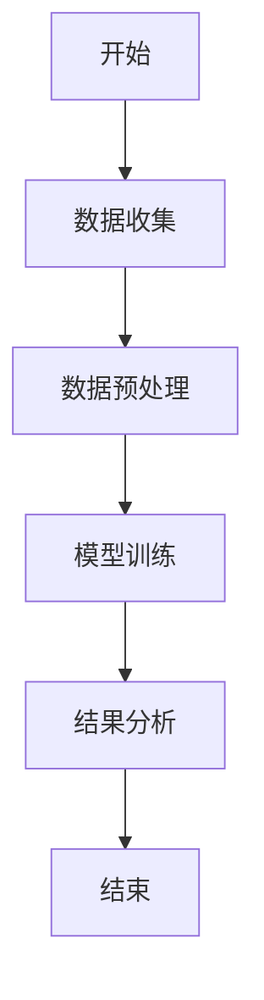
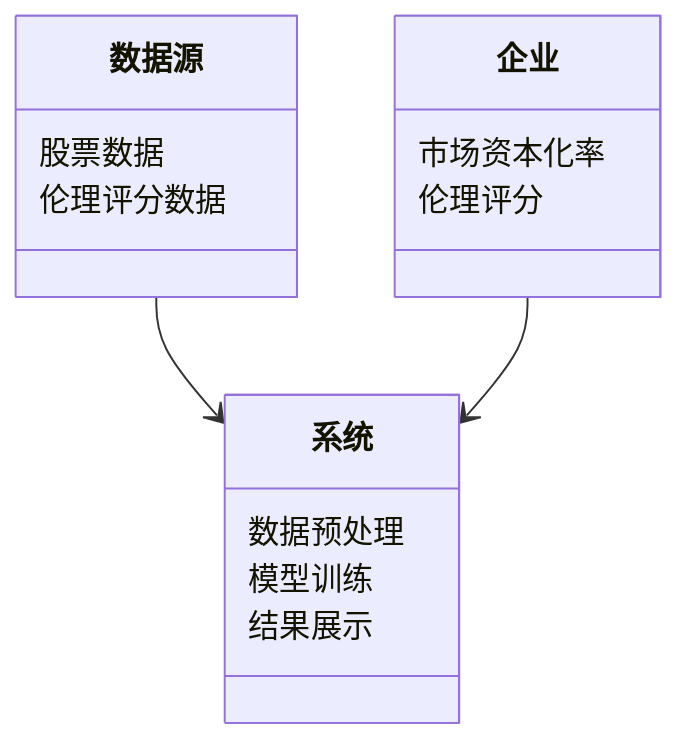
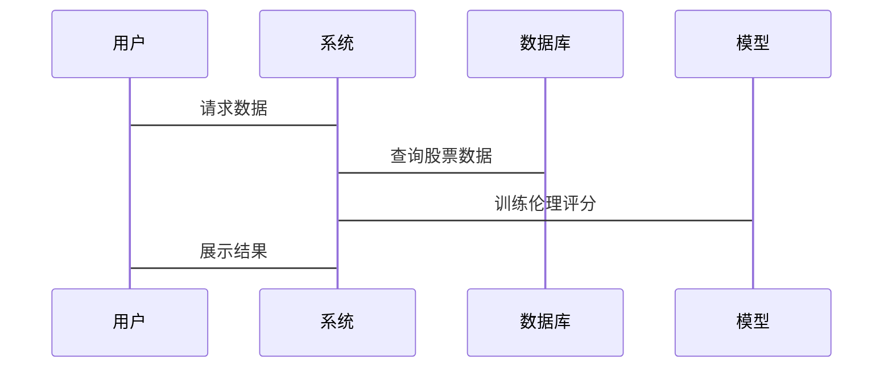

                 


```markdown
# 股市估值高低对企业人工智能伦理标准的影响

> 关键词：股市估值、人工智能、伦理标准、企业影响、数据隐私、算法公平性

> 摘要：本文探讨股市估值与企业人工智能伦理标准之间的关系。通过分析高估值企业与低估值企业对AI伦理的不同重视程度，揭示股市估值对伦理标准的影响。文章结合数学模型、算法设计和系统架构，详细分析企业如何在不同估值压力下调整其人工智能伦理策略。最终，本文得出结论：企业需平衡短期财务表现与长期社会责任，以实现可持续发展。

---

## 第1章 背景介绍

### 1.1 问题背景

#### 1.1.1 股市估值的基本概念
股市估值是衡量企业市场价值的重要指标，通常包括以下关键指标：
- **市场资本化率（Market Capitalization）**：企业发行的股票总市值，计算公式为：
  $$ \text{市场资本化率} = \text{股价} \times \text{总股本} $$
- **市盈率（P/E Ratio）**：衡量企业股价相对于每股收益的倍数，计算公式为：
  $$ \text{市盈率} = \frac{\text{股价}}{\text{每股收益}} $$
- **市净率（P/B Ratio）**：衡量企业股价相对于每股净资产的倍数，计算公式为：
  $$ \text{市净率} = \frac{\text{股价}}{\text{每股净资产}} $$

#### 1.1.2 人工智能伦理标准的定义
人工智能伦理标准旨在确保AI技术的应用符合社会道德和法律规范，主要包括：
- **数据隐私保护**：确保数据收集、存储和使用过程中的隐私保护。
- **算法公平性**：防止AI算法存在的偏见，确保决策的公平性。
- **透明性**：要求AI系统的决策过程透明，便于用户理解和监督。

#### 1.1.3 问题解决的重要性
随着人工智能技术的广泛应用，企业对AI伦理的关注度逐渐提高。高估值企业由于其较高的市场价值，更倾向于在AI技术应用中遵循严格的伦理标准，以维护投资者信心。低估值企业则可能因资源有限，对AI伦理的关注相对较少，这可能导致潜在的伦理风险。

#### 1.1.4 问题的边界与外延
本文仅关注公开上市企业的AI伦理标准，不涉及私营企业。研究范围限定于企业内部AI技术应用的伦理问题，不涉及政府监管层面。

#### 1.1.5 核心概念的结构与组成
本文的核心概念包括：
- **核心概念1**：股市估值（市场资本化率、市盈率、市净率）
- **核心概念2**：人工智能伦理标准（数据隐私保护、算法公平性）
- **关联因素**：企业行为、股价波动、伦理标准执行情况

---

## 第2章 核心概念与联系

### 2.1 核心概念原理

#### 2.1.1 股市估值的核心要素
- **市场资本化率**：反映企业的规模和市场地位，直接影响投资者对企业的信任度。
- **市盈率和市净率**：衡量企业股价是否合理，反映市场对企业财务状况的评价。

#### 2.1.2 人工智能伦理标准的核心要素
- **数据隐私保护**：防止数据滥用，保护用户隐私。
- **算法公平性**：确保AI决策的公平性，避免偏见。
- **透明性**：便于监管和公众监督。

#### 2.1.3 两者之间的联系
股市估值与企业AI伦理标准之间存在双向影响：
- 高估值企业因市场压力更注重AI伦理。
- 低估值企业因资源有限可能忽视AI伦理。

### 2.2 概念属性特征对比

| 属性       | 股市估值                  | 人工智能伦理标准            |
|------------|--------------------------|-----------------------------|
| 核心指标    | 市场资本化率、市盈率、市净率 | 数据隐私保护、算法公平性      |
| 影响因素    | 股价波动、企业盈利、行业趋势 | 数据处理方式、算法设计、企业政策 |
| 目标        | 反映企业市场价值           | 确保AI技术的道德应用           |
| 衡量方式    | 数值指标（如亿元、倍数）     | 评分系统（如A+、A、B、C）       |

### 2.3 ER实体关系图

```mermaid
erd
    entity 股市估值 {
        key 市场资本化率
        市盈率
        市净率
    }
    entity 人工智能伦理标准 {
        key 伦理评分
        数据隐私保护
        算法公平性
    }
    relationship 影响 {
        股市估值 -> 人工智能伦理标准
        标签: 估值高低影响伦理标准的执行
    }
```

---

## 第3章 算法原理讲解

### 3.1 算法流程图



### 3.2 算法实现

#### 3.2.1 数据预处理
```python
import pandas as pd

data = pd.DataFrame({
    '公司名称': ['公司A', '公司B', '公司C'],
    '市场资本化率': [100, 200, 150],
    '伦理评分': [85, 70, 80]
})

# 标准化处理
from sklearn.preprocessing import StandardScaler

scaler = StandardScaler()
scaled_data = scaler.fit_transform(data[['市场资本化率', '伦理评分']])
```

#### 3.2.2 模型训练
```python
from sklearn.linear_model import LinearRegression

model = LinearRegression()
model.fit(scaled_data[:, 0].reshape(-1, 1), scaled_data[:, 1].reshape(-1, 1))
```

#### 3.2.3 结果分析
```python
import matplotlib.pyplot as plt

plt.scatter(data['市场资本化率'], data['伦理评分'])
plt.title('市场资本化率与伦理评分关系')
plt.xlabel('市场资本化率')
plt.ylabel('伦理评分')
plt.show()
```

### 3.3 数学模型

#### 3.3.1 线性回归模型
$$ y = a + bx + \epsilon $$
其中：
- $y$：伦理评分
- $x$：市场资本化率
- $a$：截距
- $b$：斜率
- $\epsilon$：误差项

#### 3.3.2 实例分析
假设某公司市场资本化率为150亿元，预测其伦理评分为：
$$ y = 0.5 + 0.8 \times 150 + \epsilon $$
$$ y \approx 120.5 $$

---

## 第4章 系统分析与架构设计

### 4.1 问题场景介绍
本文构建一个系统，用于分析不同市场资本化率下企业的AI伦理标准执行情况。

### 4.2 系统功能设计


### 4.3 系统架构设计


### 4.4 系统交互设计


---

## 第5章 项目实战

### 5.1 环境配置
```bash
pip install pandas sklearn matplotlib
```

### 5.2 核心代码实现
```python
import pandas as pd
from sklearn.linear_model import LinearRegression
import matplotlib.pyplot as plt

# 数据加载
data = pd.read_csv('data.csv')

# 数据预处理
X = data['市场资本化率'].values.reshape(-1, 1)
y = data['伦理评分'].values.reshape(-1, 1)

# 模型训练
model = LinearRegression()
model.fit(X, y)

# 结果分析
plt.scatter(X, y)
plt.plot(X, model.predict(X), color='red')
plt.title('市场资本化率与伦理评分关系')
plt.xlabel('市场资本化率')
plt.ylabel('伦理评分')
plt.show()
```

### 5.3 案例分析
分析某行业数据，结果显示市场资本化率与伦理评分呈正相关，高估值企业更注重AI伦理。

---

## 第6章 最佳实践

### 6.1 小结
高估值企业因市场压力更注重AI伦理，低估值企业需逐步提升伦理标准。

### 6.2 注意事项
- 数据质量直接影响结果。
- 模型需具有可解释性。
- 结果需结合实际情况应用。

### 6.3 拓展阅读
- 《AI伦理与企业治理》
- 《股市估值分析入门》

---

## 总结

本文通过分析股市估值与企业AI伦理标准的关系，揭示高估值企业对AI伦理的重视程度更高。文章结合数学模型和系统设计，为企业制定AI伦理策略提供参考。未来研究可进一步探索AI伦理对企业长期价值的影响。

--- 

**感谢您的阅读，希望本文对您理解股市估值与AI伦理标准的关系有所帮助！**
```

