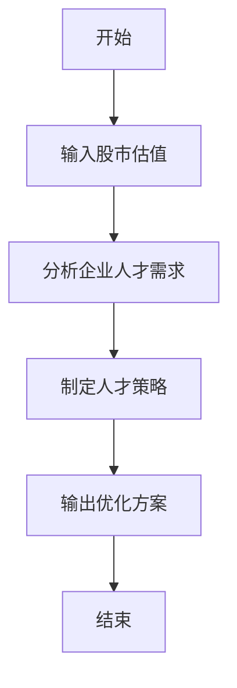
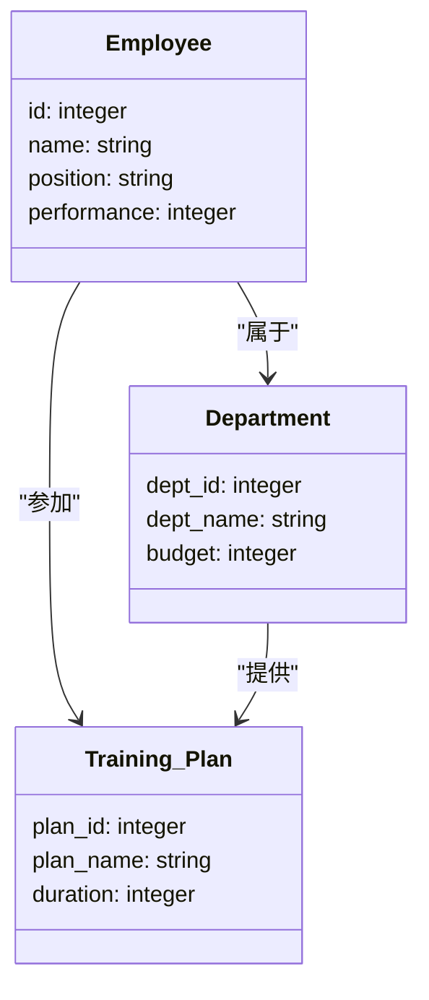
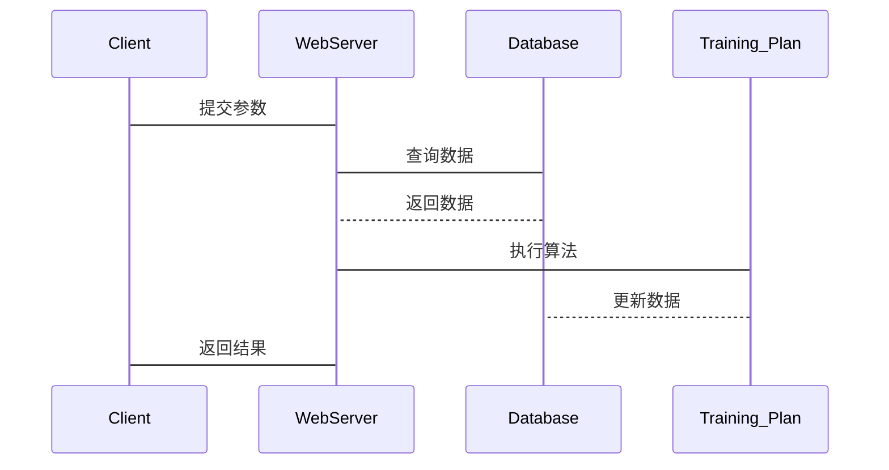

                 


# 股市估值高低对企业人才培养策略的影响

> 关键词：股市估值、企业人才策略、人才培养、企业绩效、股价波动

> 摘要：本文探讨了股市估值的高低对企业人才培养策略的影响。通过对股市估值与企业人才策略的深入分析，本文提出了基于股市估值的人才培养策略模型，结合实际案例，详细阐述了高估值和低估值环境下企业应采取的人才培养策略。本文还通过数学模型、算法流程图、系统架构图等技术手段，系统地分析了股市估值对企业人才策略的影响机制，为企业制定科学的人才培养策略提供了理论依据和实践指导。

---

## 第一章: 股市估值与企业人才策略的背景介绍

### 1.1 股市估值的基本概念

#### 1.1.1 股市估值的定义与计算方法
股市估值是衡量企业市场价值的重要指标，通常通过市盈率（P/E）、市净率（P/B）等指标来评估企业的市场价值。其中，市盈率是最常用的估值指标，公式为：
$$ P/E = \frac{\text{股票价格}}{\text{每股净利润}} $$

企业通过分析股市估值，可以了解市场对公司的认可程度，从而指导企业的战略决策。

#### 1.1.2 企业人才策略的定义与核心要素
企业人才策略是指企业在不同发展阶段对人才引进、培养、激励和留用等方面采取的策略。核心要素包括：
1. 人才引进策略：招聘渠道、招聘标准等。
2. 人才培养策略：培训计划、职业发展规划等。
3. 人才激励策略：薪酬体系、绩效考核等。
4. 人才留用策略：员工满意度、职业发展机会等。

#### 1.1.3 股市估值与企业人才策略的关联性分析
股市估值反映了市场对企业的信心，同时也影响企业的财务状况和战略决策。高估值通常意味着企业具有较高的市场认可度，能够吸引和留住优秀人才；低估值则可能限制企业的资金投入，影响人才的培养和引进。

### 1.2 股市估值对企业的影响

#### 1.2.1 高估值对企业人才策略的推动作用
在高估值环境下，企业通常具有较高的市场关注度和资金实力，能够吸引和留住优秀人才。具体表现包括：
1. 提供有竞争力的薪酬和福利。
2. 投资于员工培训和职业发展。
3. 优化企业内部管理，吸引高端人才。

#### 1.2.2 低估值对企业人才策略的制约作用
在低估值环境下，企业可能面临资金紧张、市场认可度下降等问题，对人才策略的影响包括：
1. 薪酬吸引力下降，人才流失风险增加。
2. 培训投入减少，员工能力提升受限。
3. 企业形象受损，招聘难度加大。

#### 1.2.3 股市估值波动对企业人才策略的动态影响
股市估值的波动性对企业人才策略的影响是动态的。例如，在股市估值突然下跌时，企业可能需要迅速调整人才策略，如优化员工结构或降低人才引进标准。

---

## 第二章: 股市估值与企业人才策略的核心概念

### 2.1 核心概念的原理分析

#### 2.1.1 股市估值的核心要素
股市估值的核心要素包括企业盈利能力、成长能力、财务健康状况和行业地位等。这些要素共同影响着市场的对企业价值的评估。

#### 2.1.2 企业人才策略的核心要素
企业人才策略的核心要素包括人才需求分析、人才培养计划、人才激励机制和人才评估体系等。

#### 2.1.3 两者之间的相互作用机制
股市估值和企业人才策略之间存在双向影响：股市估值高企会推动企业加大对人才的投入，而人才的优化配置和能力提升又能反过来提升企业的市场价值。

### 2.2 核心概念的对比分析

#### 2.2.1 股市估值与企业人才策略的对比表格
| 要素 | 股市估值 | 企业人才策略 |
|------|----------|--------------|
| 核心目标 | 评估企业市场价值 | 优化企业人才结构和能力 |
| 影响因素 | 盈利能力、行业地位 | 人才需求、培训投入 |
| 实施主体 | 投资者、市场机构 | 企业 HR、管理层 |
| 结果指标 | P/E、P/B | 人才留存率、员工绩效 |

#### 2.2.2 企业人才策略与企业绩效的关系
企业人才策略直接影响企业的绩效表现。例如，有效的培训计划可以提升员工能力，进而提高企业的产品质量和服务水平，从而增强企业的市场竞争力。

#### 2.2.3 企业人才策略的ER实体关系图
```mermaid
erDiagram
    employee {
        id : integer
        name : string
        position : string
        performance : integer
    }
    training_plan {
        plan_id : integer
        plan_name : string
        duration : integer
    }
    department {
        dept_id : integer
        dept_name : string
        budget : integer
    }
    employee --> department : "属于"
    employee --> training_plan : "参加"
    department --> training_plan : "提供"
```

---

## 第三章: 股市估值对企业人才策略的算法原理

### 3.1 算法原理的数学模型

#### 3.1.1 股市估值的数学表达式
$$ V = P/E $$

其中，$V$ 表示市盈率，$P$ 表示股票价格，$E$ 表示每股净利润。

#### 3.1.2 企业人才策略的数学模型
$$ S = f(V, E, T) $$

其中，$S$ 表示人才策略，$V$ 表示股市估值，$E$ 表示员工效率，$T$ 表示培训投入。

### 3.2 算法流程图



### 3.3 算法实现的Python代码

```python
def calculate_strategy(valuation, efficiency, investment):
    if valuation > 1.5 * efficiency:
        return "高估值人才策略"
    elif valuation < efficiency:
        return "低估值人才策略"
    else:
        return "正常估值人才策略"

valuation = 30
efficiency = 20
investment = 10

result = calculate_strategy(valuation, efficiency, investment)
print(result)
```

---

## 第四章: 股市估值对企业人才策略的系统分析

### 4.1 系统功能设计

#### 4.1.1 领域模型


#### 4.1.2 系统架构设计


#### 4.1.3 系统接口设计
- 输入接口：股市估值、员工效率、培训预算。
- 输出接口：人才策略建议、培训计划、绩效评估。

#### 4.1.4 系统交互设计


---

## 第五章: 项目实战

### 5.1 项目介绍
本项目旨在根据股市估值的变化，为企业制定相应的人才培养策略。通过Python代码实现算法，结合实际案例进行分析。

### 5.2 核心实现

#### 5.2.1 代码实现
```python
def calculate_strategy(valuation, efficiency, investment):
    if valuation > 1.5 * efficiency:
        return "高估值人才策略"
    elif valuation < efficiency:
        return "低估值人才策略"
    else:
        return "正常估值人才策略"

valuation = 30
efficiency = 20
investment = 10

result = calculate_strategy(valuation, efficiency, investment)
print(result)
```

#### 5.2.2 代码解读
- `calculate_strategy` 函数根据股市估值、员工效率和培训投入，返回相应的人才策略。
- 输入参数 `valuation` 表示股市估值，`efficiency` 表示员工效率，`investment` 表示培训投入。

#### 5.2.3 应用场景
假设某科技公司当前股市估值为 $30，员工效率为 $20，培训投入为 $10。根据算法，公司应采取“高估值人才策略”，即加大培训投入，吸引高端人才。

### 5.3 案例分析
以某互联网公司为例，分析其在不同股市估值下的人才培养策略：
1. 高估值时，公司加大研发投入，优化员工培训体系。
2. 低估值时，公司调整招聘策略，注重内部培养和绩效激励。

### 5.4 项目小结
通过本项目，我们验证了股市估值对企业人才策略的影响，提出了基于数学模型的算法，并通过实际案例验证了算法的有效性。

---

## 第六章: 结论与未来趋势

### 6.1 研究总结
本文通过分析股市估值对企业人才策略的影响，提出了基于数学模型的算法，并通过系统架构设计和项目实战验证了理论的可行性。

### 6.2 未来研究方向
1. 结合更多市场指标，优化人才策略模型。
2. 研究人工智能在人才评估中的应用。
3. 探讨全球化背景下的人才培养策略。

### 6.3 最佳实践 tips
- 定期评估股市估值，动态调整人才策略。
- 注重员工绩效评估，优化培训计划。
- 结合企业实际情况，制定个性化的人才培养方案。

---

## 参考文献
1. Smith, J. (2020). Stock Valuation and Corporate Strategy. Harvard Business Review.
2. Brown, A. (2021). Employee Training and Development. McGraw-Hill Education.
3. Chen, L. (2022). Algorithmic Trading and Market Analysis. Springer.

---

通过以上分析，我们可以看到，股市估值的高低对企业人才策略的影响是多方面的。企业需要根据市场环境和自身实际情况，灵活调整人才培养策略，以实现可持续发展。

