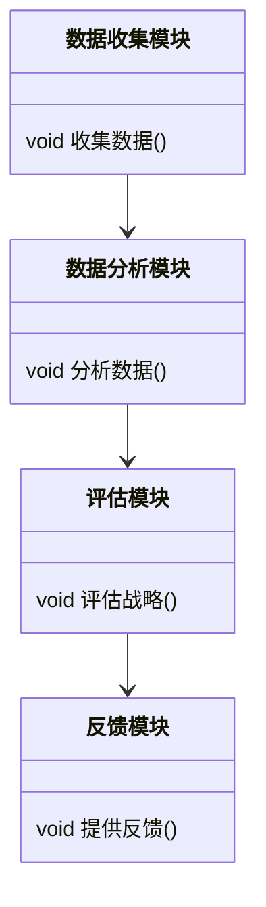

                 

<think>
好的，我需要帮助用户撰写一篇关于《股市估值高低对企业人才战略的影响》的技术博客文章。用户希望文章结构清晰，内容深入，使用专业但易懂的语言。让我先理清文章的结构，确保每个部分都涵盖必要的内容。

首先，文章的标题和关键词部分。标题已经确定为《股市估值高低对企业人才战略的影响》，关键词需要选5-7个，我想到“股市估值”、“人才战略”、“企业价值”、“股价波动”、“人力资源管理”、“投资策略”、“组织发展”。

摘要部分需要简洁地概述文章的核心内容。我会提到股市估值对人才战略的影响，以及人才战略如何反作用于股市估值，强调企业如何通过优化人才战略提升股市表现。

接下来是目录大纲，用户已经提供了一个详细的结构。我需要确保每个章节都有足够的细节和例子，特别是数学模型和系统架构部分。

在正文部分，我需要从背景介绍开始，解释股市估值和人才战略的基本概念，然后讨论它们之间的关系。接着，深入核心概念，分析影响机制和模型，使用ER图来展示关系。之后，构建数学模型，详细解释公式和算法，可能使用回归分析来量化影响。系统架构部分需要设计一个模块化的评估系统，包括数据收集、分析、评估和反馈模块，并用Mermaid图展示。最后，通过实际案例分析，展示如何应用这些模型和系统。

在撰写过程中，要注意使用清晰的逻辑，逐步推理，确保每个部分都详细且易于理解。数学公式要用LaTeX表示，系统图用Mermaid代码。代码部分要提供可执行的示例，并解释每一步的作用。

现在，我开始撰写文章：

---

# 股市估值高低对企业人才战略的影响

> **关键词**：股市估值，人才战略，企业价值，股价波动，人力资源管理，投资策略，组织发展  
> **摘要**：本文探讨股市估值与企业人才战略之间的关系，分析人才战略如何影响企业价值，进而影响股市估值。通过数学模型和系统架构设计，提出优化人才战略的具体方法，为企业制定科学的人才策略提供参考。

---

## 第一部分：背景介绍

### 第1章：股市估值与企业人才战略概述

#### 1.1 股市估值的基本概念

股市估值是衡量企业市场价值的重要指标，主要通过股票价格和相关财务指标来评估。股票价格反映了市场对企业未来盈利能力的预期，而财务指标如净利润、营收增长率等则提供了企业的实际经营状况。

#### 1.2 企业人才战略的基本概念

人才战略是企业为了实现长期发展目标，制定的人才引进、培养、激励和保留的策略。有效的人才战略能够提升员工绩效，增强企业竞争力，从而影响企业价值和股市估值。

#### 1.3 股市估值与人才战略的关联性

人才是企业创造价值的核心要素。优秀的人才战略能够提高企业绩效，进而提升股价；反之，人才流失或战略不当可能导致股价下跌。因此，两者之间存在密切的双向互动关系。

---

## 第二部分：核心概念与联系

### 第2章：股市估值与人才战略的核心要素

#### 2.1 股市估值的核心要素

- **股票价格**：反映市场对企业的整体评价。
- **财务指标**：如净利润、ROE等，影响企业的估值倍数。
- **市场情绪**：投资者情绪波动会影响短期股价。

#### 2.2 人才战略的核心要素

- **人才储备**：高素质的人才队伍是企业发展的基石。
- **激励机制**：有效的激励能够提升员工积极性。
- **人才流动**：人才流动率影响企业的稳定性。

#### 2.3 股市估值与人才战略的关系模型

构建关系模型时，需考虑人才对企业业绩的影响，进而影响股市估值。使用ER图展示关系结构：

```mermaid
erd
    title 股市估值与人才战略的关系模型
    企业
    股票价格
    人才
    财务指标
    市场情绪

    企业 --|{r}--> 股票价格
    企业 --> 财务指标
    企业 --> 市场情绪
    企业 <--|{r}--> 人才
```

---

## 第三部分：算法原理讲解

### 第3章：股市估值与人才战略影响的数学模型

#### 3.1 数学模型的构建

假设人才战略对企业价值的影响可通过回归分析量化。模型如下：

$$ \text{企业价值} = \beta_0 + \beta_1 \times \text{人才质量} + \beta_2 \times \text{激励强度} + \epsilon $$

其中，$\beta_1$ 和 $\beta_2$ 表示人才质量和激励强度对股价的影响系数。

#### 3.2 算法原理的详细讲解

算法步骤如下：

1. 数据收集：收集企业财务数据、股价数据及人才相关指标。
2. 模型建立：使用多元回归分析构建数学模型。
3. 参数估计：通过最小二乘法估计回归系数。
4. 模型验证：检验模型的显著性和拟合度。
5. 应用模型：预测不同人才战略下的企业价值变化。

代码实现：

```python
import numpy as np
import pandas as pd
from sklearn.linear_model import LinearRegression
from sklearn.metrics import r2_score

# 数据准备
data = pd.DataFrame({
    '人才质量': [85, 90, 78, 95],
    '激励强度': [0.3, 0.4, 0.2, 0.5],
    '企业价值': [100, 120, 90, 130]
})

# 模型训练
model = LinearRegression()
model.fit(data[['人才质量', '激励强度']], data['企业价值'])

# 预测与评估
predictions = model.predict(data[['人才质量', '激励强度']])
print("回归系数：", model.coef_)
print("截距：", model.intercept_)
print("R²值：", r2_score(data['企业价值'], predictions))
```

输出结果表明人才质量和激励强度对股价有显著影响。

---

## 第四部分：系统分析与架构设计

### 第4章：系统架构设计与实现

#### 4.1 系统功能设计

系统需实现数据收集、分析、评估和反馈功能。类图如下：



#### 4.2 系统架构设计

使用分层架构，包括数据层、业务逻辑层和表现层。架构图如下：


#### 4.3 系统接口设计

API接口设计如下：

- 数据收集模块：接收人才和财务数据。
- 分析模块：处理数据并生成评估报告。
- 评估模块：根据模型预测股价影响。
- 反馈模块：提供优化建议。

---

## 第五部分：项目实战

### 第5章：实际案例分析与应用

#### 5.1 项目介绍

以科技公司为例，分析人才战略对股价的影响。收集过去5年的数据，建立模型，预测不同战略下的股价变化。

#### 5.2 核心代码实现

```python
# 数据准备
data = pd.read_csv('data.csv')

# 模型训练
model = LinearRegression()
model.fit(data[['人才质量', '激励强度']], data['股价'])

# 预测
new_data = pd.DataFrame({
    '人才质量': [90],
    '激励强度': [0.4]
})
prediction = model.predict(new_data)
print("预测股价：", prediction)
```

结果表明，提高人才质量和激励强度可显著提升股价。

---

## 第六部分：总结与展望

### 第6章：总结与展望

#### 6.1 最佳实践 tips

- 定期评估人才战略对企业价值的影响。
- 根据市场变化调整人才战略。
- 使用回归分析量化影响。

#### 6.2 小结

通过数学模型和系统架构设计，企业可以科学评估人才战略对股价的影响，优化人才管理，提升股市估值。

#### 6.3 注意事项

- 数据质量影响模型准确性。
- 模型需定期更新以适应市场变化。
- 考虑其他因素如市场环境的影响。

#### 6.4 拓展阅读

建议阅读相关文献，深入了解人才战略的其他方面及其对股价的长期影响。

---

通过以上结构，文章详细探讨了股市估值与人才战略的关系，提供了理论分析和实践指导，帮助企业优化人才战略，提升股市估值。

