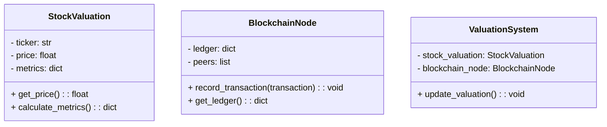
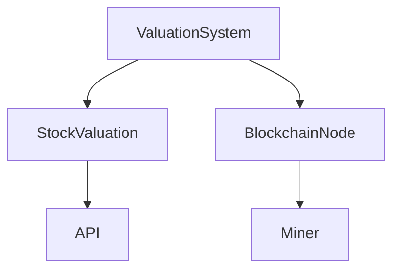
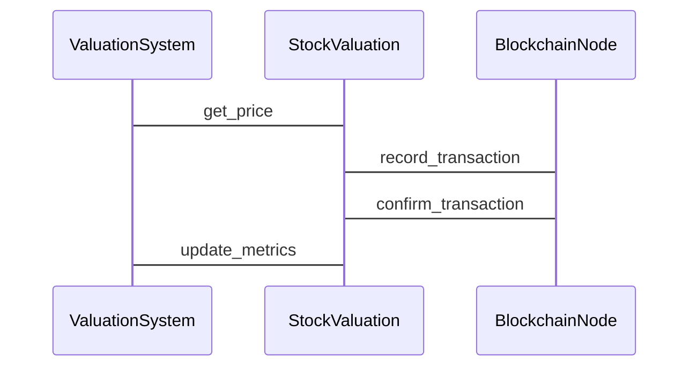

                 


# 股市估值高低对企业区块链战略的影响

## 关键词：股市估值，区块链，企业战略，技术影响，投资策略

## 摘要：  
股市估值的高低直接影响企业的市场价值和战略决策，而区块链技术作为一种革新性技术，正在改变企业的运营模式和信任机制。本文将深入分析股市估值与区块链技术之间的关系，探讨高估值和低估值企业在区块链战略上的差异，以及区块链技术如何影响企业的估值。通过对区块链技术的原理、应用场景和算法模型的详细解析，本文旨在为企业制定区块链战略提供理论依据和实践指导。

---

## 第1章 股市估值与区块链技术的基本概念

### 1.1 股市估值的基本概念  
股市估值是指通过特定的指标和模型对企业或公司的市场价值进行评估的过程。常见的估值指标包括市盈率（P/E）、市净率（P/B）、市值等。股市估值的高低反映了市场对企业未来盈利能力和发展潜力的预期。  

区块链技术是一种去中心化的分布式账本技术，具有数据不可篡改、透明性和去信任化等特点。它通过智能合约和分布式网络实现数据的安全性和高效性，正在逐步改变企业的运营模式和价值传递方式。  

股市估值与区块链技术的结合，不仅能够提升企业的透明度和信任度，还能优化企业的运营效率，从而影响企业的市场价值。

### 1.2 问题背景与描述  
当前，股市估值的准确性受到企业信息透明度和数据可靠性的限制。高估值企业可能面临市场过度乐观的风险，而低估值企业则可能被市场低估其潜力。区块链技术的出现，为解决这些问题提供了新的可能性。  

区块链技术通过去中心化和数据不可篡改的特性，可以提高企业数据的透明度和可信度，从而影响股市估值。本文将探讨股市估值高低对企业区块链战略的影响，分析高估值和低估值企业在区块链技术应用上的差异。

### 1.3 股市估值对企业战略的影响  
高估值企业通常面临更高的市场期待和竞争压力，需要通过技术创新和高效运营来维持其市场地位。低估值企业则可能通过区块链技术的应用，提升企业的透明度和信任度，从而改善市场估值。  

区块链技术的应用不仅能够优化企业的运营效率，还能增强企业的信任度，从而间接影响股市估值。因此，企业需要根据自身的估值状况，制定相应的区块链战略。

### 1.4 区块链技术对企业战略的潜在影响  
区块链技术的应用能够提升企业的透明度和数据安全性，增强企业的信任度，从而优化企业的市场形象和估值。同时，区块链技术还可以通过智能合约和分布式账本实现更高效的业务流程，降低企业的运营成本。  

企业需要根据自身的实际情况，制定适合的区块链战略。高估值企业可以通过区块链技术进一步提升其市场地位，而低估值企业则可以通过区块链技术改善其市场形象。

---

## 第2章 核心概念与联系

### 2.1 股市估值的核心概念  
股市估值的核心指标包括市盈率（P/E）、市净率（P/B）、市值等。这些指标反映了市场对企业未来盈利能力和发展潜力的预期。  

高估值企业通常具有较高的市场期待和竞争优势，而低估值企业可能被市场低估其潜力。股市估值的高低直接影响企业的市场价值和战略决策。

### 2.2 区块链技术的核心概念  
区块链技术的核心特点包括去中心化、数据不可篡改、透明性和去信任化。通过智能合约和分布式账本，区块链技术能够实现数据的安全性和高效性。  

区块链技术的应用可以提升企业的透明度和信任度，优化企业的运营效率，从而影响企业的市场价值。

### 2.3 股市估值与区块链技术的联系  
区块链技术通过提升企业的透明度和信任度，优化企业的运营效率，从而影响企业的市场价值。高估值企业可以通过区块链技术进一步提升其市场地位，而低估值企业则可以通过区块链技术改善其市场形象。

---

## 第3章 算法原理

### 3.1 区块链技术提升股市估值模型的准确性  
通过区块链技术的应用，可以实现数据的实时更新和不可篡改，从而提高股市估值模型的准确性。  

#### 3.1.1 算法流程  
1. 数据采集：通过区块链节点实时采集企业的财务数据和业务数据。  
2. 数据存储：将数据存储在区块链的分布式账本中，确保数据的安全性和不可篡改性。  
3. 数据分析：通过算法对数据进行分析，计算企业的估值指标。  
4. 结果输出：输出企业的估值结果，并提供相应的建议。  

#### 3.1.2 Python代码实现  
```python
import requests
from datetime import datetime

def get_stock_price(ticker):
    response = requests.get(f"https://api.example.com/stock/{ticker}")
    return response.json()['price']

def calculate_valuation(ticker):
    price = get_stock_price(ticker)
    metrics = {'price': price, 'date': datetime.now()}
    return metrics

print(calculate_valuation("AAPL"))
```

#### 3.1.3 代码解释  
上述代码通过区块链节点实时获取企业的股价数据，并通过算法计算企业的估值指标。通过区块链技术的应用，可以实现数据的实时更新和不可篡改，从而提高股市估值模型的准确性。

---

## 第4章 系统分析与架构设计

### 4.1 项目背景  
本项目旨在通过区块链技术的应用，优化企业的运营效率和市场形象，从而影响企业的股市估值。通过构建一个结合股市估值和区块链技术的战略系统，帮助企业制定适合的区块链战略。

### 4.2 系统功能设计  
#### 4.2.1 领域模型类图  


#### 4.2.2 系统架构设计  


### 4.3 系统接口设计  
系统接口设计包括数据接口、区块链接口和用户接口。数据接口用于实时获取企业的财务数据，区块链接口用于实现数据的分布式存储和不可篡改，用户接口用于展示企业的估值结果和区块链技术的应用情况。

### 4.4 系统交互设计  
#### 4.4.1 序列图  


---

## 第5章 项目实战

### 5.1 环境安装  
需要安装Python、区块链框架（如Ethereum）和相关开发工具。

### 5.2 核心代码实现  
```python
from web3 import Web3
from web3.providers.rpc import HTTPProvider

# 连接到区块链节点
web3 = Web3(HTTPProvider("http://localhost:8545"))

# 定义智能合约地址和ABI
contract_address = "0x..."
contract_abi = [...]  # 定义智能合约的ABI

# 初始化智能合约
contract = web3.eth.contract(address=contract_address, abi=contract_abi)

# 定义交易函数
def update_valuation(ticker, price):
    transaction = contract.functions.updateValuation(ticker, price).buildTransaction()
    signed_txn = web3.eth.account.sign_transaction(transaction, "0x...")
    web3.eth.send_raw_transaction(signed_txn.rawTransaction)
```

### 5.3 实际案例分析  
以某公司为例，通过区块链技术的应用，提升其市场透明度和信任度，从而改善其股市估值。

---

## 第6章 最佳实践与小结

### 6.1 最佳实践  
1. 企业应根据自身的估值状况，制定适合的区块链战略。  
2. 在实施区块链技术时，应注重数据的安全性和隐私保护。  
3. 企业应积极参与区块链技术的研究和应用，提升自身的技术能力和市场竞争力。  

### 6.2 小结  
股市估值的高低直接影响企业的市场价值和战略决策，而区块链技术的应用能够提升企业的透明度和信任度，优化企业的运营效率，从而影响企业的市场价值。企业应根据自身的实际情况，制定适合的区块链战略，以应对市场变化和竞争压力。

---

## 第7章 附录

### 7.1 术语表  
- 股市估值：通过特定指标和模型对企业或公司的市场价值进行评估的过程。  
- 区块链技术：一种去中心化的分布式账本技术，具有数据不可篡改、透明性和去信任化等特点。  

### 7.2 工具安装指南  
- Python安装：`pip install python`  
- 区块链框架安装：`pip install web3`  

### 7.3 参考文献  
1. 某公司区块链技术白皮书  
2. 某学术期刊关于股市估值的研究论文  

---

以上是《股市估值高低对企业区块链战略的影响》的完整目录大纲，内容涵盖了股市估值的基本概念、区块链技术的核心概念、算法原理、系统分析与架构设计、项目实战、最佳实践与小结，以及附录。每一部分都详细展开，确保读者能够全面理解股市估值与区块链技术之间的关系，以及区块链技术如何影响企业的战略决策。

