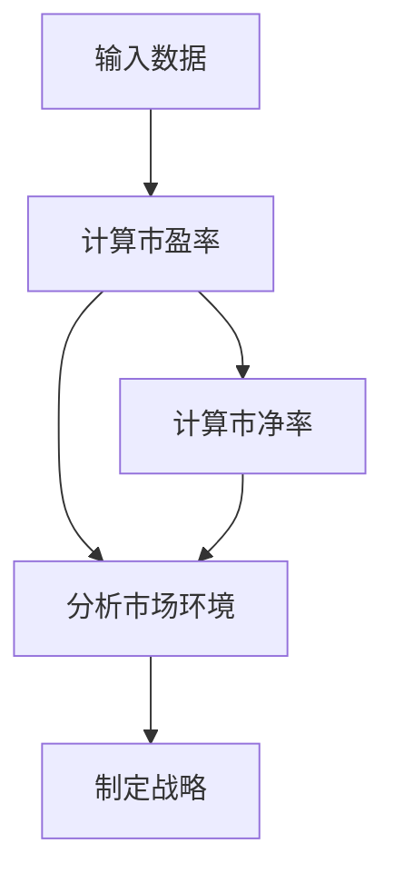

                 


---

# 股市估值高低对企业国际化战略的影响

> 关键词：股市估值、企业国际化、战略决策、数据驱动、量化模型

> 摘要：本文探讨股市估值的高低对企业国际化战略的影响，分析高市盈率和低市盈率下的不同战略选择，结合数据科学方法，建立量化模型，提出企业应对策略。通过实际案例分析，为读者提供清晰的思路和决策支持。

---

## 第1章 引言

### 1.1 背景介绍

股市估值是企业在国际市场上的重要指标，直接影响企业的融资能力、市场形象和投资决策。企业国际化战略则需要根据股市估值的变化，灵活调整扩张节奏和方向。本文将从理论和实践两方面，探讨股市估值对企业国际化战略的影响。

---

## 第2章 股市估值的核心概念与计算方法

### 2.1 股市估值的定义与计算方法

股市估值是衡量企业价值的重要指标，常用的指标包括：

- **市盈率（P/E）**：股价与每股收益的比率。
  $$ P/E = \frac{\text{股价}}{\text{每股收益}} $$
- **市净率（P/B）**：股价与每股净资产的比率。
  $$ P/B = \frac{\text{股价}}{\text{每股净资产}} $$
- **EV/EBITDA**：企业价值与息税折旧及摊销前利润的比率。
  $$ EV/EBITDA = \frac{\text{企业价值}}{\text{EBITDA}} $$

### 2.2 企业国际化战略的定义与特征

企业国际化战略是指企业在全球范围内扩展业务，进入新市场、并购或合作的策略。其特征包括全球化、本地化和风险管理。

### 2.3 股市估值与企业国际化战略的关系

股市估值影响企业的融资能力、市场信心和投资决策，从而间接或直接影响国际化战略的制定与实施。

---

## 第3章 股市估值对企业国际化战略的影响机制

### 3.1 股市估值波动对企业国际化战略的短期影响

股市估值的短期波动会影响企业的资金流动和市场信心：

1. **资金流动**：高市盈率可能导致资金流入，为企业提供更多融资机会。
2. **投资决策**：低市净率可能引发投资者对企业价值的重新评估，影响企业投资决策。

### 3.2 股市估值对企业国际化战略的长期影响

长期来看，股市估值的变化推动企业国际化进程：

1. **国际化进程**：高市盈率推动企业加快国际化扩张。
2. **风险预警**：低市盈率可能提示国际化中的潜在风险。

---

## 第4章 企业国际化战略的制定与实施

### 4.1 制定国际化战略的步骤

1. **确定目标市场**：选择适合企业发展的国际市场。
2. **分析竞争环境**：评估目标市场的竞争格局。
3. **制定具体策略**：包括市场进入方式、并购策略等。

### 4.2 实施国际化战略的方法

1. **市场进入策略**：直接投资、特许经营等方式。
2. **跨国并购**：通过并购快速进入新市场。
3. **全球化品牌管理**：统一品牌形象，适应当地文化。

---

## 第5章 案例分析：股市估值对企业国际化战略的影响

### 5.1 案例背景

以某科技公司为例，分析其在高市盈率下的国际化扩张策略。

### 5.2 数据分析

通过市盈率和市净率的对比，发现高市盈率下企业选择快速扩张，而低市盈率下则注重成本控制。

### 5.3 战略调整

根据股市估值的变化，调整市场进入方式和投资力度。

---

## 第6章 系统架构与算法设计

### 6.1 系统架构设计

设计一个量化模型，用于分析股市估值与国际化战略的关系：

1. **数据输入**：收集企业的财务数据和市场数据。
2. **模型计算**：计算市盈率、市净率等指标。
3. **决策输出**：根据估值结果，制定国际化战略。

### 6.2 算法流程图



---

## 第7章 项目实战与代码实现

### 7.1 环境安装

安装Python和相关库（Pandas、Matplotlib）。

### 7.2 核心代码实现

```python
import pandas as pd
import matplotlib.pyplot as plt

# 示例数据
data = {
    '公司': ['A', 'B', 'C'],
    '股价': [100, 80, 120],
    '每股收益': [20, 30, 10]
}

df = pd.DataFrame(data)

# 计算市盈率
df['市盈率'] = df['股价'] / df['每股收益']

print(df)
```

### 7.3 代码解读

上述代码计算了市盈率，帮助企业评估市场估值情况，从而制定国际化战略。

---

## 第8章 总结与展望

### 8.1 研究总结

股市估值对企业国际化战略的影响不容忽视，企业需根据估值变化灵活调整策略。

### 8.2 未来展望

未来可结合机器学习模型，进一步优化估值分析和战略决策。

---

## 关注事项

- 数据来源的可靠性
- 模型的适用性
- 算法的可解释性

---

通过本文的分析，企业可以更好地理解股市估值对其国际化战略的影响，做出更科学的决策。

