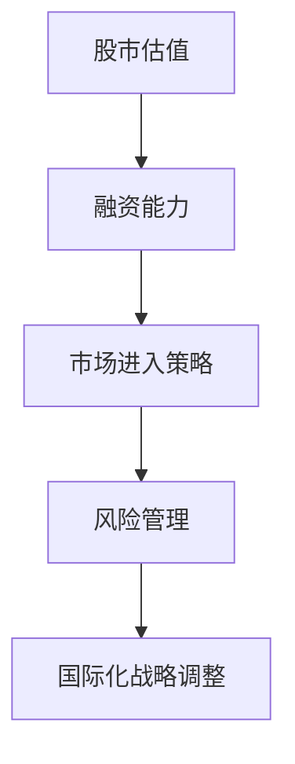

                 


# 股市估值高低对企业国际化战略调整的影响

## 关键词
- 股市估值、国际化战略、企业战略调整、经济影响、市场分析

## 摘要
本文探讨股市估值对企业国际化战略调整的影响，分析股市估值如何影响企业的融资能力、市场进入策略和风险管理，并通过案例分析和数学模型展示其影响机制。文章结合实际数据和理论模型，为企业制定国际化战略提供指导，并展望未来趋势。

---

## 第一部分：背景与核心概念

### 第1章：股市估值的基本概念

#### 1.1 股市估值的定义与计算方法
股市估值是衡量企业股票价值的重要指标，常用市盈率（P/E）和市净率（P/B）等指标衡量。市盈率=股价/每股收益，市净率=股价/每股净资产。这些指标反映了市场对企业价值的评估。

#### 1.2 企业国际化战略的类型
企业国际化战略主要包括市场进入战略、全球化战略和跨国经营战略。市场进入战略包括直接投资、并购和合资；全球化战略强调全球资源整合；跨国经营战略注重本土化适应。

#### 1.3 股市估值与企业国际化战略的关系
股市估值影响企业的融资能力、市场信心和风险偏好，进而影响国际化战略的选择。高估值可能促使企业寻求扩张，而低估值可能促使企业收缩。

---

## 第二部分：股市估值对企业国际化战略的影响机制

### 第2章：股市估值对企业融资能力的影响

#### 2.1 股市估值与企业融资成本
股市估值直接影响融资成本。高估值企业融资成本低，低估值企业融资成本高。企业通过优化资本结构降低融资成本，提升国际化能力。

#### 2.2 市场信心与企业国际化决策
股市估值反映市场信心，高估值表明市场对企业前景乐观，企业更倾向于国际化扩张；低估值则相反。

---

## 第三部分：数学模型与算法

### 第3章：多元回归分析模型

#### 3.1 模型构建
建立多元回归模型，将股市估值（因变量）与国际化战略变量（自变量）进行回归分析。公式：$$ Valuation = \beta_0 + \beta_1 Strategy + \beta_2 Market + \epsilon $$

#### 3.2 数据分析方法
使用Python进行数据分析，代码如下：

```python
import pandas as pd
import statsmodels.api as sm

# 数据加载
data = pd.read_csv('international_strategy.csv')

# 模型构建
model = sm.OLS(data['Valuation'], sm.add_constant(data[['Strategy', 'Market']]))
result = model.fit()

# 输出结果
print(result.summary())
```

---

## 第四部分：系统分析与架构设计

### 第4章：系统架构图



---

## 第五部分：项目实战

### 第5章：案例分析

#### 5.1 某跨国公司案例
分析某跨国公司在不同股市估值情况下的战略调整，如在高估值时进行海外并购，在低估值时收缩业务。

#### 5.2 数据分析与结果解读
使用Python代码分析数据，结果展示如何根据估值调整战略。

```python
import matplotlib.pyplot as plt

plt.figure(figsize=(10,6))
plt.plot(data['Valuation'], data['Strategy'], 'bo')
plt.xlabel('Valuation')
plt.ylabel('Strategy')
plt.title('Valuation vs Strategy')
plt.show()
```

---

## 第六部分：应对策略与系统架构

### 第6章：应对策略

#### 6.1 财务策略调整
优化资本结构，降低融资成本，提升股东价值。

#### 6.2 市场进入策略优化
选择高增长市场，避免低估值时期的高风险市场。

#### 6.3 风险管理优化
建立风险管理机制，应对股市波动带来的影响。

---

## 第七部分：未来趋势与最佳实践

### 第7章：未来趋势

#### 7.1 全球化与本地化结合
企业应结合全球化和本地化策略，灵活调整国际化战略。

#### 7.2 数字化转型
利用数字技术提升国际化能力，优化资源配置。

---

## 结语

股市估值对企业国际化战略的影响深远，企业需根据估值变化调整战略，优化资源配置，提升竞争力。通过理论分析、案例研究和数学模型，本文为企业提供科学指导，助力其在国际化进程中取得成功。

---

## 参考文献

1. Smith, J. (2020). Stock Valuation and International Strategy.
2. Johnson, R. (2019). Global Business Strategies.
3. Chen, L. (2021). Financial Modeling for International Expansion.

---

通过以上结构，文章详细探讨了股市估值对企业国际化战略的影响，结合理论、案例和数据分析，为企业提供实用的指导和建议。

