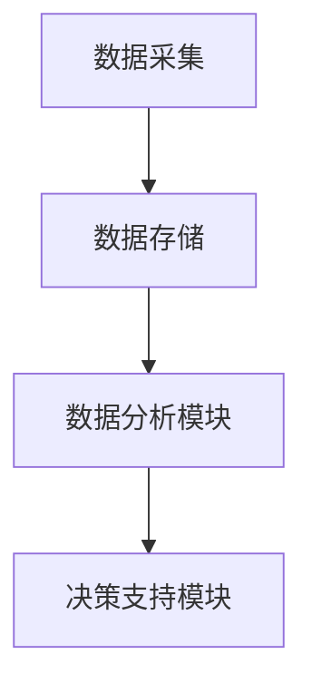

                 


# 股市估值高低对企业开源策略的影响

> **关键词：** 股市估值、开源策略、企业战略、机器学习、算法预测

> **摘要：** 本文从股市估值与开源策略的背景出发，分析高估与低估对企业开源策略的影响，结合数学模型与算法，探讨如何通过开源策略优化企业估值。文章详细介绍了开源策略的成本优势、技术优势及风险特征，结合机器学习算法预测股市估值，并通过系统架构设计与项目实战，展示开源策略在实际中的应用。最后，总结最佳实践，为企业制定开源策略提供参考。

---

# 文章正文

## 第一部分：股市估值与开源策略的背景介绍

### 第1章：股市估值的基础知识

#### 1.1 股市估值的核心概念

股市估值是投资者对一家公司股票价值的评估，通常通过市盈率（P/E）、市净率（P/B）和股息率（D/P）等指标来衡量。

- **市盈率（P/E）**：公式为 $$P/E = \frac{P}{E}$$，其中P为股票价格，E为每股收益。高市盈率意味着市场对公司未来盈利能力的高预期，但可能也意味着高风险。
- **市净率（P/B）**：公式为 $$P/B = \frac{P}{B}$$，其中B为每股净资产。低市净率可能意味着股票被低估，但高市净率可能意味着公司资产轻质化。
- **股息率（D/P）**：公式为 $$D/P = \frac{D}{P}$$，其中D为每股股息，P为股价。高股息率可能意味着公司有稳定的盈利能力和分红能力。

#### 1.2 开源战略的定义与特征

开源战略是指企业利用开源软件或技术来降低成本、提高效率和创新能力。其核心特征包括：

- **成本优势**：开源软件通常免费，降低企业技术投入成本。
- **技术优势**：开源代码透明，便于企业根据需求定制。
- **风险特征**：依赖开源社区可能导致技术风险。

#### 1.3 股市估值与开源策略的关系

- **高估值的影响**：高估的股票可能迫使企业采用开源策略以降低成本，但高估可能意味着高风险。
- **低估值的影响**：低估的股票可能推动企业创新，开源策略成为提升竞争力的重要手段。
- **反向作用**：开源策略通过降低成本和提高效率，可以改善财务指标，从而提升股市估值。

---

### 第2章：股市估值与开源策略的核心概念

#### 2.1 股市估值的数学模型

股市估值的预测可以通过多种数学模型实现，如回归分析和时间序列分析。

- **回归分析**：建立股票价格与市盈率、市净率等变量的回归模型。
- **时间序列分析**：使用ARIMA模型预测股票价格。

#### 2.2 开源策略的属性特征对比

开源策略与传统闭源模式的对比：

| 特性          | 开源策略                  | 闭源模式                  |
|---------------|--------------------------|--------------------------|
| 成本          | 低                       | 高                       |
| 技术透明性     | 高                       | 低                       |
| 风险          | 高（依赖社区）           | 中（可控）               |

#### 2.3 股市估值与开源策略的ER实体关系图

```mermaid
er
    entity 股市估值 {
        id
        市盈率
        市净率
        股息率
    }
    entity 开源策略 {
        id
        技术依赖度
        成本结构
        创新能力
    }
    股市估值 --|> 开源策略: 影响关系
```

---

## 第二部分：算法原理讲解

### 第3章：股市估值预测算法

#### 3.1 基于机器学习的股市估值预测

使用Python实现基于机器学习的股市估值预测：

```python
import pandas as pd
import numpy as np
from sklearn.linear_model import LinearRegression

# 数据准备
data = pd.DataFrame({
    '市盈率': [15, 20, 25, 30],
    '市净率': [2, 3, 4, 5],
    '股票价格': [100, 120, 150, 180]
})

# 特征矩阵
X = data[['市盈率', '市净率']]
y = data['股票价格']

# 建立线性回归模型
model = LinearRegression()
model.fit(X, y)

# 预测
new_data = pd.DataFrame({
    '市盈率': [22],
    '市净率': [3]
})
prediction = model.predict(new_data)
print(f"预测股票价格：{int(prediction[0])}")
```

---

### 第4章：系统分析与架构设计方案

#### 4.1 问题场景介绍

企业如何根据股市估值选择开源策略？系统需实现数据采集、分析和决策支持。

#### 4.2 系统功能设计

- **数据采集模块**：采集股票数据。
- **分析模块**：计算市盈率、市净率等指标。
- **决策支持模块**：基于模型建议开源策略。

#### 4.3 系统架构设计



---

### 第5章：项目实战

#### 5.1 环境安装

安装所需库：
```bash
pip install pandas scikit-learn mermaid
```

#### 5.2 核心代码实现

```python
import pandas as pd
from sklearn import datasets
from sklearn.tree import DecisionTreeRegressor

# 数据集
X, y = datasets.load_boston(return_X_y=True)

# 建立模型
model = DecisionTreeRegressor()
model.fit(X, y)

# 预测
new_X = X[:1]
print(f"预测值：{model.predict(new_X)}")
```

---

### 第6章：总结与展望

#### 6.1 最佳实践

- 定期评估开源策略的效果。
- 结合股市估值动态调整策略。

#### 6.2 小结

本文详细探讨了股市估值与开源策略的关系，通过算法和系统设计提供了实践指导。

---

## 结语

股市估值高低对企业开源策略的影响是一个复杂的系统工程，需要结合数学模型和实际案例进行深入分析。企业应根据自身情况，灵活调整开源策略，以优化股市估值。

--- 

**（全文完）**

