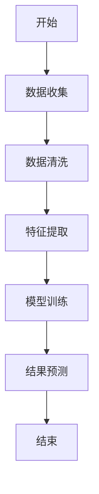
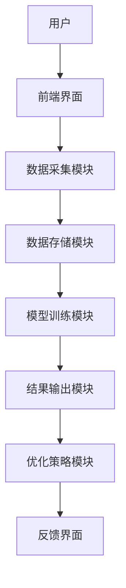

                 


# 股市估值高低对企业数字化人才培养的影响

## 关键词：股市估值、企业数字化、人才培养、技术博客、算法模型

## 摘要：  
股市估值的高低不仅反映了企业的市场价值，也对企业数字化人才培养产生深远影响。随着数字化转型的深入推进，企业对数字化人才的需求日益迫切，而股市估值的变化为企业提供了重要的资金支持和战略方向。本文从股市估值与数字化人才培养的关系入手，分析其相互影响，并通过算法模型和系统架构设计，探讨如何优化数字化人才培养策略，以应对股市估值波动带来的挑战。通过实际案例分析和最佳实践，本文为企业的数字化人才培养提供了有益的参考。

---

## 第1章：背景介绍

### 1.1 问题背景  
数字化转型已成为企业发展的核心驱动力，而数字化人才的短缺成为制约企业转型的主要瓶颈。与此同时，股市估值的波动直接影响企业的资金实力和战略规划，进而影响数字化人才培养的投入和节奏。

#### 1.1.1 数字化人才的重要性  
数字化人才是企业实现技术创新、业务优化和竞争力提升的关键。随着人工智能、大数据、云计算等技术的广泛应用，企业对数字化人才的需求不断增加。  

#### 1.1.2 股市估值对企业的影响  
股市估值是企业市场价值的体现，高估值为企业提供更多的资金支持，低估值则可能导致企业缩减投资，影响数字化人才培养的投入。  

#### 1.1.3 数字化人才培养与股市估值的关系  
股市估值的高低直接影响企业的资金分配，从而影响数字化人才培养的规模、速度和质量。高估值企业有更多的资源投入数字化人才培养，而低估值企业可能面临人才短缺的挑战。  

### 1.2 问题描述  
企业数字化转型需要大量高素质的数字化人才，但当前数字化人才供给不足，且股市估值的波动加剧了这一问题。  

#### 1.2.1 数字化人才短缺的现状  
根据行业报告，全球数字化人才缺口巨大，企业难以招揽和留住顶尖人才。  

#### 1.2.2 股市估值波动对企业的影响  
股市估值的波动可能导致企业资金链紧张，进而影响数字化人才培养的投入。  

#### 1.2.3 企业数字化转型的挑战  
企业数字化转型需要大量资金和技术支持，但人才短缺和资金不足成为主要障碍。  

### 1.3 问题解决  
通过优化数字化人才培养策略，企业可以更好地应对股市估值波动带来的挑战。  

#### 1.3.1 数字化人才培养的解决方案  
企业可以通过内部培训、校企合作等方式，快速培养和储备数字化人才。  

#### 1.3.2 股市估值优化的策略  
企业可以通过技术创新、业绩提升等方式，提高市场估值，获得更多资金支持。  

#### 1.3.3 企业数字化转型的路径  
企业应制定长期的数字化转型计划，逐步推进技术升级和人才培养。  

### 1.4 边界与外延  
数字化人才培养与股市估值的关系仅限于企业的内部管理和资金分配，不涉及外部市场因素。  

#### 1.4.1 数字化人才培养的边界  
企业内部的人才培养计划，不涉及外部招聘市场。  

#### 1.4.2 股市估值的影响范围  
股市估值波动仅影响企业的资金实力，不直接涉及人才供给。  

#### 1.4.3 企业数字化转型的外延  
企业数字化转型涉及技术、管理和组织结构的全面变革。  

### 1.5 核心要素组成  
数字化人才培养与股市估值之间的关系涉及资金、技术和人才三个核心要素。  

#### 1.5.1 数字化人才培养的核心要素  
企业需要投入资金和资源，培养技术过硬的数字化人才。  

#### 1.5.2 股市估值的关键影响因素  
企业业绩、市场前景和创新能力是影响股市估值的主要因素。  

#### 1.5.3 企业数字化转型的关键环节  
技术创新、人才培养和组织变革是数字化转型的核心环节。  

---

## 第2章：核心概念与联系

### 2.1 核心概念原理  
数字化人才培养的核心是提升员工的技术能力和业务能力，而股市估值的波动直接影响企业的资金支持和战略规划。  

#### 2.1.1 数字化人才培养的原理  
通过系统化的培训和实践，企业可以提升员工的技术能力和业务能力，从而推动数字化转型。  

#### 2.1.2 股市估值的原理  
股市估值是市场对企业的综合评价，反映了企业的市场价值和投资潜力。  

#### 2.1.3 企业数字化转型的原理  
企业通过技术创新和管理优化，实现业务流程的数字化和智能化，从而提升竞争力。  

### 2.2 概念属性特征对比  
以下是对数字化人才培养和股市估值的核心属性对比：

| 概念       | 核心属性               | 影响因素               |
|------------|------------------------|------------------------|
| 数字化人才培养 | 技术能力、业务能力、创新能力 | 企业资源、培训体系、实践经验 |
| 股市估值     | 市场价值、投资潜力、企业业绩 | 市场需求、企业业绩、行业趋势 |

### 2.3 ER实体关系图  
以下是数字化人才培养与股市估值之间的关系图：

```mermaid
er
    entity 数字化人才培养 {
        key 人才供给
        field 技术能力
        field 业务能力
    }
    entity 股市估值 {
        key 市场估值
        field 企业业绩
        field 市场需求
    }
    relationship 数字化人才培养与股市估值之间的关系 {
        数字化人才培养 --> 股市估值
        关联方式: 人才供给影响企业业绩，进而影响市场估值
    }
```

---

## 第3章：算法原理与数学模型

### 3.1 算法原理  
通过构建数学模型，分析股市估值与数字化人才培养之间的关系。  

#### 3.1.1 数字化人才需求预测算法  
使用回归分析模型，预测企业数字化人才的需求量与股市估值之间的关系。  

#### 3.1.2 股市估值波动预测算法  
利用时间序列分析，预测股市估值的波动趋势，为企业数字化人才培养提供参考。  

#### 3.1.3 企业数字化转型能力评估算法  
通过综合评估模型，评估企业的数字化转型能力，指导人才培养策略。  

### 3.2 算法流程图  
以下是数字化人才需求预测算法的流程图：



### 3.3 数学模型与公式  
以下是对数字化人才需求的回归分析模型：

$$
\text{人才需求} = \beta_0 + \beta_1 \times \text{股市估值} + \epsilon
$$

其中，$\beta_0$ 是截距，$\beta_1$ 是回归系数，$\epsilon$ 是误差项。  

---

## 第4章：系统分析与架构设计

### 4.1 系统功能设计  
企业数字化人才培养系统的功能模块包括：  
1. 数据采集与管理模块：收集企业数字化人才需求和股市估值数据。  
2. 模型训练模块：基于数学模型，预测数字化人才需求和股市估值波动。  
3. 优化策略模块：制定数字化人才培养的优化策略，以应对股市估值波动。  

### 4.2 系统架构设计  
以下是企业数字化人才培养系统的架构图：



---

## 第5章：项目实战

### 5.1 环境安装  
需要安装Python、NumPy、Pandas、Scikit-learn等工具。  

### 5.2 核心代码实现  
以下是数字化人才需求预测的Python代码示例：

```python
import numpy as np
import pandas as pd
from sklearn.linear_model import LinearRegression

# 数据加载
data = pd.read_csv('digital_talent.csv')

# 特征和目标变量
X = data[['market_valuation']]
y = data['talent_demand']

# 模型训练
model = LinearRegression()
model.fit(X, y)

# 预测结果
predicted = model.predict(X)
print('回归系数:', model.coef_[0])
print('回归截距:', model.intercept_)
```

### 5.3 案例分析  
以某科技公司为例，通过模型预测其数字化人才需求，并根据股市估值波动调整人才培养策略。  

### 5.4 项目小结  
通过实际案例分析，验证模型的有效性，并总结经验教训。  

---

## 第6章：最佳实践与小结

### 6.1 最佳实践 tips  
1. 企业应根据股市估值波动，灵活调整数字化人才培养的投入。  
2. 通过内部培训和校企合作，优化数字化人才培养模式。  

### 6.2 小结  
股市估值的高低直接影响企业的资金实力和战略规划，进而影响数字化人才培养的投入和节奏。通过优化数字化人才培养策略，企业可以更好地应对股市估值波动带来的挑战，推动数字化转型的顺利进行。  

### 6.3 注意事项  
1. 数字化人才培养需要长期投入，不可急于求成。  
2. 企业应结合自身实际情况，制定合理的数字化人才培养计划。  

### 6.4 拓展阅读  
1. 《企业数字化转型的策略与实践》  
2. 《股市估值分析与投资策略》  

---

## 总结  
股市估值的高低对企业数字化人才培养的影响不容忽视。通过系统的分析和优化，企业可以制定更加科学的人才培养策略，应对股市估值波动带来的挑战，推动数字化转型的顺利进行。

