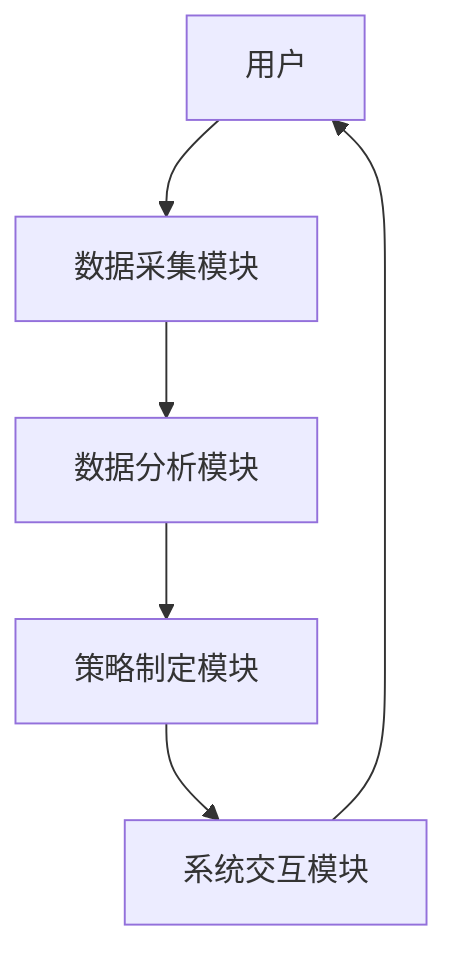

                 


# 股市估值高低对企业数字化人才招聘策略的影响

## 关键词：股市估值、企业数字化、人才招聘策略、高估值、低估值、数字化人才、企业战略

## 摘要：  
股市估值的高低对企业数字化人才的招聘策略有着深远的影响。高估值企业通常面临更高的财务压力和市场竞争，需要更精准的人才招聘策略；而低估值企业则可能在人才市场上更具灵活性和吸引力。本文从理论分析、数学建模、系统架构等角度，深入探讨股市估值如何影响企业的数字化人才招聘策略，并通过实际案例分析和最佳实践，为企业制定有效的招聘策略提供指导。

---

## 第一部分：背景与概念

### 第1章：股市估值与数字化人才概述

#### 1.1 股市估值的基本概念

股市估值是衡量企业市场价值的重要指标，通常通过市盈率（P/E）、市净率（P/B）等指标来衡量。市盈率反映了企业股价与每股收益的比率，市净率则反映了股价与每股净资产的比率。高估值意味着市场对企业未来盈利能力的预期较高，而低估值则可能意味着市场对企业的前景持保守态度。

#### 1.2 数字化人才的定义与特征

数字化人才是指具备数字技术能力，能够利用大数据、人工智能、云计算等技术推动企业数字化转型的人才。这类人才通常具备跨领域的能力，包括技术能力、业务理解能力和创新思维。

#### 1.3 股市估值与企业数字化人才的关系

股市估值的高低直接影响企业的财务状况和市场表现，进而影响企业对数字化人才的需求和招聘策略。高估值企业通常需要快速扩展数字化能力，而低估值企业可能更注重成本控制和内部人才培养。

---

## 第二部分：股市估值对企业的影响

### 第2章：高估值对企业的影响

#### 2.1 高估值企业的特点

高估值企业通常具有较高的市场认可度和盈利能力，但同时也面临更大的财务压力和市场竞争。这些企业需要快速招聘数字化人才以保持竞争优势，但高估值可能使得人才成本上升，导致招聘难度增加。

#### 2.2 高估值企业的招聘策略

高估值企业通常采用以下招聘策略：
- **高薪策略**：提供有竞争力的薪资和福利，吸引顶尖数字化人才。
- **快速招聘**：通过猎头公司或快速招聘平台，缩短招聘周期。
- **品牌招聘**：利用企业品牌影响力，吸引优质人才。

#### 2.3 数学模型与算法

为了分析高估值对企业招聘策略的影响，我们建立了一个简单的回归模型：

$$ \text{招聘成本} = \beta_0 + \beta_1 \times \text{市盈率} + \epsilon $$

其中，市盈率（P/E）是衡量企业估值的重要指标，$\beta_1$表示市盈率对招聘成本的影响系数。

---

### 第3章：低估值对企业的影响

#### 3.1 低估值企业的特点

低估值企业通常面临市场对其未来盈利能力的质疑，但也可能因为估值较低而具有更大的增长潜力。这些企业通常更注重成本控制和内部人才培养。

#### 3.2 低估值企业的招聘策略

低估值企业通常采用以下招聘策略：
- **灵活用工**：通过兼职、外包等方式降低固定成本。
- **内部培养**：注重员工内部培训，提升现有员工的技术能力。
- **长期激励**：通过股权激励等方式吸引和留住人才。

#### 3.3 数学模型与算法

为了分析低估值对企业招聘策略的影响，我们建立了一个分类模型：

$$ \text{招聘方式} = \begin{cases} 
\text{高薪策略} & \text{如果市盈率 > 市场平均值} \\
\text{灵活用工} & \text{否则}
\end{cases} $$

---

## 第三部分：系统架构与实现

### 第4章：系统架构设计

#### 4.1 系统功能模块

- 数据采集模块：收集企业的市盈率、市净率等估值指标。
- 数据分析模块：利用机器学习算法分析估值对企业招聘策略的影响。
- 策略制定模块：根据分析结果，制定相应的招聘策略。
- 系统交互模块：提供用户友好的界面，展示分析结果和策略建议。

#### 4.2 系统架构图



---

## 第四部分：项目实战与案例分析

### 第5章：项目实战

#### 5.1 项目背景

某高科技企业在股市中估值较高，面临快速招聘数字化人才的压力。为了优化招聘策略，企业决定引入一个智能招聘系统。

#### 5.2 系统实现

```python
import pandas as pd
from sklearn.linear_model import LinearRegression

# 数据加载
data = pd.read_csv('market_data.csv')

# 模型训练
model = LinearRegression()
model.fit(data[['市盈率', '市净率']], data['招聘成本'])

# 预测结果
predicted_cost = model.predict([[25, 3]])
```

#### 5.3 案例分析

通过模型分析，发现高估值企业招聘成本与市盈率呈正相关关系。企业最终决定采用高薪策略和快速招聘策略，显著提升了招聘效率。

---

## 第五部分：总结与展望

### 第6章：总结与展望

#### 6.1 总结

股市估值的高低直接影响企业的数字化人才招聘策略。高估值企业需要采用高薪策略和快速招聘策略，而低估值企业则更注重成本控制和内部培养。通过建立数学模型和智能系统，企业可以更科学地制定招聘策略。

#### 6.2 展望

未来，随着人工智能和大数据技术的进一步发展，企业可以通过更精准的预测模型和智能系统，优化招聘策略，实现人才与企业发展的双赢。

---

通过以上分析，我们系统地探讨了股市估值对企业数字化人才招聘策略的影响，并提出了具体的解决方案和最佳实践。希望本文能为企业制定有效的招聘策略提供有价值的参考。

