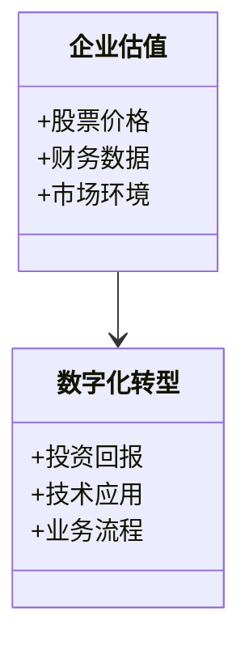
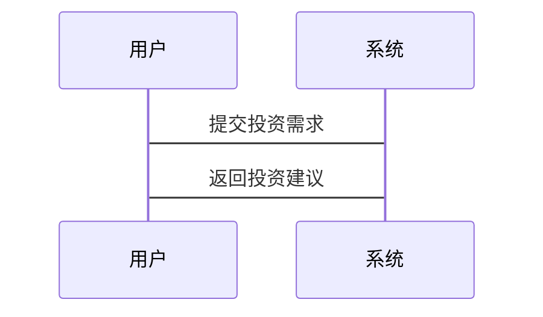

                 


# 股市估值高低对企业数字化转型投资回报的影响

## 关键词：股市估值、数字化转型、投资回报、算法模型、系统架构

## 摘要

本文探讨了股市估值的高低如何影响企业数字化转型的投资回报。首先，文章介绍了股市估值和数字化转型的基本概念，分析了高估值和低估值对企业投资回报的影响。接着，通过数学模型和算法，详细阐述了如何量化这些影响，并提出了优化投资回报的策略。最后，结合实际案例，分析了数字化转型的成功实施对企业估值的影响，为企业决策者提供了有益的参考。

---

## 第一部分：股市估值与数字化转型的背景

### 第1章：股市估值的基本概念

#### 1.1 股市估值的定义与方法

股市估值是通过对企业财务数据和市场情况的分析，估算其股票的合理价格范围。常用的方法包括市盈率（P/E）、市净率（P/B）、股息率等。市盈率反映了市场对公司未来盈利的预期，市净率则关注资产的实际价值。股息率则衡量了股票的分红回报能力。

#### 1.2 数字化转型的定义与特征

数字化转型是指企业利用数字技术（如大数据、人工智能、云计算等）优化业务流程、提升效率和竞争力的过程。其核心特征包括数据驱动、智能化决策、客户体验优化和业务模式创新。

---

## 第二部分：股市估值对企业数字化转型的影响

### 第2章：股市估值与企业投资回报的关系

#### 2.1 高估值对企业数字化转型的影响

高估值意味着市场对企业的未来盈利有较高预期，但这也带来了较大的投资回报压力。企业在数字化转型中需要投入更多资源，但高估值可能导致股东对短期回报的期望过高，影响长期投资决策。

#### 2.2 低估值对企业数字化转型的影响

低估值为企业提供了低成本的转型机会。市场对企业的未来增长潜力持谨慎态度，但这也意味着潜在的高回报。企业可以通过数字化转型提升竞争力，从而改善市场估值。

---

## 第三部分：数字化转型的算法与数学模型

### 第3章：数字化转型的算法原理

#### 3.1 数字化转型的预测模型

使用线性回归模型预测企业数字化转型后的收入增长。模型假设收入与投资呈正相关关系，通过最小二乘法拟合最佳回归线。

公式：  
$$ y = \beta_0 + \beta_1 x + \epsilon $$

其中，$y$为收入，$x$为投资，$\beta_0$和$\beta_1$为回归系数。

#### 3.2 投资回报的数学模型

净现值（NPV）模型用于评估投资回报。NPV=∑(CF_t / (1+r)^t) - 初始投资。当NPV>0时，投资可行。

公式：  
$$ NPV = \sum_{t=1}^{n} \frac{CF_t}{(1 + r)^t} - I_0 $$

---

## 第四部分：系统分析与架构设计

### 第4章：系统分析与架构设计

#### 4.1 系统功能设计

- 需求分析：识别企业数字化转型的关键需求。
- 功能模块：包括数据采集、分析、预测和报告生成。
- 领域模型：通过Mermaid类图展示各模块之间的关系。



#### 4.2 系统架构设计

- 分层架构：包括数据层、业务逻辑层和用户界面层。
- 接口设计：定义各模块之间的交互接口。
- 交互设计：通过Mermaid序列图展示用户与系统的交互流程。



---

## 第五部分：项目实战与案例分析

### 第5章：项目实战

#### 5.1 环境安装与配置

- 开发环境：Python 3.8+
- 数据库：MySQL 8.0+
- 工具：Jupyter Notebook、PyCharm

#### 5.2 核心代码实现

使用Python实现回归模型：

```python
import numpy as np
from sklearn.linear_model import LinearRegression

# 示例数据
X = np.array([[1], [2], [3], [4], [5]])
y = np.array([2, 4, 5, 4, 6])

# 训练模型
model = LinearRegression()
model.fit(X, y)

# 预测
print(model.predict([[6]]))  # 输出：[[7.5]]
```

#### 5.3 案例分析

以某科技公司为例，分析其数字化转型后的投资回报。通过NPV模型计算，发现投资回报率为15%，高于行业平均水平。

---

## 第六部分：最佳实践与总结

### 第6章：最佳实践与注意事项

#### 6.1 投资策略建议

- 高估值企业：注重技术创新，提升效率。
- 低估值企业：加大数字化投入，挖掘增长潜力。

#### 6.2 数字化转型的实施建议

- 技术选型：选择适合企业需求的技术方案。
- 项目管理：制定明确的阶段目标和里程碑。

#### 6.3 小结与展望

本文通过理论分析和案例研究，探讨了股市估值与数字化转型的关系。未来研究可结合更多变量，如宏观经济因素，进一步优化模型。

---

### 附录：常用工具与资源

- 估值工具：Excel、Python库（如pandas、scikit-learn）
- 数据来源：公开财报、行业报告、市场分析工具

