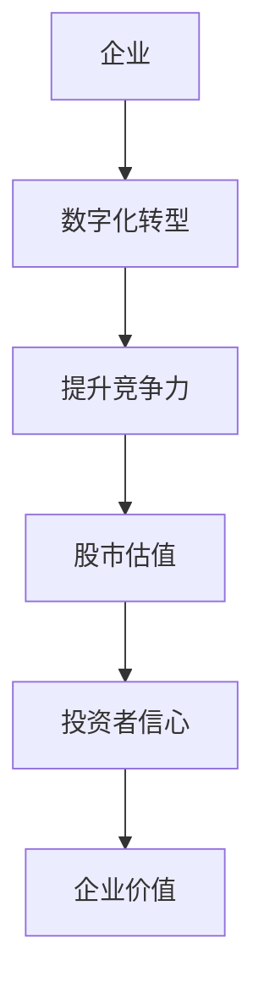
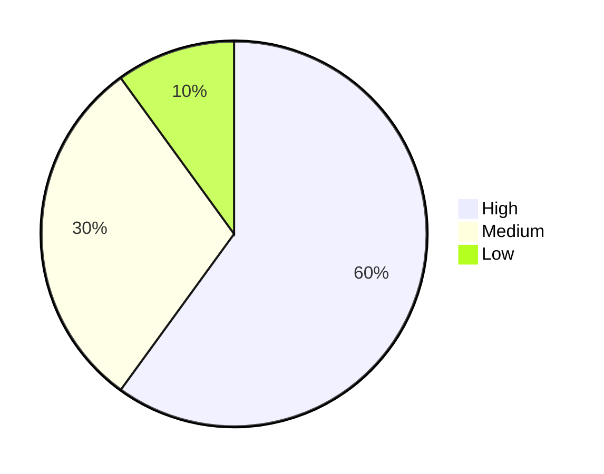
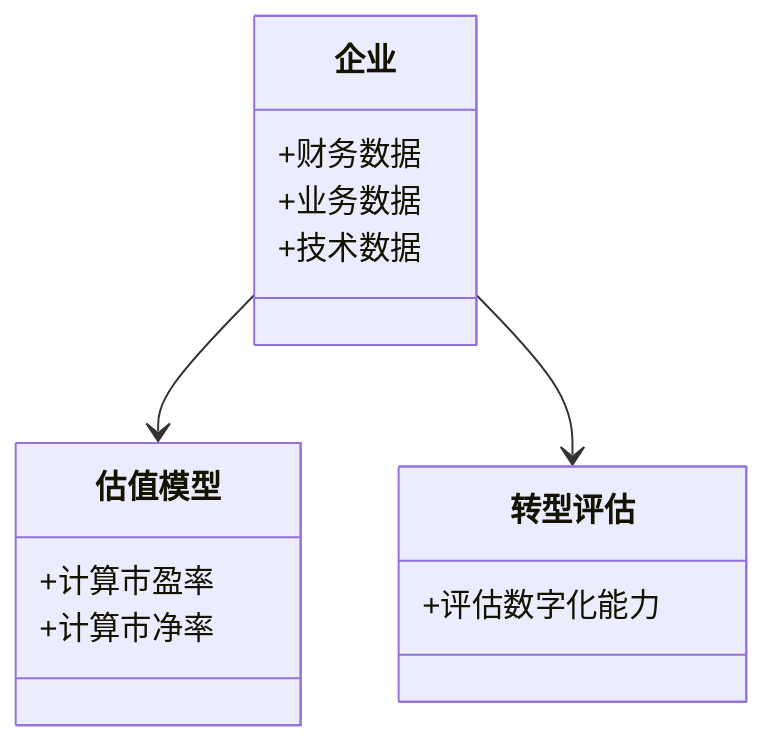
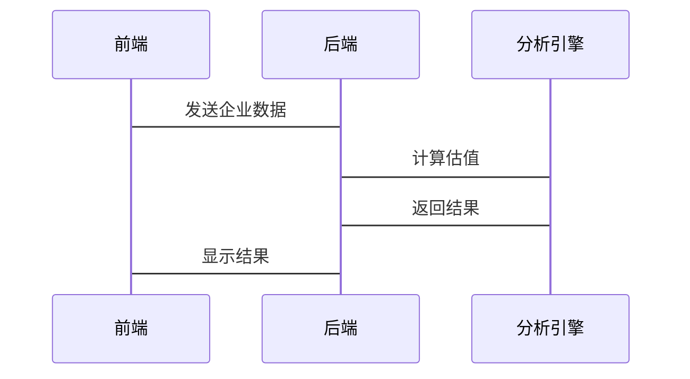

                 


# 股市估值高低对企业数字化转型的影响

## 关键词：股市估值、企业数字化转型、投资决策、企业价值、技术驱动

## 摘要：股市估值是衡量企业价值的重要指标，而企业数字化转型通过技术创新和业务模式优化，能够显著影响企业的市场表现和投资者信心。本文从股市估值的核心概念出发，分析其与企业数字化转型的内在联系，探讨如何通过算法和系统架构设计，帮助企业优化数字化转型策略，从而在股市中获得更高的估值。文章结合实际案例，详细讲解了从环境搭建到算法实现，再到系统设计与项目实战的全过程，并总结了最佳实践和注意事项。

---

## 第1章 股市估值的基本概念

### 1.1 股市估值的定义与意义

#### 1.1.1 股市估值的定义
股市估值是指通过对企业的财务数据、市场表现和行业环境等多方面因素的分析，评估企业股票的内在价值。常见的估值指标包括市盈率（P/E）、市净率（P/B）和市销率（P/S）等。

#### 1.1.2 股市估值的重要性
股市估值是投资者决策的重要依据，高估值可能意味着市场对企业的未来增长充满信心，而低估值可能暗示潜在的投资机会或企业面临的挑战。

#### 1.1.3 股市估值的核心要素
- 财务数据：净利润、营收、现金流等。
- 行业环境：行业竞争状况、市场增长率。
- 管理团队：领导层的决策能力和战略规划。
- 风险因素：政策风险、市场风险等。

### 1.2 企业数字化转型的背景

#### 1.2.1 数字化转型的定义
数字化转型是指企业利用数字技术（如大数据、人工智能、云计算等）改造或创新业务模式、流程、组织结构，以提高效率和竞争力。

#### 1.2.2 数字化转型的驱动因素
- 技术进步：云计算、AI等技术的发展为企业提供了新的工具。
- 市场需求：消费者对个性化、智能化服务的需求增加。
- 竞争压力：数字化转型成为企业保持竞争力的关键。

#### 1.2.3 数字化转型的挑战与机遇
- 挑战：技术实施难度大、组织变革困难、数据安全风险。
- 机遇：提高效率、降低成本、创造新的商业模式。

### 1.3 股市估值与企业数字化转型的关系

#### 1.3.1 股市估值对企业数字化转型的影响
高估值企业通常有更多的资金用于技术创新，而低估值企业可能在数字化转型中面临资金不足的问题。

#### 1.3.2 数字化转型如何影响股市估值
成功的数字化转型能够提升企业的盈利能力和市场地位，从而提高股市估值。

#### 1.3.3 两者的相互作用机制
数字化转型通过提升企业绩效间接影响股市估值，而股市估值又为企业提供资金支持，形成良性循环。

---

## 第2章 股市估值的核心概念与分析方法

### 2.1 股市估值的主要指标

#### 2.1.1 市盈率（P/E）
市盈率=股票价格/每股净利润，反映了投资者对每股利润的支付意愿。

#### 2.1.2 市净率（P/B）
市净率=股票价格/每股净资产，适用于评估资产密集型企业的估值。

#### 2.1.3 市销率（P/S）
市销率=股票价格/每股营收，适用于评估成长型企业。

#### 2.1.4 EV/EBITDA
EV/EBITDA=企业价值/息税折旧及摊销前利润，反映了企业的整体估值。

### 2.2 数字化转型的核心要素

#### 2.2.1 技术应用（如大数据、AI）
- 技术应用：利用大数据分析和人工智能优化业务流程。
- 典型案例：电商企业通过AI推荐系统提升销售额。

#### 2.2.2 组织结构变革
- 数字化转型需要扁平化的组织结构和敏捷的团队协作。
- 挑战：传统组织结构的转型阻力。

#### 2.2.3 业务模式创新
- 从传统模式向数字化模式转变，例如从线下销售转向线上线下融合。

### 2.3 股市估值与数字化转型的关联分析

#### 2.3.1 估值指标与数字化能力的关系
- 数字化能力越强，企业的营收增长潜力越大，从而提升估值指标。

#### 2.3.2 数字化转型对估值指标的影响
- 高效的数字化转型能够降低企业成本，提高净利润率，从而提升市盈率。

#### 2.3.3 行业差异与企业规模的影响
- 高科技行业更依赖数字化转型，而传统行业可能影响较小。

---

## 第3章 核心概念的原理与特征

### 3.1 股市估值的原理

#### 3.1.1 基本原理
股市估值基于对企业未来现金流的预测，通过贴现模型（如DCF）计算内在价值。

#### 3.1.2 估值模型
- DCF模型：通过预测未来现金流并贴现计算企业价值。
- 市盈率模型：基于可比公司的P/E倍数进行估值。

#### 3.1.3 影响因素分析
- 利率水平：影响贴现率，从而影响估值。
- 行业周期：行业处于增长期时估值可能更高。

### 3.2 数字化转型的核心原理

#### 3.2.1 技术驱动
- 利用新兴技术优化业务流程，提高效率。
- 例如，制造业通过工业4.0实现智能化生产。

#### 3.2.2 业务流程优化
- 数字化转型通过自动化和智能化优化传统业务流程，降低成本，提高效率。

#### 3.2.3 组织文化变革
- 企业文化需要从传统模式向数字化思维转变，鼓励创新和协作。

### 3.3 核心概念的对比分析

#### 3.3.1 股市估值与数字化转型的属性对比

| 属性       | 股市估值                  | 数字化转型                  |
|------------|--------------------------|-----------------------------|
| 核心目标   | 评估企业价值              | 提升企业竞争力和效率          |
| 驱动因素   | 财务数据、市场环境          | 技术创新、组织变革            |
| 实施主体   | 投资者、分析师              | 企业管理层、技术团队          |

#### 3.3.2 两者关系的特征总结
- 数字化转型是影响股市估值的内在因素。
- 高估值企业更容易获得资源支持数字化转型。

---

## 第4章 核心概念的实体关系图

### 4.1 股市估值的实体关系

#### 4.1.1 企业、投资者、市场的关系
- 企业通过数字化转型提升竞争力，吸引投资者。
- 投资者关注企业的财务指标和市场表现，影响股市估值。

#### 4.1.2 估值指标与企业绩效的关系
- 净利润影响市盈率，营收增长影响市销率。

### 4.2 数字化转型的实体关系

#### 4.2.1 技术、组织、业务的关系
- 技术支撑数字化转型，组织结构变革推动业务模式创新。

#### 4.2.2 数字化转型与企业价值的关系
- 数字化转型提升企业价值，进而影响股市估值。

### 4.3 两者的综合关系图



---

## 第5章 算法原理与实现

### 5.1 股市估值预测的算法

#### 5.1.1 简单线性回归模型
- 模型：y = a + bx
- y：预测股价；x：历史数据（如营收增长率）。

#### 5.1.2 时间序列分析
- 使用ARIMA模型预测股价趋势。

#### 5.1.3 机器学习模型
- 随机森林回归模型用于多变量预测。

#### 5.1.4 Python代码示例

```python
import pandas as pd
import numpy as np
from sklearn.ensemble import RandomForestRegressor
from sklearn.metrics import mean_squared_error

# 数据加载
data = pd.read_csv('stock_data.csv')

# 特征与目标
X = data[['revenue', 'profit', 'growth']]
y = data['price']

# 模型训练
model = RandomForestRegressor(n_estimators=100)
model.fit(X, y)

# 预测
y_pred = model.predict(X)

# 评估
mse = mean_squared_error(y, y_pred)
print(f'MSE: {mse}')
```

#### 5.1.5 数学模型与公式
- 回归分析公式：$$y = \beta_0 + \beta_1x + \epsilon$$
- 随机森林是一种集成学习方法，通过多棵决策树的组合提高预测准确性。

### 5.2 数字化转型评估的算法

#### 5.2.1 主成分分析（PCA）
- 用于降维，提取影响数字化转型的关键因素。

#### 5.2.2 聚类分析
- 将企业按数字化转型能力分为不同类别。

#### 5.2.3 可视化展示


### 5.3 算法实现步骤

#### 5.3.1 数据预处理
- 清洗数据，处理缺失值，标准化特征。

#### 5.3.2 模型训练
- 使用训练数据拟合模型，调整超参数优化性能。

#### 5.3.3 模型评估
- 使用测试数据评估模型的准确性和稳定性。

#### 5.3.4 结果分析
- 解释模型输出，识别关键影响因素。

---

## 第6章 系统分析与架构设计方案

### 6.1 问题场景介绍

#### 6.1.1 问题背景
企业希望通过数字化转型提升竞争力，但缺乏有效的评估和实施框架。

#### 6.1.2 项目目标
开发一个系统，帮助企业评估数字化转型对股市估值的影响。

### 6.2 系统功能设计

#### 6.2.1 领域模型


#### 6.2.2 系统架构设计


### 6.3 系统接口设计

#### 6.3.1 接口定义
- 前端向后端发送企业数据请求。
- 后端调用分析引擎进行估值计算。

#### 6.3.2 接口交互


---

## 第7章 项目实战

### 7.1 环境安装与配置

#### 7.1.1 安装Python与相关库
```bash
pip install numpy pandas scikit-learn
```

#### 7.1.2 数据准备
- 数据来源：股票数据集（如K线数据）。
- 数据清洗：处理缺失值，标准化数据。

### 7.2 核心实现代码

#### 7.2.1 股市估值预测代码

```python
import pandas as pd
from sklearn.model_selection import train_test_split
from sklearn.metrics import r2_score

# 数据加载
data = pd.read_csv('stock.csv')

# 特征与目标
X = data[['open', 'high', 'low']]
y = data['close']

# 数据分割
X_train, X_test, y_train, y_test = train_test_split(X, y, test_size=0.2)

# 模型训练
model = RandomForestRegressor()
model.fit(X_train, y_train)

# 预测与评估
y_pred = model.predict(X_test)
print(f'R² Score: {r2_score(y_test, y_pred)}')
```

#### 7.2.2 数字化转型评估代码

```python
import pandas as pd
from sklearn.decomposition import PCA

# 数据加载
data = pd.read_csv('transformation.csv')

# 特征提取
X = data[['IT投入', '员工培训', '创新指标']]

# PCA降维
pca = PCA(n_components=2)
principal_components = pca.fit_transform(X)

print(f'主成分解释方差比例：{pca.explained_variance_ratio_}')
```

### 7.3 案例分析与解读

#### 7.3.1 案例背景
某科技公司希望通过数字化转型提升股价，采用AI优化生产流程。

#### 7.3.2 数据分析
- 数据清洗与预处理。
- 应用随机森林模型预测股价。
- 使用PCA分析数字化转型的关键因素。

#### 7.3.3 实施结果
- 股价预测准确率提升，数字化转型能力显著增强。

### 7.4 项目小结
- 成功案例展示了算法的有效性。
- 需要注意数据质量和模型调优。

---

## 第8章 最佳实践与注意事项

### 8.1 小结
- 股市估值与数字化转型密切相关。
- 企业应通过技术创新提升市场表现。

### 8.2 注意事项
- 数据质量：确保数据准确性和完整性。
- 模型选择：根据具体情况选择合适算法。
- 风险控制：关注市场波动和政策变化。

### 8.3 拓展阅读
- 推荐阅读《股票估值实战技巧》和《数字化转型方法论》。

---

## 结语
股市估值高低对企业数字化转型的影响是一个复杂但关键的议题。通过科学的算法和系统的架构设计，企业可以更好地优化数字化转型策略，从而在股市中获得更高的估值。希望本文能为读者提供有价值的见解和实用的方法。

--- 

以上是《股市估值高低对企业数字化转型的影响》的技术博客文章，内容涵盖了从概念到实践的全过程，结合了理论分析和实际案例，为读者提供了全面的视角。

