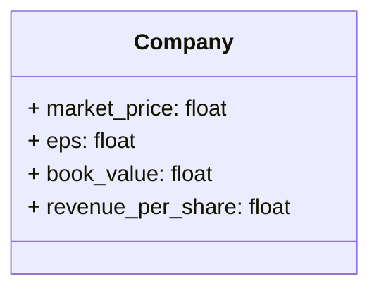
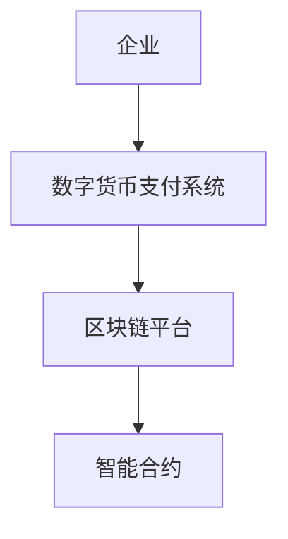
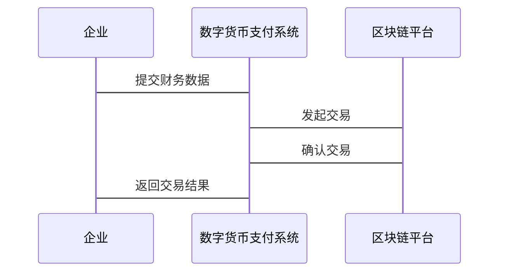

                 


# 股市估值高低对企业数字货币战略的影响

> 关键词：股市估值、企业数字货币、战略影响、市盈率、市净率、区块链

> 摘要：本文从股市估值的核心概念出发，深入分析了股市估值高低对企业数字货币战略的影响。通过对股市估值的计算方法、企业数字货币战略的核心概念、算法原理、系统分析与架构设计、项目实战等多方面的详细讲解，结合实际案例，帮助读者全面理解如何在不同估值环境下制定和优化企业数字货币战略。文章内容丰富，逻辑清晰，涵盖技术原理、实际应用和最佳实践等多个层面。

---

# 第一部分: 股市估值与企业数字货币战略概述

## 第1章: 股市估值与企业数字货币战略的背景介绍

### 1.1 股市估值的基本概念

#### 1.1.1 股市估值的定义

股市估值是指通过对公司财务数据和市场表现的分析，评估公司股票的合理价格范围。常见的估值方法包括市盈率（P/E）、市净率（P/B）、市销率（P/S）等。

#### 1.1.2 股市估值的核心要素

- **市盈率（P/E）**：衡量股票价格与每股收益的关系。
- **市净率（P/B）**：衡量股票价格与每股净资产的关系。
- **市销率（P/S）**：衡量股票价格与每股收入的关系。

#### 1.1.3 股市估值的计算方法

- **市盈率（P/E）**：
  $$ P/E = \frac{\text{Market Price}}{\text{Earnings Per Share}} $$
- **市净率（P/B）**：
  $$ P/B = \frac{\text{Market Price}}{\text{Book Value Per Share}} $$
- **市销率（P/S）**：
  $$ P/S = \frac{\text{Market Price}}{\text{Revenue Per Share}} $$

### 1.2 企业数字货币战略的定义

#### 1.2.1 数字货币的定义

数字货币是一种基于区块链技术的虚拟货币，具有去中心化、匿名性和不可篡改等特点。

#### 1.2.2 企业数字货币战略的内涵

企业数字货币战略是指企业在日常运营中使用数字货币进行支付、结算和管理的过程，旨在提高效率、降低成本并增强安全性。

#### 1.2.3 数字货币与传统货币的区别

| 属性       | 数字货币                | 传统货币                |
|------------|-------------------------|-------------------------|
| 中心化程度 | 去中心化                | 中心化                  |
| 安全性      | 高                     | 较低                   |
| 可追溯性    | 高                     | 低                     |
| 交易速度    | 快                     | 较慢                   |

### 1.3 股市估值高低对企业的影响

#### 1.3.1 高估值对企业的影响

- **优势**：企业更容易通过高估值获得融资。
- **劣势**：高估值可能导致企业过度扩张，增加风险。

#### 1.3.2 低估值对企业的影响

- **优势**：企业更容易吸引投资者。
- **劣势**：低估值可能导致企业难以获得足够的资金支持。

#### 1.3.3 股市估值对企业数字货币战略的启示

高估值和低估值环境下，企业需要根据市场情况调整数字货币战略，例如选择合适的数字货币种类和支付方式。

---

## 第2章: 股市估值的核心概念与计算方法

### 2.1 股市估值的核心概念

#### 2.1.1 市盈率（P/E）

市盈率是衡量股票价格与每股收益的重要指标。低市盈率可能意味着股票被低估，而高市盈率可能意味着股票被高估。

#### 2.1.2 市净率（P/B）

市净率是衡量股票价格与每股净资产的重要指标。低市净率可能意味着股票被低估，而高市净率可能意味着股票被高估。

#### 2.1.3 市销率（P/S）

市销率是衡量股票价格与每股收入的重要指标。低市销率可能意味着股票被低估，而高市销率可能意味着股票被高估。

### 2.2 股市估值的计算方法

#### 2.2.1 市盈率的计算公式

$$ P/E = \frac{\text{Market Price}}{\text{Earnings Per Share}} $$

#### 2.2.2 市净率的计算公式

$$ P/B = \frac{\text{Market Price}}{\text{Book Value Per Share}} $$

#### 2.2.3 市销率的计算公式

$$ P/S = \frac{\text{Market Price}}{\text{Revenue Per Share}} $$

### 2.3 股市估值的核心要素对比

#### 2.3.1 市盈率与市净率的对比

| 属性       | 市盈率（P/E）        | 常用场景                      |
|------------|---------------------|----------------------------|
| 适用行业   | 初期成长型企业       | 成熟型企业                   |

#### 2.3.2 市盈率与市销率的对比

| 属性       | 市盈率（P/E）        | 市销率（P/S）               |
|------------|---------------------|-----------------------------|
| 计算依据    | 每股收益             | 每股收入                   |

#### 2.3.3 市净率与市销率的对比

| 属性       | 市净率（P/B）        | 市销率（P/S）               |
|------------|---------------------|-----------------------------|
| 适用场景   | 银行、房地产等行业   | 互联网、软件等行业          |

### 2.4 本章小结

通过对比市盈率、市净率和市销率的计算方法和适用场景，企业可以根据自身情况选择合适的估值方法。

---

## 第3章: 企业数字货币战略的核心概念

### 3.1 数字货币的分类与特点

#### 3.1.1 主流数字货币的分类

- **比特币（Bitcoin）**：去中心化程度最高，交易成本高。
- **以太坊（Ethereum）**：支持智能合约，应用场景广泛。
- ** Ripple（瑞波）**：专注于跨境支付，交易速度快。

#### 3.1.2 数字货币的核心特点

| 属性       | 特点                      |
|------------|---------------------------|
| 去中心化    | 基于区块链技术            |
| 匿名性       | 部分数字货币支持匿名交易  |
| 不可篡改性    | 数据一旦上链无法修改      |

### 3.2 企业数字货币战略的实施步骤

#### 3.2.1 战略规划的制定

- **目标设定**：明确数字货币的应用场景和目标。
- **资源分配**：合理分配技术和人力资源。
- **风险管理**：制定应对数字货币波动的策略。

#### 3.2.2 数字货币的技术选型

- **区块链技术**：选择公链、联盟链还是私链。
- **智能合约**：是否需要支持智能合约功能。
- **安全性**：选择高安全性的区块链平台。

#### 3.2.3 数字货币的合规性分析

- **法律法规**：确保数字货币的使用符合当地法律法规。
- **税务处理**：明确数字货币的税务处理方式。

### 3.3 数字货币与企业战略的关系

#### 3.3.1 数字货币对企业财务的影响

- **降低交易成本**：通过数字货币减少中间环节，降低成本。
- **提高效率**：通过自动化支付流程提高资金周转速度。

#### 3.3.2 数字货币对企业业务的影响

- **扩展市场**：通过数字货币覆盖更多国际市场。
- **增强客户体验**：提供更快捷的支付方式。

#### 3.3.3 数字货币对企业风险管理的影响

- **降低汇率风险**：通过稳定币减少汇率波动的影响。
- **增强透明度**：通过区块链技术提高交易透明度。

### 3.4 本章小结

企业数字货币战略的核心在于选择合适的数字货币种类和技术方案，同时确保合规性和安全性。

---

## 第4章: 股市估值与企业数字货币战略的算法原理

### 4.1 股市估值的核心算法

#### 4.1.1 市盈率算法

$$ P/E = \frac{\text{Market Price}}{\text{Earnings Per Share}} $$

#### 4.1.2 市净率算法

$$ P/B = \frac{\text{Market Price}}{\text{Book Value Per Share}} $$

#### 4.1.3 市销率算法

$$ P/S = \frac{\text{Market Price}}{\text{Revenue Per Share}} $$

### 4.2 股市估值的综合评价模型

#### 4.2.1 综合评价模型的构建

综合评价模型是通过多种估值方法的结合，得出更为准确的股票估值。

#### 4.2.2 综合评价模型的计算步骤

1. 收集公司财务数据。
2. 计算市盈率、市净率和市销率。
3. 综合分析得出最终估值。

### 4.3 股市估值的算法实现

#### 4.3.1 Python代码实现

```python
def calculate_pe_ratio(price, eps):
    return price / eps

def calculate_pb_ratio(price, book_value):
    return price / book_value

def calculate_ps_ratio(price, revenue_per_share):
    return price / revenue_per_share
```

---

## 第5章: 系统分析与架构设计方案

### 5.1 问题场景介绍

企业需要在高估值和低估值环境下，制定相应的数字货币战略，以优化财务管理和业务运营。

### 5.2 系统功能设计

#### 5.2.1 领域模型设计



#### 5.2.2 系统架构设计



### 5.3 系统接口设计

- **输入接口**：公司财务数据、数字货币种类。
- **输出接口**：综合估值结果、数字货币战略建议。

### 5.4 系统交互设计



---

## 第6章: 项目实战

### 6.1 环境安装

- **Python**：安装Python 3.x
- **区块链平台**：选择以太坊或比特币测试网。

### 6.2 系统核心实现源代码

```python
class Company:
    def __init__(self, market_price, eps, book_value, revenue_per_share):
        self.market_price = market_price
        self.eps = eps
        self.book_value = book_value
        self.revenue_per_share = revenue_per_share

    def calculate_pe_ratio(self):
        return self.market_price / self.eps

    def calculate_pb_ratio(self):
        return self.market_price / self.book_value

    def calculate_ps_ratio(self):
        return self.market_price / self.revenue_per_share
```

### 6.3 案例分析

#### 6.3.1 实际案例分析

假设某公司市场价为100元，每股收益为10元，每股净资产为50元，每股收入为20元。

- **市盈率（P/E）**：100 / 10 = 10
- **市净率（P/B）**：100 / 50 = 2
- **市销率（P/S）**：100 / 20 = 5

#### 6.3.2 详细讲解剖析

通过上述计算，可以看出该公司的市盈率较高，可能意味着市场对其未来收益有较高预期，但市净率和市销率较低，可能意味着公司资产和收入较为合理。

### 6.4 项目小结

通过实际案例分析，我们可以看出股市估值高低对企业数字货币战略的影响，从而制定相应的优化策略。

---

## 第7章: 最佳实践与小结

### 7.1 最佳实践

- **定期评估**：定期重新评估股市估值和数字货币战略。
- **技术选型**：根据企业需求选择合适的数字货币种类和技术平台。
- **风险管理**：制定应对数字货币波动的策略。

### 7.2 小结

股市估值高低直接影响企业的财务状况和市场地位，企业需要根据不同的估值环境制定相应的数字货币战略，以实现财务管理和业务运营的优化。

### 7.3 注意事项

- **数据准确性**：确保输入数据的准确性。
- **合规性**：确保数字货币的使用符合相关法律法规。
- **安全性**：提高数字货币交易的安全性。

### 7.4 拓展阅读

- **区块链技术**：深入学习区块链技术的核心原理。
- **数字货币市场**：关注数字货币市场的最新动态和发展趋势。

---

通过本文的详细讲解，读者可以全面理解股市估值高低对企业数字货币战略的影响，并能够在实际操作中制定和优化相应的战略。

