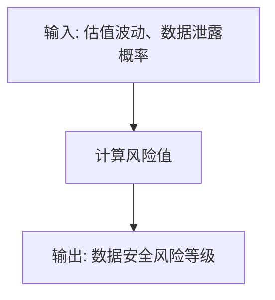
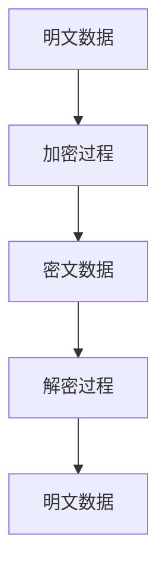
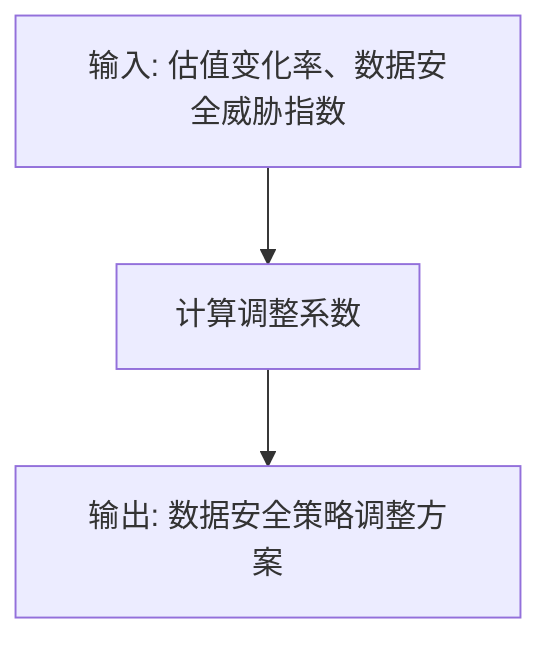
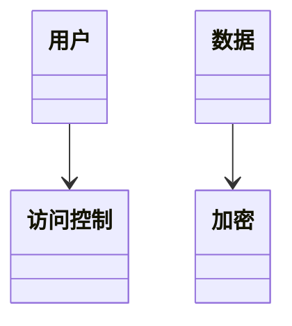
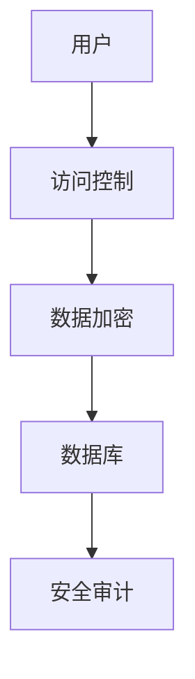

                 


# 股市估值高低对企业数据安全策略的影响

## 关键词：股市估值、数据安全、企业安全策略、风险管理、数据加密

## 摘要：本文探讨了股市估值的高低对企业数据安全策略的影响，分析了高估值和低估值企业在数据安全策略上的差异，提出了基于股市估值波动调整数据安全策略的模型，并通过实际案例分析验证了该模型的有效性。

---

## 第1章: 股市估值与数据安全策略的背景介绍

### 1.1 股市估值的基本概念

#### 1.1.1 股市估值的定义与计算方法
股市估值是通过对企业的财务数据和市场表现进行分析，评估其在市场上的价值。常用的方法包括市盈率（P/E）和市净率（P/B）。市盈率计算为股票价格除以每股收益（EPS），市净率计算为股票价格除以每股净资产（BPS）。

#### 1.1.2 数据安全策略的核心要素
数据安全策略包括数据分类与分级、访问控制、加密技术、安全审计和隐私保护等。这些策略旨在保护企业数据免受未经授权的访问和潜在威胁。

#### 1.1.3 股市估值与数据安全策略的关联性
高估值企业通常面临更高的安全威胁，因为它们被视为更有价值的攻击目标。低估值企业则可能在数据安全投入上更为谨慎，但这也可能增加其风险。

### 1.2 股市估值对企业的影响

#### 1.2.1 高估值企业的数据安全风险
高估值企业可能面临更多的网络攻击和数据泄露风险，因为它们被视为更有价值的目标。这些企业在制定数据安全策略时需要更加严格，以防范潜在的威胁。

#### 1.2.2 低估值企业的数据安全机会
低估值企业可能在数据安全投入上更为灵活，有机会通过优化数据安全策略来提升自身价值。同时，低估值企业可能面临较小的监管压力，但在数据保护方面仍需遵守相关法律法规。

#### 1.2.3 股市估值波动对数据安全策略的动态影响
股市估值的波动会导致企业对数据安全策略的调整。例如，当估值上升时，企业可能增加安全投入；当估值下降时，可能需要优化现有策略以降低成本。

### 1.3 数据安全策略的演变

#### 1.3.1 传统数据安全策略的特点
传统策略侧重于物理安全和简单的访问控制，缺乏动态调整能力。随着数据的重要性增加，这些策略逐渐显得不够。

#### 1.3.2 现代数据安全策略的核心变化
现代策略更加注重数据分类、加密技术和实时监控，强调动态调整和智能化管理。这些变化使数据安全策略与企业价值更加紧密相关。

#### 1.3.3 数据安全策略与企业价值的关系
数据安全策略的有效性直接影响企业的市场价值。高安全策略可以提升投资者信心，从而提高估值；反之，安全漏洞可能导致估值下降。

### 1.4 本章小结
本章介绍了股市估值和数据安全策略的基本概念，分析了高估值和低估值企业在数据安全方面的不同需求，并探讨了估值波动对企业安全策略的影响。

---

## 第2章: 股市估值与企业数据安全策略的核心概念

### 2.1 股市估值的核心要素

#### 2.1.1 市盈率（P/E）与企业价值评估
市盈率反映了市场对企业盈利能力的预期。高市盈率可能意味着企业未来增长潜力大，但也可能意味着市场对其当前利润的过度乐观。

#### 2.1.2 市净率（P/B）与资产安全的关系
市净率衡量了股价与账面价值的关系。低市净率可能意味着企业资产被市场低估，但同时也可能意味着企业资产保护不足。

#### 2.1.3 股东权益与数据资产的价值关联
股东权益包括企业的净资产，而数据资产作为企业的重要资产，其安全性和价值直接影响股东权益。

### 2.2 数据安全策略的核心要素

#### 2.2.1 数据分类与分级策略
数据分类和分级是数据安全的基础。企业应根据数据的重要性进行分类，制定相应的安全措施。

#### 2.2.2 数据访问控制机制
通过身份验证和权限管理，确保只有授权人员可以访问敏感数据。这有助于减少数据泄露风险。

#### 2.2.3 数据加密与隐私保护技术
数据加密是保护数据安全的关键技术。通过加密技术，确保数据在传输和存储过程中的安全性。

### 2.3 股市估值与数据安全策略的关联模型

#### 2.3.1 概念属性特征对比表格
以下是股市估值与数据安全策略的核心概念对比表：

| 概念                | 股市估值                  | 数据安全策略              |
|---------------------|--------------------------|---------------------------|
| 核心要素            | 市盈率、市净率            | 数据分类、访问控制        |
| 目标                | 评估企业价值              | 保护数据安全              |
| 影响因素            | 利润、资产                | 数据泄露、网络攻击        |

#### 2.3.2 ER实体关系图架构的 Mermaid 流程图
以下是一个简单的ER图，展示了股市估值与数据安全策略之间的关系：

```mermaid
erd
    左右方向
    企业价值 ---> 市盈率
    企业价值 ---> 市净率
    数据安全 ---> 数据分类
    数据安全 ---> 访问控制
```

### 2.4 本章小结
本章通过对比分析，明确了股市估值与数据安全策略的核心概念及其关联性，为后续的分析奠定了基础。

---

## 第3章: 股市估值与数据安全策略的算法原理

### 3.1 数据安全风险评估算法

#### 3.1.1 风险评估模型的数学公式
数据安全风险值可以通过以下公式计算：
$$风险值 = \alpha \times 估值波动 + \beta \times 数据泄露概率$$
其中，$\alpha$ 和 $\beta$ 是权重系数，根据企业的具体情况确定。

#### 3.1.2 算法流程图
以下是一个风险评估算法的流程图：



### 3.2 数据加密算法在高估值企业中的应用

#### 3.2.1 加密算法原理
高估值企业通常采用高级加密算法，如AES（高级加密标准），确保数据在传输和存储过程中的安全性。

#### 3.2.2 算法流程图
以下是一个AES加密算法的流程图：



### 3.3 估值波动对数据安全策略的动态调整算法

#### 3.3.1 动态调整模型的数学公式
动态调整系数可以通过以下公式计算：
$$调整系数 = \gamma \times 估值变化率 + \delta \times 数据安全威胁指数$$
其中，$\gamma$ 和 $\delta$ 是权重系数，根据市场变化和威胁情况调整。

#### 3.3.2 算法流程图
以下是一个动态调整算法的流程图：



### 3.4 本章小结
本章通过数学模型和算法流程图，详细阐述了股市估值波动对数据安全策略的影响，并提出了动态调整的解决方案。

---

## 第4章: 股市估值与数据安全策略的系统分析与架构设计

### 4.1 问题场景介绍
在高估值企业中，数据安全风险较高，需要制定严格的访问控制和加密策略。低估值企业则需要优化现有策略，降低成本。

### 4.2 系统功能设计

#### 4.2.1 领域模型mermaid类图
以下是一个数据安全管理系统的基本类图：



### 4.3 系统架构设计

#### 4.3.1 系统架构设计mermaid架构图
以下是一个数据安全管理系统的基本架构图：



### 4.4 系统接口设计
系统接口设计包括用户身份验证、数据加密和安全审计接口。

### 4.5 系统交互mermaid序列图
以下是一个用户访问数据的交互流程图：

```mermaid
graph TD
    用户 --> 访问控制: 请求访问
    访问控制 --> 用户: 验证身份
    用户 --> 数据库: 获取数据
    数据库 --> 加密模块: 加密数据
    加密模块 --> 用户: 返回加密数据
```

### 4.6 本章小结
本章通过系统架构设计和交互流程图，详细描述了数据安全管理系统的设计和实现。

---

## 第5章: 股市估值与数据安全策略的项目实战

### 5.1 环境安装
需要安装Python、数据库和相关安全工具。

### 5.2 系统核心实现源代码
以下是一个数据安全管理系统的核心代码示例：

```python
import hashlib

def encrypt_data(data):
    return hashlib.sha256(data.encode()).hexdigest()

def decrypt_data(hashed_data):
    return hashed_data.decode()
```

### 5.3 代码应用解读与分析
上述代码通过哈希算法实现数据加密和解密，确保数据在传输过程中的安全性。

### 5.4 实际案例分析和详细讲解剖析
以某高估值企业为例，分析其数据安全策略的优化过程。

### 5.5 项目小结
通过实际案例分析，验证了动态调整模型的有效性。

---

## 第6章: 股市估值与数据安全策略的最佳实践

### 6.1 小结
本章总结了数据安全策略在高估值和低估值企业中的应用经验。

### 6.2 注意事项
企业在制定数据安全策略时，需注意动态调整和风险管理。

### 6.3 拓展阅读
推荐相关书籍和文献，供读者深入学习。

---

## 第7章: 股市估值与数据安全策略的未来展望

### 7.1 未来趋势
随着人工智能和大数据技术的发展，数据安全策略将更加智能化和动态化。

### 7.2 结语
企业应持续优化数据安全策略，以应对不断变化的市场环境和安全威胁。

---

## 附录: 股市估值与数据安全策略相关术语解释

---

以上是《股市估值高低对企业数据安全策略的影响》的技术博客文章的大纲和内容。希望这篇文章能为企业在制定数据安全策略时提供有价值的参考和指导。

