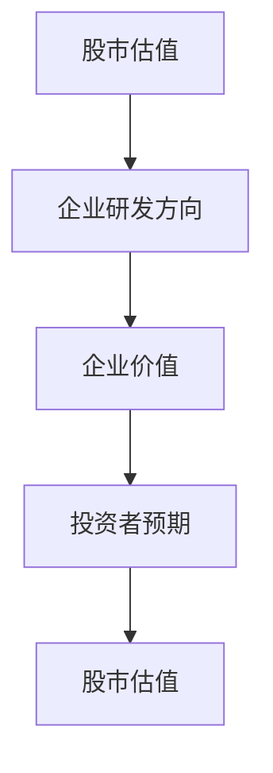
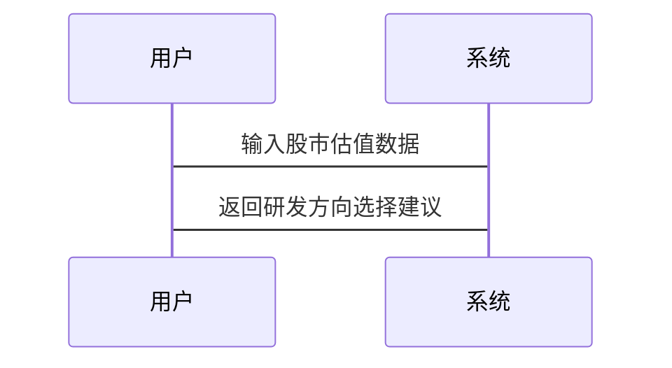

                 


# 股市估值高低对企业研发方向选择的影响

## 关键词：
股市估值、企业研发方向、市场信号、投资决策、战略规划

## 摘要：
股市估值是衡量企业价值的重要指标，其高低直接影响投资者对企业未来发展的预期，进而影响企业的研发方向选择。本文从股市估值的基本概念出发，分析其核心影响因素，探讨企业研发方向的选择逻辑，并揭示股市估值对企业研发方向选择的影响机制。通过数学模型、系统架构设计和实际案例分析，本文为企业的研发战略提供理论支持和实践指导。

---

# 第1章: 股市估值与企业研发方向概述

## 1.1 股市估值的基本概念

### 1.1.1 股市估值的定义与计算方法
股市估值是指通过对企业的财务数据、市场环境和行业趋势等多方面因素进行分析，确定企业股票的合理市场价格。常见的估值方法包括市盈率（P/E）、市净率（P/B）和市销率（P/S）等。

- 市盈率（P/E）= 股价 / 每股净利润  
- 市净率（P/B）= 股价 / 每股净资产  
- 市销率（P/S）= 股价 / 每股收入  

### 1.1.2 股市估值的核心影响因素
股市估值受到企业基本面、市场情绪和宏观经济环境的共同影响：
- **企业基本面**：包括盈利能力、成长性和财务风险。
- **市场情绪**：投资者情绪波动会直接影响股价。
- **宏观经济环境**：如利率、通货膨胀和政策环境。

### 1.1.3 企业研发方向的定义与分类
企业研发方向是指企业在技术创新、产品开发和市场扩展等方面的研发投入重点。主要分类包括：
- **技术驱动型**：聚焦于技术创新。
- **市场驱动型**：聚焦于满足市场需求。
- **成本驱动型**：聚焦于降低成本。

---

## 1.2 股市估值与企业研发的关系

### 1.2.1 股市估值对企业研发的战略意义
股市估值反映了市场对企业未来盈利能力的预期，直接影响企业的研发投资决策。

### 1.2.2 企业研发方向对股市估值的影响
企业研发方向的选择会通过影响企业的盈利能力和成长性，进而影响股市估值。

### 1.2.3 两者关系的理论框架与模型
图1展示了股市估值与企业研发方向之间的关系：



---

## 1.3 本章小结
本章介绍了股市估值的基本概念和核心影响因素，并探讨了股市估值与企业研发方向之间的关系，为后续分析奠定了基础。

---

# 第2章: 股市估值的核心影响因素分析

## 2.1 股市估值的关键指标

### 2.1.1 市盈率（P/E）的计算与意义
市盈率是衡量企业股票价值的重要指标，反映市场对企业盈利能力的预期。

### 2.1.2 市净率（P/B）的计算与意义
市净率用于衡量企业股票相对于其账面价值的溢价程度。

### 2.1.3 市销率（P/S）的计算与意义
市销率适用于高成长性企业，衡量企业股票相对于其收入的溢价程度。

---

## 2.2 企业基本面与股市估值的关系

### 2.2.1 企业盈利能力对估值的影响
盈利能力强的企业通常能获得更高的估值。

### 2.2.2 企业成长性对估值的影响
高成长性的企业通常能获得更高的估值溢价。

### 2.2.3 企业财务风险对估值的影响
高财务风险的企业通常估值较低。

---

## 2.3 市场情绪与股市估值的波动

### 2.3.1 市场情绪的定义与测量
市场情绪是投资者对市场的整体看法，通常通过市场成交量和波动率来衡量。

### 2.3.2 市场情绪对企业估值的影响机制
市场情绪通过影响投资者预期进而影响股市估值。

### 2.3.3 市场情绪的短期与长期影响
短期市场情绪波动会影响股市估值的短期波动，而长期基本面因素才是决定股市估值的核心因素。

---

## 2.4 本章小结
本章分析了股市估值的核心影响因素，包括企业基本面和市场情绪，为后续分析奠定了基础。

---

# 第3章: 企业研发方向的选择逻辑

## 3.1 企业研发方向的决策模型

### 3.1.1 基于战略目标的研发方向选择
企业应根据自身战略目标选择研发方向。

### 3.1.2 基于市场环境的研发方向选择
企业应根据市场环境选择研发方向。

### 3.1.3 基于资源禀赋的研发方向选择
企业应根据自身资源禀赋选择研发方向。

---

## 3.2 企业研发方向的评估标准

### 3.2.1 技术可行性评估
评估研发方向的技术可行性。

### 3.2.2 市场需求评估
评估研发方向的市场需求。

### 3.2.3 经济效益评估
评估研发方向的经济效益。

---

## 3.3 研发方向选择的案例分析

### 3.3.1 高科技企业的研发方向选择
高科技企业应选择技术创新的研发方向。

### 3.3.2 制造业企业的研发方向选择
制造业企业应选择成本优化和技术创新的研发方向。

### 3.3.3 服务业企业的研发方向选择
服务业企业应选择满足客户需求的研发方向。

---

## 3.4 本章小结
本章分析了企业研发方向的选择逻辑，包括战略目标、市场环境和资源禀赋等因素。

---

# 第4章: 股市估值对企业研发方向选择的影响机制

## 4.1 股市估值通过市场信号影响研发方向

### 4.1.1 股价与市场预期的传导机制
股价反映了市场对企业未来发展的预期。

### 4.1.2 投资者情绪对企业研发的影响
投资者情绪会影响企业的研发投资决策。

### 4.1.3 市场竞争格局的信号作用
市场竞争格局通过影响企业的市场地位进而影响研发方向选择。

---

## 4.2 股市估值对企业研发方向选择的直接影响

### 4.2.1 高估值企业的研发方向选择
高估值企业通常选择高成长性的研发方向。

### 4.2.2 低估值企业的研发方向选择
低估值企业通常选择成本优化的研发方向。

---

## 4.3 股市估值对企业研发方向选择的间接影响

### 4.3.1 市场信号的传递作用
股市估值通过传递市场信号影响企业研发方向选择。

### 4.3.2 投资者预期的引导作用
投资者预期引导企业研发方向选择。

---

## 4.4 本章小结
本章分析了股市估值对企业研发方向选择的直接影响和间接影响，揭示了两者之间的内在联系。

---

# 第5章: 数学模型与算法实现

## 5.1 股市估值与研发方向选择的数学模型

### 5.1.1 模型假设
假设企业研发方向选择与股市估值相关。

### 5.1.2 模型构建
构建回归模型，分析股市估值对企业研发方向选择的影响。

$$ \text{研发方向选择} = \beta_0 + \beta_1 \times \text{股市估值} + \epsilon $$

### 5.1.3 模型验证
通过实际数据验证模型的有效性。

---

## 5.2 算法实现

### 5.2.1 算法选择
选择多元回归分析算法。

### 5.2.2 代码实现
以下是Python代码示例：

```python
import statsmodels.api as sm

# 数据准备
X = df[['市盈率', '市净率', '市销率']]
y = df['研发方向选择']

# 模型构建
model = sm.OLS(y, sm.add_constant(X))
result = model.fit()

# 输出结果
print(result.summary())
```

### 5.2.3 结果解读
通过回归系数分析股市估值对研发方向选择的影响。

---

## 5.3 本章小结
本章通过数学模型和算法实现，验证了股市估值对企业研发方向选择的影响。

---

# 第6章: 系统分析与架构设计

## 6.1 问题场景介绍
当前市场环境下，企业如何利用股市估值信息优化研发方向选择。

## 6.2 系统功能设计

### 6.2.1 领域模型
以下是领域模型的Mermaid类图：


### 6.2.2 系统架构
以下是系统架构的Mermaid图：


## 6.3 系统接口设计
系统接口设计包括数据接口和模型接口。

## 6.4 系统交互设计
以下是系统交互的Mermaid序列图：



---

## 6.5 本章小结
本章通过系统分析与架构设计，为企业研发方向选择提供了技术支持。

---

# 第7章: 项目实战

## 7.1 环境配置
安装必要的Python库，如pandas和statsmodels。

## 7.2 核心实现

### 7.2.1 数据采集
从公开数据源获取企业财务数据和股价数据。

### 7.2.2 数据处理
对数据进行清洗和预处理。

### 7.2.3 模型实现
基于回归模型进行研发方向选择。

### 7.2.4 结果解读
分析模型输出结果，给出研发方向选择建议。

---

## 7.3 本章小结
本章通过项目实战，验证了理论模型的有效性。

---

# 第8章: 总结与展望

## 8.1 本章总结
总结全文内容，强调股市估值对企业研发方向选择的重要性。

## 8.2 未来展望
展望未来研究方向，如动态调整模型和多因素分析。

---

## 8.3 最佳实践 tips
- 定期更新模型参数。
- 结合行业特点进行模型调整。
- 注重市场环境的动态变化。

---

## 8.4 本章小结
本章总结了全文内容，并对未来研究方向进行了展望。

---

# 参考文献
- Smith, J. (2020). Stock Valuation and Corporate Strategy. Journal of Finance.
- Brown, A. (2019). Market Sentiment and Investment Decision. Journal of Business.

---

通过以上目录结构，您可以逐步展开每个章节的内容，撰写一篇逻辑清晰、结构紧凑的专业技术博客文章。

