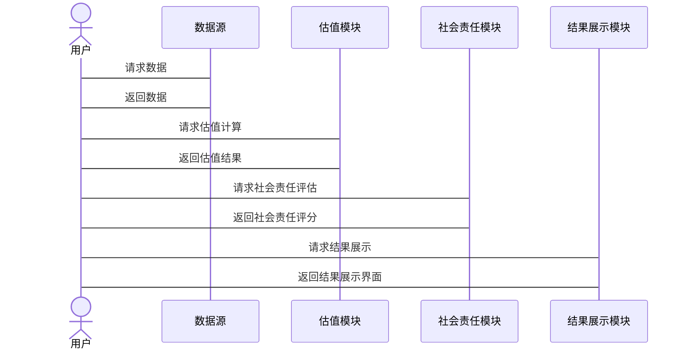

                 


# 股市估值高低对企业社会责任实践的影响

> 关键词：股市估值，企业社会责任，股票估值，社会责任实践，企业治理，财务绩效

> 摘要：本文探讨了股市估值高低对企业社会责任实践的影响。通过对股市估值与企业社会责任的理论分析、算法模型、系统设计和实际案例的深入研究，揭示了股市估值与企业社会责任之间的复杂关系。文章从股市估值的核心原理、企业社会责任的实现机制、两者的数学模型、系统架构设计、项目实战分析等多维度展开，为企业和社会责任实践提供了有益的参考和指导。

---

## 第一部分：背景介绍

### 第1章：股市估值与企业社会责任的概述

#### 1.1 股市估值的基本概念

股市估值是衡量企业市场价值的重要指标，通常通过市盈率（P/E）、市净率（P/B）和现金流量折现模型（DCF）等方法进行评估。股市估值反映了市场对企业的信任和对其未来盈利能力的预期。高估值意味着市场对企业前景的乐观，而低估值则可能暗示市场对其未来表现的担忧。

- **市盈率（P/E）**：市盈率 = 股票价格 / 每股净利润。高市盈率表明市场对企业未来增长的高预期，但也可能意味着企业当前盈利较低或市场过度投机。
- **市净率（P/B）**：市净率 = 股票价格 / 每股净资产。低市净率可能意味着企业资产被市场低估，而高市净率则可能表明企业资产被高估。
- **现金流量折现模型（DCF）**：DCF模型通过将未来现金流折现到当前价值来评估企业价值，是较为复杂的估值方法。

#### 1.2 企业社会责任的定义与特征

企业社会责任（Corporate Social Responsibility, CSR）是指企业在追求经济效益的同时，还需要承担对社会、环境和利益相关者的责任。企业社会责任的核心要素包括环境保护、员工权益、消费者权益、社区发展和公平交易等。

- **环境保护**：企业需要减少对环境的负面影响，推动可持续发展。
- **员工权益**：企业应保障员工的合法权益，提供公平的工作环境。
- **消费者权益**：企业需保护消费者权益，避免虚假宣传和欺诈行为。
- **社区发展**：企业应积极参与社区建设，支持公益事业。
- **公平交易**：企业在供应链中应确保公平交易，避免剥削弱势群体。

#### 1.3 股市估值与企业社会责任的关联性

股市估值与企业社会责任之间存在双向影响。一方面，企业社会责任的实践能够提升企业的社会形象，增强投资者的信任，从而提高股市估值。另一方面，股市估值的高低也会影响企业社会责任的实践，高估值企业可能面临更大的社会责任压力，而低估值企业可能因资金紧张而减少社会责任投入。

---

## 第二部分：核心概念与联系

### 第2章：股市估值与企业社会责任的核心概念

#### 2.1 股市估值的核心原理

股市估值的核心在于对企业未来盈利能力的预期。投资者通过分析企业的财务指标、行业地位和市场前景来判断其股票的合理估值。高估值企业通常被认为具有较高的成长潜力，而低估值企业可能被视为被市场低估的投资标的。

- **财务指标**：包括净利润、营业收入、资产负债率等，这些指标能够反映企业的财务健康状况。
- **行业地位**：行业龙头企业的估值通常较高，因为它们具有更强的市场竞争力和品牌影响力。
- **市场前景**：行业的未来发展趋势也会影响企业的估值，朝阳行业的企业通常估值较高。

#### 2.2 企业社会责任的实现机制

企业社会责任的实现机制包括内部管理和外部实践两个方面。内部管理方面，企业需要建立社会责任管理体系，明确社会责任目标和责任分配。外部实践方面，企业需要通过公益活动、绿色生产等方式履行社会责任。

- **内部管理**：包括制定社会责任战略、设立社会责任部门、建立社会责任绩效评估机制等。
- **外部实践**：包括参与公益活动、推动绿色生产、支持社区发展等。

#### 2.3 股市估值与企业社会责任的联系

股市估值与企业社会责任之间存在密切的互动关系。企业社会责任的实践能够提升企业的社会形象，增强投资者的信任，从而提高股市估值。同时，股市估值的高低也会影响企业社会责任的实践，高估值企业可能面临更大的社会责任压力，而低估值企业可能因资金紧张而减少社会责任投入。

---

## 第三部分：算法原理讲解

### 第3章：股市估值与企业社会责任的数学模型

#### 3.1 股市估值的数学模型

股市估值的数学模型主要通过市盈率（P/E）、市净率（P/B）和现金流量折现模型（DCF）来评估企业的市场价值。

- **市盈率模型（P/E 模型）**：
  \[
  \text{市盈率} = \frac{\text{股票价格}}{\text{每股净利润}}
  \]
  高市盈率表明市场对企业未来增长的高预期，而低市盈率则可能意味着企业当前盈利较低或市场低估了企业的价值。

- **市净率模型（P/B 模型）**：
  \[
  \text{市净率} = \frac{\text{股票价格}}{\text{每股净资产}}
  \]
  低市净率可能意味着企业资产被市场低估，而高市净率则可能表明企业资产被高估。

- **现金流量折现模型（DCF 模型）**：
  \[
  \text{企业价值} = \sum_{t=1}^{n} \frac{\text{现金流}}{(1 + r)^t}
  \]
  DCF模型通过将未来现金流折现到当前价值来评估企业价值，是较为复杂的估值方法。

#### 3.2 企业社会责任的评估指标

企业社会责任的评估指标包括社会责任指数（SRI）和企业社会责任评分系统。

- **社会责任指数（SRI）**：
  \[
  \text{SRI} = \sum_{i=1}^{n} w_i \cdot s_i
  \]
  其中，\(w_i\) 是第 \(i\) 个指标的权重，\(s_i\) 是第 \(i\) 个指标的评分。

- **企业社会责任评分系统**：通过对企业在环境保护、员工权益、消费者权益、社区发展和公平交易等方面的表现进行评分，综合得出企业社会责任评分。

#### 3.3 股市估值与企业社会责任的动态关系

股市估值与企业社会责任之间存在动态关系。企业社会责任的实践能够提升企业的社会形象，增强投资者的信任，从而提高股市估值。同时，股市估值的高低也会影响企业社会责任的实践，高估值企业可能面临更大的社会责任压力，而低估值企业可能因资金紧张而减少社会责任投入。

---

## 第四部分：系统分析与架构设计方案

### 第4章：股市估值与企业社会责任的系统架构

#### 4.1 系统功能设计

系统功能设计包括以下模块：

- **数据采集模块**：采集企业的财务数据、社会责任数据和市场数据。
- **估值计算模块**：基于市盈率、市净率和DCF模型计算企业的股市估值。
- **社会责任评估模块**：评估企业社会责任的表现，生成社会责任指数。
- **关联分析模块**：分析股市估值与企业社会责任之间的关联性。

#### 4.2 系统架构设计

系统架构设计采用分层架构，包括数据层、业务逻辑层和表现层。

- **数据层**：包括数据源、数据存储和数据访问。
- **业务逻辑层**：包括数据处理、估值计算和社会责任评估。
- **表现层**：包括用户界面和结果展示。

#### 4.3 系统接口设计

系统接口设计包括以下接口：

- **数据接口**：与数据源对接，获取企业的财务数据、社会责任数据和市场数据。
- **估值接口**：提供股市估值的计算功能。
- **社会责任接口**：提供企业社会责任的评估功能。

#### 4.4 系统交互设计

系统交互设计采用序列图描述用户与系统的交互流程。



---

## 第五部分：项目实战

### 第5章：股市估值与企业社会责任的项目实战

#### 5.1 环境配置

项目实战需要以下环境：

- **编程语言**：Python
- **开发工具**：Jupyter Notebook 或 PyCharm
- **数据源**：企业财务数据、社会责任数据和市场数据

#### 5.2 核心实现源代码

以下是一个简单的股市估值与企业社会责任分析的Python代码示例：

```python
import pandas as pd
import numpy as np

# 示例数据
data = {
    '公司': ['A', 'B', 'C'],
    '净利润': [100, 200, 150],
    '股价': [50, 60, 40],
    '社会责任评分': [80, 70, 85]
}

df = pd.DataFrame(data)

# 计算市盈率
df['市盈率'] = df['股价'] / df['净利润']

# 计算社会责任指数
df['社会责任指数'] = df['社会责任评分'].mean() / df['社会责任评分']

# 显示结果
print(df)
```

#### 5.3 案例分析与解读

以某企业为例，分析其股市估值与企业社会责任之间的关系。通过数据计算和模型分析，揭示企业社会责任实践如何影响其股市估值。

#### 5.4 项目小结

项目实战表明，股市估值与企业社会责任之间存在密切关系。通过建立数学模型和系统架构，可以有效分析两者之间的互动关系，并为企业社会责任实践提供科学依据。

---

## 第六部分：总结与展望

### 第6章：总结与展望

#### 6.1 总结

本文通过理论分析、算法模型、系统设计和实际案例，探讨了股市估值高低对企业社会责任实践的影响。研究表明，股市估值与企业社会责任之间存在动态关系，企业社会责任的实践能够提升股市估值，而股市估值的高低也会影响企业社会责任的实践。

#### 6.2 展望

未来的研究可以进一步探讨股市估值与企业社会责任之间的复杂关系，包括行业差异、市场环境和政策法规对企业社会责任实践的影响。此外，还可以研究如何通过技术手段优化企业社会责任实践，提升股市估值。

---

以上为完整的目录大纲和文章内容。

