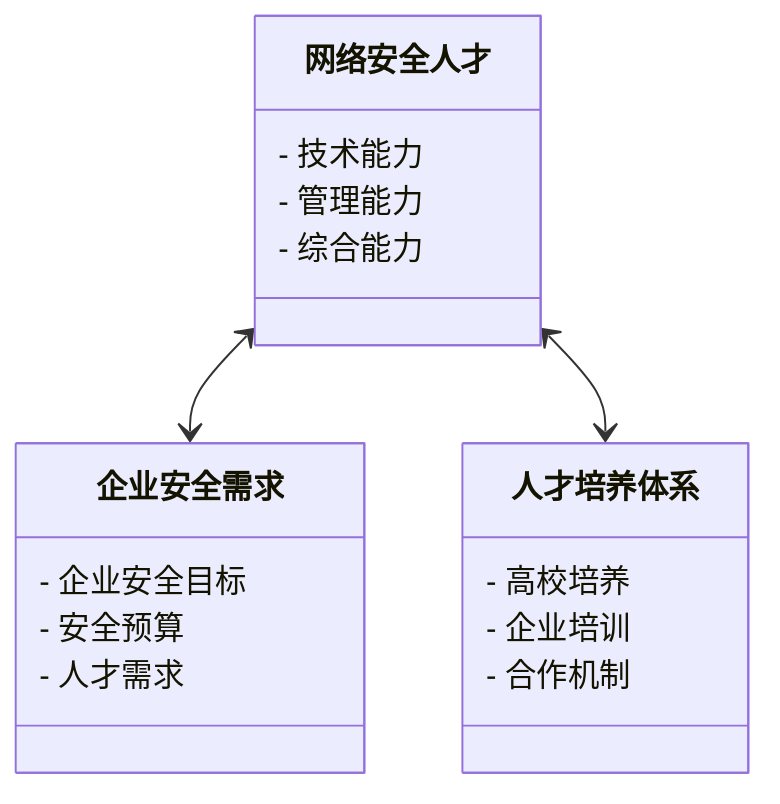

                 


# 股市估值高低对企业网络安全人才培养的影响

> **关键词**：股市估值、网络安全、人才培养、企业安全、投资分析、人才流动  
> 
> **摘要**：  
> 本文从股市估值的角度分析其对企业网络安全人才培养的影响，探讨高估值与低估值企业在人才需求、投资策略和流动机制上的差异。通过建立数学模型和系统分析，揭示股市估值与网络安全人才供给之间的动态平衡关系，并提出优化企业安全能力的具体策略。文章还结合实际案例，分析股市波动对人才流动的短期与长期影响，为企业的网络安全人才培养提供实用的指导和建议。

---

## 第一部分：背景与核心概念

### 第1章：股市估值与网络安全人才的基本概念

#### 1.1 股市估值的基本概念

##### 1.1.1 股市估值的定义  
股市估值是通过对企业财务数据和市场表现的分析，评估企业股票的合理价格范围。常用的估值方法包括市盈率（P/E）、市净率（P/B）和股息率等。

##### 1.1.2 股市估值的核心要素  
- **企业盈利能力**：净利润、ROE（净资产收益率）  
- **财务健康状况**：资产负债率、现金流  
- **行业地位**：市场占有率、竞争格局  
- **未来增长潜力**：行业发展趋势、技术创新能力  

##### 1.1.3 股市估值对企业的影响  
- 高估值企业：市场对其未来增长的预期较高，容易吸引人才  
- 低估值企业：可能面临投资者的质疑，影响企业形象和人才吸引力  

#### 1.2 网络安全人才的核心概念

##### 1.2.1 网络安全人才的定义  
网络安全人才是指具备网络安全技术、管理和战略规划能力的专业人员，包括但不限于网络安全工程师、数据保护专家、风险评估师等。

##### 1.2.2 网络安全人才的分类  
- **技术型人才**：擅长漏洞检测、渗透测试  
- **管理型人才**：擅长安全策略制定、团队管理  
- **综合型人才**：具备技术与管理双重能力  

##### 1.2.3 网络安全人才的重要性  
- 企业安全防护的核心力量  
- 企业数据资产保护的关键  
- 企业竞争力的重要组成部分  

#### 1.3 股市估值与网络安全人才的关系

##### 1.3.1 股市估值对企业安全投入的影响  
- 高估值企业：更倾向于高投入，提升安全能力  
- 低估值企业：可能压缩安全预算，影响人才引进  

##### 1.3.2 网络安全人才对企业价值的作用  
- 提升企业抗风险能力，增强投资者信心  
- 优化企业安全架构，降低运营成本  
- 提高企业市场竞争力，吸引优质人才  

##### 1.3.3 股市波动对人才流动的关联  
- 高估值企业：吸引优秀人才流入  
- 低估值企业：可能面临人才流失风险  
- 股市波动：影响企业的短期和长期人才战略  

---

## 第二部分：股市估值对企业网络安全人才培养的影响机制

### 第2章：股市估值对企业安全投入的驱动作用

#### 2.1 高估值企业的安全投入特点

##### 2.1.1 高估值企业的安全预算  
- 更高的安全预算，用于引进高端人才和技术  
- 更倾向于投资新兴技术，如AI驱动的安全解决方案  

##### 2.1.2 高估值企业的安全文化  
- 强调安全文化建设，吸引高素质人才  
- 提供更具竞争力的薪酬和职业发展机会  

#### 2.2 低估值企业的安全投入策略

##### 2.2.1 低估值企业的安全预算  
- 受限于预算，可能选择成本更低的安全方案  
- 更倾向于外包安全服务，而非内部培养人才  

##### 2.2.2 低估值企业的安全文化  
- 安全文化建设可能不足，影响人才吸引力  
- 可能忽视长期安全投入，追求短期利益  

#### 2.3 股市估值对人才需求的影响

##### 2.3.1 高估值企业对网络安全人才的需求  
- 对高端人才的需求旺盛，尤其是技术型和管理型人才  
- 更倾向于内部培养和梯队建设  

##### 2.3.2 低估值企业对网络安全人才的需求  
- 人才需求相对有限，主要集中在基础岗位  
- 可能依赖外部招聘，而非系统化培养  

#### 2.4 股市估值对人才流动的影响

##### 2.4.1 高估值企业对人才的吸引力  
- 更高的薪资和职业发展空间  
- 更好的职业发展机会和培训资源  

##### 2.4.2 低估值企业对人才的流失风险  
- 人才可能流向高估值企业  
- 内部员工可能因职业发展受限而离职  

##### 2.4.3 股市波动对人才流动的短期与长期影响  
- 短期波动：可能影响企业的短期人才策略  
- 长期波动：可能改变企业的长期人才规划  

---

## 第三部分：网络安全人才的培养与企业安全能力提升

### 第3章：网络安全人才的培养体系

#### 3.1 网络安全教育的现状

##### 3.1.1 高校教育  
- 当前网络安全教育的现状  
- 与企业需求的匹配度分析  

##### 3.1.2 企业内部培养机制  
- 企业内部培训的特点  
- 内部培养的优势与不足  

##### 3.1.3 高校与企业的合作模式  
- 合作培养计划  
- 实习与就业结合的模式  

#### 3.2 网络安全人才的技能要求

##### 3.2.1 技术技能要求  
- 漏洞检测、渗透测试、加密技术  
- 数据分析、机器学习在安全中的应用  

##### 3.2.2 管理技能要求  
- 安全策略制定、团队管理、风险评估  
- 安全文化建设与沟通能力  

##### 3.2.3 综合能力要求  
- 问题解决能力、创新思维、跨领域知识  

#### 3.3 企业安全能力提升的路径

##### 3.3.1 技术能力提升  
- 投资新兴技术，提升安全防护能力  
- 引进高端人才，优化技术架构  

##### 3.3.2 管理能力提升  
- 建立完善的安全管理体系  
- 加强内部培训和认证机制  

##### 3.3.3 综合能力提升  
- 提升团队协作能力  
- 加强与外部机构的合作  

---

## 第四部分：股市估值与网络安全人才供给的动态平衡

### 第4章：股市估值对人才供给的影响

#### 4.1 高估值企业的示范效应

##### 4.1.1 高估值企业的示范效应  
- 提供更高的薪酬和职业发展机会  
- 吸引更多优秀人才加入  

##### 4.1.2 低估值企业的鲇鱼效应  
- 高估值企业对低估值企业的压力  
- 低估值企业通过优化管理吸引人才  

#### 4.2 网络安全人才供给的现状分析

##### 4.2.1 人才供给的总体情况  
- 当前市场中网络安全人才的供需现状  
- 人才缺口的分析  

##### 4.2.2 人才供给的区域差异  
- 一线城市与三四线城市的差异  
- 区域性人才流动的趋势  

##### 4.2.3 人才供给的行业差异  
- 金融、科技等行业对网络安全人才的需求分析  
- 不同行业对人才需求的差异  

#### 4.3 股市估值与人才供给的平衡策略

##### 4.3.1 提高企业安全投入的透明度  
- 通过公开信息吸引人才  
- 提升企业的品牌形象  

##### 4.3.2 加强企业安全文化建设  
- 提供良好的职业发展机会  
- 建立有效的激励机制  

##### 4.3.3 优化人才流动机制  
- 建立灵活的人才流动政策  
- 提供更多跨行业的人才流动机会  

---

## 第五部分：网络安全人才投资的股市估值分析

### 第5章：股市估值与人才投资的关系

#### 5.1 人才投资的股市价值

##### 5.1.1 人才投资的股市价值  
- 高质量人才对企业长期发展的价值  
- 人才投资对企业市值的潜在影响  

##### 5.1.2 股市估值对人才投资的反馈作用  
- 高估值企业的投资行为对人才的吸引力  
- 低估值企业的投资行为对人才的排斥作用  

#### 5.2 股市波动对人才流动的周期性影响

##### 5.2.1 短期波动的影响  
- 股市大跌对企业人才战略的短期影响  
- 投资者信心下降对人才流动的影响  

##### 5.2.2 长期波动的影响  
- 长期熊市对人才供给的持续影响  
- 长期牛市对人才需求的推动作用  

---

## 第六部分：系统分析与最佳实践

### 第6章：企业网络安全人才培养的系统化解决方案

#### 6.1 系统功能设计

##### 6.1.1 领域模型（Mermaid 类图）


#### 6.2 系统架构设计

##### 6.2.1 系统架构（Mermaid 架构图）
```mermaid
title 企业网络安全人才培养系统架构
client --> 企业安全需求分析模块
企业安全需求分析模块 --> 数据分析模块
数据分析模块 --> 人才供给预测模块
人才供给预测模块 --> 人才培养计划制定模块
人才培养计划制定模块 --> 企业安全能力提升模块
企业安全能力提升模块 --> 投资回报分析模块
投资回报分析模块 --> 股市估值反馈模块
```

#### 6.3 系统接口设计

##### 6.3.1 系统接口（Mermaid 序列图）
```mermaid
title 企业网络安全人才培养系统接口
actor 企业安全需求分析模块
actor 数据分析模块
actor 人才供给预测模块
actor 人才培养计划制定模块
actor 企业安全能力提升模块
actor 投资回报分析模块
actor 股市估值反馈模块
```

---

## 第七部分：总结与展望

### 第7章：总结与最佳实践

#### 7.1 总结

##### 7.1.1 核心观点总结  
- 股市估值是影响企业网络安全人才培养的重要因素  
- 高估值企业与低估值企业在人才需求和流动机制上存在显著差异  

##### 7.1.2 实践意义总结  
- 企业应根据自身估值水平制定合理的人才培养策略  
- 高估值企业应注重高端人才引进和内部培养，低估值企业应优化管理机制  

#### 7.2 最佳实践 Tips

##### 7.2.1 企业安全文化建设  
- 强调安全文化的重要性，提升员工的安全意识  

##### 7.2.2 人才流动机制优化  
- 建立灵活的人才流动机制，吸引和留住优秀人才  

##### 7.2.3 投资回报分析  
- 定期评估人才投资的回报，优化投资策略  

---

## 第八部分：参考文献与扩展阅读

### 第8章：参考文献与扩展阅读

#### 8.1 参考文献

1. [书籍标题1]，作者，出版社，年份  
2. [书籍标题2]，作者，出版社，年份  
3. [学术论文标题]，作者，期刊名称，年份  

#### 8.2 扩展阅读

- 关于股市估值的深入研究  
- 网络安全领域的最新技术动态  
- 人才管理与企业发展的相关研究  

---

**注**：以上目录大纲和内容仅为示例，实际文章需要根据具体情况进行补充和调整。

