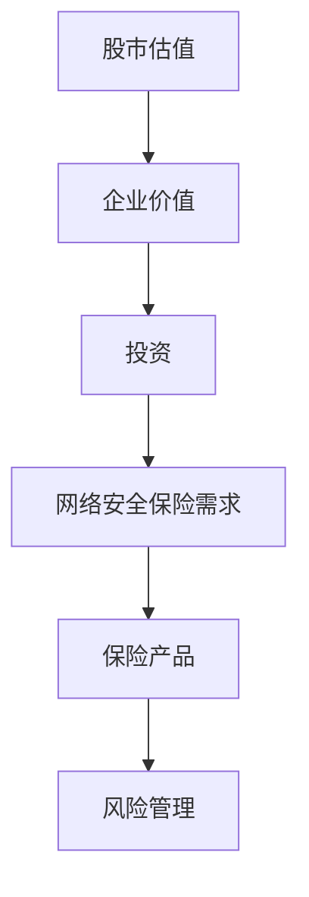
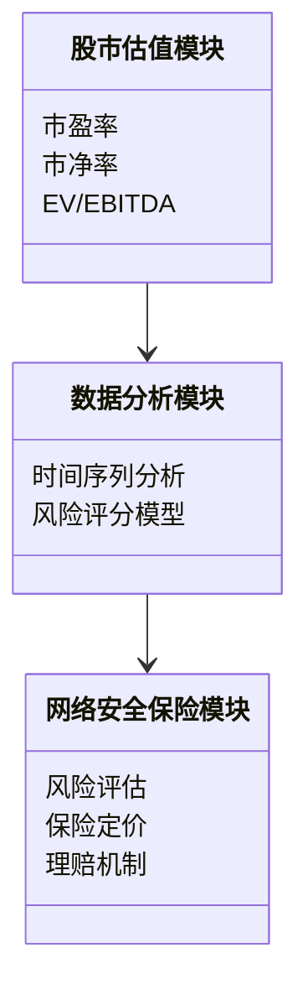
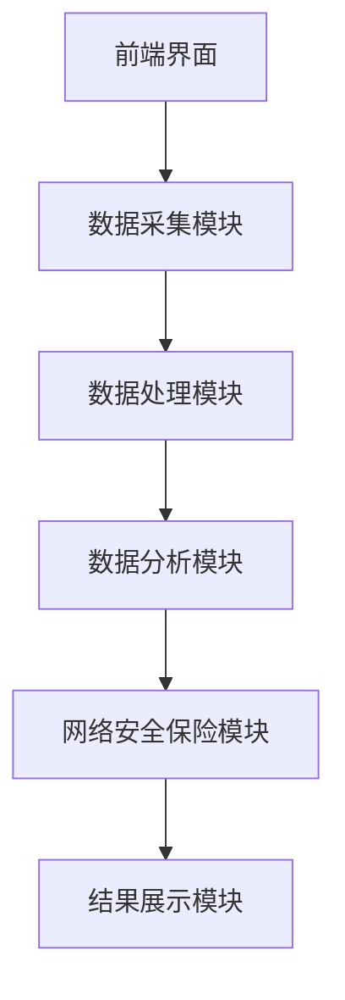
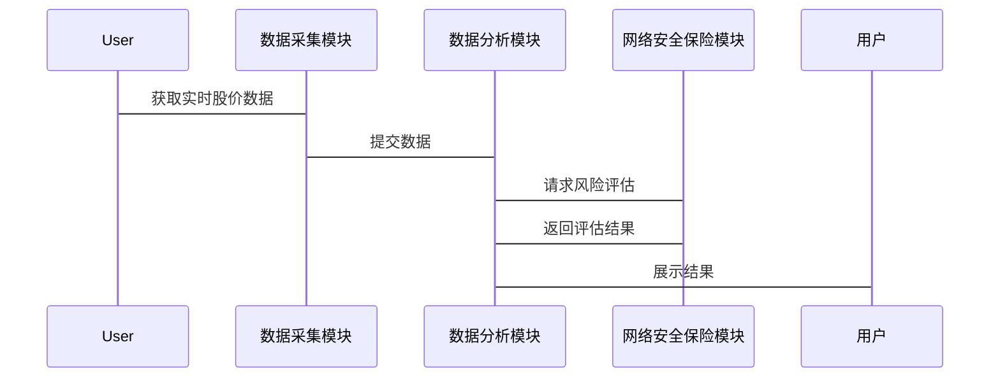

                 


# 股市估值高低对企业网络安全保险策略的影响

## 关键词：股市估值、企业网络安全、保险策略、风险管理、网络安全保险

## 摘要：股市估值作为衡量企业市场价值的重要指标，与企业网络安全保险策略密切相关。高估值企业可能面临更高的网络安全风险，而低估值企业可能通过优化网络安全策略提升市场价值。本文将从股市估值的核心概念、网络安全保险的基本原理、两者之间的关联性分析，到具体的算法原理、系统架构设计、项目实战案例，全面探讨股市估值对网络安全保险策略的影响，为企业制定有效的网络安全风险管理策略提供理论依据和实践指导。

---

## 目录大纲

### 第一部分: 背景介绍

#### 第1章: 股市估值与企业网络安全保险概述

- 1.1 股市估值的基本概念
  - 1.1.1 股市估值的定义与作用
  - 1.1.2 常见的股市估值指标（市盈率、市净率、EV/EBITDA等）
  - 1.1.3 股市估值对企业经营的影响

- 1.2 企业网络安全保险的定义与特点
  - 1.2.1 网络安全保险的基本概念
  - 1.2.2 网络安全保险与传统保险的区别
  - 1.2.3 网络安全保险的市场需求与发展趋势

- 1.3 股市估值与企业网络安全保险的关系
  - 1.3.1 股市估值对企业网络安全需求的影响
  - 1.3.2 企业网络安全风险对股市估值的反向影响
  - 1.3.3 股市估值与网络安全保险策略的互动机制

- 1.4 本章小结

---

### 第二部分: 核心概念与联系

#### 第2章: 股市估值与网络安全保险的核心概念分析

- 2.1 股市估值的核心要素
  - 2.1.1 财务指标分析
  - 2.1.2 市场情绪与投资者预期
  - 2.1.3 行业环境与宏观经济因素

- 2.2 网络安全保险的核心要素
  - 2.2.1 网络安全风险评估模型
  - 2.2.2 保险定价与承保策略
  - 2.2.3 理赔机制与风险管理

- 2.3 股市估值与网络安全保险的关联性分析
  - 2.3.1 股市估值波动对网络安全保险需求的影响
  - 2.3.2 网络安全事件对企业估值的冲击
  - 2.3.3 网络安全保险在企业风险管理中的作用

- 2.4 核心概念对比分析表
  | 核心概念 | 股市估值 | 网络安全保险 |
  |----------|----------|--------------|
  | 定义     | 企业市场价值的评估 | 保障网络安全风险的保险产品 |
  | 关键指标 | 市盈率、市净率等 | 保险费率、风险敞口等 |
  | 影响因素 | 财务表现、市场情绪 | 网络攻击风险、企业安全措施 |

- 2.5 ER实体关系图（Mermaid流程图）



---

### 第三部分: 算法原理

#### 第3章: 股市估值与网络安全保险的算法原理

- 3.1 网络安全保险定价算法
  - 3.1.1 多元回归分析
    - 数据预处理：收集企业财务数据、网络安全事件历史数据、股价数据。
    - 模型构建：建立多元回归模型，分析各变量对保险费率的影响。
    - 代码实现：
      ```python
      import pandas as pd
      from sklearn.linear_model import LinearRegression
      
      # 数据预处理
      df = pd.read_csv('data.csv')
      X = df[['市盈率', '网络安全事件次数']]
      y = df['保险费率']
      
      # 模型训练
      model = LinearRegression()
      model.fit(X, y)
      ```
    - 公式解释：
      $$ \text{保险费率} = \beta_0 + \beta_1 \times \text{市盈率} + \beta_2 \times \text{网络安全事件次数} $$

  - 3.1.2 贝叶斯网络
    - 数据建模：构建贝叶斯网络，分析网络安全风险对股价的影响。
    - 代码实现：
      ```python
      from sklearn.naive_bayes import GaussianNB
      
      # 数据准备
      X = df[['市净率', '网络安全风险评分']]
      y = df['股价波动率']
      
      # 模型训练
      model = GaussianNB()
      model.fit(X, y)
      ```
    - 公式解释：
      $$ P(\text{股价波动} | \text{市净率}, \text{网络安全风险}) = \frac{P(\text{股价波动}) \times P(\text{市净率} | \text{股价波动}) \times P(\text{网络安全风险} | \text{股价波动})}{P(\text{市净率}) \times P(\text{网络安全风险})} $$

- 3.2 股市估值波动预测算法
  - 3.2.1 时间序列分析（ARIMA）
    - 数据建模：使用ARIMA模型预测股市估值的未来走势。
    - 代码实现：
      ```python
      from statsmodels.tsa.arima_model import ARIMA
      
      # 数据准备
      df = pd.read_csv('stock.csv')
      data = df['股价'].values
      
      # 模型训练
      model = ARIMA(data, order=(5, 2, 0))
      model_fit = model.fit(disp=0)
      ```
    - 公式解释：
      $$ \hat{y}_t = \alpha + \beta_1 y_{t-1} + \beta_2 y_{t-2} + \dots + \beta_n y_{t-n} $$

- 3.3 网络安全风险评估算法
  - 3.3.1 风险评分模型
    - 数据建模：基于网络安全事件历史数据，构建风险评分模型。
    - 代码实现：
      ```python
      import numpy as np
      
      # 数据准备
      df = pd.read_csv('security.csv')
      X = df[['漏洞数量', '攻击频率']]
      y = df['风险评分']
      
      # 模型训练
      model = np.polyfit(X['漏洞数量'], y, 2)
      ```
    - 公式解释：
      $$ \text{风险评分} = \alpha + \beta_1 \times \text{漏洞数量} + \beta_2 \times \text{攻击频率} $$

---

### 第四部分: 系统分析与架构设计

#### 第4章: 股市估值与网络安全保险的系统架构

- 4.1 问题场景介绍
  - 企业如何通过优化网络安全策略提升股市估值？
  - 如何基于股市估值动态调整网络安全保险策略？

- 4.2 系统功能设计（领域模型Mermaid类图）



- 4.3 系统架构设计（Mermaid架构图）



- 4.4 系统接口设计
  - 数据接口：从股票数据源获取实时股价数据。
  - API接口：提供网络安全风险评估的API服务。

- 4.5 系统交互设计（Mermaid序列图）



---

### 第五部分: 项目实战

#### 第5章: 股市估值与网络安全保险的项目实战

- 5.1 环境安装
  - Python环境：Python 3.8+
  - 库的安装：pandas、scikit-learn、statsmodels

- 5.2 系统核心实现源代码
  - 数据预处理代码：
    ```python
    import pandas as pd
    
    df = pd.read_csv('data.csv')
    df['市盈率'].fillna(df['市盈率'].mean(), inplace=True)
    df.to_csv('processed.csv', index=False)
    ```
  - 模型训练代码：
    ```python
    from sklearn.linear_model import LinearRegression
    
    X = df[['市盈率', '网络安全事件次数']]
    y = df['保险费率']
    
    model = LinearRegression()
    model.fit(X, y)
    print('保险费率预测结果:', model.predict(X))
    ```

- 5.3 实际案例分析
  - 某企业网络安全事件对企业股价的影响分析。
  - 如何通过模型调整优化保险策略。

- 5.4 代码应用解读与分析
  - 数据预处理的逻辑。
  - 模型训练的具体步骤。
  - 结果展示与分析。

- 5.5 项目小结
  - 成功经验总结。
  - 遇到的问题及解决方案。
  - 对未来工作的启发。

---

### 第六部分: 最佳实践、小结、注意事项、拓展阅读

#### 第6章: 最佳实践与小结

- 6.1 最佳实践
  - 根据股市估值动态调整网络安全保险策略。
  - 定期更新风险评估模型。
  - 结合AI技术优化保险定价。

- 6.2 小结
  - 本文从股市估值与网络安全保险的关联性入手，深入分析了核心概念、算法原理、系统架构，并通过项目实战验证了理论的可行性。

- 6.3 注意事项
  - 数据质量和实时性对模型准确性的影响。
  - 算法选择与企业实际需求的匹配。

- 6.4 拓展阅读
  - 推荐阅读《网络安全风险管理》和《金融数据分析与建模》。

---

### 附录

- 附录A: 数据来源与处理方法
- 附录B: 代码实现细节
- 附录C: 模型评估指标解释

---

# END

