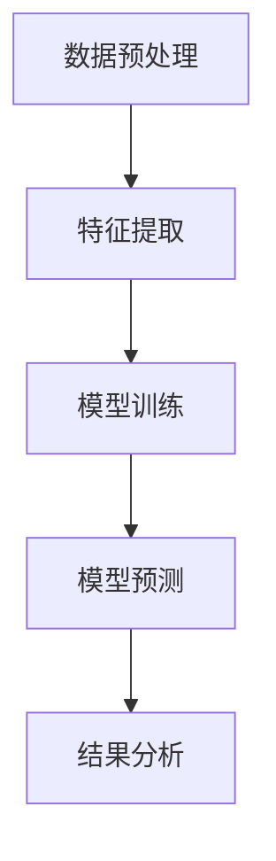
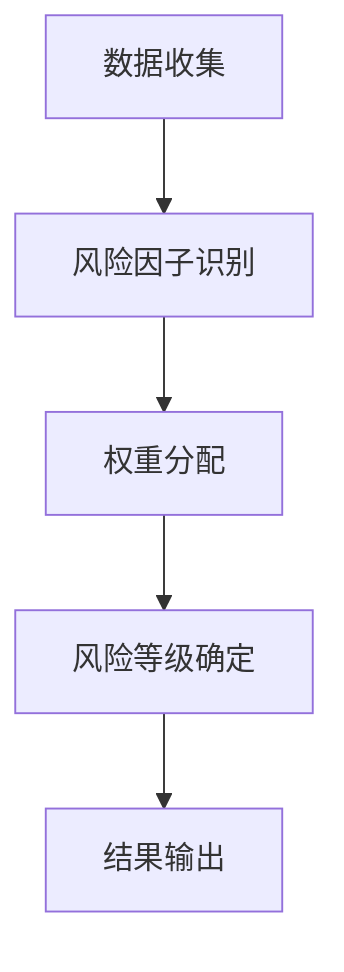
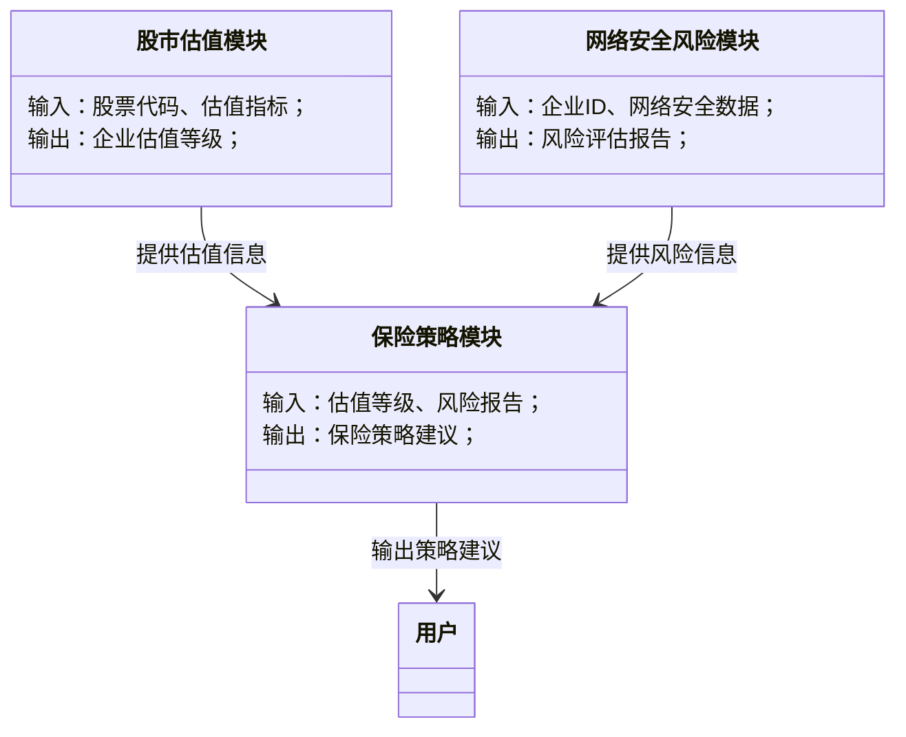

                 


# 股市估值高低对企业网络安全保险策略的影响

> 关键词：股市估值、网络安全保险、企业风险管理、市场波动、保险策略

> 摘要：本文探讨了股市估值的高低对企业网络安全保险策略的影响，分析了两者之间的关系，并通过算法模型、系统架构和实际案例展示了如何制定有效的网络安全保险策略以应对股市波动带来的风险。

---

## 第一部分: 股市估值与网络安全保险策略的背景介绍

### 第1章: 股市估值与网络安全保险策略的核心概念

#### 1.1 股市估值的基本概念
- 1.1.1 股市估值的定义与计算方法
  - 股市估值是指通过一定的指标和模型对企业的市场价值进行评估的过程。
  - 常见的估值指标包括市盈率（P/E）、市净率（P/B）、市值与销售收入比（P/S）等。

- 1.1.2 股市估值的主要指标
  - 市盈率（P/E）：企业市值与净利润的比值，反映市场对企业盈利能力的预期。
  - 市净率（P/B）：企业市值与净资产的比值，适用于评估资产密集型行业。
  - 市值与销售收入比（P/S）：企业市值与销售收入的比值，适用于高增长行业。

- 1.1.3 股市估值对企业财务状况的影响
  - 高估值企业通常被市场给予更高的溢价，反映了市场对其未来增长的乐观预期。
  - 低估值企业可能面临市场对其前景的担忧，需要通过提升业绩或改善治理来恢复市场信心。

#### 1.2 网络安全保险策略的基本概念
- 1.2.1 网络安全保险的定义与类型
  - 网络安全保险是为企业在遭受网络攻击或数据泄露等网络安全事件时提供经济补偿的保险产品。
  - 常见类型包括网络安全责任险、数据泄露险、网络中断险等。

- 1.2.2 网络安全保险的覆盖范围与保障内容
  - 覆盖范围：数据泄露导致的赔偿责任、网络攻击造成的经济损失、网络安全事件的响应费用等。
  - 保障内容：赔偿第三方损失、承担法律费用、修复网络安全漏洞等。

- 1.2.3 网络安全保险的市场现状与发展趋势
  - 市场现状：随着网络安全威胁的增加，网络安全保险市场需求快速增长。
  - 发展趋势：保险产品逐渐细分化、覆盖范围不断扩大、保费与风险评估更加精准。

#### 1.3 股市估值与网络安全保险策略的关系
- 1.3.1 股市估值对企业网络安全风险的影响
  - 高估值企业通常拥有更强的财务实力，能够投入更多资源用于网络安全防护。
  - 低估值企业可能在网络安全投入上更为谨慎，增加潜在风险。

- 1.3.2 网络安全保险策略对企业估值的反作用
  - 通过购买网络安全保险，企业可以转移部分网络安全风险，提升投资者信心。
  - 网络安全保险的存在可能影响企业的资本成本，进而影响其估值。

- 1.3.3 两者关系的综合分析与总结
  - 股市估值和网络安全保险策略相互影响，企业需要根据自身估值水平调整网络安全策略。
  - 高估值企业应注重风险管理，合理配置网络安全保险；低估值企业应通过提升安全水平来改善市场估值。

---

## 第2章: 股市估值与网络安全保险策略的核心概念与联系

### 2.1 核心概念的原理与属性特征对比
- 2.1.1 股市估值的原理
  - 基于企业未来现金流的折现模型（如DCF模型）进行估值。
  - 结合市场整体表现和行业情况调整估值结果。

- 2.1.2 网络安全保险策略的原理
  - 通过风险评估确定保险覆盖范围和保费水平。
  - 结合企业的网络安全状况和历史损失数据制定保险策略。

- 2.1.3 两者关系的属性特征对比
  | 属性       | 股市估值                          | 网络安全保险策略                   |
  |------------|----------------------------------|------------------------------------|
  | 定义         | 企业市场价值的评估                | 网络安全风险的经济补偿             |
  | 作用         | 影响投资者对企业价值的判断        | 降低企业因网络安全事件的损失      |
  | 影响因素     | 利润、资产、销售收入等            | 网络安全风险、企业财务状况等       |
  | 调整方式     | 通过改善财务表现或市场预期调整      | 通过加强安全措施或转移风险调整     |

### 2.2 核心概念的ER实体关系图
```mermaid
erDiagram
    企业/公司 {
        id
        名称
        股票代码
        估值指标
    }
    网络安全风险 {
        id
        类型
        影响程度
        对应保险策略
    }
    股市估值与网络安全保险关系 {
        id
        关联方式
        影响程度
        保险策略建议
    }
    企业/公司 --> 网络安全风险 : 受影响
    企业/公司 --> 股市估值与网络安全保险关系 : 关联
    网络安全风险 --> 股市估值与网络安全保险关系 : 反映
```

---

## 第3章: 股市估值与网络安全保险策略的算法原理

### 3.1 股市估值预测算法

#### 3.1.1 时间序列分析
- 基于历史股价数据，使用ARIMA模型预测未来股价走势。
- 步骤：
  1. 数据预处理（去除趋势、季节性调整）。
  2. 模型参数估计。
  3. 模型验证与优化。
  4. 未来股价预测。

#### 3.1.2 机器学习算法（如LSTM）
- 使用长短期记忆网络模型进行时间序列预测。
- 步骤：
  1. 数据预处理（归一化、滑动窗口）。
  2. 模型训练。
  3. 模型预测。
  4. 结果分析与误差评估。

#### 3.1.3 算法流程图


### 3.2 网络安全风险评估算法

#### 3.2.1 风险评估指标体系
- 包括网络安全事件频率、损失金额、漏洞数量等指标。

#### 3.2.2 层次分析法（AHP）
- 确定各风险因素的权重，构建风险评估模型。
- 步骤：
  1. 确定影响网络安全的主要因素。
  2. 构建比较矩阵。
  3. 计算各因素的权重。
  4. 确定综合风险等级。

#### 3.2.3 算法流程图


### 3.3 算法数学模型

#### 3.3.1 时间序列预测模型（ARIMA）
- 模型公式：
  $$ ARIMA(p, d, q) $$
  其中，p为自回归阶数，d为差分阶数，q为移动平均阶数。

#### 3.3.2 网络安全风险评估模型（AHP）
- 模型公式：
  $$ w_i \times x_i $$
  其中，\( w_i \) 为第i个风险因素的权重，\( x_i \) 为该因素的指标值。

---

## 第4章: 系统分析与架构设计方案

### 4.1 问题场景介绍
- 某高科技企业在股市中估值较高，但面临频繁的网络攻击威胁，需要制定有效的网络安全保险策略。

### 4.2 项目介绍
- 开发一个结合股市估值和网络安全风险评估的综合系统，帮助企业在不同估值水平下优化保险策略。

### 4.3 系统功能设计（领域模型）


### 4.4 系统架构设计（系统架构图）


### 4.5 系统接口设计
- 输入接口：股票代码、网络安全数据。
- 输出接口：保险策略建议。

### 4.6 系统交互设计（交互序列图）
```mermaid
sequenceDiagram
    用户 -> 中间件: 发送股票代码和网络安全数据
    中间件 -> 数据库: 查询历史估值数据
    中间件 -> 分析模块: 调用风险评估算法
    分析模块 -> 返回结果
    中间件 -> 用户: 输出保险策略建议
```

---

## 第5章: 项目实战

### 5.1 环境安装
- 安装Python、Pandas、Scikit-learn、TensorFlow等工具。

### 5.2 系统核心实现源代码

#### 5.2.1 股市估值预测代码
```python
import pandas as pd
from statsmodels.tsa.arima_model import ARIMA

# 数据预处理
data = pd.read_csv('stock_data.csv')
data = data['close'].values

# 模型训练
model = ARIMA(data, order=(5, 1, 0))
model_fit = model.fit(disp=0)

# 预测未来股价
forecast = model_fit.forecast(steps=10)
```

#### 5.2.2 网络安全风险评估代码
```python
import numpy as np
from sklearn.decomposition import PCA

# 数据预处理
data = pd.read_csv('security_risk.csv')
features = data.drop('risk_level', axis=1)

# PCA降维
pca = PCA(n_components=3)
principal_components = pca.fit_transform(features)

# 风险评估模型
from sklearn.ensemble import RandomForestClassifier
model = RandomForestClassifier(n_estimators=100)
model.fit(principal_components, data['risk_level'])
```

### 5.3 代码应用解读与分析
- 股市估值预测代码：基于ARIMA模型，利用历史股价数据预测未来股价走势，帮助企业判断当前股市估值水平。
- 网络安全风险评估代码：通过PCA降维和随机森林模型，评估企业的网络安全风险等级，为保险策略提供依据。

### 5.4 实际案例分析和详细讲解剖析
- 案例背景：某高科技企业在股市中估值较高，但面临频繁的网络攻击威胁。
- 数据收集：收集该企业的历史股价数据和网络安全事件数据。
- 数据分析：通过ARIMA模型预测股价走势，评估企业当前估值水平；通过随机森林模型评估网络安全风险等级。
- 保险策略建议：根据高估值和高风险的双重因素，建议企业购买网络安全责任险和数据泄露险，同时加强内部安全措施。

### 5.5 项目小结
- 本项目通过结合股市估值和网络安全风险评估，帮助企业制定有效的网络安全保险策略。
- 通过算法模型和系统架构设计，实现对股市估值和网络安全风险的动态监控和预测。

---

## 第6章: 最佳实践 tips、小结、注意事项、拓展阅读

### 6.1 小结
- 股市估值和网络安全保险策略相互影响，企业需要根据自身估值水平调整网络安全策略。
- 高估值企业应注重风险管理，合理配置网络安全保险；低估值企业应通过提升安全水平来改善市场估值。

### 6.2 注意事项
- 网络安全保险策略应与企业的整体风险管理框架相结合。
- 在制定保险策略时，需综合考虑企业的财务状况、市场环境和网络安全风险。

### 6.3 拓展阅读
- 《网络安全风险管理与保险策略》
- 《股市估值分析与投资策略》
- 《机器学习在金融风险管理中的应用》

---

## 附录: 参考文献与代码仓库

- 参考文献：
  1. Smith, J. (2022). *Cybersecurity Risk Management*. John Wiley & Sons.
  2. Brown, D. (2021). *Stock Valuation Techniques*. McGraw-Hill Education.
  3. Zhang, W. (2020). *Machine Learning in Financial Risk Management*. Springer.

- 代码仓库：[GitHub链接](https://github.com/username/stock_valuation_cyber_insurance_strategy)

---

## 结束语

股市估值的高低直接影响企业的网络安全保险策略，企业需要根据自身的估值水平和网络安全风险，制定相应的保险策略。通过本文的分析和案例展示，希望能够为企业提供有价值的参考和指导。

