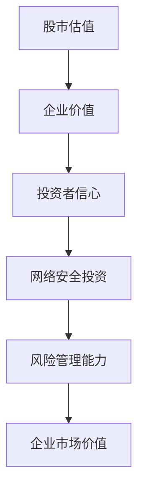
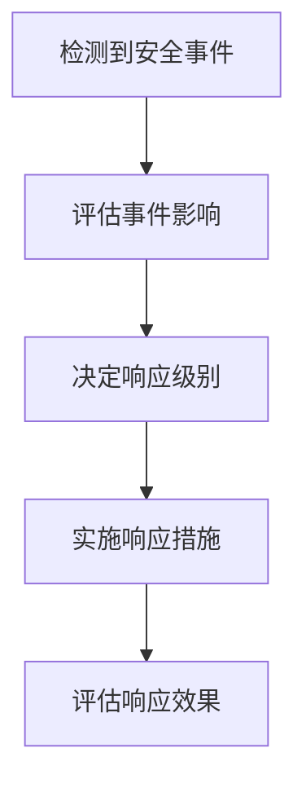
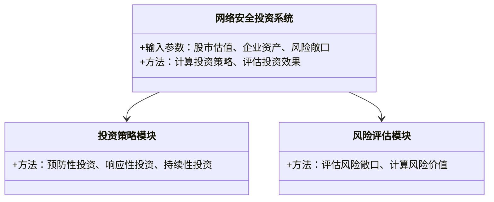
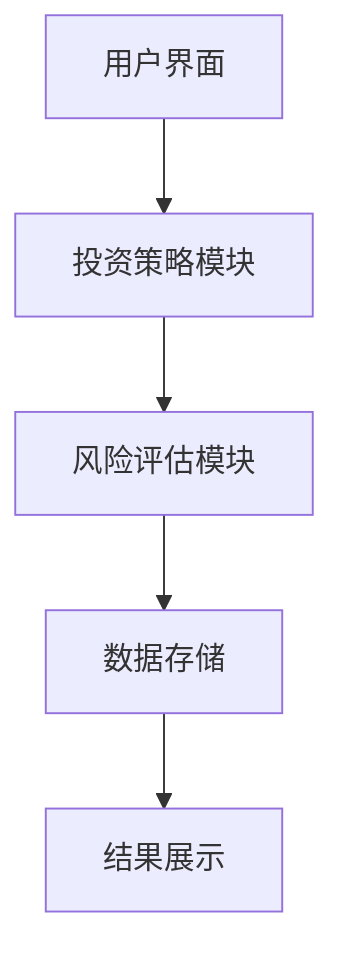

                 


# 股市估值高低对企业网络安全投资策略的影响

> 关键词：股市估值，网络安全投资，企业风险管理，成本效益分析，系统架构设计

> 摘要：本文探讨了股市估值高低对企业网络安全投资策略的影响，分析了网络安全投资与企业风险管理之间的关系，提出了基于股市估值的网络安全投资策略优化方法。通过数学模型和实际案例，展示了如何利用成本效益分析和系统架构设计来优化企业网络安全投资，提升企业风险管理能力，实现企业价值最大化。

---

## 第一章：股市估值与网络安全投资概述

### 1.1 股市估值的基本概念

股市估值是衡量企业市场价值的重要指标，通常通过市盈率（P/E）、市净率（P/B）等指标进行评估。股市估值反映了市场对企业未来盈利能力的预期，高估值意味着市场对企业前景乐观，而低估值则可能意味着市场对企业前景持谨慎态度。

### 1.2 企业网络安全投资的重要性

随着数字化转型的深入，网络安全已成为企业风险管理的核心部分。企业网络安全投资包括预防性投资（如防火墙、入侵检测系统）、响应性投资（如应急响应团队）和持续性投资（如员工安全培训）。有效的网络安全投资可以降低数据泄露等风险，保护企业核心资产，进而提升企业市场价值。

### 1.3 股市估值与网络安全投资的关系

股市估值与网络安全投资存在密切关系。高估值企业通常在网络安全投资上更为积极，以降低风险并提升投资者信心。而低估值企业可能因为资金紧张而减少网络安全投资，这可能导致更大的风险敞口，进一步影响企业市值。

---

## 第二章：股市估值与网络安全投资的核心概念

### 2.1 股市估值模型

以下是常用的股市估值模型：

1. **市盈率（P/E）模型**：$$\text{市盈率} = \frac{\text{股价}}{\text{每股收益}}$$
2. **市净率（P/B）模型**：$$\text{市净率} = \frac{\text{股价}}{\text{每股净资产}}$$
3. **股权自由现金流模型**：$$\text{企业价值} = \text{自由现金流} \times \text{折现率}$$

### 2.2 网络安全投资的分类

网络安全投资可以分为以下三类：

| 投资类型 | 描述 | 目标 |
|----------|------|------|
| 预防性投资 | 用于预防网络安全事件的投资 | 降低风险 |
| 响应性投资 | 用于应对网络安全事件的投资 | 减少损失 |
| 持续性投资 | 用于持续提升网络安全能力的投资 | 提升能力 |

### 2.3 股市估值与网络安全投资的关联模型

以下是概念模型的构建：



---

## 第三章：网络安全投资评估算法

### 3.1 成本效益分析模型

成本效益分析模型用于评估网络安全投资的效益与成本之间的关系：

1. **成本计算**：$$\text{总成本} = \text{预防性投资} + \text{响应性投资} + \text{持续性投资}$$
2. **效益计算**：$$\text{总效益} = \text{风险降低带来的价值提升}$$
3. **净效益**：$$\text{净效益} = \text{总效益} - \text{总成本}$$

### 3.2 响应性投资模型

以下是一个响应性投资模型的流程图：



---

## 第四章：系统分析与架构设计

### 4.1 问题场景介绍

企业面临网络安全事件的风险，需要通过优化网络安全投资策略来降低风险，提升企业价值。

### 4.2 系统功能设计

以下是系统功能设计的类图：



### 4.3 系统架构设计

以下是系统架构设计的架构图：



---

## 第五章：项目实战

### 5.1 环境安装

需要安装以下工具：

1. Python 3.8+
2. Mermaid工具链
3. 数据分析库（如Pandas、NumPy）

### 5.2 系统核心实现源代码

以下是Python代码实现：

```python
import pandas as pd
import numpy as np

def calculate_cost_efficiency(cost, benefit):
    return benefit / cost

def main():
    # 示例数据
    costs = [100, 200, 300]
    benefits = [90, 180, 270]
    
    efficiencies = []
    for c, b in zip(costs, benefits):
        efficiencies.append(calculate_cost_efficiency(c, b))
    
    df = pd.DataFrame({
        '成本': costs,
        '效益': benefits,
        '成本效益比': efficiencies
    })
    print(df)

if __name__ == "__main__":
    main()
```

### 5.3 代码实现与解读

上述代码计算不同成本和效益下的成本效益比，帮助企业在不同投资策略下评估投资效率。

### 5.4 案例分析

以某企业为例，分析其网络安全投资策略对股市估值的影响，展示如何优化投资策略以提升企业价值。

---

## 第六章：最佳实践与小结

### 6.1 最佳实践 tips

1. 定期评估网络安全投资策略。
2. 根据股市估值调整投资策略。
3. 采用成本效益分析模型优化投资。

### 6.2 小结

本文探讨了股市估值与网络安全投资的关系，提出了优化投资策略的方法，通过案例分析展示了实际应用。

### 6.3 注意事项

- 数据分析需基于实际情况。
- 模型需定期更新以适应市场变化。

### 6.4 拓展阅读

建议阅读相关文献，深入理解股市估值和网络安全投资的理论与实践。

---

# 结语

股市估值高低对企业网络安全投资策略的影响是一个复杂但重要的问题。通过本文的分析和案例，企业可以更好地优化投资策略，提升风险管理能力，实现可持续发展。

