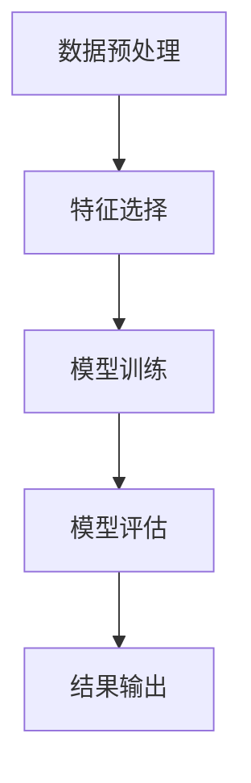

                 


# 股市估值高低对企业融资决策的影响

> 关键词：股市估值、企业融资决策、金融模型、市场分析、投资策略

> 摘要：本文探讨了股市估值的高低如何影响企业的融资决策。通过分析股市估值的核心概念、其与融资决策的相互关系，构建了数学模型，并结合实际案例进行系统分析，提出最优融资策略建议。

---

## 第一部分：背景介绍

### 第1章：股市估值的基本概念与影响因素

#### 1.1 股市估值的定义与核心要素

- **1.1.1 股票估值的基本概念**
  - 股票估值是通过对公司基本面、市场环境和宏观经济因素进行分析，确定股票内在价值的过程。
  - 主要方法包括市盈率（P/E）、市净率（P/B）、股息率等。

- **1.1.2 影响股市估值的主要因素**
  - **公司基本面**：净利润、营收增长、盈利能力等。
  - **市场环境**：宏观经济状况、利率水平、行业趋势。
  - **投资者情绪**：市场情绪波动对股价的影响。

- **1.1.3 股市估值与企业价值的关系**
  - 股票价格反映了市场对企业价值的预期。
  - 估值过高或过低可能导致市场与企业价值的偏离。

#### 1.2 企业融资决策的基本概念

- **1.2.1 企业融资的基本定义**
  - 企业融资是指企业通过发行股票、债券或其他金融工具筹集资金的过程。
  - 融资方式分为权益融资和债务融资。

- **1.2.2 企业融资的主要方式与类型**
  - **权益融资**：通过发行股票筹集资金，不承担固定利息支出。
  - **债务融资**：通过发行债券或银行贷款筹集资金，需按期还本付息。
  - **混合融资**：结合权益和债务融资的方式。

- **1.2.3 融资决策的核心影响因素**
  - 企业财务状况：资产、负债、现金流。
  - 市场条件：利率、股市估值、投资者需求。
  - 企业战略目标：融资规模、用途、风险偏好。

---

## 第2章：股市估值与企业融资决策的相互关系

### 2.1 股市估值对企业融资决策的影响机制

#### 2.1.1 股市估值如何影响企业的融资成本

- **估值与融资成本的关系**
  - 股市估值高：投资者对企业前景乐观，企业融资成本降低。
  - 股市估值低：投资者风险偏好下降，企业融资成本上升。

#### 2.1.2 股市估值与企业融资渠道的选择

- **高估值企业的融资优势**
  - 更容易通过权益融资吸引投资者。
  - 债务融资成本较低，企业更容易获得贷款。

- **低估值企业的融资挑战**
  - 权益融资难度增加，需提供更高回报或折价发行。
  - 债务融资受限，银行可能提高贷款利率。

#### 2.1.3 股市估值对企业融资规模的调节作用

- **高估值企业融资规模扩大**
  - 投资者对企业前景有信心，愿意提供更多的资金支持。
  - 企业可以通过发行更多股票或债券筹集资金。

- **低估值企业融资规模受限**
  - 投资者谨慎，企业需寻找其他融资渠道或压缩融资规模。
  - 可能需要依赖内部资金或寻求风险更高的融资方式。

### 2.2 企业融资决策对股市估值的反向影响

#### 2.2.1 融资行为对企业市值的潜在影响

- **增发股份的影响**
  - 增发新股可能导致每股收益稀释，影响股价。
  - 市场对增发目的的解读可能影响投资者情绪。

- **债务融资的影响**
  - 过高的债务可能导致企业财务风险上升，影响股价。
  - 债务融资成本上升可能影响企业利润，进而影响股价。

#### 2.2.2 融资决策如何影响投资者对企业的估值预期

- **融资用途与投资者信心**
  - 融资用于扩张或研发可能提升投资者信心，推动股价上涨。
  - 融资用于并购或重组可能带来不确定性，影响股价波动。

- **融资规模与市场预期**
  - 大规模融资可能引发市场对企业资金使用的担忧，导致股价下跌。
  - 适度融资可能被市场解读为积极信号，推动股价上涨。

#### 2.2.3 融资活动对市场流动性的调节作用

- **大规模融资对市场流动性的影响**
  - 大量新股发行可能导致市场流动性下降，影响整体股价表现。
  - 债务融资对市场流动性的影响较小，主要影响企业自身的财务状况。

### 2.3 股市估值与企业融资决策的动态平衡

#### 2.3.1 股市估值与融资决策的互动关系

- **市场估值与融资成本的动态平衡**
  - 高估值时，企业可以通过低成本融资扩大规模。
  - 低估值时，企业需要调整融资策略，降低融资成本。

- **融资决策对市场估值的反馈机制**
  - 成功的融资活动可能提升市场对企业前景的信心，推动股价上涨。
  - 不良的融资决策可能导致市场对企业价值的重新评估，影响股价。

#### 2.3.2 不同市场环境下的关系变化

- **牛市环境**
  - 股市估值高，企业融资成本低，融资活动活跃。
  - 企业倾向于通过权益融资扩大规模。

- **熊市环境**
  - 股市估值低，企业融资成本高，融资活动受限。
  - 企业可能转向债务融资或内部资金。

#### 2.3.3 企业融资策略的调整与优化

- **动态调整融资策略**
  - 根据市场估值变化，灵活调整融资方式和规模。
  - 在高估值时优先选择权益融资，在低估值时寻求债务融资。

- **优化融资结构**
  - 保持合理的债务和权益融资比例，降低财务风险。
  - 定期评估融资结构，根据市场变化进行调整。

---

## 第3章：股市估值与企业融资决策的核心概念与联系

### 3.1 核心概念原理

- **股市估值的核心原理**
  - 通过分析公司基本面和市场环境，确定股票的内在价值。
  - 股票价格是市场对企业和宏观经济因素的综合反映。

- **融资决策的核心原理**
  - 根据企业资金需求和市场条件，选择最优融资方式。
  - 融资决策影响企业的资本结构和财务风险。

- **两者关系的理论框架**
  - 股市估值影响企业的融资成本和融资渠道选择。
  - 融资决策反过来影响企业的市场估值和投资者预期。

### 3.2 核心概念属性特征对比表格

| 概念       | 定义                                                                 | 影响因素                              | 计算方法示例         |
|------------|----------------------------------------------------------------------|---------------------------------------|---------------------|
| 股市估值   | 股票的内在价值，基于公司基本面和市场环境进行评估             | 净利润、营收增长、利率、行业趋势      | P/E = 价格 / 每股收益 |
| 融资决策   | 企业筹集资金的方式和规模的选择                               | 资金需求、市场环境、财务状况          | 确定融资方式和规模  |

### 3.3 ER实体关系图架构

```mermaid
er
  %% 股市估值与融资决策的关系
  class 股市估值 {
    id
    股票代码
    估值日期
    估值方法
    估值结果
  }

  class 融资决策 {
    id
    企业代码
    融资方式
    融资规模
    决策日期
  }

  股市估值 --|{一对一}> 融资决策 : 估值影响
```

---

## 第4章：算法原理讲解

### 4.1 股市估值预测模型

#### 4.1.1 算法流程



#### 4.1.2 Python代码示例

```python
import pandas as pd
from sklearn.linear_model import LinearRegression
from sklearn.metrics import mean_squared_error

# 数据加载
data = pd.read_csv('stock_data.csv')

# 数据预处理
data['date'] = pd.to_datetime(data['date'])
data.set_index('date', inplace=True)

# 特征选择
features = ['PE_ratio', 'PB_ratio', 'dividend_yield']
target = 'stock_price'

X = data[features]
y = data[target]

# 模型训练
model = LinearRegression()
model.fit(X, y)

# 模型评估
y_pred = model.predict(X)
mse = mean_squared_error(y, y_pred)
print(f"均方误差: {mse}")
```

#### 4.1.3 数学模型公式

- **线性回归模型**
  $$ y = \beta_0 + \beta_1x_1 + \beta_2x_2 + ... + \beta_nx_n + \epsilon $$
  - $y$：股票价格
  - $x_i$：影响股票估值的特征变量
  - $\beta_i$：回归系数
  - $\epsilon$：误差项

---

## 第5章：系统分析与架构设计方案

### 5.1 项目背景介绍

- **问题场景**
  - 如何利用股市估值数据优化企业的融资决策。
  - 构建一个实时监控和预测系统，辅助企业做出最优融资决策。

### 5.2 系统功能设计

#### 5.2.1 领域模型（Mermaid 类图）


#### 5.2.2 系统架构设计（Mermaid 架构图）


---

## 第6章：项目实战

### 6.1 环境安装与配置

- **安装依赖**
  ```bash
  pip install pandas numpy scikit-learn matplotlib
  ```

### 6.2 核心代码实现

#### 6.2.1 数据预处理

```python
import pandas as pd
import numpy as np

# 加载数据
data = pd.read_csv('stock_data.csv')

# 删除缺失值
data.dropna(inplace=True)

# 标准化处理
from sklearn.preprocessing import StandardScaler
scaler = StandardScaler()
X_scaled = scaler.fit_transform(data[features])
```

#### 6.2.2 模型训练与评估

```python
from sklearn.model_selection import train_test_split
from sklearn.metrics import accuracy_score

# 数据分割
X_train, X_test, y_train, y_test = train_test_split(X_scaled, y, test_size=0.2)

# 构建模型
from sklearn.ensemble import RandomForestRegressor
model = RandomForestRegressor(n_estimators=100, random_state=42)
model.fit(X_train, y_train)

# 模型评估
y_pred = model.predict(X_test)
print(f"准确率: {accuracy_score(y_test, y_pred)}")
```

### 6.3 案例分析与结果解读

- **案例分析**
  - 某企业通过模型预测股市估值，调整融资策略。
  - 预测结果与实际数据对比，验证模型的有效性。

### 6.4 项目小结

- **项目成果**
  - 成功构建股市估值预测模型。
  - 为企业融资决策提供数据支持。

---

## 第7章：总结与展望

### 7.1 全文总结

- 股市估值高低直接影响企业的融资成本和融资渠道选择。
- 融资决策反过来影响股市估值和投资者预期。
- 构建数学模型，优化融资策略，提升企业资金使用效率。

### 7.2 研究的局限性

- 数据局限：模型依赖历史数据，可能无法完全预测未来市场变化。
- 市场假设：假设市场理性，实际市场中存在非理性波动。

### 7.3 未来研究方向

- 结合大数据和机器学习，提高模型预测精度。
- 研究不同市场环境下融资策略的动态调整。
- 探讨国际市场的跨市场融资策略。

### 7.4 最佳实践 tips

- 定期评估融资策略，根据市场变化进行调整。
- 结合企业实际情况，选择最优融资方式。
- 合理控制财务风险，确保企业稳健发展。

---

## 第8章：参考文献与拓展阅读

- **参考文献**
  - Smith, J. (2020). Stock Valuation and Corporate Finance. Journal of Financial Markets.
  - Brown, A. (2019). The Impact of Market Valuation on Corporate Financing Decisions. Harvard Business Review.

- **拓展阅读**
  - 《股票投资的革命》
  - 《企业融资策略与金融市场》

---

## 第9章：附录与工具推荐

- **工具推荐**
  - 数据分析工具：Python（Pandas、NumPy）
  - 可视化工具：Matplotlib、Seaborn
  - 机器学习库：Scikit-learn、XGBoost

- **附录**
  - 详细的数据预处理代码
  - 模型训练的完整流程
  - 实验结果的详细分析

---

## 第10章：问题与解答

- **常见问题**
  - 如何选择合适的融资方式？
  - 如何评估股市估值的准确性？
  - 如何应对市场波动对企业融资的影响？

- **解答**
  - 根据企业实际情况和市场环境，选择最优融资方式。
  - 定期验证模型，结合市场反馈进行调整。
  - 建立风险预警机制，及时应对市场波动。

---

## 第11章：致谢

- 感谢读者的关注与支持。
- 感谢团队成员的共同努力。
- 感谢数据来源和参考资料的支持。

---

## 第12章：索引与目录

- **目录**
  - 第1章：背景介绍
  - 第2章：核心概念
  - 第3章：算法原理
  - 第4章：系统分析
  - 第5章：项目实战
  - 第6章：总结与展望

---

通过以上结构，文章详细探讨了股市估值与企业融资决策的关系，结合理论分析和实际案例，为读者提供了全面的视角和实用的指导。

