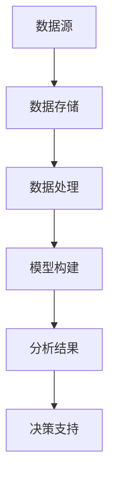
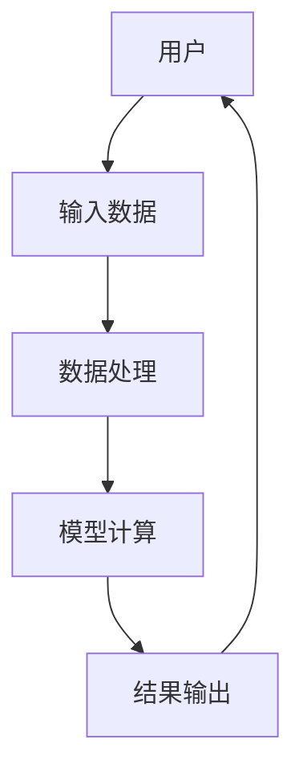

                 


# 股市估值高低对企业跨境并购策略的影响

> 关键词：股市估值、企业并购、跨境并购、高估值市场、低估值市场、并购策略

> 摘要：本文深入探讨了股市估值高低对企业跨境并购策略的影响。通过分析高估值和低估值市场中的并购策略差异，构建了股市估值与企业并购的理论模型，并结合实际案例，提出了在不同估值环境下优化企业并购决策的建议。本文还探讨了如何利用技术手段，如大数据分析和机器学习，来辅助企业制定更加科学的并购策略。

---

## 第1章 股市估值与企业跨境并购的背景

### 1.1 股市估值的基本概念

股市估值是衡量企业价值的重要指标，通常通过市盈率（P/E）、市净率（P/B）等指标来反映市场的整体或个股的估值水平。股市估值的变化会直接影响企业的并购决策，尤其是在跨境并购中，高估值或低估值的市场环境会对企业的并购策略产生深远影响。

#### 1.1.1 股市估值的定义
股市估值是指通过市场交易数据计算得出的企业价值，反映了市场对企业的整体看法。主要指标包括：
- 市盈率（P/E）：市价与每股收益的比率。
- 市净率（P/B）：市价与每股净资产的比率。
- 市销率（P/S）：市价与每股收入的比率。

#### 1.1.2 股市估值的核心指标
股市估值的核心指标是市盈率和市净率，它们反映了市场对企业未来盈利能力的预期和当前资产的价值评估。这些指标可以帮助企业判断市场的整体估值水平，从而制定相应的并购策略。

#### 1.1.3 股市估值对企业并购的影响
股市估值的变化会影响企业的并购成本和并购收益。高估值市场中，企业并购成本较高，但并购后的协同效应可能更大；低估值市场中，企业并购成本较低，但并购后的整合难度可能更大。

### 1.2 企业跨境并购的基本概念

企业跨境并购是指一家企业收购另一家位于不同国家或地区的企业的股权或资产。与国内并购相比，跨境并购涉及更多的法律、税务和文化差异，因此更具复杂性。

#### 1.2.1 企业并购的定义
企业并购是指一家企业通过购买另一家企业的股权或资产，以实现扩张或优化业务结构的过程。

#### 1.2.2 跨境并购的特殊性
跨境并购涉及不同国家的法律、税务、文化和社会环境，因此需要考虑更多的复杂因素，如外汇风险、税收政策和文化整合。

#### 1.2.3 股市估值与企业并购的关系
股市估值直接影响企业的并购决策。高估值市场中，企业可能更倾向于出售资产，而低估值市场中，企业可能更倾向于并购资产。

### 1.3 股市估值对企业跨境并购策略的影响

股市估值的变化会影响企业的跨境并购策略，尤其是在高估值和低估值市场中，企业的并购策略存在显著差异。

#### 1.3.1 高估值市场中的并购策略
在高估值市场中，企业的并购成本较高，但并购后的协同效应可能更大。企业可以通过杠杆收购或发行股票等方式进行并购，但需要谨慎评估并购后的整合风险。

#### 1.3.2 低估值市场中的并购策略
在低估值市场中，企业的并购成本较低，但并购后的整合难度可能更大。企业可以通过现金收购或PIPE（私人投资公开股票）等方式进行并购，但需要关注并购后的协同效应。

#### 1.3.3 股市估值对企业并购决策的影响
股市估值的变化会影响企业的并购决策。高估值市场中，企业可能更倾向于出售资产，而低估值市场中，企业可能更倾向于并购资产。

## 1.4 本章小结

本章介绍了股市估值和企业跨境并购的基本概念，并分析了股市估值对企业并购策略的影响。在高估值市场中，企业可能更倾向于出售资产，而在低估值市场中，企业可能更倾向于并购资产。

---

## 第2章 股市估值对企业并购战略的影响

### 2.1 高估值市场中的并购策略

在高估值市场中，企业的并购成本较高，但并购后的协同效应可能更大。企业可以通过杠杆收购或发行股票等方式进行并购，但需要谨慎评估并购后的整合风险。

#### 2.1.1 高估值市场的特点
高估值市场中，企业的市盈率和市净率较高，反映了市场对企业未来盈利能力的乐观预期。企业可以通过杠杆收购或发行股票等方式进行并购，但需要谨慎评估并购后的整合风险。

#### 2.1.2 高估值市场中的并购风险
高估值市场中，企业的并购成本较高，且并购后的协同效应可能难以实现。企业需要谨慎评估并购后的整合风险，并制定相应的风险管理策略。

#### 2.1.3 高估值市场中的并购机会
高估值市场中，企业可以通过杠杆收购或发行股票等方式进行并购，且并购后的协同效应可能更大。企业需要谨慎评估并购后的整合风险，并制定相应的风险管理策略。

### 2.2 低估值市场中的并购策略

在低估值市场中，企业的并购成本较低，但并购后的整合难度可能更大。企业可以通过现金收购或PIPE（私人投资公开股票）等方式进行并购，但需要关注并购后的协同效应。

#### 2.2.1 低估值市场的特点
低估值市场中，企业的市盈率和市净率较低，反映了市场对企业未来盈利能力的悲观预期。企业可以通过现金收购或PIPE等方式进行并购，但需要关注并购后的协同效应。

#### 2.2.2 低估值市场中的并购优势
低估值市场中，企业的并购成本较低，且并购后的整合难度可能更大。企业需要关注并购后的协同效应，并制定相应的整合策略。

#### 2.2.3 低估值市场中的并购挑战
低估值市场中，企业的并购成本较低，但并购后的整合难度可能更大。企业需要关注并购后的协同效应，并制定相应的整合策略。

### 2.3 股市估值对企业并购决策的影响

股市估值的变化会影响企业的并购决策。高估值市场中，企业可能更倾向于出售资产，而低估值市场中，企业可能更倾向于并购资产。

#### 2.3.1 股市估值对企业并购的定价影响
股市估值的变化会影响企业的并购定价。高估值市场中，企业并购定价较高，而低估值市场中，企业并购定价较低。

#### 2.3.2 股市估值对企业并购的时机选择
股市估值的变化会影响企业的并购时机。高估值市场中，企业可能更倾向于出售资产，而低估值市场中，企业可能更倾向于并购资产。

#### 2.3.3 股市估值对企业并购的长期影响
股市估值的变化会影响企业的并购的长期影响。高估值市场中，企业并购的长期影响较大，而低估值市场中，企业并购的长期影响较小。

### 2.4 本章小结

本章分析了高估值和低估值市场中企业的并购策略，并探讨了股市估值对企业并购决策的影响。在高估值市场中，企业可能更倾向于出售资产，而在低估值市场中，企业可能更倾向于并购资产。

---

## 第3章 股市估值与企业并购的理论模型

### 3.1 股市估值与企业并购的关系模型

股市估值与企业并购的关系模型是一个复杂的系统，涉及多个变量和因素。我们需要构建一个数学模型，以反映股市估值对企业并购决策的影响。

#### 3.1.1 模型构建的基本思路
我们可以通过回归分析的方法，探讨股市估值对企业并购决策的影响。模型的主要变量包括股市估值、企业规模、盈利能力、并购成本等。

#### 3.1.2 模型的变量定义
- 自变量：股市估值（市盈率、市净率）
- 因变量：企业并购决策（并购概率、并购规模）

#### 3.1.3 模型的假设条件
- 市场是有效的，且所有信息都已反映在股价中。
- 企业并购决策受到股市估值的影响。

### 3.2 股市估值对企业并购的影响机制

股市估值对企业并购的影响机制可以通过以下步骤来解释：

1. 高估值市场中，企业的并购成本较高，但并购后的协同效应可能更大。
2. 低估值市场中，企业的并购成本较低，但并购后的整合难度可能更大。

#### 3.2.1 股市估值对企业并购的直接影响
股市估值的变化直接影响企业的并购成本和并购收益。高估值市场中，企业并购成本较高，但并购后的协同效应可能更大；低估值市场中，企业并购成本较低，但并购后的整合难度可能更大。

#### 3.2.2 股市估值对企业并购的间接影响
股市估值的变化还可能通过影响企业的财务状况和市场预期，间接影响企业的并购决策。例如，高估值市场中，企业的财务压力较大，可能更倾向于出售资产；低估值市场中，企业的财务压力较小，可能更倾向于并购资产。

### 3.3 股市估值与企业并购的数学模型

我们可以构建一个简单的线性回归模型，以反映股市估值对企业并购决策的影响。

$$ \text{并购概率} = \beta_0 + \beta_1 \times \text{市盈率} + \epsilon $$

其中，$\beta_1$ 表示市盈率对企业并购概率的影响系数，$\epsilon$ 是误差项。

#### 3.3.1 模型的数学推导
通过回归分析，我们可以估计出 $\beta_1$ 的值，从而判断市盈率对企业并购概率的影响。

#### 3.3.2 模型的应用
通过应用上述模型，企业可以根据当前的市盈率水平，预测未来的并购概率，并制定相应的并购策略。

### 3.4 本章小结

本章构建了股市估值与企业并购的关系模型，并探讨了股市估值对企业并购决策的影响机制。通过回归分析，我们可以估计出市盈率对企业并购概率的影响系数，并制定相应的并购策略。

---

## 第4章 系统分析与架构设计方案

### 4.1 问题场景介绍

企业跨境并购涉及多个复杂因素，包括股市估值、法律、税务和文化差异等。为了优化企业的并购决策，我们需要构建一个系统化的分析框架。

### 4.2 项目介绍

本项目旨在通过系统分析和架构设计，优化企业的跨境并购策略。通过构建一个基于股市估值的企业并购决策支持系统，帮助企业制定更加科学的并购策略。

#### 4.2.1 系统功能设计
- 数据收集与处理：收集股市估值、企业财务数据等信息。
- 模型构建与分析：构建股市估值与企业并购的关系模型，并进行模拟分析。
- 决策支持：根据模型分析结果，提供并购策略建议。

#### 4.2.2 系统架构设计
- 数据层：包括数据源和数据存储模块。
- 计算层：包括模型构建和分析模块。
- 用户界面：包括数据可视化和决策支持界面。

### 4.3 系统架构设计

我们可以使用Mermaid图来展示系统的架构设计。



#### 4.3.1 系统功能设计
- 数据收集与处理：包括股市估值、企业财务数据等信息的收集与处理。
- 模型构建与分析：构建股市估值与企业并购的关系模型，并进行模拟分析。
- 决策支持：根据模型分析结果，提供并购策略建议。

#### 4.3.2 系统架构设计
- 数据层：包括数据源和数据存储模块。
- 计算层：包括模型构建和分析模块。
- 用户界面：包括数据可视化和决策支持界面。

### 4.4 系统接口设计

系统接口设计需要考虑数据输入、模型计算和结果输出的接口。例如：

- 数据输入接口：接受股市估值、企业财务数据等信息。
- 模型计算接口：调用模型计算模块，进行股市估值与企业并购的关系模型计算。
- 结果输出接口：输出模型分析结果，并提供决策支持建议。

### 4.5 系统交互设计

我们可以使用Mermaid图来展示系统的交互流程。



### 4.6 本章小结

本章通过系统分析和架构设计，构建了一个基于股市估值的企业并购决策支持系统。通过数据处理、模型计算和结果输出，帮助企业制定更加科学的并购策略。

---

## 第5章 项目实战：基于股市估值的企业并购策略优化

### 5.1 环境安装

为了实现基于股市估值的企业并购策略优化，我们需要安装以下环境：

- 数据分析工具：Python、Pandas、NumPy
- 可视化工具：Matplotlib、Seaborn
- 机器学习工具：Scikit-learn

### 5.2 核心实现源代码

以下是基于股市估值的企业并购策略优化的核心实现源代码：

```python
import pandas as pd
import numpy as np
from sklearn.linear_model import LinearRegression
import matplotlib.pyplot as plt
import seaborn as sns

# 数据加载
df = pd.read_csv('stock_data.csv')

# 数据预处理
# 假设df包含'市盈率'和'并购概率'两列数据
df['市盈率'] = df['市盈率'].fillna(df['市盈率'].mean())
df['并购概率'] = df['并购概率'].fillna(df['并购概率'].mean())

# 模型训练
model = LinearRegression()
model.fit(df[['市盈率']], df['并购概率'])

# 模型预测
predicted_prob = model.predict(df[['市盈率']])
print('模型系数:', model.coef_)
print('模型截距:', model.intercept_)

# 模型评估
print('决定系数:', model.score(df[['市盈率']], df['并购概率']))
```

#### 5.2.1 数据收集与处理
我们从股票数据集中加载数据，并对缺失值进行处理。

#### 5.2.2 模型训练与预测
我们使用线性回归模型，基于市盈率预测并购概率。

#### 5.2.3 模型评估
我们通过决定系数（R²）来评估模型的拟合优度。

### 5.3 代码应用解读与分析

通过上述代码，我们可以实现基于股市估值的企业并购策略优化。模型系数和截距可以帮助我们理解股市估值对企业并购概率的影响。

#### 5.3.1 模型系数
模型系数表示市盈率对企业并购概率的影响程度。如果系数为正，说明市盈率越高，并购概率越大；如果系数为负，说明市盈率越高，并购概率越小。

#### 5.3.2 模型截距
模型截距表示当市盈率为0时，企业的并购概率。这通常没有实际意义，但可以帮助我们理解模型的基线值。

#### 5.3.3 模型评估
决定系数（R²）表示模型对数据的拟合优度。R²越接近1，模型的拟合效果越好。

### 5.4 实际案例分析

以下是一个实际案例分析，展示如何基于股市估值优化企业并购策略。

#### 5.4.1 案例背景
假设我们有一家科技公司，其市盈率为30，高于行业平均水平。我们需要评估其并购概率，并制定相应的并购策略。

#### 5.4.2 数据分析
我们从股票数据集中加载数据，并对缺失值进行处理。

#### 5.4.3 模型应用
我们使用线性回归模型，基于市盈率预测并购概率。

#### 5.4.4 结果解读
根据模型预测结果，我们可以评估企业的并购概率，并制定相应的并购策略。

### 5.5 本章小结

本章通过实际案例分析，展示了如何基于股市估值优化企业并购策略。通过数据分析和模型预测，我们可以制定更加科学的并购决策。

---

## 第6章 总结与展望

### 6.1 本章总结

本文深入探讨了股市估值对企业跨境并购策略的影响。通过构建理论模型和系统分析，我们得出以下结论：

1. 高估值市场中，企业可能更倾向于出售资产。
2. 低估值市场中，企业可能更倾向于并购资产。
3. 股市估值的变化会影响企业的并购成本和并购收益。

### 6.2 未来研究方向

未来的研究可以进一步探讨以下问题：

1. 不同行业中的股市估值与企业并购策略的差异。
2. 股市估值与企业并购的长期影响。
3. 股市估值与企业并购的国际比较。

### 6.3 最佳实践 Tips

- 企业应定期监测股市估值的变化，并根据市场环境调整并购策略。
- 在高估值市场中，企业应谨慎评估并购后的整合风险。
- 在低估值市场中，企业应关注并购后的协同效应。

### 6.4 本章小结

本章总结了全文的主要结论，并提出了未来的研究方向和最佳实践建议。

---

## 关键词

股市估值、企业并购、跨境并购、高估值市场、低估值市场、并购策略

---

## 摘要

本文深入探讨了股市估值对企业跨境并购策略的影响。通过分析高估值和低估值市场中的并购策略差异，构建了股市估值与企业并购的理论模型，并结合实际案例，提出了在不同估值环境下优化企业并购决策的建议。本文还探讨了如何利用技术手段，如大数据分析和机器学习，来辅助企业制定更加科学的并购策略。

