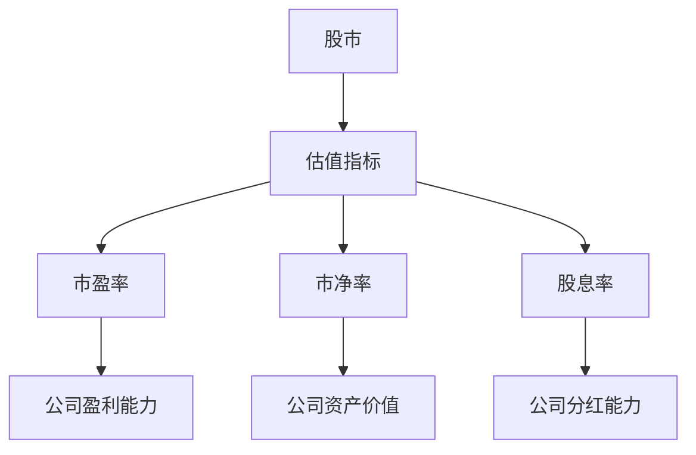
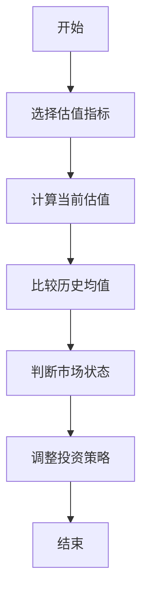
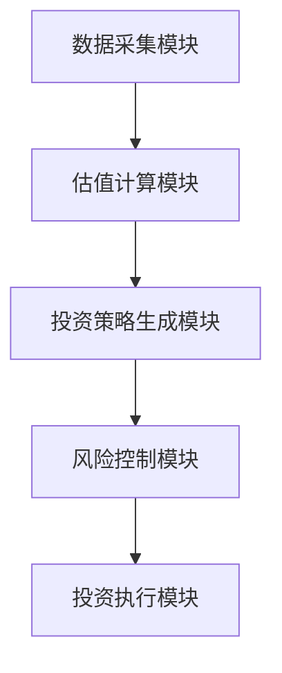

                 


# 股市估值高低对养老金投资策略的影响

> 关键词：股市估值，养老金投资，资产配置，风险控制，投资策略，市场波动

> 摘要：股市估值是影响养老金投资策略的重要因素。本文系统分析了股市估值的核心概念、算法原理、数学模型，并通过实际案例展示了如何根据市场估值调整投资策略。文章还探讨了系统架构设计、项目实战、最佳实践等关键内容，为养老金投资提供了深入的理论支持和实践指导。

---

# 第一部分: 股市估值与养老金投资策略的背景

# 第1章: 股市估值与养老金投资策略概述

## 1.1 股市估值的基本概念
### 1.1.1 什么是股市估值
股市估值是指对股票或整个股票市场的价值进行评估的过程。通过分析公司财务数据和市场环境，投资者可以判断股票是否被高估或低估。常见的估值指标包括市盈率（P/E）、市净率（P/B）和股息率等。

### 1.1.2 股市估值的重要性
股市估值是投资者做出投资决策的基础。对于养老金投资来说，准确的估值可以帮助投资者在市场高估时降低风险，在低估时增加投资。

### 1.1.3 养老金投资的基本原理
养老金投资追求长期稳定的收益，通常采用资产配置策略，将资金分配到股票、债券、房地产等多种资产中，以分散风险并实现保值增值。

## 1.2 股市估值与养老金投资的关系
### 1.2.1 股市估值对养老金投资的影响
股市估值直接影响养老金的投资决策。例如，当市场估值过高时，养老金可能会减少股票投资比例，转投其他资产以规避风险。

### 1.2.2 养老金投资的长期性与风险控制
养老金投资具有长期性，需要考虑市场周期波动。通过合理估值，可以在市场底部增加投资，在市场顶部减少风险。

### 1.2.3 股市估值波动对养老金投资策略的挑战
股市估值的波动性使得养老金投资策略需要动态调整。例如，当市场估值显著低于历史平均水平时，可以增加股票配置；当市场估值显著高于历史平均水平时，减少股票配置。

## 1.3 本章小结
本章介绍了股市估值的基本概念及其对养老金投资策略的影响，强调了合理估值在风险控制和资产配置中的重要性。

---

# 第2章: 股市估值的核心概念与分析框架

## 2.1 股市估值的主要指标
### 2.1.1 市盈率（P/E）
市盈率 = 股价 / 每股收益（EPS）。市盈率反映了市场对公司未来盈利能力的预期。低市盈率可能意味着股票被低估，高市盈率可能意味着市场对公司未来增长有较高预期。

### 2.1.2 市净率（P/B）
市净率 = 股价 / 每股净资产（BPS）。市净率适用于评估重资产行业的公司，如银行、房地产等。低市净率可能意味着股票被低估。

### 2.1.3 股息率
股息率 = 每股股息 / 股价。股息率高的股票通常具有稳定的收益，适合长期投资者。

### 2.1.4 其他估值指标
还包括市销率（P/S）、企业价值倍数（EV/EBITDA）等。

## 2.2 股票市场整体估值的衡量方法
### 2.2.1 市场整体估值指标（如指数估值）
通过股票指数（如标普500）的历史估值水平，判断当前市场是否高估或低估。

### 2.2.2 市场分板块估值分析
将市场分为成长股、价值股、周期股等，分析不同板块的估值水平。

### 2.2.3 市场估值周期性分析
市场估值通常呈现周期性波动，可以通过历史数据分析市场周期，制定投资策略。

## 2.3 养老金投资的资产配置策略
### 2.3.1 股票在养老金资产配置中的地位
股票是养老金投资的重要组成部分，但比例通常控制在合理范围内，以平衡风险和收益。

### 2.3.2 不同市场环境下养老金的资产配置调整
- **市场低估时**：增加股票配置，减少债券配置。
- **市场高估时**：减少股票配置，增加债券或其他资产配置。

### 2.3.3 养老金投资的风险管理策略
通过分散投资、设置止损、定期再平衡等方式控制风险。

## 2.4 核心概念联系
### 2.4.1 估值指标对比分析表
| 估值指标 | 定义 | 适用场景 | 优缺点 |
|----------|------|----------|--------|
| 市盈率   | 股价/每股收益 | 评估盈利能力 | 易受周期性影响 |
| 市净率   | 股价/每股净资产 | 评估资产价值 | 更适合重资产行业 |
| 股息率   | 每股股息/股价 | 评估分红能力 | 受公司股息政策影响 |
| 市销率   | 股价/每股营收 | 评估销售能力 | 适用于亏损公司 |

### 2.4.2 实体关系图（Mermaid）


## 2.5 本章小结
本章详细介绍了股市估值的主要指标及其应用，分析了不同市场环境下养老金的资产配置策略，并通过对比分析表和实体关系图展示了各指标之间的联系。

---

# 第3章: 股市估值的算法原理与数学模型

## 3.1 算法原理
### 3.1.1 市场估值算法
通过历史数据分析市场估值水平，判断当前市场是否处于高估或低估状态。

### 3.1.2 基于市盈率的估值模型
使用历史市盈率均值作为参考，判断当前市盈率是否偏离均值。

### 3.1.3 基于回归分析的预测模型
通过回归分析预测未来市场估值的变化趋势。

## 3.2 算法流程图（Mermaid）


## 3.3 算法实现（Python代码）
```python
import pandas as pd
import numpy as np

# 示例数据：历史市盈率
data = {'year': [2018, 2019, 2020, 2021, 2022], 'PE_ratio': [15, 16, 17, 18, 20]}
df = pd.DataFrame(data)

# 计算历史市盈率均值
mean_pe = df['PE_ratio'].mean()

# 当前市盈率
current_pe = 22

# 判断市场状态
if current_pe > mean_pe:
    print("市场高估，减少股票配置")
else:
    print("市场低估，增加股票配置")
```

## 3.4 数学模型
### 3.4.1 市盈率模型
$$ PE_{ratio} = \frac{\text{股价}}{\text{每股收益}} $$

### 3.4.2 市场估值预测模型
$$ \text{预测PE}_{ratio} = a \times \text{历史PE}_{ratio均值} + b $$

### 3.4.3 风险调整模型
$$ \text{风险调整收益} = \text{预期收益} - \text{风险溢价} $$

## 3.5 本章小结
本章通过算法原理和数学模型，展示了如何基于市盈率等估值指标判断市场状态，并制定相应的投资策略。

---

# 第4章: 系统分析与架构设计

## 4.1 问题场景介绍
养老金投资管理系统需要实时监控市场估值，动态调整资产配置策略。

## 4.2 系统功能设计
### 4.2.1 数据采集模块
- 采集股票市场数据，包括市盈率、市净率等指标。
- 数据源：金融数据库、API接口等。

### 4.2.2 估值计算模块
- 基于数据计算市场估值指标。
- 使用回归分析预测市场走势。

### 4.2.3 投资策略生成模块
- 根据市场估值生成资产配置建议。
- 输出投资策略报告。

### 4.2.4 风险控制模块
- 设置止损线，监控市场波动。
- 定期资产再平衡。

## 4.3 系统架构设计（Mermaid）


## 4.4 系统交互图（Mermaid）
```mermaid
graph TD
    User --> A[数据采集模块]: 提供数据源
    A --> B[估值计算模块]: 传递数据
    B --> C[投资策略生成模块]: 传递估值结果
    C --> D[风险控制模块]: 传递投资策略
    D --> User: 输出投资建议
```

## 4.5 本章小结
本章通过系统架构设计，展示了如何构建一个基于市场估值的养老金投资管理系统，并通过模块化设计实现功能分离。

---

# 第5章: 项目实战与案例分析

## 5.1 项目环境安装
- 安装Python、Pandas、NumPy等工具。
- 数据获取：使用Yahoo Finance API获取股票数据。

## 5.2 核心代码实现
```python
import pandas as pd
import numpy as np
import requests

# 获取股票数据
def get_stock_data(ticker):
    url = f"https://query1.finance.yahoo.com/manifest.json? tanker={ticker}"
    response = requests.get(url)
    data = response.json()
    return data

# 计算市盈率
def calculate_pe_ratio(data):
    pe_ratio = data['financials']['metric']['PE Ratio']
    return pe_ratio

# 判断市场状态
def market_status(pe_ratio, mean_pe):
    if pe_ratio > mean_pe:
        return "高估"
    else:
        return "低估"

# 示例运行
data = get_stock_data("AAPL")
mean_pe = 15  # 假设历史市盈率均值为15
current_pe = calculate_pe_ratio(data)
status = market_status(current_pe, mean_pe)
print(status)
```

## 5.3 案例分析
### 5.3.1 案例背景
2020年新冠疫情爆发期间，市场估值大幅波动，养老金投资策略需要及时调整。

### 5.3.2 数据分析
- 2020年3月，市场估值显著低于历史均值，养老金增加股票配置。
- 2021年，市场估值回升，养老金逐步减少股票配置。

### 5.3.3 投资策略调整
- 市场低估时，股票配置比例从30%提高到40%。
- 市场高估时，股票配置比例从40%降低到25%。

## 5.4 本章小结
本章通过实际案例展示了如何根据市场估值调整养老金投资策略，并提供了完整的代码实现。

---

# 第6章: 最佳实践、小结与展望

## 6.1 最佳实践
- 定期监控市场估值，动态调整投资策略。
- 保持资产配置的分散性，降低投资风险。
- 使用技术指标和算法模型辅助决策。

## 6.2 本章小结
本章总结了全文的核心内容，强调了股市估值在养老金投资中的重要性，并提出了实际操作中的注意事项。

## 6.3 未来展望
随着人工智能和大数据技术的发展，市场估值分析将更加精准，养老金投资策略将更加智能化和个性化。

---

# 第7章: 总结与展望

## 7.1 总结
股市估值是影响养老金投资策略的重要因素。通过合理估值，可以在市场波动中动态调整资产配置，实现长期稳定的收益。

## 7.2 未来展望
随着技术的进步，养老金投资将更加依赖数据驱动的决策。未来的研究方向包括开发更智能的估值模型和优化投资策略的执行效率。

---

# 附录: 工具与资源

## 附录A: 数据来源
- Yahoo Finance API
- Bloomberg Terminal
- Morningstar数据

## 附录B: 开源工具
- Pandas
- NumPy
- Matplotlib

## 附录C: 参考文献
-《投资学》（书籍）
-《算法交易》（书籍）
-《养老金投资策略》（论文）

---

通过以上目录结构，文章系统地介绍了股市估值与养老金投资策略的关系，并通过理论分析、算法实现、系统设计和案例分析，为读者提供了全面的知识和实践指导。

