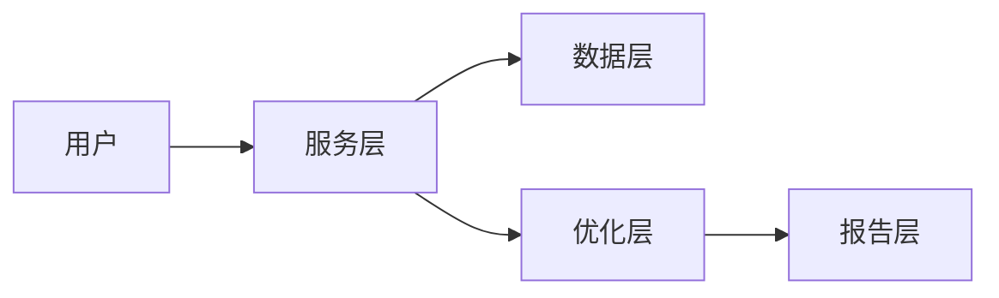

                 


# 股市估值高低对国际投资组合配置的影响

> **关键词**：股市估值、国际投资组合、资产配置、高估值市场、低估值市场、风险管理  
> **摘要**：股市估值的高低对国际投资组合配置具有重要影响。本文系统分析了股市估值的核心概念、影响因素及其对投资组合配置的影响，探讨了高估值和低估值市场下的配置策略，并结合实际案例进行了深入剖析。通过本文的分析，投资者可以更好地理解如何根据市场估值动态调整投资组合，以实现风险可控下的收益最大化。

---

# 第1章: 股市估值的基本概念与影响因素

## 1.1 股市估值的定义与核心要素

### 1.1.1 股市估值的定义

股市估值是指对上市公司股票的内在价值进行评估，以确定其合理的价格区间。股票的估值通常通过市盈率（P/E）、市净率（P/B）、股息率等指标来衡量。

$$\text{市盈率} = \frac{\text{股票价格}}{\text{每股收益}}$$

$$\text{市净率} = \frac{\text{股票价格}}{\text{每股净资产}}$$

股票的内在价值与公司财务状况、盈利能力、行业地位等因素密切相关。

---

### 1.1.2 市盈率与市净率的计算方法

市盈率反映了市场对公司盈利能力的预期，而市净率则反映了市场对公司资产质量的评估。例如，假设某公司股价为10元，每股收益为2元，每股净资产为5元：

$$\text{市盈率} = \frac{10}{2} = 5$$

$$\text{市净率} = \frac{10}{5} = 2$$

---

### 1.1.3 股东权益与企业价值的关系

股东权益是公司净资产的体现，企业价值则是公司整体的市场价值。股票估值需要综合考虑公司资产、负债、盈利能力等因素。

$$\text{企业价值} = \text{股权价值} + \text{债务价值}$$

---

## 1.2 影响股市估值的主要因素

### 1.2.1 宏观经济环境的影响

宏观经济指标如GDP增长率、利率、通货膨胀率等会直接影响股市估值。例如，低利率环境通常会导致市盈率上升。

### 1.2.2 行业周期与企业盈利能力

行业周期性波动和企业的盈利状况是影响估值的重要因素。例如，周期性行业的市盈率在繁荣期可能远高于衰退期。

### 1.2.3 市场情绪与投资者心理

市场情绪的波动会导致短期估值偏离长期合理水平。例如，市场恐慌时，市盈率可能显著低于正常水平。

---

## 1.3 国际投资组合配置的背景与重要性

### 1.3.1 国际化投资的必要性

通过配置国际资产，投资者可以分散风险，降低单一市场的波动性影响。

### 1.3.2 投资组合配置的基本原则

根据现代投资组合理论，合理的配置应基于风险承受能力、收益目标和市场预期。

### 1.3.3 估值高低对投资组合的影响

高估值市场可能带来短期收益下降风险，低估值市场则可能蕴含长期增值机会。

---

## 1.4 本章小结

本章介绍了股市估值的核心概念、影响因素及其对国际投资组合配置的重要性。理解这些内容是后续分析的基础。

---

# 第2章: 股市估值高低对投资组合配置的影响分析

## 2.1 高估值市场中的投资组合配置

### 2.1.1 高估值市场的特征与风险

高估值市场通常表现为市盈率和市净率远高于历史平均水平，市场情绪乐观，投资者预期较高。

### 2.1.2 高估值市场下的投资策略

- 降低权益资产配置比例
- 增加防御性资产（如债券、黄金）配置
- 选择估值相对合理的成长性行业

### 2.1.3 高估值市场中的防御性配置

在高估值市场中，防御性配置可以有效降低组合波动性。

---

## 2.2 低估值市场中的投资组合配置

### 2.2.1 低估值市场的特征与机会

低估值市场通常表现为市盈率和市净率低于历史平均水平，市场情绪悲观，估值修复潜力大。

### 2.2.2 低估值市场下的投资策略

- 增加权益资产配置比例
- 选择估值修复潜力大的周期性行业
- 长期持有优质资产，等待估值回升

### 2.2.3 低估值市场中的进攻性配置

在低估值市场中，进攻性配置可以捕捉市场反转机会。

---

## 2.3 综合配置策略的制定

### 2.3.1 根据估值水平动态调整配置

- 估值过高时，逐步降低权益配置
- 估值过低时，逐步增加权益配置

### 2.3.2 行业与资产类别的均衡配置

- 根据市场估值调整行业权重
- 保持资产类别间的合理分散

### 2.3.3 风险管理与收益目标的平衡

- 设定止损点，控制回撤风险
- 确保配置策略与收益目标一致

---

## 2.4 本章小结

本章分析了高估值和低估值市场下的投资策略，强调动态调整和风险管理的重要性。

---

# 第3章: 国际市场的主要特点与估值差异

## 3.1 不同国家市场的估值差异

### 3.1.1 美国市场的估值特点

- 市场流动性高，机构投资者主导
- 市盈率通常高于全球平均水平

### 3.1.2 欧洲市场的估值特点

- 行业集中度高，尤其是金融和工业板块
- 市净率通常低于美国市场

### 3.1.3 亚洲市场的估值特点

- 市盈率波动较大，受周期性影响显著
- 新兴市场估值通常低于成熟市场

---

## 3.2 汇率与地缘政治对估值的影响

### 3.2.1 汇率波动对估值的直接影响

汇率波动会影响以本币计价的资产估值，例如，本币贬值会导致以美元计价的资产估值上升。

### 3.2.2 地缘政治风险对估值的影响

地缘政治冲突可能导致市场情绪恶化，进而影响估值水平。

---

## 3.3 本章小结

国际市场估值差异显著，投资者需要结合宏观经济和地缘政治因素进行综合分析。

---

# 第4章: 国际投资组合配置的理论与实践

## 4.1 现代投资组合理论

现代投资组合理论（MPT）强调通过分散化降低风险，同时优化收益与风险的比值。

$$\text{风险} = \sqrt{w_1^2\sigma_1^2 + w_2^2\sigma_2^2 + 2w_1w_2\sigma_1\sigma_2\rho_{12}}$$

其中，$w$为权重，$\sigma$为波动率，$\rho$为相关系数。

---

## 4.2 投资组合的有效前沿

有效前沿是指在给定风险水平下，能够提供最高收益的资产组合。

### 4.2.1 有效前沿的构建

- 确定资产的预期收益和风险
- 计算资产之间的相关性
- 优化组合权重

### 4.2.2 有效前沿的应用

- 根据投资者风险偏好选择最优组合
- 动态调整组合以适应市场变化

---

## 4.3 风险管理与收益目标的平衡

### 4.3.1 风险管理策略

- 设定止损点
- 分散化投资
- 定期再平衡

### 4.3.2 收益目标的设定

- 根据市场环境调整收益预期
- 确保目标与组合风险承受能力一致

---

## 4.4 本章小结

本章介绍了现代投资组合理论及其在国际投资组合配置中的应用。

---

# 第5章: 实际案例分析与配置策略

## 5.1 历史案例分析

### 5.1.1 2008年全球金融危机后的配置策略

- 增加债券配置比例
- 减少高估值股票配置

### 5.1.2 2020年新冠疫情后的配置策略

- 增加科技股配置
- 减少周期性行业配置

---

## 5.2 情景模拟与策略选择

### 5.2.1 高通胀环境下的配置策略

- 增加抗通胀资产（如房地产信托）
- 减少债券配置比例

### 5.2.2 低增长环境下的配置策略

- 增加防守性股票配置
- 减少高增长行业配置

---

## 5.3 本章小结

通过历史案例和情景模拟，投资者可以更好地理解不同市场环境下的配置策略。

---

# 第6章: 投资组合配置的系统架构与实现

## 6.1 系统功能设计

### 6.1.1 系统功能模块

- 数据采集与处理
- 估值分析与风险评估
- 组合优化与配置建议

### 6.1.2 数据流图


---

## 6.2 系统架构设计



---

## 6.3 系统接口设计

### 6.3.1 输入接口

- 用户输入市场数据和风险偏好

### 6.3.2 输出接口

- 组合优化结果和配置建议

---

## 6.4 本章小结

本章通过系统架构设计展示了如何实现投资组合配置的自动化。

---

# 第7章: 总结与展望

## 7.1 本章总结

股市估值的高低对国际投资组合配置具有重要影响。投资者需要根据市场环境动态调整配置策略，注重风险管理与收益目标的平衡。

## 7.2 未来展望

随着全球经济一体化的深入，国际市场估值差异和风险因素将更加复杂。投资者需要结合更多维度的分析，如ESG因素和宏观经济指标，制定更科学的配置策略。

---

## 7.3 投资者注意事项

- 定期审视和调整投资组合
- 保持对市场变化的敏感性
- 避免情绪化投资决策

---

## 7.4 最佳实践 Tips

- **分散化**：避免过度集中于单一市场或资产类别
- **长期视角**：关注企业的长期价值，而非短期波动
- **动态调整**：根据市场估值变化及时优化组合

---

# 附录: 简单的估值计算工具代码

```python
import pandas as pd
import numpy as np

def calculate_valuation(fundamental_data):
    df = pd.DataFrame(fundamental_data)
    df['PE'] = df['price'] / df['eps']
    df['PB'] = df['price'] / df['book_value']
    return df[['PE', 'PB']]

# 示例数据
data = {
    'price': [100, 80, 120],
    'eps': [2, 1.5, 3],
    'book_value': [50, 40, 60]
}

valuation = calculate_valuation(data)
print(valuation)
```

---

# 结语

股市估值高低对国际投资组合配置的影响是一个复杂而重要的课题。通过本文的分析，投资者可以更好地理解如何根据市场估值动态调整投资策略，实现风险可控下的收益最大化。

