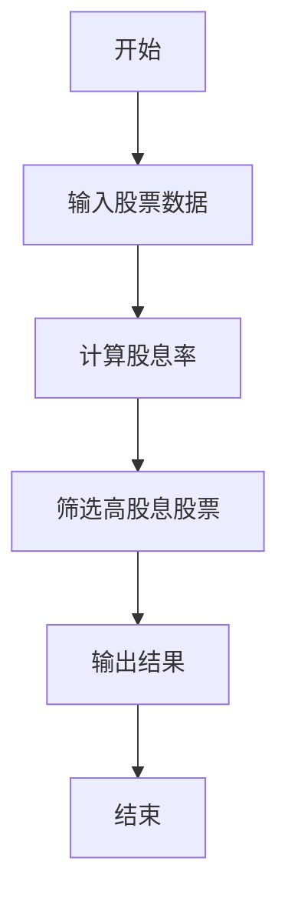
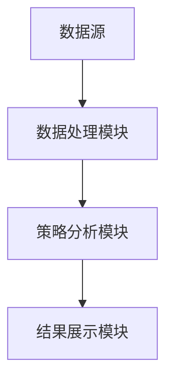

                 


# 股息投资策略：在动荡市场中获得稳定收入

> 关键词：股息投资，股息率，股票投资，稳定收入，动荡市场，高分红股票，股息增长策略

> 摘要：本文详细探讨了在动荡市场中通过股息投资策略获得稳定收入的方法。文章首先介绍了股息投资的基本概念和核心策略，然后分析了股息投资的数学模型和系统架构设计，接着通过项目实战展示了如何具体实施股息投资策略，最后总结了最佳实践、注意事项和未来展望。通过本文的分析，读者可以系统地了解和掌握股息投资的策略和方法。

---

## 第一部分：股息投资策略概述

### 第1章：股息投资的基本概念

#### 1.1 股息的定义与特点
- 股息的定义：股息是公司分配给股东的利润部分，通常以现金或股票形式发放。
- 股息的分类：现金股息、股票股息、财产股息等。
- 股息的重要性：股息是投资者收益的重要来源之一，尤其是在市场波动较大时，股息收入可以提供稳定性。

#### 1.2 股息投资的背景与意义
- 当前市场环境：全球经济不确定性增加，投资者更倾向于稳定收益。
- 股息投资的优势：收入稳定、风险较低。
- 股息投资的劣势：流动性风险、公司分红政策变化。

### 第2章：股息投资的核心策略

#### 2.1 股息率的计算与分析
- 股息率的定义：股息率=（每股股息/股票价格）×100%。
- 股息率的影响因素：公司盈利能力、股价波动、行业特点。
- 股息率与股票价格的关系：高股息率不一定意味着高收益，需结合股价走势分析。

#### 2.2 高分红股票的筛选标准
- 公司盈利能力：ROE（净资产收益率）高，净利润稳定。
- 股息支付率：股息支付率=（股息/净利润）×100%，合理范围通常在20%-60%。
- 行业特征：选择行业龙头股，行业景气度高。

#### 2.3 股息增长策略
- 股息增长股的定义：连续多年股息增长的公司。
- 股息增长策略的优势：长期收益稳定，抗跌性强。
- 如何选择股息增长股：关注公司历史股息增长率、行业地位、财务健康状况。

### 第3章：股息投资的数学模型与算法

#### 3.1 股息投资的数学模型
- 股息率计算公式：
  $$股息率 = \frac{每股股息}{股票价格}$$
- 股息增长模型：
  $$D_{n} = D_{0} \times (1 + g)^n$$
  其中，$D_{0}$为初始股息，$g$为股息增长率，$n$为年数。

#### 3.2 股息投资的算法流程


### 第4章：股息投资的系统架构设计

#### 4.1 系统功能设计
- 数据获取模块：获取股票数据，包括股价、股息、净利润等。
- 数据分析模块：计算股息率、筛选高分红股票。
- 策略执行模块：根据筛选结果制定投资策略。
- 结果展示模块：展示分析结果和投资建议。

#### 4.2 系统架构图


---

## 第二部分：股息投资策略的实战应用

### 第5章：股息投资的项目实战

#### 5.1 环境搭建
- 数据源：选择可靠的金融数据源，如Yahoo Finance、东方财富等。
- 工具选择：使用Python进行数据处理和分析，利用Pandas、NumPy等库。

#### 5.2 数据获取与处理
- 获取股票数据：使用API获取历史股价和股息数据。
- 数据清洗：处理缺失值、异常值。

#### 5.3 股息投资策略的实现
- 编写Python代码实现股息率计算和高分红股票筛选。
- 代码示例：
  ```python
  import pandas as pd

  # 假设df为股票数据，包含'Close'和'Dividend'列
  df['Dividend Yield'] = df['Dividend'] / df['Close']
  # 筛选股息率高于5%的股票
  high_dividend_stocks = df[df['Dividend Yield'] > 0.05]
  ```

#### 5.4 回测与分析
- 计算投资组合的预期收益和风险。
- 分析不同市场环境下股息投资的表现。

### 第6章：最佳实践与注意事项

#### 6.1 最佳实践
- 定期审视投资组合，根据市场变化调整。
- 结合技术分析和基本面分析，优化投资决策。
- 分散投资，降低风险。

#### 6.2 小结
- 股息投资是一种有效的长期投资策略，尤其适合在动荡市场中获取稳定收益。
- 投资者需要综合考虑股息率、公司基本面和行业前景，制定合理的投资计划。

#### 6.3 注意事项
- 避免过度依赖股息收入，忽略股价波动。
- 选择高分红股票时，需关注公司的财务健康和分红能力。
- 定期评估投资组合，及时调整策略。

#### 6.4 拓展阅读
- 推荐阅读《股息投资实战》、《价值投资经典案例》等书籍。

---

## 第三部分：总结与展望

### 第7章：股息投资的未来展望

#### 7.1 股息投资的未来趋势
- 数字化投资工具的普及，提高股息投资的效率。
- 人工智能在股息投资中的应用，优化股票筛选和风险控制。

#### 7.2 对投资者的建议
- 提高金融知识，保持对市场的敏感性。
- 采用多元化投资策略，降低风险。
- 关注宏观经济和行业动态，优化投资组合。

---

## 参考文献
- 《股息投资实战》，作者：XXX。
- 《价值投资经典案例》，作者：XXX。
- 其他相关书籍和学术论文。

---

通过以上目录，读者可以系统地学习股息投资的核心概念、策略、数学模型和实际应用，从而在动荡的市场中实现稳定收益。

